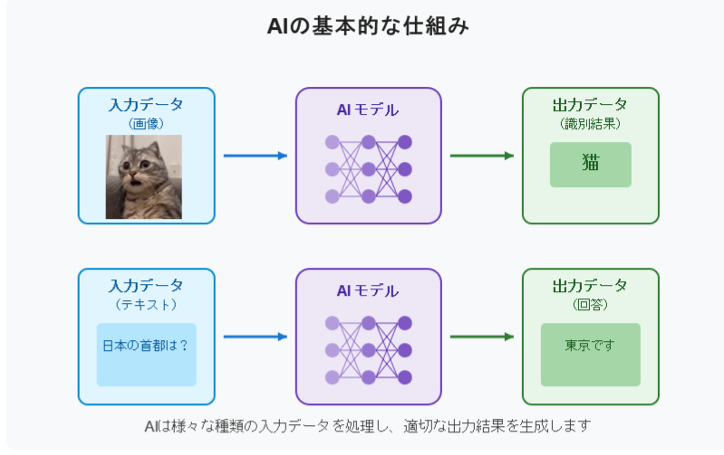
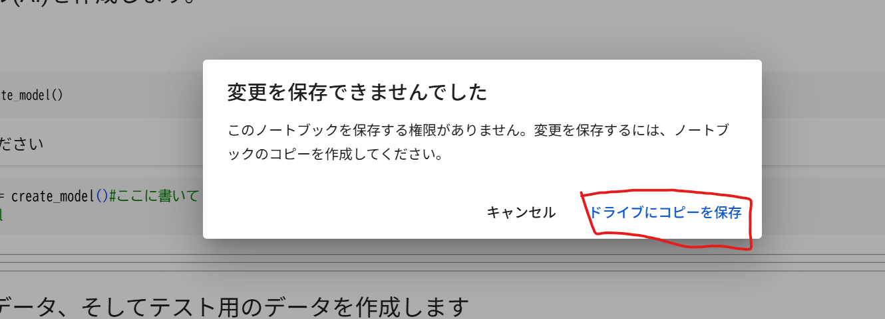
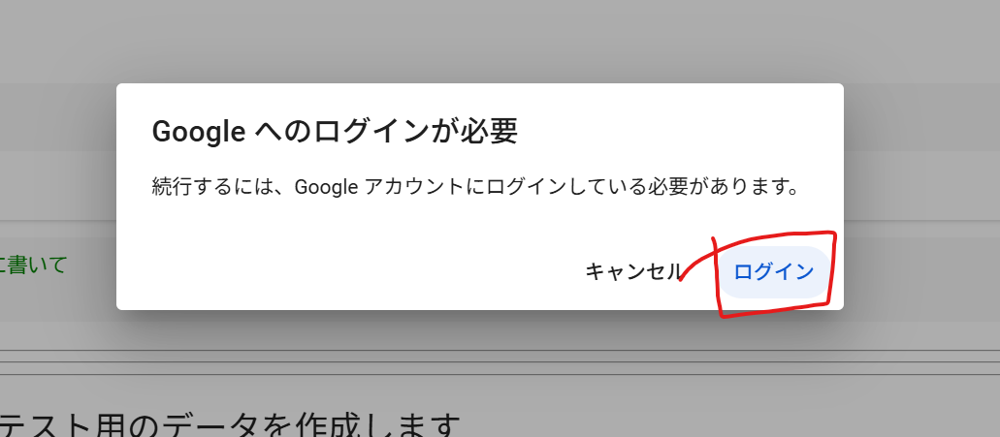
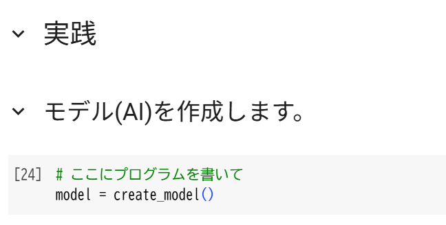
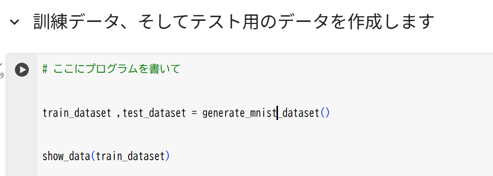
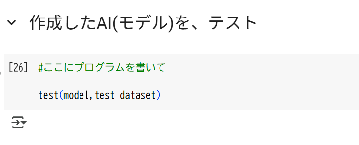
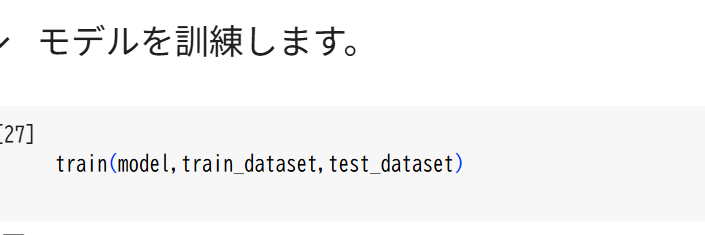
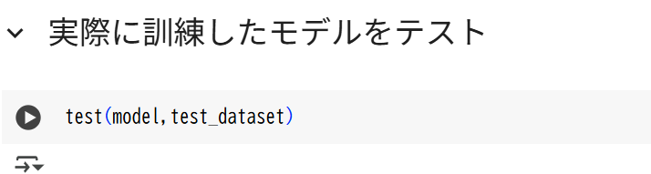
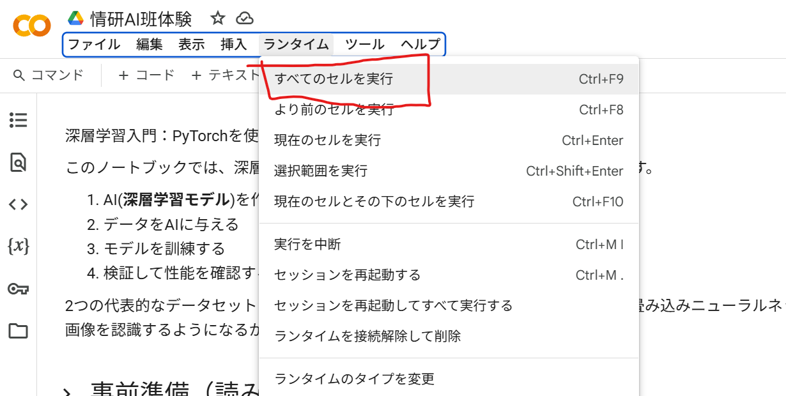

# AI体験

## 目的

AIを開発する全体の流れを把握してもらい、また、実際に自分の手でAIを訓練する経験をしてもらいたい

## AIとは？

とりあえず、AIの中身はブラックボックスとします。その中身は今後学ぶことにします。

AIはこのような図であらわされます



## AIの開発の流れ

まず、最初このAIモデルはランダムな数値で初期化されます。つまり、間違った答えをいうのです。
そこで、AIにたくさんのデータを見せてあげます。
この画像は猫、これは犬、これは車、これは人間、などと教えてあげます。
これをたくさん繰り返すと、AIは少しずつ、正しい答えを言えるようになります。

## 実際にやるには

実際の学習には高性能なパソコンが必要です。そこで、インターネット上のコンピュータを使って、そこでAIを訓練します。

今回はGoogleが提供しているColabというサービスを使います。
これは、ブラウザ(Chromeとか)の中で、Pythonというプログラミング言語を実行することができます。GPUも無料で使えたりで、AIの訓練に最適です。

## では実際にAIを訓練してみましょう

### テンプレートの準備

私が今回テンプレートを用意しました。そのテンプレートはまだ未完成なので、続きを皆さんに書いていただきたいです。

そのテンプレートはこちらからアクセスできます：
[Colabテンプレート](https://colab.research.google.com/drive/1XSmelqg-Z4rbTljrsQzgEgFc0tjaHbdj?usp=sharing)

### 保存

これをGoogleドライブに保存します。Googleドライブとは、グーグルのでっかいサーバーの中にデータを保存できるサービスです。

「Ctrl+S」を同時に押すと、こんなウィンドウが出ます。



「ドライブにコピーを保存」を選択して



ログイン.. してきてください。

(※学校のGoogleアカウントでも良いと思うよ)

そして、もう一度もとのページに戻ったらOK

### このノートブックは

今開いてあるページは、Colabのノートブックと呼ばれるものです。
ノートブックは、Pythonのコードを実行したり、文章を書いたりすることができるものです。
今回、私がコードの一部は既に書いておきました。「事前準備」は全て読み飛ばして、「実践」のところから始めてください。

### 書き写す

以下の内容を、Colabのノートブック上に書き写してみましょう！







### 実行

「ランタイム」をクリックして


「すべてのセルを実行」をクリックします。



すると、全てのコードが実行されます。時間がかかるので待ちましょう。

ちなみにエラーが出ることがよくあるので、気軽に声かけたりしてください

### 結果を確認

この実行でいつかのことが分かるはずです。

- 訓練(train)前は、AIの答えは間違えだらけだ！
- 訓練すると、答えは正しい。

### 次に

最初の体験で、ここまででできたら素晴らしいです！

興味がある人、少し深掘りしてみましょう

#### 別のデータで訓練、テスト

```python
train_dataset ,test_dataset = generate_mnist_dataset()
```

の部分を、

```python
train_dataset ,test_dataset = generate_cifar_dataset()
```

に変えてみましょう。

そのうえで、幾つかのセルを実行してみましょう。

### AIの中身を見てみる

部長が解説するかもです。
