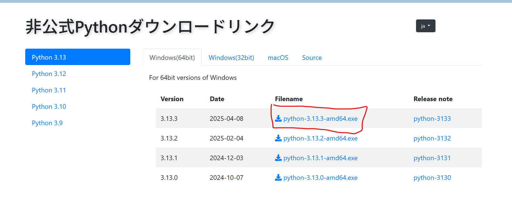
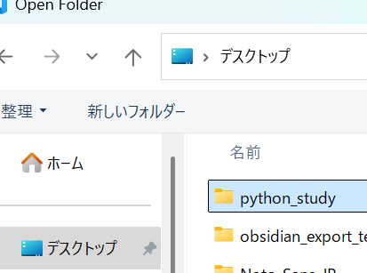
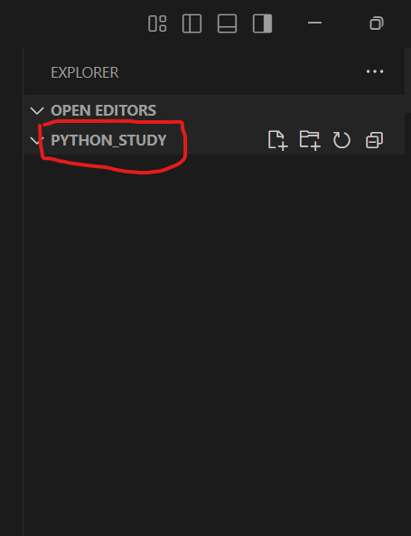
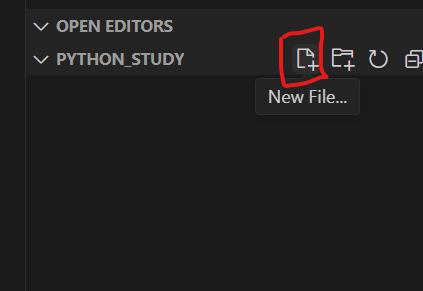
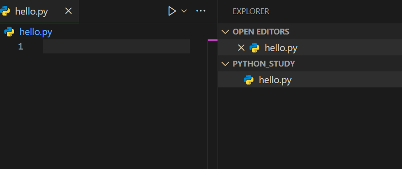
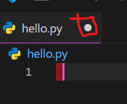
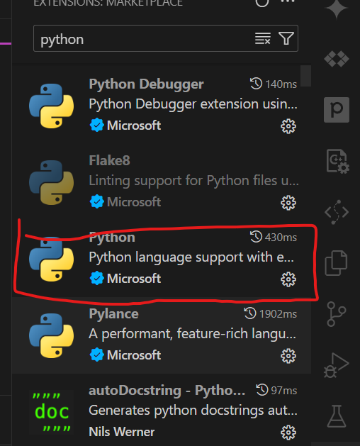
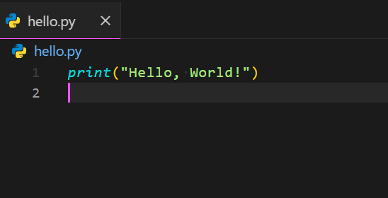

# 環境構築、Python導入

このシリーズは、後にAIを実際にコンピュータ上で動かすために、必要となるプログラミングの技術、つまり「Python」を学ぶためのものです。

Pythonは、最も様々な分野でつかわれており、これを学べば基本的になんでも作れるようになります。

今回の内容はまだ退屈・面倒くさいことも多いですが、ここを乗り越えたら本格的なプログラミングの世界に飛び込んでいけるので、頑張っていきましょう！

## 目次

1. **Pythonのインストール**
    * Pythonの概要とインストール手順
    * Pythonのバージョン確認と環境変数の設定
2. **開発環境のセットアップ**
    * Visual Studio Code (VSCode) の概要とインストール
    * VSCodeの基本的な使い方：フォルダの開き方、ファイルの作成、ターミナルの利用
    * Python開発を快適にするVSCode拡張機能
3. **Pythonの第一歩：Hello World**
    * `print()` 関数：コンピュータに指示を出す基本
    * 最初のコード実行：`print("Hello, Python World!")`
4. **コードの可読性を高める**
    * コメントの役割と記述方法
    * なぜコメントが重要なのか、実践的な観点から

---

## 1. Pythonのインストール

Pythonを使うためには、まずPython自体をコンピュータにインストールする必要があります。Pythonは、オープンソースのプログラミング言語であり、公式サイトから無料でダウンロードできます。公式サイトは分かりにくいのでこちらのページからダウンロードして、インストールしてください。（心配しないで、安全ですよ）



ダウンロードしたら、インストーラーを実行して、画面の指示に従ってインストールを進めてください。特に、以下の点に注意してください。

* **Add Python to PATH**: インストール時に「Add Python to PATH」というオプションが表示されます。これをチェックしておくと、コマンドラインからPythonを簡単に実行できるようになります。これを忘れると、後で面倒なことになるので、必ずチェックしてください。
* **インストール先の選択**: デフォルトのインストール先で問題ありませんが、特に理由がなければそのまま進めてください。

## 2. 開発環境のセットアップ

効率的な学習と開発のためには、適切な「開発環境」を整えることが不可欠です。今回は、非常に人気があり高機能なテキストエディタである「Visual Studio Code (VSCode)」を使用します。

### Visual Studio Code (VSCode) の概要とインストール

VSCodeは、Microsoft社が開発している無料のソースコードエディタです。軽量でありながら、豊富な拡張機能によって様々なプログラミング言語に対応でき、デバッグ機能も強力です。プロの開発現場でも広く採用されており、今のうちに慣れておくことは将来的に大きなアドバンテージになります。

**インストール手順の概要：**

1. **公式サイトへアクセス**: 「VSCode」で検索し、公式ダウンロードページにアクセスします。
    * 
2. **インストーラーのダウンロード**: お使いのOS（Windows, macOS, Linux）に合ったインストーラーをダウンロードします。
3. **インストール実行**: ダウンロードしたインストーラーを実行し、画面の指示に従ってインストールを完了させます。基本的にデフォルト設定のままで問題ありません。

### VSCodeの基本的な使い方

VSCodeを起動したら、まずは基本的な操作に慣れましょう。以下の手順を実践してください。（分からないことがあったら、部長のカトにいつでも、DMでも直接でも聞いてください。）

1. **フォルダを開く (作業スペースの準備)**
    * プログラミングでは、関連するファイルを一つのフォルダにまとめて管理するのが一般的です。
    * VSCodeのメニューバーから `ファイル (File)` > `フォルダーを開く (Open Folder...)` を選択し、「デスクトップ」の中に新しくフォルダを作成し、（例: `python_study`）を開きます。
    * 
    * 
    * 
    * 一度フォルダを開くと、VSCodeの左側にある「エクスプローラー」ビューにフォルダ構造が表示されます。ここからファイルの作成や管理ができます。個人的には、最初にこの「作業フォルダを決める」という行為が、プロジェクトへの意識を高める第一歩だと感じています。
    * 

2. **新しいファイルの作成**
    * エクスプローラービューで、開いているフォルダ名にマウスカーソルを合わせると表示される「新しいファイル」アイコンをクリックします。
    * または、フォルダ名を右クリックして「新しいファイル」を選択します。
    * ファイル名を入力します。Pythonのソースファイルは、慣習的に拡張子を `.py` とします（例: `hello.py`）。ファイル名を入力してEnterキーを押すと、エディタエリアに新しい空のファイルが開かれ、すぐにコードを書き始めることができます。
    * 
    * 
    * コードを記述したら、忘れずにファイルを保存しましょう (`Ctrl+S` または `Cmd+S`)。保存しないと、変更内容はディスクに書き込まれず、実行時に反映されません。

3. **エディタエリア**
    * ファイルを作成または開くと、中央の大きなエリアにファイルの内容が表示され、編集できます。ここでPythonのコードを記述していきます。
    * コードを書き加えたり、修正したりした後は、こまめに保存する習慣をつけましょう。VSCodeでは、編集中のファイルタブに●マークが表示され、保存すると×マーク（または何もなし）に戻ります。
    * 

4. **ターミナル (コマンドラインインターフェース)**
    * VSCodeには統合ターミナルが内蔵されており、Pythonプログラムの実行や関連ツールの操作に非常に便利です。
    * メニューバーから `ターミナル (Terminal)` > `新しいターミナル (New Terminal)` を選択、またはControl + Jを同時に押すと、画面下部にターミナルが開きます。
    * 
    * Pythonスクリプトを実行する前には、必ず対象のファイルが保存されていることを確認してください。保存されていない変更は、実行結果に反映されません。
    * ここで `python hello.py` のようにコマンドを打つことで、作成し保存したPythonスクリプトを実行できます。

### Python開発を快適にするVSCode拡張機能

VSCodeの大きな魅力の一つが拡張機能です。Python開発を始めるにあたり、必須である以下の拡張機能をインストールしてください。

* 

* **Python (Microsoft提供)**:
  * これは必須です。シンタックスハイライト（コードの色分け）、コード補完（入力支援）、リンティング（文法チェック）、デバッグ機能などを提供し、Python開発を格段に効率化します。
  * インストール方法: VSCode左側のアクティビティバーから拡張機能ビュー（四角が4つ並んだようなアイコン）を開き、「Python」と検索してMicrosoft提供のものをインストールします。
  * 
  * 
  * この拡張機能があるだけで、タイプミスが減ったり、関数の使い方を素早く確認できたりと、学習初期のつまずきを大幅に減らせます。

---

## 2. Pythonの第一歩：Hello World

環境が整ったところで、いよいよPythonのコードを書いていきましょう。プログラミング学習の伝統として、最初に「Hello, World!」のようなメッセージを画面に表示させることから始めます。

Pythonで画面に何かを出力するには、`print()` という組み込み関数（後々、**関数**について深く学習していきます。とりあえず、一つのおまじない、コマンドとして覚えてください）を使用します。

### 最初のコード実行

1. 先ほど作成した `hello.py` (または任意の `.py` ファイル) をVSCodeで開きます。
2. エディタエリアに以下のコードを記述してください。

    ```python
    print("Hello, World!")
    ```

    
    

3. ファイルを保存します (`Ctrl+S` または `Cmd+S`)。
4. VSCodeの統合ターミナルを開き、次のコマンドを入力して実行します。

    ```bash
    python hello.py
    ```

    (macOSやLinuxで `python3` コマンドを使用している場合は `python3 hello.py` としてください)

ターミナルに `Hello, World!` と表示されれば成功です！これが、あなたがコンピュータに対して初めて出した指示であり、その結果です。


**コードの解説：**

* `print`: 「表示する」という命令を出すためのキーワードです。
* `()`: 関数を呼び出す際に使用し、この中に表示したい内容などを記述します。
* `"Hello, World!"`: 表示したい文字列です。文字列はダブルクォーテーション `"` またはシングルクォーテーション `'` で囲むルールになっています。

---

## 3. コードの可読性を高める コメント

プログラムは、書いた本人だけでなく、将来の自分や他の人が読むこともあります。そのため、コードが何をしているのかを分かりやすく記述しておくことが重要です。その手段の一つが「コメント」です。

コメントは、プログラムの動作には直接影響しない、人間向けの注釈です。

### なぜコメントが重要なのか

* **備忘録として**: 数日後、数週間後に自分のコードを見返したとき、複雑なロジックや特定の処理の意図をすぐに思い出せるようにするため。
* **他者への説明として**: チームで開発する場合や、コードを共有する場合に、他の人がコードの意図を理解しやすくするため。
* **デバッグの補助として**: 一時的にコードの一部を無効化したい場合などにも使えます。

良いコメントを書く習慣は、効率的な開発と円滑なコミュニケーションに不可欠です。特に、なぜそのようなコードにしたのかという「背景」や「意図」をコメントに残しておくと、後々非常に役立ちます。これは経験上、強調しておきたいポイントです。

### Pythonでのコメントの書き方

Pythonでは、`#` (ハッシュマーク) を使うと、その行の `#` 以降のテキストはコメントとして扱われます。

```python
# この行全体がコメントになります。
print("このコードは実行されます。")  # ここから右側はコメントです。処理の簡単な説明など。

# print("この行はコメントアウトされているため実行されません。")
```

---

## ✏️ 本日の演習

今日学んだことを使って、実際に手を動かしてみましょう。

1. VSCodeで新しいPythonファイル（例: `practice01.py`）を作成してください。
2. そのファイルに、あなたの名前や好きな言葉などを表示する `print()` 文を3つ以上記述してください。
3. それぞれの `print()` 文が何を表示しようとしているのか、その上にコメントで説明を加えてください。
4. 作成したファイルをターミナルから実行し、意図した通りに表示されるか確認してください。

---

最初は戸惑うこともあるかもしれませんが、実際にコードを書き、動かす体験を積み重ねることが上達への近道です。

次回は、プログラムでデータを扱うための基本となる「変数」と「データ型」について学びます。本格的なプログラミングの世界に足を踏み入れる準備が整いました。引き続き、頑張っていきましょう！
