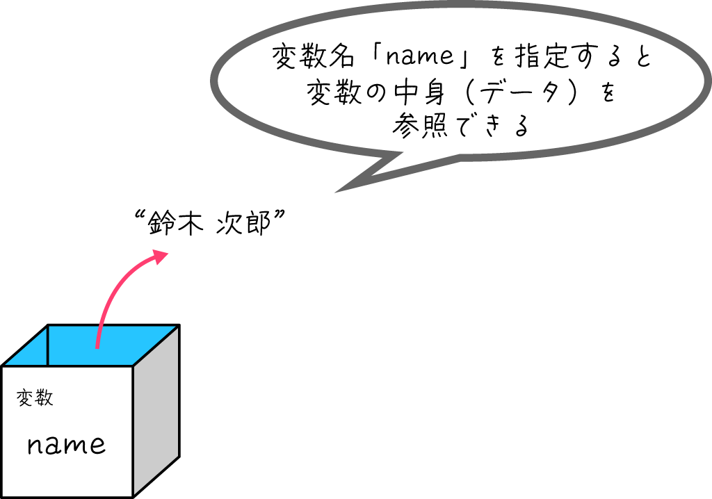

# Pythonプログラミング入門：変数、データ型、演算

前回は開発環境を整えて、初めての `print("Hello, World!")` を実行し、またコメントの重要性について学びました。

今回は、プログラミングでデータを扱うための超基本にして超重要な「**変数**」と「**データ型**」、そしてそれらを使った簡単な「**演算**」について学んでいきます。ここをしっかり押さえると、プログラムでできることの幅が一気に広がります。覚えることも多いかもしれませんが、少しずつ慣れていきましょう

## 目次

1. **変数とは？**
    * 変数の役割：データに名前をつける箱
    * 変数の作り方（定義）と使い方
    * 変数名のルール：分かりやすい名前をつけよう！
2. **データ型の種類**
    * `int`型：整数
    * `float`型：小数点も扱える数
    * `str`型：文字や文章
    * `bool`型：真(True)か偽(False)か
    * データ型の確認方法：`type()`関数を使ってみよう
3. **基本的な演算**
    * 数値の計算：算術演算子 (+, -, \*, /, //, %, \*\*)
    * 文字列の操作：連結と繰り返し
    * ユーザーからの入力を受け取る: `input()`関数
4. **演習**

---

## 1. 変数とは？

### 変数の役割：データに名前をつける箱

プログラムでは、数値や文字列など、様々な「データ」を扱います。このデータを一時的に保存しておいたり、後で使ったりするために用意するのが「**変数**」です。

変数とは、**データを入れておくための名前付きの箱**のようなものだとイメージしてください。箱に名前（これが**変数名**）をつけて、その中にデータ（これが**値**）を入れておく感じです。

例えば、テストの点数「80」というデータに「`score`」という名前の変数を用意したり、自分の名前「山田太郎」というデータに「`my_name`」という変数を用意したりできます。こうすることで、後から「`score`」や「`my_name`」という名前で、中のデータを取り出して使うことができるんです。便利ですよね！



### 変数の作り方（定義）と使い方

Pythonで変数を作るのはとっても簡単です。基本の形はこれだけ！

```python
変数名 = 値
```

「`=`」は算数で使う「等しい」という意味ではなく、プログラミングでは「**右側の値を左側の変数に代入する（入れる）**」という意味で使われます。これを「**代入**」と言います。

実際にコードで見てみましょう。

```python
score = 80  # score という名前の変数に、数値の 80 を代入
my_name = "高専太郎"  # my_name という名前の変数に、文字列の "高専太郎" を代入

# 変数に入っている値を使ってみる (print関数で表示)
print(score)
print(my_name)
```

これを実行すると、ターミナルには以下のように表示されるはずです。

```
80
高専太郎
```

ちゃんと変数に入れた値が表示されましたね！

### 変数名のルール：分かりやすい名前をつけよう

変数には好きな名前をつけられますが、いくつかルールと、守った方が良い「お作法」があります。

**ルール（守らないとエラーになります）：**

* 使える文字は、アルファベット (`a`～`z`, `A`～`Z`)、数字 (`0`～`9`)、アンダースコア (`_`) です。
* ただし、**先頭の文字に数字は使えません**。`1st_score` はダメですが、`score_1st` はOKです。
* Pythonが特別な意味で使っている単語（**予約語**または**キーワード**と言います。例: `print`, `if`, `for` など）は変数名として使えません。VSCodeなどのエディタでは予約語が色付きで表示されることが多いので、それで判断できます。
* 大文字と小文字は区別されます。`score` と `Score` は別の変数として扱われます。

**お作法（守るとコードが読みやすくなります）：**

* **変数名はその中身を表す分かりやすい名前にする**のが鉄則です！ 例えば、テストの点数なら `score` や `test_point`、名前なら `name` や `user_name` のように。`a` とか `x` とか一文字の変数名は、よほど単純な場合を除いて避けましょう。
  * 個人的な経験から言うと、適当な変数名をつけて後で「これ、何入れてたっけ…？」と頭を抱えるのはプログラミングあるあるです（笑）。未来の自分のためにも、分かりやすい名前をつけるクセをつけましょうね！
* 複数の単語をつなげて変数名にする場合、Pythonでは慣習的に単語間をアンダースコア `_` でつなぐ「**スネークケース**」がよく使われます (例: `my_name`, `student_id`)。

---

## 2. データ型の種類

変数に入れるデータには、実は色々な「種類」があります。これを「**データ型**」と言います。Pythonはデータ型を自動で判断してくれる賢い言語ですが、代表的なものをいくつか覚えておくと、プログラムを書く上で非常に役立ちます。

今回は、特に重要な3つのデータ型を紹介します。

### `int`型：ピシッと決まる整数

`int`（イント、integerの略）は、**整数**を表すデータ型です。小数点を含まない数値ですね。

```python
age = 18         # 年齢
count = 100      # 個数
temperature = -5 # 気温 (マイナスもOK)
```

### `float`型：小数点も扱える数

`float`（フロート、floating-point numberの略）は、**浮動小数点数**、つまり**小数**を表すデータ型です。

```python
height = 175.5     # 身長 (cm)
weight = 68.2      # 体重 (kg)
pi_value = 3.14159 # 円周率
```

**ポイント：** `int` と `float` の違いは、小数点がつくかどうかです。例えば、`10` は `int` ですが、`10.0` は `float` として扱われます。この違いが計算結果に影響することもあるので、意識しておくと良いでしょう。

### `str`型：文字や文章

`str`（エスティーアール、stringの略）は、**文字列**を表すデータ型です。前回 `print()` で使ったように、文字や文章はダブルクォーテーション `"` またはシングルクォーテーション `'` で囲みます。

```python
school_name = "明石工業高等専門学校"
message = 'Pythonは楽しい！'
empty_string = "" # 空の文字列も作れます
```

### `bool`型：真 (`True`) か偽 (`False`) か

`bool`（ブール、booleanの略）は、**真偽値**を表すデータ型です。この型が持つ値は、**`True` (真)** と **`False` (偽)** の2つだけです。
プログラムが条件に基づいて何かを判断する際に非常に重要な役割を果たします。例えば、「ある条件が正しいか (True)」「間違っているか (False)」といったことを表現できます。

```python
is_student = True  # 学生ですか？ -> はい (True)
is_adult = False   # 大人ですか？ -> いいえ (False)
has_error = False  # エラーはありますか？ -> いいえ (False)
```

後の回で学ぶ「条件分岐」などで、この `bool`型がどのように使われるかを見ていきましょう。

### データ型の確認方法：`type()`関数を使ってみよう

変数にどんな型のデータが入っているかを確認したいときは、`type()` という組み込み関数が便利です。

```python
a = 7
b = 2.5
c = "kosen"

print(type(a))  # 変数 a のデータ型を表示
print(type(b))  # 変数 b のデータ型を表示
print(type(c))  # 変数 c のデータ型を表示
```

これを実行すると、ターミナルには以下のように表示されます。

```
<class 'int'>
<class 'float'>
<class 'str'>
```

ちゃんとそれぞれのデータ型が表示されましたね！`type()` 関数は、デバッグ（プログラムの間違い探し）の時などにも役立つので、覚えておくと便利ですよ。


---

## 3. 基本的な演算をマスターしよう

変数とデータ型が分かったところで、次はそれらを使って簡単な計算や操作をしてみましょう。これを「**演算**」と言い、演算に使われる記号を「**演算子**」と言います。

### 数値の計算：算術演算子

`int`型や`float`型の数値データに対しては、おなじみの算術演算子が使えます。

| 演算子 | 意味             | 例 (`a=7`, `b=2`) | 結果 |
| :----- | :--------------- | :---------------- | :--- |
| `+`    | 足し算           | `a + b`           | `9`  |
| `-`    | 引き算           | `a - b`           | `5`  |
| `*`    | 掛け算           | `a * b`           | `14` |
| `/`    | 割り算           | `a / b`           | `3.5` (結果は常にfloat) |
| `//`   | 割り算 (小数点以下切り捨て) | `a // b`          | `3`  |
| `%`    | 割り算の余り     | `a % b`           | `1`  |
| `**`   | べき乗           | `a ** b`          | `49` (7の2乗) |

**注意点：**

* `int` 同士の `/` (割り算) の結果は、割り切れる場合でも `float` 型になります (例: `4 / 2` は `2.0`)。
* `0` で割ろうとするとエラー (ZeroDivisionError) になるので注意してくださいね。

実際にコードで試してみましょう。

```python
num1 = 10
num2 = 3

print(num1 + num2)  # 13
print(num1 / num2)  # 3.333...
print(num1 // num2) # 3
print(num1 % num2)  # 1
print(num1 ** num2) # 1000
```

### 文字列の操作：連結と繰り返し

`str` 型の文字列に対しても、いくつかの演算子が使えます。

* **`+` 演算子 (連結)**: 文字列同士をくっつけて新しい文字列を作ります。
* **`*` 演算子 (繰り返し)**: 文字列を整数回繰り返します。

```python
str1 = "Hello"
str2 = "Kosen"
space = " "

# 文字列の連結
greeting = str1 + space + str2 + "!" # "Hello Kosen!" となる
print(greeting)

# 文字列の繰り返し
laugh = "ha" * 3  # "hahaha" となる
print(laugh)

# 数字の文字列と数値は直接連結できないので注意！
# print("出席番号" + 10) # これはエラーになります
# print("出席番号" + str(10)) # こうすればOK (str()で数値を文字列に変換)
```

**ポイント：** 数値と文字列を `+` で直接連結しようとするとエラーになります。もし数値を文字列とくっつけたい場合は、`str()` という「関数」を使って数値を文字列型に変換してから連結する必要があります。

```python
print("出席番号" + str(10)) # こうすればOK (str()で数値を文字列に変換)
```

### ユーザーからの入力を受け取る: `input()`関数

プログラムが実行中にユーザーから情報を受け取りたい場合があります。そんな時に使うのが `input()` 関数です。

`input()` 関数は、ユーザーがキーボードから何かを入力してEnterキーを押すまで待ち、入力された内容を**文字列として**返します。

```python
print("あなたのお名前を教えてください。")
user_name = input() # ユーザーの入力を待ち、変数 user_name に代入
print("こんにちは、" + user_name + "さん！")

print("好きな数字を入力してください。")
favorite_number_str = input() # この時点では文字列型
# favorite_number = int(favorite_number_str) # もし数値として扱いたい場合は、int()で変換
# print(user_name + "さんの好きな数字に10を足すと、" + str(favorite_number + 10) + "です。")
```

**ポイント：**

* `input()` の括弧の中にメッセージ（プロンプトと言います）を入れると、入力待ちの際にそのメッセージが表示されます。例: `age_str = input("年齢を入力してください: ")`
* `input()` で受け取った値は**必ず文字列型**になります。もし数値として計算に使いたい場合は、`int()` や `float()` を使って適切なデータ型に変換する必要があります。

    ```python
    age_str = input("年齢を入力してください: ")
    age = int(age_str) # 文字列を整数に変換
    next_year_age = age + 1
    print("来年には" + str(next_year_age) + "歳ですね！")
    ```

    これを怠ると、例えば `"18" + 1` のような計算はエラーになってしまいます（文字列と数値を直接足し算できないため）。

---

## ✏️ 本日の演習

さあ、今日学んだことを使って、実際に手を動かしてみましょう！

1. VSCodeで新しいPythonファイル（例: `practice02.py`）を作成してください。
2. 以下の3つの変数を定義してください。
    * `a` に整数 `7` を代入
    * `b` に小数 `2.5` を代入
    * `c` に文字列 `"kosen"` を代入
3. `a + b` の計算結果を `print()` 関数で表示してください。
4. `c * 3` の計算結果（文字列が3回繰り返されたもの）を `print()` 関数で表示してください。
5. **発展**:
    * あなた自身の「名前 (name)」「年齢 (age)」「好きな食べ物 (favorite_food)」を変数に代入し、それらを `print()` で表示してみてください。
    * いくつかの数値（整数や小数）を変数に代入し、それらを使って四則演算（足し算、引き算、掛け算、割り算）を行い、結果を表示してみてください。それぞれの演算結果のデータ型がどうなるかも `type()` 関数で確認してみると面白いですよ！

---
---
---

### 演習の答え

```python
# 変数を定義
a = 7
b = 2.5
c = "kosen"

# a + b の計算と結果の表示
result1 = a + b
print("a + b の結果:", result1)
print("result1のデータ型:", type(result1)) # 結果のデータ型も見てみよう！

# c * 3 の計算と結果の表示
result2 = c * 3
print("c * 3 の結果:", result2)
print("result2のデータ型:", type(result2)) # こちらもデータ型を確認！
```

---

第2回はここまでです。変数とデータ型、そして基本的な演算についてやりました。
プログラミングは、こうやって小さな部品（変数や演算子など）を組み合わせて、だんだんと複雑なものを作っていく作業です。一つ一つの部品の役割をしっかり理解することが、大きなシステムの作成には必須です。

次回は、今回少し触れた「文字列 (`str`型)」について、もっと詳しく掘り下げていきます。文字列を切り取ったり、特定の文字を探したり、色々な操作ができるように

質問や要望などがあれば、いつでも部長のカトに聞いてくださいね。次回も頑張りましょう！
