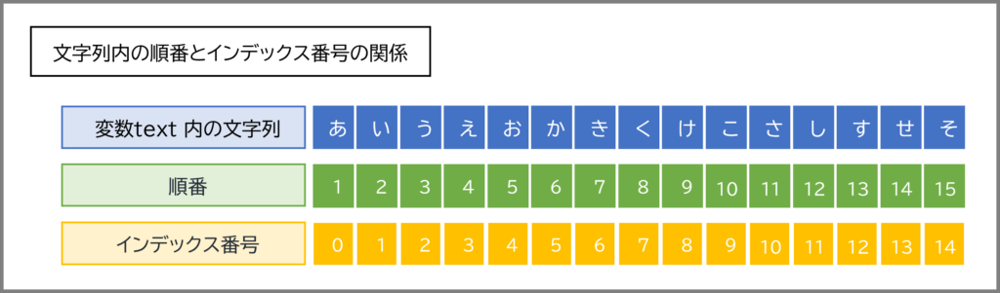
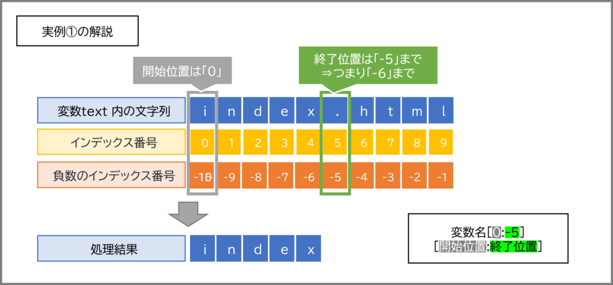
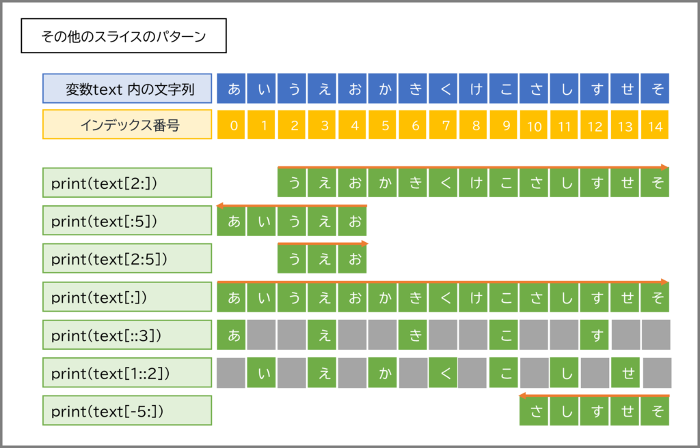

# 文字列操作

前回は、プログラミングの超基本である「変数」と「データ型」、そして「演算」について学びました。数値の計算や簡単な文字列の連結ができるようになりました。

今回は、前回少しだけ触れた「**文字列 (`str`型)**」について、もっと深く、もっと便利に扱えるようになるためのテクニックを学んでいきます！

プログラムでは、ユーザーからの入力、ファイルからの読み込み、インターネット経由でのデータ取得など、様々な場面で文字列データを扱います。そのため、文字列操作をマスターすることは、より実用的なプログラムを作る上で避けては通れない道なんです。非常に多いですが、詳細まで完璧に覚えようとする必要はありません。実際には、関数の機能や便利な使い方だけを覚えておいて、実際に使うときにはこの資料や、またインターネットで確認しながらつかえばよいです。（実際に僕もそうやることがあるよ）

**この資料はチートシートとして、使って下さい。一つ一つのコードを模写しながら進めるのは、時間がかかりすぎます。「こんな機能もあったな」ということだけを覚えて、必要な時に見てください**

## 目次

1. **文字列の基本とインデックスのおさらい**
    * 文字列は文字の「ならび」
    * インデックス：文字の住所番号
    * インデックスを使った1文字の取り出し
2. **文字列のスライス：一部分をスパッと切り出す！**
    * スライスの基本：`[開始インデックス:終了インデックス]`
    * 開始や終了を省略するとどうなる？
    * ステップ指定：`[開始:終了:ステップ]`で飛ばし読み
    * マイナスインデックスとスライス
3. **文字列の便利な相棒たち：文字列メソッド**
    * `len()`：文字数を数える
    * `upper()`, `lower()`：大文字・小文字に変換
    * `replace()`：特定の文字を置き換える
    * `find()`, `index()`：文字や文字列を探す
    * `count()`：文字や文字列の出現回数を数える
    * `strip()`, `lstrip()`, `rstrip()`：端っこの空白を取り除く
    * `split()`：文字列をリストに分割する
    * `join()`：リストの要素を文字列として連結する
4. **文字列フォーマット：データを美しく表示する技術**
    * `+`演算子での連結の限界と課題
    * 古い方法：`%`演算子 (参考程度に)
    * ちょっと便利：`str.format()`メソッド
    * **イチオシ！ f-string (フォーマット済み文字列リテラル)**
        * 基本的な使い方
        * 変数や式をカンタンに埋め込める！
        * 書式指定で見た目をコントロール
5. **演習**

---

## 1. 文字列の基本とインデックスのおさらい

### 文字列は文字の「ならび」

前回学んだように、文字列 (`str`型) は、文字が順番に並んだものです。例えば、`"Python"` という文字列は、`P`, `y`, `t`, `h`, `o`, `n` という6つの文字がこの順番で並んでいます。このようなデータの並びをプログラミングの世界では「**シーケンス**」と呼んだりします。

### インデックス：文字の住所番号

文字列の中の個々の文字には、その位置を示す「**インデックス**」という番号が自動的に割り振られています。これは、マンションの部屋番号や、出席番号のようなものだと考えてください。

**重要なポイント：インデックスは `0` から始まります！**

例えば、`"Python"` という文字列の場合：

| 文字    | P | y | t | h | o | n |
| :------ | :-: | :-: | :-: | :-: | :-: | :-: |
| インデックス | 0 | 1 | 2 | 3 | 4 | 5 |



また、Pythonでは**マイナスのインデックス**も使えます。これは末尾からの位置を示し、`-1` が最後の文字、`-2` が最後から2番目の文字…というようになります。

| 文字    | P  | y  | t  | h  | o  | n  |
| :------ | :-: | :-: | :-: | :-: | :-: | :-: |
| インデックス | 0 | 1 | 2 | 3 | 4 | 5 |
| マイナスインデックス | -6 | -5 | -4 | -3 | -2 | -1 |



### インデックスを使った1文字の取り出し

インデックスを使うと、文字列の中から特定の1文字だけを取り出すことができます。書き方は `文字列[インデックス番号]` です。

```python
my_class = "AI班"
print(my_class[0])  # 最初の文字
print(my_class[1])  # 2番目の文字
print(my_class[2])  # 3番目の文字

print(my_class[-1]) # 最後の文字
print(my_class[-3]) # 最後から3番目の文字 (この場合は最初の文字と同じ)
```

これを実行すると、ターミナルにはこう表示されます。

```
A
I
班
班
A
```

**注意！** 存在しないインデックスを指定するとエラー (IndexError) になります。例えば、`my_class[3]` は `my_class` の文字数を超えているのでエラーです。気をつけてくださいね。

---

## 2. 文字列のスライス：一部分をスパッと切り出す

文字列全体ではなく、その一部分だけを取り出したい場合、「**スライス**」という機能が非常に便利です。名前の通り、ケーキをスライスするように、文字列の一部分を切り出すイメージです。

### スライスの基本：`[開始インデックス:終了インデックス]`

スライスの基本的な書き方は `文字列[開始インデックス:終了インデックス]` です。

* `開始インデックス`: 切り出しを開始する位置のインデックス。この文字は含まれます。
* `終了インデックス`: 切り出しを終了する位置のインデックス。**この文字は含まれません！** (ここ、大事なポイントです！)

```python
message = "Hello, Kosen!"
# インデックス: H e l l o ,   K o s e  n  !
#             0 1 2 3 4 5 6 7 8 9 10 11 12

print(message[0:5])   # インデックス0から4まで (5の手前まで)
print(message[7:12])  # インデックス7から11まで (12の手前まで)
```

実行結果：

```
Hello
Kosen
```



### 開始や終了を省略するとどうなる？

スライスでは、開始インデックスや終了インデックスを省略することもできます。

* `開始インデックス` を省略 (`[:終了インデックス]`)：文字列の先頭から `終了インデックス` の手前まで。
* `終了インデックス` を省略 (`[開始インデックス:]`)：`開始インデックス` から文字列の最後まで。
* 両方省略 (`[:]`)：文字列全体のコピー。

```python
text = "Programming"
# インデックス: P r o g r a m m i  n  g
#             0 1 2 3 4 5 6 7 8  9  10

print(text[:7])     # 先頭からインデックス6まで (7の手前まで)
print(text[3:])     # インデックス3から最後まで
print(text[:])      # 全部 (コピーが作られる)
```

実行結果：

```
Program
gramming
Programming
```

### ステップ指定：`[開始:終了:ステップ]`で飛ばし読み

スライスには、さらに「ステップ」という3番目の値を指定できます。`文字列[開始:終了:ステップ]` の形です。ステップは、何文字おきに文字を取り出すかを指定します。デフォルトは `1` (1文字ずつ) です。

```python
alphabet = "ABCDEFGHIJKLMNOPQRSTUVWXYZ"

print(alphabet[0:10:2]) # インデックス0から9までの範囲で、2文字おきに
print(alphabet[::3])    # 文字列全体を、3文字おきに
print(alphabet[::-1])   # ステップに-1を指定すると、文字列を逆順にできる！
```

実行結果：

```
ACEGI
ADGJMPSVY
ZYXWVUTSRQPONMLKJIHGFEDCBA
```

`[::-1]` で文字列を簡単に逆順にできるのは、覚えておくと便利な小技ですよ！

### マイナスインデックスとスライス

スライスでもマイナスインデックスが使えます。

```python
word = "nitac"
# インデックス: n  i  t  a  c
#             0  1  2  3  4
#            -5 -4 -3 -2 -1

print(word[-3:])  # 後ろから3文字 (インデックス-3から最後まで)
print(word[:-2]) # 後ろから2文字の手前まで (つまり先頭からインデックス-3まで)
```

実行結果：

```
tac
nit
```

スライスは非常に強力で、文字列操作の基本中の基本です。色々なパターンを試して、感覚を掴んでみてくださいね！

---

## 3. 文字列の便利な相棒たち：文字列メソッド

Pythonの文字列 (`str`型オブジェクト) には、様々な便利な操作を行うための「**メソッド**」があらかじめ用意されています。メソッドとは、特定のデータ型に関連付けられた関数のことで、`オブジェクト.メソッド名()` のようにドット `.` を使って呼び出します。これについて、関数を学習するときにもまた振り返ると、理解が深まります。今のところは、「便利なことができるコマンドがたくさん用意されているんだ」、という程度で大丈夫です。

ここでは、特によく使われる便利な文字列メソッドをいくつか紹介します。

### `len()`：文字数を数える

これはメソッドではありませんが、文字列の長さを得るのに非常によく使う**組み込み関数**です。

```python
greeting = "こんにちは"
print(len(greeting)) # 5

empty_str = ""
print(len(empty_str)) # 0
```

### `upper()`, `lower()`：大文字・小文字に変換

* `upper()`: 文字列をすべて大文字にします。
* `lower()`: 文字列をすべて小文字にします。

```python
title = "Python Programming"
print(title.upper()) # PYTHON PROGRAMMING
print(title.lower()) # python programming
```

これらのメソッドは、元の文字列を変更するのではなく、新しい変換後の文字列を返すことに注意してください。

### `replace()`：特定の文字を置き換える

`文字列.replace(置換前の文字列, 置換後の文字列)` で、文字列内の一部を別の文字列に置き換えます。

```python
sentence = "I like apple pie."
new_sentence = sentence.replace("apple", "banana")
print(new_sentence) # I like banana pie.

# 元の文字列は変わらない
print(sentence)     # I like apple pie.
```

### `find()`, `index()`：文字や文字列を探す

指定した文字や文字列が、元の文字列のどこに最初に出現するか、その開始インデックスを返します。

* `文字列.find(探す文字列)`:
  * 見つかった場合：最初のインデックスを返す。
  * 見つからなかった場合：`-1` を返す (エラーにはならない)。
* `文字列.index(探す文字列)`:
  * 見つかった場合：最初のインデックスを返す。
  * 見つからなかった場合：エラー (ValueError) になる。

```python
text_data = "search target text"
print(text_data.find("target"))    # 7
print(text_data.find("xyz"))       # -1 (見つからない)

print(text_data.index("text"))     # 14
# print(text_data.index("xyz"))    # これは ValueError になるのでコメントアウト
```

どちらを使うかは状況によりますが、見つからない可能性がある場合は `find()` の方が安全かもしれませんね。

### `count()`：文字や文字列の出現回数を数える

`文字列.count(数える文字列)` で、指定した文字列が元の文字列の中に何回出現するかを数えます。

```python
story = "A long, long time ago, in a galaxy far, far away..."
print(story.count("long")) # 2
print(story.count("far"))  # 2
print(story.count("o"))    # 7
```

### `strip()`, `lstrip()`, `rstrip()`：端っこの空白を取り除く

ユーザー入力やファイルから読み込んだ文字列には、意図しない空白が先頭や末尾についていることがあります。これらを取り除くのに便利です。

* `strip()`: 文字列の先頭と末尾の両方から空白文字（スペース、タブ、改行など）を取り除く。
* `lstrip()`: 文字列の先頭から空白文字を取り除く (Left Strip)。
* `rstrip()`: 文字列の末尾から空白文字を取り除く (Right Strip)。

```python
user_input = "   Hello World!   \n" # \n は改行文字
print(f"'{user_input.strip()}'")   # 'Hello World!'
print(f"'{user_input.lstrip()}'")  # 'Hello World!   \n'
print(f"'{user_input.rstrip()}'")  # '   Hello World!'
```

引数に文字列を指定すると、その文字列に含まれる文字を端から取り除きます。

### `split()`：文字列をリストに分割する

`文字列.split(区切り文字)` で、指定した「区切り文字」で文字列を分割し、分割された各部分を要素とする**リスト**を返します。(リストについては次回詳しく学びますので、今は「複数の値をまとめて扱えるもの」くらいに思っておいてください！)

区切り文字を省略すると、スペースやタブ、改行などの連続する空白文字で分割します。

```python
csv_data = "Taro,20,Tokyo"
items = csv_data.split(",")
print(items) # ['Taro', '20', 'Tokyo']

words = "This is a pen."
word_list = words.split() # 区切り文字なし (空白で分割)
print(word_list) # ['This', 'is', 'a', 'pen.']
```

### `join()`：リストの要素を文字列として連結する

`区切り文字列.join(文字列のリスト)` で、リスト内の各文字列要素を「区切り文字列」でつなぎ合わせて、一つの新しい文字列を作ります。`split()` の逆の操作と考えると分かりやすいかもしれません。

```python
path_parts = ["home", "user", "documents"]
full_path = "/".join(path_parts)
print(full_path) # home/user/documents

words_to_join = ['Python', 'is', 'fun']
sentence_joined = " ".join(words_to_join)
print(sentence_joined) # Python is fun
```

これらのメソッドはほんの一部ですが、非常によく使われるものばかりです。実際にコードを書いて試しながら、どんな動きをするのか体感してみてくださいね！

---

## 4. 文字列フォーマット：データを美しく表示する技術

プログラムの実行結果や、ユーザーへのメッセージを画面に表示するとき、変数に入っている値と固定の文字列を組み合わせて表示したい場面がよくあります。例えば、「〇〇さん、こんにちは！あなたのスコアは△△点です。」のように。

これを実現するのが「**文字列フォーマット**」です。

### `+`演算子での連結の限界と課題

前回、文字列同士を `+` で連結できることを学びました。

```python
name = "高専太郎"
score = 85
# print("ようこそ、" + name + "さん！あなたの点数は" + score + "点です。") # これはエラー！
print("ようこそ、" + name + "さん！あなたの点数は" + str(score) + "点です。")
```

`score` は数値 (`int`型) なので、そのままでは文字列と連結できません。`str()` 関数で文字列に変換する必要がありましたね。
これが数カ所ならまだしも、たくさんの変数を埋め込みたい場合、`+` と `str()` がたくさん並んで読みにくく、間違いやすいコードになってしまいます。

### 古い方法：`%`演算子 (参考程度に)

Pythonには古くから `%` 演算子を使った文字列フォーマットの方法があります。C言語の `printf` に似た書き方です。

```python
name = "高専花子"
age = 18
print("名前: %s, 年齢: %d歳" % (name, age)) # 名前: 高専花子, 年齢: 18歳
```

`%s` が文字列、`%d` が整数を表す「変換指定子」です。今でも古いコードでは見かけることがありますが、これから新しく書く場合は、もっと良い方法があるので、参考程度に知っておけばOKです。

### ちょっと便利：`str.format()`メソッド

`%`演算子より少し改善されたのが `str.format()` メソッドです。

```python
name = "技大次郎"
subject = "Python"
print("こんにちは、{}さん。{}の勉強を頑張りましょう。".format(name, subject))
# こんにちは、技大次郎さん。Pythonの勉強を頑張りましょう。

# 波括弧 {} に番号や名前をつけることもできます
print("私の名前は{1}です。{0}から来ました。".format("沖縄高専", "高専ロボコン"))
# 私の名前は高専ロボコンです。沖縄高専から来ました。

print("X座標: {x}, Y座標: {y}".format(x=10, y=20))
# X座標: 10, Y座標: 20
```

`{}` をプレースホルダー（値が入る場所）として使い、`.format()` の引数で値を渡します。`%` 演算子よりは柔軟性がありますが、それでも少し冗長に感じるかもしれません。

### イチオシ！ f-string (フォーマット済み文字列リテラル)

そして、現在Pythonで文字列フォーマットを行う上で**最も推奨される方法**が、Python 3.6から導入された「**f-string**」（エフストリング）です！
f-stringは、非常に直感的で、簡潔に、そして効率的に文字列フォーマットを行えます。個人的にも大好きで、これなしのPythonは考えられないくらいです（笑）。

#### 基本的な使い方

f-stringを使うには、文字列リテラルの前に `f` (または `F`) をつけます。そして、文字列の中に `{}` で囲んで変数名や式を直接書き込むことができます。

```python
student_name = "AI三郎"
score = 92

message = f"生徒名: {student_name}, テストの点数: {score}点"
print(message)
# 生徒名: AI三郎, テストの点数: 92点
```

どうですか？ `+` で連結したり、`str()` で変換したりする必要がなく、とてもスッキリしていますよね！

#### 変数や式をカンタンに埋め込める

`{}` の中には、変数だけでなく、Pythonの式も書けます。

```python
num1 = 10
num2 = 5
print(f"{num1} + {num2} = {num1 + num2}")       # 10 + 5 = 15
print(f"num1の二乗は {num1 ** 2} です。")        # num1の二乗は 100 です。

user = "admin"
print(f"ユーザー名は大文字で {user.upper()} です。") # ユーザー名は大文字で ADMIN です。
```

#### 書式指定で見た目をコントロール

f-stringの `{}` の中では、さらに `:` (コロン) の後に「書式指定」を行うことで、数値の桁数を揃えたり、小数点以下の表示桁数を指定したり、文字寄せをしたりと、表示の見た目を細かくコントロールできます。

**数値の書式指定例:**

* **ゼロ埋め**: `f"{数値:0桁数d}"` (整数をゼロで指定桁数に)

    ```python
    file_number = 7
    print(f"ファイル名: data_{file_number:03d}.txt") # ファイル名: data_007.txt
    ```

* **小数点以下の桁数**: `f"{浮動小数点数:.桁数f}"`

    ```python
    pi_approx = 3.1415926535
    print(f"円周率 (小数点以下2桁): {pi_approx:.2f}") # 円周率 (小数点以下2桁): 3.14
    print(f"円周率 (小数点以下5桁): {pi_approx:.5f}") # 円周率 (小数点以下5桁): 3.14159
    ```

* **桁区切り (カンマ)**: `f"{数値:,}"`

    ```python
    large_number = 1234567890
    print(f"大きな数字: {large_number:,}") # 大きな数字: 1,234,567,890
    ```

* **パーセント表示**: `f"{数値:.表示したい小数点以下の桁数%}"` (数値は0.25のような小数で与える)

    ```python
    ratio = 0.856
    print(f"達成率: {ratio:.1%}") # 達成率: 85.6%
    ```

**文字寄せの書式指定例:** (`<`:左寄せ, `^`:中央寄せ, `>`:右寄せ)

```python
item = "Apple"
price = 150
print(f"|{item:<10}|{price:>5}|")  # |Apple     |  150|
print(f"|{item:^10}|{price:^5}|")  # |  Apple   | 150 |
```

### f-stringのデバッグ活用と知っておくと便利なTips

f-stringは単に文字列を整形するだけでなく、開発中のデバッグ作業を助けたり、より複雑な表現を可能にする機能も持っています。特にPython 3.8以降で使えるようになった機能は強力ですよ！

#### 1. 変数名とその値を一発表示！ `=` 指定子 (デバッグの神様)

プログラムを書いていると、「この変数、今どんな値が入ってるんだっけ？」と確認したくなることが頻繁にありますよね。そんな時、従来は `print(f"my_variable = {my_variable}")` のように書いていたかもしれません。

Python 3.8からは、f-string内で変数名の直後に `=` を書くだけで、**変数名とその値の両方を自動的に表示**してくれるようになりました！これはデバッグ時に本当に便利です。

```python
# Python 3.8以降が必要です
user_id = 101
user_name = "kosen_student"
items_in_cart = 5
total_price = 7500

# 変数名とその値を簡単に出力
print(f"{user_id=}")
print(f"{user_name=}")
print(f"{items_in_cart=}, {total_price=}") # 複数もOK

# 式に対しても使えます
print(f"{total_price / items_in_cart = }")
print(f"{user_name.upper() = }")
```

これを実行すると、こうなります。

```
user_id=101
user_name='kosen_student'
items_in_cart=5, total_price=7500
total_price / items_in_cart = 1500.0
user_name.upper() = 'KOSEN_STUDENT'
```

見てください！わざわざ `変数名 =` と書かなくても、自動で表示してくれています。タイプ量が減るだけでなく、何を表示しているのかが一目瞭然なので、デバッグ効率が格段に上がります。
`=` の前後にはスペースを入れることもできますし、書式指定子と組み合わせることも可能です。

```python
# Python 3.8以降
value_a = 12.3456
value_b = 98765

print(f"{value_a = :.2f}") # 小数点以下2桁で表示
print(f"{value_b = :,}")   # 桁区切りで表示
```

実行結果：

```
value_a = 12.35
value_b = 98,765
```

この `=` 指定子は、プログラムの途中経過を確認したいときに `print` 文を差し込む際、本当にタイプ量が減って思考を中断させないので、ぜひ覚えて活用してください！「あ、この変数の中身なんだっけ？」と思ったら、すぐに `f"{変数名=}"` です！

#### 2. 波括弧 `{}` そのものを表示したいとき

f-stringの中で、変数展開のためではなく、文字としての波括弧 `{` や `}` を表示したい場合は、それぞれ `{{` と `}}` のように二重に書きます。

```python
data_format = "JSON"
print(f"データは {data_format} 形式です。例: {{'key': 'value'}}")
# データは JSON 形式です。例: {'key': 'value'}
```

#### 3. 日付や時刻もいい感じにフォーマット (datetimeオブジェクト)

Python標準の `datetime` モジュールを使って日付や時刻を扱う際も、f-stringの書式指定が役立ちます。
（`datetime`モジュールについては、後の回で詳しく触れるかもしれません。）

```python
from datetime import datetime # datetimeモジュールからdatetimeクラスをインポート

now = datetime.now() # 現在の日時を取得

print(f"現在の日時: {now}") # デフォルトの表示
print(f"今日の日付: {now:%Y-%m-%d}") # YYYY-MM-DD 形式
print(f"現在の時刻: {now:%H:%M:%S}") # HH:MM:SS 形式
print(f"和暦風 (簡易): {now:%Y年%m月%d日 %H時%M分}")
```

実行結果 (例):

```
現在の日時: 2025-05-07 10:30:45.123456
今日の日付: 2025-05-07
現在の時刻: 10:30:45
和暦風 (簡易): 2025年05月07日 10時30分
```

`%Y`, `%m`, `%d`, `%H`, `%M`, `%S` などは、日付時刻の各要素を表す「書式コード」です。これはたくさん種類があるので、必要になったときに調べてみてくださいね。

#### 4. もっと凝ったアラインメントとフィル文字

先ほど「文字寄せ」を紹介しましたが、空いたスペースを特定の文字で埋める「フィル文字」も指定できます。
書式は `{[フィル文字][アラインメント指定子][幅]}` のようになります。

```python
section_title = "概要"
print(f"{section_title:-^30}") # '-'で中央寄せ、幅30

status = "OK"
print(f"ステータス: {status:.>10}") # '.'で右寄せ、幅10
```

実行結果：

```
-------------概要-------------
ステータス: .......OK
```

レポートのヘッダーや、ちょっとした区切り線を作るときなどに便利かもしれません。

f-stringは、ここで紹介した以外にも様々な機能や細かい指定が可能です。基本をマスターしたら、公式ドキュメントなどを覗いてみると、さらに新しい発見があるかもしれません。
まずは、今回紹介した `=` 指定子をデバッグで使いこなし、コードの可読性を上げるために積極的にf-stringを活用していくことから始めてみましょう！

---

## ✏️ 本日の演習

さあ、今日学んだ文字列操作のテクニックを使って、実際に手を動かしてみましょう！

1. VSCodeで新しいPythonファイル（例: `practice03.py`）を作成してください。
2. **スライス練習**:
    * 自分のフルネームを一つの文字列として変数 `my_name` に代入してください (例: `my_name = "高専太郎"` )。
    * `my_name` から、姓だけをスライスで取り出して表示してください。
    * `my_name` から、名だけをスライスで取り出して表示してください。
    * `my_name` を逆順にして表示してください。
3. **メソッド練習**:
    * 英文 `python is fun and powerful` を変数 `sentence` に代入してください。
    * `sentence` の単語数を数えて表示してください (ヒント: `split()` と `len()` を使います)。
    * `sentence` の中の `fun` を `easy` に置き換えて表示してください。
    * `sentence` が `powerful` という単語で終わっているか調べて表示してください (ヒント: `endswith()` メソッドも便利です。調べてみましょう！ もしくはスライスと `==` でもOK)。
4. **f-string練習**:
    * ユーザーに「好きな果物」と「その値段（整数）」を `input()` 関数で尋ねてください。
    * f-stringを使って、「〇〇は1個△△円ですね。3個だと××円です。」と表示するプログラムを作成してください。値段の計算もf-string内で行ってみましょう。
5. **発展**:
    * メールアドレス `example.user@nit-kosen.ac.jp` が変数 `email` に入っているとします。
    * `@`マークを境に、ユーザー名部分 (`example.user`) とドメイン部分 (`nit-kosen.ac.jp`) に分割して、それぞれ別の変数に格納し、表示してください。 (ヒント: `find()` または `index()` で `@` の位置を見つけてスライス、もしくは `split('@')` を使う)

---
---
---

### 演習の解答例

```python
# 2. スライス練習
print("--- 2. スライス練習 ---")
my_name = "高専太郎"  # ご自身の名前に置き換えてください

# 姓の取り出し (例として最初の2文字を姓とします)
# 実際の姓の文字数に合わせてスライスの範囲を調整してください。
# ここでは例として「高専」を姓、「太郎」を名とします。
last_name = my_name[0:2]
print(f"姓: {last_name}")

# 名の取り出し (例として3文字目以降を名とします)
first_name = my_name[2:]
print(f"名: {first_name}")

# 逆順
reversed_name = my_name[::-1]
print(f"逆順の名前: {reversed_name}")
print("")

# 3. メソッド練習
print("--- 3. メソッド練習 ---")
sentence = "python is fun and powerful"

# 単語数のカウント
words = sentence.split()
word_count = len(words)
print(f"'{sentence}' の単語数: {word_count}")

# 'fun' を 'easy' に置換
new_sentence = sentence.replace("fun", "easy")
print(f"置換後: '{new_sentence}'")

# 'powerful' で終わっているか確認 (endswith() を使用)
is_ending_with_powerful = sentence.endswith("powerful")
print(f"'{sentence}' は 'powerful' で終わるか: {is_ending_with_powerful}")

# 'powerful' で終わっているか確認 (スライスを使用)
# 'powerful' の文字数は8文字
ends_with_powerful_slice = sentence[-8:] == "powerful"
print(f"'{sentence}' は 'powerful' で終わるか (スライス版): {ends_with_powerful_slice}")
print("")

# 4. f-string練習
print("--- 4. f-string練習 ---")
favorite_fruit = input("好きな果物を入力してください: ")
price_str = input(f"{favorite_fruit}の値段（整数）を入力してください: ")
price_per_item = int(price_str) # input()の結果は文字列なので整数に変換

# f-string内で計算も実行
print(f"{favorite_fruit}は1個{price_per_item}円ですね。3個だと{price_per_item * 3}円です。")
print("")

# 5. 発展
print("--- 5. 発展 ---")
email = "example.user@nit-kosen.ac.jp"

# 方法1: find() とスライスを使用
at_mark_index = email.find("@")
if at_mark_index != -1: # '@'が見つかった場合
    username_part = email[:at_mark_index]
    domain_part = email[at_mark_index + 1:]
    print(f"方法1 - ユーザー名: {username_part}, ドメイン: {domain_part}")
else:
    print(f"方法1 - '@'が見つかりませんでした。")

# 方法2: split('@') を使用
parts = email.split('@')
if len(parts) == 2: # 正しく2つに分割できた場合
    username_part_split = parts[0]
    domain_part_split = parts[1]
    print(f"方法2 - ユーザー名: {username_part_split}, ドメイン: {domain_part_split}")
else:
    print(f"方法2 - メールアドレスの形式が正しくありません。")

print("\n演習お疲れ様でした！")
```

---

文字列操作は、プログラミングの中でも特によく使う技術の一つです。書きながら、随時調べながら慣れていきましょう。

次回は、複数のデータをまとめて扱うのに非常に便利な「**リスト**」と「**辞書**」という新しいデータ型について学びます。これらを使いこなせるようになると、プログラムで扱える情報の幅がさらに広がりますよ！

分からないことや、「こんな時どうするの？」といった疑問があれば、いつでも部長のカトに気軽に質問してくださいね。
