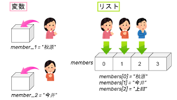
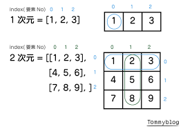

# リスト、辞書

前回は、文字列操作の便利なテクニックについて学びましたね。これで文字列データをかなり自由に扱えるようになったはずです！

今回は、プログラミングで非常に重要な「**複数のデータをまとめて扱う**」ための強力な武器、「**リスト (`list`型)**」と「**辞書 (`dict`型)**」という新しいデータ型を学びます。これらをマスターすれば、例えばクラスの名簿を管理したり、ゲームのキャラクターのステータスを保存したり、センサーから取得した複数の測定値を記録したりと、プログラムでできることの幅が広がります。

AIの実装においても必要になるデータを扱う能力に直結してきます。焦らず、いつでも気軽に質問してください。

## 目次

1. **リスト (`list`)：順番付きのデータコレクション**
    * リストとは？ なぜ便利？
    * リストの作り方：`[]` で囲むだけ！
    * リストの要素へのアクセス：インデックスが大活躍
    * リストのスライス：一部分を切り出す (文字列操作の復習も兼ねて！)
    * リストの要素を変更する
    * リストに要素を追加する：`append()`, `insert()`, `extend()`
    * リストから要素を削除する：`del`文, `pop()`, `remove()`
    * リストの便利な相棒たち：リストメソッド (`len()`, `sort()`, `count()` など)
    * リストの中にリスト！？：ネストしたリスト（多次元リストの第一歩）
2. **辞書 (`dict`)：キーと値のペアでデータを管理**
    * 辞書とは？ なぜ便利？
    * 辞書の作り方：`{}` とキー・バリューペア
    * 辞書の要素へのアクセス：キーを指定する
    * 辞書に要素を追加・変更する
    * 辞書から要素を削除する：`del`文, `pop()`
    * 辞書の便利な相棒たち：辞書メソッド (`keys()`, `values()`, `items()`, `get()` など)
3. **リストと辞書の使い分け (ちょっとしたヒント)**
4. **演習**

---

## 1. リスト (`list`)：順番付きのデータコレクション

### リストとは？ なぜ便利？

「**リスト (`list`)**」は、複数のデータを「**順番に並べて**」格納することができるデータ型です。ちょうど、買い物リストや、出席番号順に並んだ名簿のようなイメージですね。
今まで学んだ変数では、基本的に1つのデータしか入れられませんでした (例: `name = "高専太郎"`、`score = 80`)。でも、例えばクラス全員の名前や、テストの全科目の点数のように、関連する複数のデータをまとめて扱いたい場面はたくさんあります。そんな時にリストが大活躍するんです！

リストを使うと、こんなメリットがあります：

* たくさんのデータを一つの変数で管理できる。
* データの順番が保持される。
* 後から要素を追加したり、削除したり、変更したりと、柔軟に操作できる。

Pythonでは、数値、文字列、さらには他のリストなど、異なるデータ型の値を同じリストに混在させることも可能です（ただ、通常は同じ種類のデータを入れることが多いです）。

### リストの作り方：`[]` で囲むだけ

リストを作るのはとっても簡単！ 角括弧 `[]` で囲み、各要素をカンマ `,` で区切って書きます。

```python
# 空のリスト
empty_list = []
print(f"空のリスト: {empty_list}, 型: {type(empty_list)}")

# 数値のリスト (例: テストの点数)
scores = [80, 92, 75, 88, 60]
print(f"点数リスト: {scores}")

# 文字列のリスト (例: 好きな果物)
fruits = ["apple", "banana", "orange", "grape"]
print(f"果物リスト: {fruits}")

# 異なるデータ型を混ぜることも可能 (あまり推奨されない場合もある)
mixed_list = [10, "Hello", 3.14, True]
print(f"混合リスト: {mixed_list}")
```

実行結果：

```
空のリスト: [], 型: <class 'list'>
点数リスト: [80, 92, 75, 88, 60]
果物リスト: ['apple', 'banana', 'orange', 'grape']
混合リスト: [10, 'Hello', 3.14, True]
```




### リストの要素へのアクセス：インデックスが大活躍

リストの中の個々のデータ（これを「**要素**」と呼びます）にアクセスするには、文字列の時と同じように「**インデックス**」を使います。
思い出してください、インデックスは `0` から始まる番号でしたね！

```python
fruits = ["apple", "banana", "orange", "grape"]
# インデックス:  0        1         2        3

print(f"最初の果物: {fruits[0]}")      # インデックス0は 'apple'
print(f"3番目の果物: {fruits[2]}")    # インデックス2は 'orange'

# マイナスインデックスも使えます
print(f"最後の果物: {fruits[-1]}")     # -1は最後の要素 'grape'
print(f"最後から2番目の果物: {fruits[-2]}") # -2は最後から2番目の 'orange'
```

実行結果：

```
最初の果物: apple
3番目の果物: orange
最後の果物: grape
最後から2番目の果物: orange
```


**注意！** 文字列の時と同様に、存在しないインデックスを指定すると `IndexError` というエラーが発生します。例えば、上の `fruits` リストで `fruits[4]` としようとするとエラーです。気をつけてくださいね。

### リストのスライス：一部分を切り出す (文字列操作の復習も兼ねて！)

文字列で学んだ「スライス」は、リストでも全く同じように使えます！ `[開始インデックス:終了インデックス:ステップ]` の形で、リストの一部分を新しいリストとして取り出すことができます。

```python
numbers = [0, 1, 2, 3, 4, 5, 6, 7, 8, 9]

# インデックス1から4の手前まで (1, 2, 3)
print(f"numbers[1:4] -> {numbers[1:4]}")

# 最初からインデックス5の手前まで (0, 1, 2, 3, 4)
print(f"numbers[:5] -> {numbers[:5]}")

# インデックス5から最後まで (5, 6, 7, 8, 9)
print(f"numbers[5:] -> {numbers[5:]}")

# 2つおきに取り出す (0, 2, 4, 6, 8)
print(f"numbers[::2] -> {numbers[::2]}")

# リスト全体をコピー
copied_numbers = numbers[:]
print(f"コピーされたリスト: {copied_numbers}")

# リストを逆順にする
reversed_numbers = numbers[::-1]
print(f"逆順のリスト: {reversed_numbers}")
```

実行結果：

```
numbers[1:4] -> [1, 2, 3]
numbers[:5] -> [0, 1, 2, 3, 4]
numbers[5:] -> [5, 6, 7, 8, 9]
numbers[::2] -> [0, 2, 4, 6, 8]
コピーされたリスト: [0, 1, 2, 3, 4, 5, 6, 7, 8, 9]
逆順のリスト: [9, 8, 7, 6, 5, 4, 3, 2, 1, 0]
```

スライスは非常に便利なので、文字列とリスト、両方で使いこなせるようにしておきましょう！

### リストの要素を変更する

リストの大きな特徴の一つは、作成した後でも要素の値を変更できることです。これを「**ミュータブル (mutable)**」である、と言います。（ちなみに、文字列は一度作ると変更できない「イミュータブル (immutable)」なデータ型です。）

要素を変更するには、インデックスで場所を指定して、新しい値を代入します。

```python
colors = ["red", "green", "blue"]
print(f"変更前: {colors}")

colors[1] = "yellow" # インデックス1 (2番目の要素) を "yellow" に変更
print(f"変更後: {colors}")

colors[-1] = "purple" # 最後の要素を "purple" に変更
print(f"さらに変更後: {colors}")
```

実行結果：

```
変更前: ['red', 'green', 'blue']
変更後: ['red', 'yellow', 'blue']
さらに変更後: ['red', 'yellow', 'purple']
```

### リストに要素を追加する：`append()`, `insert()`, `extend()`

リストの長さを変えたい、つまり要素を追加したい場合もよくあります。Pythonにはそのための便利なメソッドが用意されています。

* **`リスト.append(要素)`**: リストの**末尾**に新しい要素を1つ追加します。一番よく使う追加方法かもしれません。

    ```python
    my_classmates = ["佐藤", "鈴木"]
    print(f"追加前: {my_classmates}")
    my_classmates.append("高橋")
    print(f"append後: {my_classmates}")
    ```

    実行結果：

    ```
    追加前: ['佐藤', '鈴木']
    append後: ['佐藤', '鈴木', '高橋']
    ```

* **`リスト.insert(インデックス, 要素)`**: 指定した**インデックスの位置**に新しい要素を1つ挿入します。元の要素は後ろにずれます。

    ```python
    numbers = [10, 20, 40, 50]
    print(f"挿入前: {numbers}")
    numbers.insert(2, 30) # インデックス2の位置に30を挿入
    print(f"insert後: {numbers}")
    ```

    実行結果：

    ```
    挿入前: [10, 20, 40, 50]
    insert後: [10, 20, 30, 40, 50]
    ```

* **`リスト.extend(別のリスト)`**: リストに別のリストの**全要素**をまとめて追加します。`+`演算子でリスト同士を連結するのと似ていますが、`extend`は元のリストを変更する点が異なります。

    ```python
    list_a = [1, 2, 3]
    list_b = [4, 5, 6]
    print(f"extend前 list_a: {list_a}")
    list_a.extend(list_b)
    print(f"extend後 list_a: {list_a}")

    # 参考: +演算子の場合 (新しいリストが作られる)
    list_c = [1, 2, 3]
    list_d = [4, 5, 6]
    list_e = list_c + list_d
    print(f"+演算子の場合 list_c: {list_c}, list_e: {list_e}")
    ```

    実行結果：

    ```
    extend前 list_a: [1, 2, 3]
    extend後 list_a: [1, 2, 3, 4, 5, 6]
    +演算子の場合 list_c: [1, 2, 3], list_e: [1, 2, 3, 4, 5, 6]
    ```

### リストから要素を削除する：`del`文, `pop()`, `remove()`

要素を追加するだけでなく、不要になった要素を削除することも重要です。

* **`del リスト[インデックス]`**: 指定したインデックスの要素を削除します。`del`はPythonの文（命令の一種）です。

    ```python
    items = ["PC", "mouse", "keyboard", "monitor"]
    print(f"削除前: {items}")
    del items[1] # インデックス1 ("mouse") を削除
    print(f"del後: {items}")
    ```

    実行結果：

    ```
    削除前: ['PC', 'mouse', 'keyboard', 'monitor']
    del後: ['PC', 'keyboard', 'monitor']
    ```

    スライスを使って範囲を指定し、複数の要素を一度に削除することもできます (`del items[1:3]`)。

* **`リスト.pop(インデックス)`**: 指定したインデックスの要素をリストから取り除き、その要素の値を返します。インデックスを省略すると、**末尾の要素**を取り除いて返します。

    ```python
    stack = ["A", "B", "C", "D"]
    print(f"pop前: {stack}")
    last_item = stack.pop() # 末尾の "D" を取り出す
    print(f"取り出した要素: {last_item}, pop後: {stack}")
    second_item = stack.pop(1) # インデックス1 ("B") を取り出す
    print(f"取り出した要素: {second_item}, pop後: {stack}")
    ```

    実行結果：

    ```
    pop前: ['A', 'B', 'C', 'D']
    取り出した要素: D, pop後: ['A', 'B', 'C']
    取り出した要素: B, pop後: ['A', 'C']
    ```

    `pop()` は、リストをスタック（後入れ先出しのデータ構造）のように使いたい場合に便利です。

* **`リスト.remove(値)`**: リストの中から、指定した**値**を持つ最初の要素を削除します。同じ値が複数ある場合は、最初に見つかったものだけが削除されます。

    ```python
    pets = ["dog", "cat", "dog", "rabbit"]
    print(f"remove前: {pets}")
    pets.remove("dog") # 最初の "dog" を削除
    print(f"remove後: {pets}")
    ```

    実行結果：

    ```
    remove前: ['dog', 'cat', 'dog', 'rabbit']
    remove後: ['cat', 'dog', 'rabbit']
    ```

    **注意！** `remove()` は、指定した値がリスト内に存在しない場合、`ValueError` というエラーになります。

### リストの便利な相棒たち：リストメソッド

リストには、上で紹介した追加・削除以外にも、様々な便利なメソッドや関連する関数があります。

* **`len(リスト)`**: リストの要素数を返します (これは関数です)。

    ```python
    numbers = [10, 20, 30, 40, 50]
    print(f"リストの長さ: {len(numbers)}") # 5
    ```

* **`リスト.sort()`**: リストの要素を**昇順** (小さい順、アルファベット順) に並び替えます。このメソッドは元のリストを直接変更します。

    ```python
    num_list = [3, 1, 4, 1, 5, 9, 2, 6]
    char_list = ["banana", "apple", "cherry"]
    num_list.sort()
    char_list.sort()
    print(f"数値ソート後: {num_list}")
    print(f"文字列ソート後: {char_list}")

    # 降順にしたい場合は reverse=True を指定
    num_list.sort(reverse=True)
    print(f"数値降順ソート後: {num_list}")
    ```

    実行結果：

    ```
    数値ソート後: [1, 1, 2, 3, 4, 5, 6, 9]
    文字列ソート後: ['apple', 'banana', 'cherry']
    数値降順ソート後: [9, 6, 5, 4, 3, 2, 1, 1]
    ```

    **注意！** `sort()` は異なるデータ型が混在するリスト（例: 数値と文字列）には使えません (エラーになります)。

* **`sorted(リスト)`**: リストの要素を並び替えた**新しいリストを返します**。元のリストは変更されません (これは関数です)。

    ```python
    original_list = [30, 10, 20]
    sorted_new_list = sorted(original_list)
    print(f"元のリスト: {original_list}")
    print(f"sorted()で作成された新しいリスト: {sorted_new_list}")
    ```

    実行結果：

    ```
    元のリスト: [30, 10, 20]
    sorted()で作成された新しいリスト: [10, 20, 30]
    ```

* **`リスト.reverse()`**: リストの要素の並びを**逆順**にします。これも元のリストを直接変更します。

    ```python
    my_list = [1, "two", 3.0]
    my_list.reverse()
    print(f"reverse後: {my_list}")
    ```

    実行結果：

    ```
    reverse後: [3.0, 'two', 1]
    ```

* **`リスト.count(値)`**: リストの中に指定した値が何個含まれているかを数えます。

    ```python
    grades = ["A", "B", "A", "C", "A", "B"]
    count_a = grades.count("A")
    print(f"Aの数: {count_a}") # 3
    ```

* **`リスト.index(値)`**: リストの中で指定した値が最初に出現するインデックスを返します。

    ```python
    animals = ["cat", "dog", "bird", "dog"]
    dog_index = animals.index("dog")
    print(f"最初のdogのインデックス: {dog_index}") # 1
    ```

    **注意！** 指定した値がリストにない場合は `ValueError` になります。

* **`値 in リスト`**: 特定の値がリストに含まれているかどうかを `True` / `False` で返します (これは演算子です)。

    ```python
    numbers = [1, 3, 5, 7, 9]
    print(f"5はリストに含まれるか: {5 in numbers}")  # True
    print(f"2はリストに含まれるか: {2 in numbers}")  # False
    print(f"2はリストに含まれないか: {2 not in numbers}") # True
    ```

これらのメソッドや関数を使いこなせると、リスト操作が格段に楽になりますよ！

### リストの中にリスト！？：ネストしたリスト（多次元リストの第一歩）

リストの要素には、数値や文字列だけでなく、別のリストを入れることもできます。これを「**ネストしたリスト**」や「**入れ子のリスト**」と呼びます。これは、表のような2次元のデータや、もっと複雑な構造のデータを表現するのに役立ちます。

```python
# 2x3の行列のようなデータ
matrix = [
    [1, 2, 3],
    [4, 5, 6]
]
print(f"ネストしたリスト: {matrix}")

# 要素へのアクセス
print(f"1行目 (インデックス0): {matrix[0]}")        # [1, 2, 3]
print(f"2行目3列目の要素: {matrix[1][2]}") # 6 (matrix[1]が[4,5,6]を返し、その[2]番目)

# 変更も可能
matrix[0][1] = 200
print(f"変更後のmatrix: {matrix}")
```

実行結果：

```
ネストしたリスト: [[1, 2, 3], [4, 5, 6]]
1行目 (インデックス0): [1, 2, 3]
2行目3列目の要素: 6
変更後のmatrix: [[1, 200, 3], [4, 5, 6]]
```





最初は少しややこしく感じるかもしれませんが、エクセルの表のようなものをイメージすると分かりやすいかもしれませんね。

---

## 2. 辞書 (`dict`)：キーと値のペアでデータを管理

リストは順番でデータを管理しましたが、次に見る「**辞書 (`dict`)**」は、「**キー (key)**」と「**値 (value)**」のペアでデータを管理します。ちょうど、英和辞書で単語（キー）を引くと意味（値）が出てくるのに似ていますね。

リストでは要素にアクセスするのにインデックス（0からの番号）を使いましたが、辞書では自分で決めた「キー」を使って対応する「値」を取り出します。

辞書を使うと、こんなメリットがあります：

* データに意味のある名前（キー）をつけて管理できるので、何の情報か分かりやすい。
* 大量の関連情報を一つの変数でまとめて扱える（例：個人のプロフィール情報など）。
* データの順番は基本的には気にしない（Python 3.7以降は挿入順序が保持されますが、それに依存しない設計が推奨されます）。

### 辞書の作り方：`{}` とキー・バリューペア

辞書は波括弧 `{}` を使って作ります。キーと値はコロン `:` で結びつけ、各ペアはカンマ `,` で区切ります。

```python
# 空の辞書
empty_dict = {}
print(f"空の辞書: {empty_dict}, 型: {type(empty_dict)}")

# 生徒の情報を格納する辞書
student = {
    "name": "高専太郎", # "name"がキー, "高専太郎"が値
    "age": 18,
    "department": "情報工学科",
    "grades": [85, 90, 78] # 値にはリストも使える！
}
print(f"生徒の情報: {student}")
```

実行結果：

```
空の辞書: {}, 型: <class 'dict'>
生徒の情報: {'name': '高専太郎', 'age': 18, 'department': '情報工学科', 'grades': [85, 90, 78]}
```


**キーに関する注意点：**

* キーは辞書の中で**ユニーク(一意)** でなければなりません。同じキーを複数使うことはできません（後から同じキーで値を設定すると上書きされます）。
* キーには、文字列や数値など、変更不可能な（イミュータブルな）データ型を使います。リストのような変更可能な（ミュータブルな）データ型はキーには使えません。通常は文字列をキーにすることが多いです。

### 辞書の要素へのアクセス：キーを指定する

辞書の中の値にアクセスするには、リストのインデックスの代わりに「キー」を使います。書き方は `辞書[キー]` です。

```python
student = {
    "name": "高専太郎",
    "age": 18,
    "department": "情報工学科"
}

print(f"名前: {student['name']}")
print(f"年齢: {student['age']}")
# print(f"趣味: {student['hobby']}") # これはエラー！ 'hobby'というキーは存在しない
```

実行結果：

```
名前: 高専太郎
年齢: 18
```

**注意！** リストと同様に、存在しないキーを指定して値を取得しようとすると `KeyError` というエラーが発生します。これを避ける方法は後で紹介しますね (`get()` メソッド)。

### 辞書に要素を追加・変更する

辞書に新しいキーと値のペアを追加したり、既存のキーに対応する値を変更したりするのは簡単です。

```python
profile = {"name": "技大花子"}
print(f"変更前: {profile}")

# 新しいキーと値のペアを追加
profile["age"] = 20
profile["city"] = "Nagaoka"
print(f"追加後: {profile}")

# 既存のキーの値を変更 (上書き)
profile["city"] = "Tokyo"
print(f"変更後: {profile}")
```

実行結果：

```
変更前: {'name': '技大花子'}
追加後: {'name': '技大花子', 'age': 20, 'city': 'Nagaoka'}
変更後: {'name': '技大花子', 'age': 20, 'city': 'Tokyo'}
```

指定したキーが辞書に既に存在すれば値が更新され、存在しなければ新しいキーと値のペアとして追加されます。

### 辞書から要素を削除する：`del`文, `pop()`

辞書から特定のキーと値のペアを削除する方法も見てみましょう。

* **`del 辞書[キー]`**: 指定したキーとその値を辞書から削除します。

    ```python
    car_info = {"maker": "Toyota", "model": "Prius", "year": 2020}
    print(f"削除前: {car_info}")
    del car_info["year"]
    print(f"del後: {car_info}")
    ```

    実行結果：

    ```
    削除前: {'maker': 'Toyota', 'model': 'Prius', 'year': 2020}
    del後: {'maker': 'Toyota', 'model': 'Prius'}
    ```

* **`辞書.pop(キー, デフォルト値)`**: 指定したキーの要素を辞書から取り除き、その値を返します。キーが存在しない場合にエラーになるのを避けるため、オプションでデフォルト値を指定できます。

    ```python
    settings = {"volume": 80, "brightness": 60, "mode": "eco"}
    print(f"pop前: {settings}")

    mode_value = settings.pop("mode")
    print(f"取り出したmode: {mode_value}, pop後: {settings}")

    # 存在しないキーをpopしようとするとエラーになる
    # non_existent = settings.pop("color") # KeyError

    # デフォルト値を指定すればエラーにならない
    color_value = settings.pop("color", "N/A") # "color"キーは無いのでデフォルト値"N/A"が返る
    print(f"取り出したcolor: {color_value}, pop後: {settings}")
    ```

    実行結果：

    ```
    pop前: {'volume': 80, 'brightness': 60, 'mode': 'eco'}
    取り出したmode: eco, pop後: {'volume': 80, 'brightness': 60}
    取り出したcolor: N/A, pop後: {'volume': 80, 'brightness': 60}
    ```

### 辞書の便利な相棒たち：辞書メソッド

辞書にも、操作を助ける便利なメソッドがたくさんあります。

* **`len(辞書)`**: 辞書に含まれるキーと値のペアの数を返します (これは関数です)。

    ```python
    user = {"id": 101, "username": "ai_master", "active": True}
    print(f"ペアの数: {len(user)}") # 3
    ```

* **`辞書.keys()`**: 辞書のすべての**キー**を一覧で取得します (専門的には「ビューオブジェクト」という形で返されます)。ループ処理などでよく使います。

    ```python
    product = {"name": "Laptop", "price": 120000, "stock": 15}
    all_keys = product.keys()
    print(f"キーの一覧: {all_keys}") # dict_keys(['name', 'price', 'stock'])
    # list(all_keys) とするとリストに変換できます
    ```

* **`辞書.values()`**: 辞書のすべての**値**を一覧で取得します (これもビューオブジェクト)。

    ```python
    product = {"name": "Laptop", "price": 120000, "stock": 15}
    all_values = product.values()
    print(f"値の一覧: {all_values}") # dict_values(['Laptop', 120000, 15])
    ```

* **`辞書.items()`**: 辞書のすべての**キーと値のペア**を (キー, 値) というタプル（後で少し触れますが、変更不可なリストのようなもの）の形で一覧取得します (これもビューオブジェクト)。ループでキーと値を同時に扱いたい場合に非常に便利です。

    ```python
    product = {"name": "Laptop", "price": 120000, "stock": 15}
    all_items = product.items()
    print(f"アイテムの一覧: {all_items}") # dict_items([('name', 'Laptop'), ('price', 120000), ('stock', 15)])
    ```

* **`辞書.get(キー, デフォルト値)`**: キーを指定して値を取得します。`辞書[キー]` と似ていますが、キーが存在しなくても**エラーにならず**、代わりに `None` (何もないことを示す特別な値) または指定したデフォルト値を返します。これは安全に値を取得したい場合に非常に役立ちます。

    ```python
    student = {"name": "高専太郎", "age": 18}
    print(f"名前: {student.get('name')}")
    print(f"年齢: {student.get('age')}")
    print(f"趣味 (存在しないキー): {student.get('hobby')}") # None
    print(f"趣味 (デフォルト値指定): {student.get('hobby', '特になし')}") # 特になし
    ```

    実行結果：

    ```
    名前: 高専太郎
    年齢: 18
    趣味 (存在しないキー): None
    趣味 (デフォルト値指定): 特になし
    ```

    個人的には、辞書から値を取り出すときは、エラーでプログラムが止まるのを避けるために `get()` を積極的に使うことをお勧めします！

* **`キー in 辞書`**: 特定のキーが辞書に含まれているかどうかを `True` / `False` で返します (これは演算子です)。値ではなく、**キーの存在確認**であることに注意してください。

    ```python
    config = {"host": "localhost", "port": 8080}
    print(f"'host'キーは存在するか: {'host' in config}")    # True
    print(f"'user'キーは存在するか: {'user' in config}")    # False
    print(f"'user'キーは存在しないか: {'user' not in config}") # True
    ```

---

## 3. リストと辞書の使い分け (ちょっとしたヒント)

リストと辞書、どちらも複数のデータを扱うのに便利ですが、どんな時にどちらを使えばいいか迷うかもしれませんね。簡単な目安としてはこんな感じです。

* **リストが向いているケース**:
  * データの「**順番**」が重要で、その順番で処理したい場合 (例: 実行するタスクのリスト、時系列データ)。
  * 同じ種類のものをたくさん集めて、番号で管理したい場合 (例: テストの点数一覧、複数のセンサーからの測定値)。
  * 要素の追加や削除が頻繁で、特に末尾への追加が多い場合。

* **辞書が向いているケース**:
  * データに「**名前（ラベル）**」をつけて、その名前で情報を取り出したい場合 (例: 個人のプロフィール(名前、年齢、趣味)、設定情報)。
  * 異なる種類の情報をひとまとめにして、それぞれの情報が何であるかを明確にしたい場合。
  * データの順番はあまり重要ではなく、キーによる高速なアクセスが求められる場合。

もちろん、これらは絶対的なルールではありませんし、リストと辞書を組み合わせて使うこともよくあります（例えば、生徒の辞書を要素とするリストなど）。実際にプログラムを書いていく中で、どちらがその状況に適しているか、だんだんと感覚が掴めてくるはずです。

---

## ✏️ 本日の演習

さあ、今日学んだリストと辞書のテクニックを使って、実際に手を動かしてみましょう！

1. VSCodeで新しいPythonファイル（例: `practice04.py`）を作成してください。
2. **リスト練習**:
    * あなたの好きなプログラミング言語を3つ以上入れたリスト `favorite_languages` を作成してください。
    * `favorite_languages` の最初の要素と最後の要素を `print()` で表示してください。
    * `favorite_languages` の末尾に、新しく学びたい言語を1つ追加してください (`append()`)。
    * `favorite_languages` の2番目の要素を、別の言語に変更してください。
    * `favorite_languages` の中から、いずれかの言語を削除してください (`remove()` または `del`)。
    * `favorite_languages` の現在の要素数を `print()` で表示してください (`len()`)。
    * `favorite_languages` をアルファベット順に並び替えて表示してください (`sort()` または `sorted()`)。
3. **辞書練習**:
    * あなたのPCに関する情報（例: `OS`, `CPU`, `RAM_GB`, `GPU`）を格納した辞書 `my_pc_specs` を作成してください。RAMの容量は数値で入れてみましょう。
    * `my_pc_specs` からOSとCPUの情報を `print()` で表示してください。
    * `my_pc_specs` に新しい情報（例: `storage_GB` とその容量）を追加してください。
    * `my_pc_specs` のRAMの容量を、現在の倍の値に更新してください。
    * `my_pc_specs` に `GPU` というキーが存在するか確認し、もし存在すればその値を表示し、存在しなければ「GPU情報なし」と表示するコードを書いてみましょう (`get()`メソッドや `in` 演算子と `if` 文を使うと良いでしょう。`if`文は次回詳しく学びますが、`if 'GPU' in my_pc_specs:` のように書けます)。
4. **発展 (リストと辞書の組み合わせ)**:
    * 複数の友人（3人以上）の情報を管理するデータ構造を考えてみましょう。各友人の情報として「名前(name)」と「好きな食べ物(favorite_food)」を辞書で持ち、それらの辞書を一つのリスト `friends_data` に格納してください。
        例: `friends_data = [{'name': 'Aさん', 'favorite_food': 'カレー'}, {'name': 'Bさん', 'favorite_food': '寿司'}, ...]`
    * 作成した `friends_data` リストから、2番目の友人の名前と好きな食べ物を表示してください。
    * `friends_data` リストに、新しい友人の情報を追加してください。

---
---
---

### 演習の解答例

```python
# practice04.py

# 2. リスト練習
print("--- 2. リスト練習 ---")
favorite_languages = ["Python", "JavaScript", "C++"]
print(f"作成直後: {favorite_languages}")

# 最初の要素と最後の要素
print(f"最初の言語: {favorite_languages[0]}")
print(f"最後の言語: {favorite_languages[-1]}")

# 末尾に新しい言語を追加
favorite_languages.append("Rust")
print(f"append後: {favorite_languages}")

# 2番目の要素を変更
favorite_languages[1] = "TypeScript"
print(f"2番目を変更後: {favorite_languages}")

# いずれかの言語を削除 (例: C++)
if "C++" in favorite_languages:
    favorite_languages.remove("C++")
print(f"remove後: {favorite_languages}")
# もしdelを使うなら: del favorite_languages[2] (インデックスに注意)

# 要素数を表示
print(f"現在の要素数: {len(favorite_languages)}")

# アルファベット順に並び替え (元のリストを変更)
favorite_languages.sort()
print(f"ソート後: {favorite_languages}")
# sorted()を使うなら: sorted_languages = sorted(favorite_languages)
print("")

# 3. 辞書練習
print("--- 3. 辞書練習 ---")
my_pc_specs = {
    "OS": "Windows 11",
    "CPU": "Intel Core i7",
    "RAM_GB": 16,
    "GPU": "NVIDIA GeForce RTX 3060"
}
print(f"作成直後: {my_pc_specs}")

# OSとCPUの情報を表示
print(f"OS: {my_pc_specs['OS']}")
print(f"CPU: {my_pc_specs.get('CPU')}") # getでもOK

# 新しい情報を追加
my_pc_specs["storage_GB"] = 1024 # 1TB
print(f"ストレージ追加後: {my_pc_specs}")

# RAMの容量を倍に更新
my_pc_specs["RAM_GB"] = my_pc_specs["RAM_GB"] * 2
# または my_pc_specs["RAM_GB"] *= 2
print(f"RAM更新後: {my_pc_specs}")

# GPU情報の確認と表示
if 'GPU' in my_pc_specs:
    print(f"GPU: {my_pc_specs['GPU']}")
else:
    print("GPU情報なし")

# get() を使った別解
gpu_info = my_pc_specs.get("GPU")
if gpu_info: # NoneでなければTrue扱い
    print(f"GPU (get版): {gpu_info}")
else:
    print("GPU情報なし (get版)")
print("")

# 4. 発展 (リストと辞書の組み合わせ)
print("--- 4. 発展 ---")
friends_data = [
    {"name": "山田さん", "favorite_food": "ラーメン"},
    {"name": "田中さん", "favorite_food": "焼肉"},
    {"name": "鈴木さん", "favorite_food": "お寿司"}
]
print(f"友人データ: {friends_data}")

# 2番目の友人の名前と好きな食べ物を表示
if len(friends_data) >= 2:
    second_friend = friends_data[1] # インデックス1が2番目
    print(f"2番目の友人: {second_friend['name']}さん、好きな食べ物: {second_friend['favorite_food']}")
else:
    print("友人が2人未満です。")

# 新しい友人の情報を追加
new_friend = {"name": "加藤さん", "favorite_food": "パスタ"}
friends_data.append(new_friend)
print(f"新しい友人を追加後: {friends_data}")

print("\n演習お疲れ様でした！")
```

---

リストと辞書は、Pythonプログラミングの屋台骨とも言える非常に重要なデータ型です。とにかく経験を積んでください。「このデータはどうやって管理するのが効率的かな？」と考えるクセをつけると、より良いプログラムが書けるようになりますよ。

次回は、プログラムの流れを自在にコントロールするための重要な構文、「**ループ (繰り返し処理)**」と「**条件分岐 (if文)**」について学びます。（普通だったら、ループとか条件分岐を先に勉強するんだけど、僕の資料ではリストや文字列、辞書がループやforと深く結びついていることを踏まえて、この順番でやりました）

もし、リストと辞書の使い分けで迷ったり、「こんなデータ構造を作りたいんだけど、どうすればいいの？」といった具体的な疑問が出てきたりしたら、遠慮なく部長のカトに質問してくださいね。みんなで助け合いながら、スキルアップしていきましょう！
