# 条件分岐、ループ

前回は、「リスト」と「辞書」という、たくさんのデータをまとめて効率的に扱うための強力な武器を学びましたね。これで、クラスの名簿やゲームキャラクターのステータスなど、より複雑な情報もプログラムで管理できるようになりました！

さあ、今回はプログラミングの心臓部とも言える「**ループ（繰り返し処理）**」と「**条件分岐 (`if`文)**」を学びます！ これらをマスターすれば、プログラムがまるで生き物のように、状況に応じて異なる動きをしたり、面倒な作業を何度も正確にこなしてくれたりするようになります。
いよいよ本格的なプログラムらしいことができるようになってきます。じっくり、そして楽しみながら進んでいきましょう！

## 目次

1. **条件分岐 (`if`文)：もし〜なら、こう動く！**
    * `if`文って何？ なぜ大切？
    * 基本的な`if`の形：`if 条件式:`
    * 条件に合わなかったら？：`else`の出番
    * もっとたくさんの条件を分けたい！：`elif`を使おう
    * 条件式を組み立てるコツ (比較演算子、論理演算子、`in`演算子)
    * `if`文の中に`if`文！？：ネストした`if`文
2. **繰り返し処理 (ループ)：面倒な作業はコンピュータにおまかせ！**
    * ループって何？ なぜ便利？
    * `for`ループ：決まった回数や、リストの要素分だけ繰り返す
        * リストや文字列と一緒に`for`ループを使ってみよう
        * `range()`関数：指定した回数だけ繰り返すお供
        * `enumerate()`関数：番号も一緒に取り出したい時に便利
        * 辞書と`for`ループ：キーや値を順番に見ていこう
    * `while`ループ：ある条件が満たされている間、ずっと繰り返す
        * 基本的な`while`の形：`while 条件式:`
        * 無限ループにご注意！ (止める方法も伝授します)
3. **ループを自在にコントロール！**
    * `break`：ループから脱出！
    * `continue`：今回はパス！次の繰り返しへ
    * ループの`else`節：ループが無事に終わった時だけ実行
4. **ちょっと発展：リスト内包表記 (おまけ)**
5. **演習**

---

## 1. 条件分岐 (`if`文)：もし〜なら、こう動く

### `if`文って何？ なぜ大切？

日常生活で私たちは、「もし雨が降っていたら、傘を持っていく」「もしお腹が空いていたら、何か食べる」というように、状況に応じて行動を変えますよね。
プログラムの世界でも同じように、ある条件が満たされているかどうかで処理の流れを変えたい場面がたくさんあります。そんな時に使うのが「**`if`文（いふぶん）**」です。

`if`文を使うと、プログラムが「考える」ことができるようになり、より賢く、柔軟な動きを実現できます。例えば、ユーザーが入力した年齢によって表示するメッセージを変えたり、テストの点数によって「合格」か「不合格」かを判定したり、といったことが可能になります。
これが使えるようになると、プログラムが一気に賢くなったように感じますよ！

### プログラムの「はい/いいえ」：ブール型 (`bool`) 、比較演算子、論理演算子を理解しよう

`if`文を使いこなすためには、「**ブール型 (`bool`)**」と、その値を生成する「**比較演算子**」および「**論理演算子**」の理解が不可欠です。これらは、プログラムが「条件」をどのように判断しているかの核心部分です。

**ブール型 (`bool`) とは？**

ブール型は、**`True` (真)** と **`False` (偽)** という、たった2つの値しか持たない特別なデータ型です。プログラムの世界で「はい/いいえ」「正しい/間違い」といった判断結果を表すのに使われます。

**比較演算子：2つの値を比べる**

比較演算子は、2つの値を比べて、その関係が正しいか (`True`)、間違っているか (`False`) を返します。

| 演算子 | 意味        | 例 (`a=5`, `b=10`) | 結果    |
| :----- | :---------- | :----------------- | :------ |
| `==`   | 等しい      | `a == 5`           | `True`  |
| `!=`   | 等しくない  | `a != b`           | `True`  |
| `<`    | より小さい  | `a < b`            | `True`  |
| `>`    | より大きい  | `b > 10`           | `False` |
| `<=`   | 以下        | `a <= 5`           | `True`  |
| `>=`   | 以上        | `b >= 10`          | `True`  |

**論理演算子：複数の条件を組み合わせる**

論理演算子は、複数のブール値（またはブール値を返す式）を組み合わせて、新たなブール値を作り出します。

| 演算子 | 意味                                   | 例 (`x=True`, `y=False`) | 結果    |
| :----- | :------------------------------------- | :----------------------- | :------ |
| `and`  | 両方が`True`なら`True` (かつ)          | `x and y`                | `False` |
| `or`   | どちらかが`True`なら`True` (または)    | `x or y`                 | `True`  |
| `not`  | `True`なら`False`、`False`なら`True` (ではない) | `not x`                  | `False` |

**`if`文とブール値**

`if`文は、これらの比較演算子や論理演算子を使って作られた条件式の結果（つまり `True` か `False` か）を見て、次にどの処理を実行するかを決定します。

例えば、

```python
age = 20
is_student = False

# (age >= 18) は True
# is_student は False
# (age >= 18) and is_student は True and False なので False になる
if (age >= 18) and is_student:
    print("あなたは成人学生です。")
elif (age >= 18) and not is_student: # not is_student は True
    # (age >= 18) and not is_student は True and True なので True になる
    print("あなたは社会人の成人です。")
else:
    print("あなたは未成年です。")

temperature = 30
# (temperature > 28) は True
if temperature > 28:
    print(f"気温{temperature}度は暑いですね！")
```

このように、比較演算子や論理演算子を駆使して条件式を組み立て、その結果が `True` になるか `False` になるかでプログラムの振る舞いを変えるのが `if`文の基本的な使い方です。

### 基本的な`if`の形：`if 条件式:`

`if`文の最も基本的な形は、とてもシンプルです。

```python
if 条件式:
    # 条件式がTrue (真) の場合に実行される処理
    # この部分はインデント (字下げ) されていることに注目！
    print("条件が成り立ちました！")
```

* `if`: 「もし〜ならば」という意味のキーワードです。
* `条件式`: `True` (真) または `False` (偽) の結果になる式を書きます。例えば、`age >= 18` (年齢が18歳以上) や `name == "山田"` (名前が山田と等しい) などです。
* `:` (コロン): 条件式の後には必ずコロンをつけます。忘れやすいので注意！
* **インデント (字下げ)**: `if`文の次の行から、条件が成り立った時に実行したい処理を書きますが、この部分は必ず**インデント**（半角スペース4つ分が一般的）を入れます。Pythonではこのインデントが非常に重要で、処理のまとまり（ブロック）を示します。インデントが正しくないと、エラーになったり、意図しない動きをしたりするので、しっかり意識してくださいね。

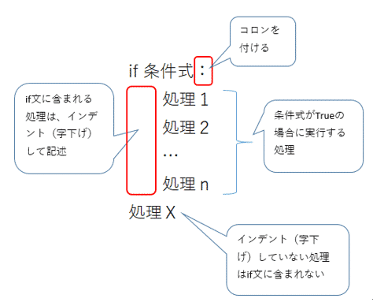
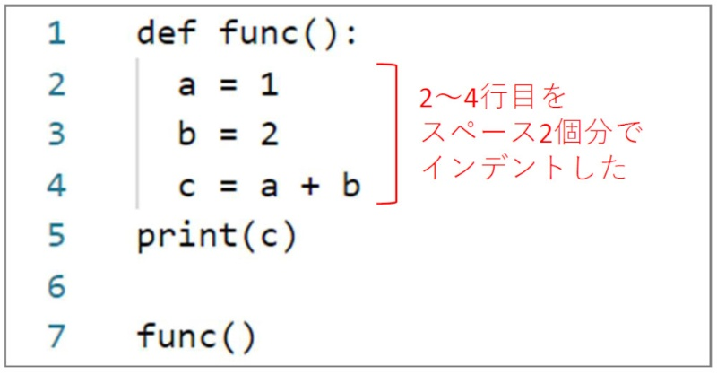
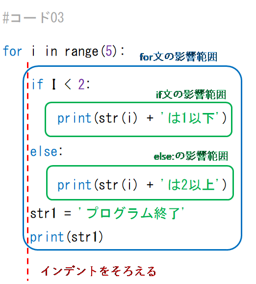
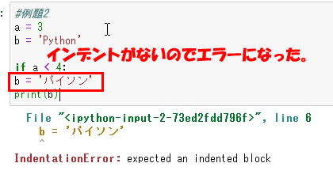
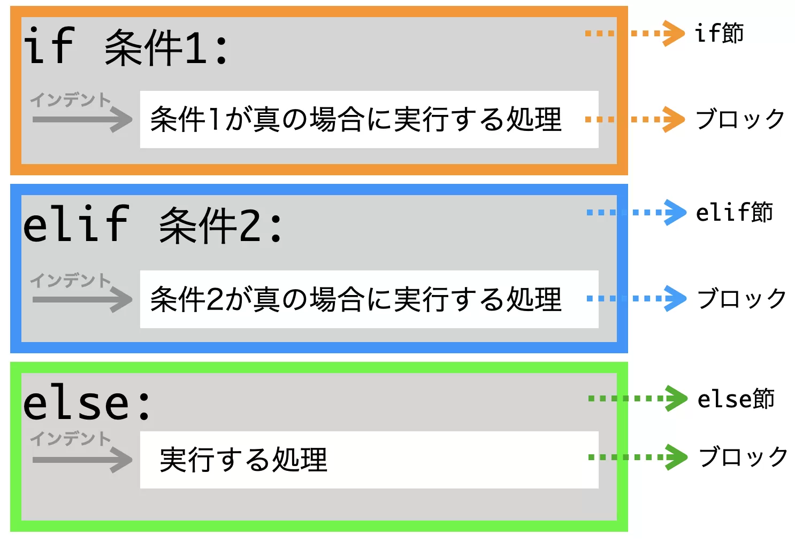

例えば、ある数値がプラスかどうかを判定するプログラムはこう書けます。

```python
number = 10
if number > 0:
    print(f"{number} はプラスの数です。")

number = -5
if number > 0: # この条件は成り立たないので、中のprintは実行されない
    print(f"{number} はプラスの数です。")
```

### 条件に合わなかったら？：`else`の出番

`if`文で条件が成り立たなかった場合（条件式が `False` だった場合）に、別の処理を実行したいこともありますよね。そんな時に使うのが `else` (エルス) です。

```python
if 条件式:
    # 条件式がTrueの場合の処理
    print("条件がTrueでした。")
else:
    # 条件式がFalseの場合の処理
    print("条件はFalseでした。")
```

`else` も `if` と同じようにコロン `:` で終わり、その次の行から実行したい処理をインデントして書きます。

先ほどの点数で合格・不合格を判定する例を見てみましょう。

```python
score = 75
passing_score = 80

if score >= passing_score:
    print(f"おめでとう！ {score}点なので合格です！")
else:
    print(f"残念... {score}点なので不合格です。次は頑張ろう！")
```

実行結果：

```
残念... 75点なので不合格です。次は頑張ろう！
```

もし `score` が `90` だったら、「おめでとう！ 90点なので合格です！」と表示されます。

### もっとたくさんの条件を分けたい！：`elif`を使おう

条件が「Aの場合」「Bの場合」「それ以外の場合」というように、3つ以上に分岐することもあります。そんな時は `elif` (エルイフ) を使います。`elif` は "else if" の略で、「前の `if` や `elif` の条件には当てはまらなかったけど、この条件ならどう？」という意味です。

```python
if 条件式1:
    # 条件式1がTrueの場合の処理
elif 条件式2:
    # 条件式1がFalseで、条件式2がTrueの場合の処理
elif 条件式3:
    # 条件式1も2もFalseで、条件式3がTrueの場合の処理
else:
    # 上のどの条件式もFalseだった場合の処理
```

`elif` はいくつでも続けることができます。最後に `else` を書くと、どの `if` や `elif` の条件にも当てはまらなかった場合の処理を指定できます (`else` は省略も可能です)。

例えば、信号の色によってメッセージを変えるプログラムはこう書けます。

```python
signal = "yellow" # "red", "blue" などに変えて試してみよう

if signal == "red":
    print("止まれ！危険です！")
elif signal == "yellow":
    print("注意して！もうすぐ赤信号かも。")
elif signal == "blue": # 地域によっては "green"
    print("進め！安全確認を忘れずに。")
else:
    print(f"'{signal}' は信号の色として認識できません。")
```

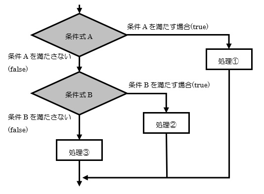
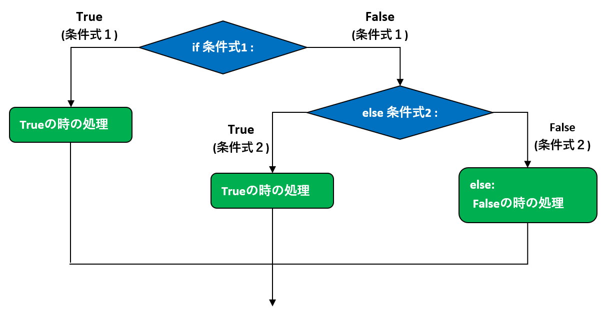
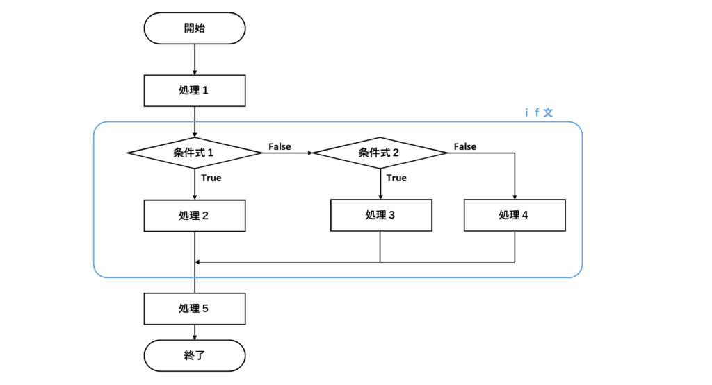

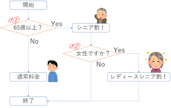
**ポイント：** `if`, `elif`, `else` のブロックでは、条件に一致した最初のブロックだけが実行され、残りのブロックは無視されます。

### 条件式を組み立てるコツ (比較演算子、論理演算子、`in`演算子)

`if`文の「条件式」には、結果が `True` か `False` になるような式を書きます。**比較演算子**や**論理演算子**です。

* **比較演算子**:
  * `==` (等しい), `!=` (等しくない)
  * `<` (より小さい), `>` (より大きい)
  * `<=` (以下), `>=` (以上)
* **論理演算子**:
  * `and` (かつ): `条件A and 条件B` → AもBもTrueならTrue
  * `or` (または): `条件A or 条件B` → AかBのどちらかがTrueならTrue
  * `not` (ではない): `not 条件A` → AがFalseならTrue、AがTrueならFalse

例えば、「年齢が18歳以上で、かつ、学生である」という条件はこう書けます。

```python
age = 20
is_student = True # True (学生である), False (学生ではない)

if age >= 18 and is_student:
    print("あなたは成人学生です。")
elif age >= 18 and not is_student:
    print("あなたは社会人の成人です。")
else:
    print("あなたは未成年の学生または未成年です。")
```

また、リストや文字列の中に特定の要素が含まれているかを確認するには `in` 演算子が便利です。

```python
my_favorite_fruits = ["apple", "banana", "orange"]
fruit_to_check = "banana"

if fruit_to_check in my_favorite_fruits:
    print(f"{fruit_to_check} は大好物です！")
else:
    print(f"{fruit_to_check} はリストにありません。")

# 文字列の場合
if "py" in "python":
    print("pythonという単語にはpyが含まれています。")
```

**ちょっとした豆知識 (Truthy / Falsy):**
Pythonでは、`True` や `False` だけでなく、いくつかの値が条件式の中で `True` や `False` と同じように扱われます。

* `False` とみなされるもの (Falsyな値): `None`, `False`, 数値の `0` や `0.0`, 空の文字列 `""`, 空のリスト `[]`, 空の辞書 `{}` など。
* それ以外のほとんどの値は `True` とみなされます (Truthyな値)。

なので、`if my_list:` と書くと、「もし `my_list` が空でなければ」という意味になります。便利ですね！

### `if`文の中に`if`文！？：ネストした`if`文

`if`文の処理ブロックの中に、さらに別の`if`文を書くこともできます。これを「**ネストした`if`文**」や「入れ子の`if`文」と呼びます。

```python
user_id = "testuser"
password = "password123"
entered_id = input("IDを入力してください: ")
entered_password = input("パスワードを入力してください: ")

if entered_id == user_id:
    print("IDは一致しました。")
    if entered_password == password:
        print("パスワードも一致しました。ログイン成功！")
    else:
        print("パスワードが間違っています。")
else:
    print("IDが間違っています。")
```

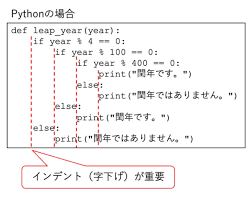

ネストした`if`文を使うと、より複雑な条件分岐を表現できますが、あまり深くネストしすぎるとコードが読みにくくなることがあります。そんな時は、処理を関数に分けたり、条件式を見直したりすると良いでしょう。（関数については次回以降で学びます！）

### ちょっと便利：条件式を1行で書く (三項演算子)

簡単な `if-else` の処理を1行で簡潔に書きたい場合があります。そんな時に使えるのが「**三項演算子 (conditional expression)**」です。

```python
# 通常のif-else文
score = 75
result = ""
if score >= 60:
    result = "合格"
else:
    result = "不合格"
print(result)

# 三項演算子を使った場合
score = 50
result = "合格" if score >= 60 else "不合格"
print(result)
```

構文は `値1 if 条件式 else 値2` となります。条件式が `True` なら `値1` が、`False` なら `値2` が全体の式の値となります。
読みやすさを損なわない範囲で使うと、コードがスッキリします。

---

## 2. 繰り返し処理 (ループ)：面倒な作業はコンピュータにおまかせ

### ループって何？ なぜ便利？

プログラムを書いていると、「この処理を10回繰り返したい」「リストの要素を全部順番に処理したい」といった場面がよく出てきます。そんな時に大活躍するのが「**ループ**」です。
ループを使うと、同じようなコードを何度も書く手間が省け、プログラムがスッキリし、間違いも減ります。

例えば、クラスの生徒全員（30人いたとしましょう）に「こんにちは！」と挨拶するプログラムを考えてみてください。ループを使わないと、`print("こんにちは！")` を30回書くことになります。大変ですよね？ ループなら数行で済んでしまいます！

Pythonには主に2種類のループがあります。「`for`ループ」と「`while`ループ」です。順番に見ていきましょう。

### `for`ループ：決まった回数や、リストの要素分だけ繰り返す

`for`ループは、主に「**決まった回数**」や「**データの集まり（リストや文字列など）の各要素に対して順番に**」処理を行いたい場合に使います。
このようなデータの集まりのことを、プログラミングの世界では「**イテラブル (iterable)**」なオブジェクトと呼んだりします。「反復可能」という意味ですね。

#### リストや文字列と一緒に`for`ループを使ってみよう

`for`ループの基本的な形はこうです。

```python
for 変数名 in イテラブルオブジェクト:
    # イテラブルオブジェクトから取り出した要素が「変数名」に入り、
    # このブロックの処理が要素の数だけ繰り返される
    # この部分もインデントが重要！
    print(変数名)
```

* `for`: ループを開始するキーワード。
* `変数名`: イテラブルオブジェクトから取り出された各要素が、ループの各回で一時的に格納される変数です。この名前は自由に決められますが、何が入るか分かりやすい名前にするのが良いでしょう（例: `fruit`, `name`, `char`など）。
* `in`: `for`とイテラブルオブジェクトをつなぐキーワード。
* `イテラブルオブジェクト`: リスト、文字列、タプル、辞書、`range()`関数の結果など、要素を一つずつ取り出せるもの。
* `:` (コロン): `if`文と同じく、行の最後に必要です。
* **インデント**: ループ内で実行したい処理はインデントします。

実際にリストと文字列で試してみましょう。

```python
# リストを使ったforループ
fruits = ["apple", "banana", "cherry", "date"]
print("好きな果物:")
for fruit in fruits: # fruitsリストから要素を一つずつ取り出し、fruit変数に入れる
    print(f"- {fruit}")

# 文字列を使ったforループ
my_name = "KOSEN"
print("\n私の名前を一文字ずつ表示:")
for char_in_name in my_name: # my_name文字列から文字を一つずつ取り出し、char_in_name変数に入れる
    print(char_in_name)
```

実行結果：

```
好きな果物:
- apple
- banana
- cherry
- date

私の名前を一文字ずつ表示:
K
O
S
E
N
```

簡単ですね！リストの要素の数や文字列の長さが変わっても、コードを修正する必要がないのがループの素晴らしいところです。

#### `range()`関数：指定した回数だけ繰り返すお供

「リストの要素の数だけ」ではなく、単純に「5回繰り返したい」「100回繰り返したい」というように、回数を指定してループしたい場合もよくあります。そんな時に便利なのが `range()` (レンジ) 関数です。

`range()`関数は、連続した数値のシーケンス（これもイテラブルの一種です）を生成します。

* `range(終了値)`: 0から「終了値 - 1」までの数値を生成します。

    ```python
    for i in range(5): # 0, 1, 2, 3, 4 の数値が順番に i に入る
        print(f"{i+1}回目のこんにちは！")
    ```

    実行結果：

    ```
    1回目のこんにちは！
    2回目のこんにちは！
    3回目のこんにちは！
    4回目のこんにちは！
    5回目のこんにちは！
    ```

    **ポイント：** `range(5)` は 0, 1, 2, 3, 4 であり、5は含まれません。「終了値の手前まで」と覚えておきましょう。これはスライスの時と同じですね！

* `range(開始値, 終了値)`: 「開始値」から「終了値 - 1」までの数値を生成します。

    ```python
    for num in range(1, 6): # 1, 2, 3, 4, 5 の数値が順番に num に入る
        print(f"現在の数値: {num}")
    ```

* `range(開始値, 終了値, ステップ)`: 「開始値」から「終了値 - 1」まで、「ステップ」おきに数値を生成します。

    ```python
    # 0から10の手前まで、2つおきに (偶数)
    for even_num in range(0, 10, 2): # 0, 2, 4, 6, 8
        print(even_num)

    # 5から1まで、1つずつ減らしながら (逆順)
    for countdown in range(5, 0, -1): # 5, 4, 3, 2, 1
        print(countdown)
    print("発射！")
    ```

`range()` は `for`ループと組み合わせて非常によく使われるので、ぜひマスターしてくださいね。

#### ループ変数が不要な場合は `_` (アンダースコア) を使う

`for` ループでは、イテラブルオブジェクトから取り出した要素を一時的に格納する変数（ループ変数）が必要ですが、ループの各回でその変数の値を**実際には使わない**場合もあります。例えば、単純に「5回同じ処理を繰り返したい」だけで、0, 1, 2, 3, 4 という数値自体は処理に必要ないケースです。

このような場合、Pythonプログラマーの間では、ループ変数名として **`_` (アンダースコア)** を使う慣習があります。これは、「この変数は意図的に使っていませんよ」ということを他のプログラマー（や未来の自分）に伝えるための、一種の目印のようなものです。

```python
# 5回「処理を実行しました」と表示する
# ループ変数 i の値は使わない
for _ in range(5):
    print("処理を実行しました。")

# リストの要素は使わないが、要素の数だけ処理を繰り返したい場合
my_list = ["a", "b", "c"]
count = 0
for _ in my_list: # my_listの要素 "a", "b", "c" は使わない
    count += 1
print(f"リストの要素数は {count} です。") # len(my_list) と同じですが、例として
```

もちろん、`_` の代わりに `i` や `num` などの変数名を使ってもプログラムは正しく動作します。しかし、`_` を使うことで、「この変数は使わないよ」という意図が明確になり、コードが読みやすくなることがあります。
特に `range()` と組み合わせて、単に回数を指定してループする場合によく見られます。

#### `enumerate()`関数：番号も一緒に取り出したい時に便利

リストなどの要素を順番に処理する際、その要素が「何番目か」という情報（インデックス）も一緒に使いたいことがあります。そんな時に便利なのが `enumerate()` (エニュメレート) 関数です。

`enumerate()` は、イテラブルオブジェクトと一緒に使うと、各ループで「インデックス」と「要素の値」のペアを返してくれます。

```python
members = ["佐藤", "鈴木", "高橋", "田中"]
for index, name in enumerate(members): # インデックスと名前を同時に取得
    print(f"出席番号{index+1}番: {name}さん") # インデックスは0から始まるので、+1して表示

# 開始番号を指定することもできます
for i, member_name in enumerate(members, start=1): # インデックスを1から始める
    print(f"会員番号{i}: {member_name}様")
```

実行結果：

```
出席番号1番: 佐藤さん
出席番号2番: 鈴木さん
出席番号3番: 高橋さん
出席番号4番: 田中さん
会員番号1: 佐藤様
会員番号2: 鈴木様
会員番号3: 高橋様
会員番号4: 田中様
```

`enumerate()` を使うと、わざわざ自分でカウンター変数を用意してインデックスを管理する必要がなくなるので、コードがスッキリします。
ご指摘ありがとうございます。該当箇所の構成を修正し、コードブロック内の重要な説明を本文に移動します。

#### `zip()`関数：複数のリストをまとめて処理したい時に便利

複数のリスト（や他のイテラブルオブジェクト）の要素を、同じインデックス同士でペアにして順番に取り出したい場合があります。そんな時に便利なのが `zip()` (ジップ) 関数です。

`zip()` は、引数として渡された複数のイテラブルから、対応する要素をタプルにまとめて返します。

```python
names = ["Alice", "Bob", "Charlie"]
ages = [25, 30, 22]
cities = ["Tokyo", "New York", "London"]

for name, age, city in zip(names, ages, cities):
    print(f"{name}さんは{age}歳で、{city}に住んでいます。")

# 実行結果:
# Aliceさんは25歳で、Tokyoに住んでいます。
# Bobさんは30歳で、New Yorkに住んでいます。
# Charlieさんは22歳で、Londonに住んでいます。
```

もし、渡されたイテラブルの要素数が異なる場合、`zip()` は最も要素数の少ないイテラブルに合わせて処理を終了します。

```python
list1 = [1, 2, 3, 4]
list2 = ['a', 'b', 'c']

for num, char_val in zip(list1, list2):
    print(f"数値: {num}, 文字: {char_val}")

# 実行結果:
# 数値: 1, 文字: a
# 数値: 2, 文字: b
# 数値: 3, 文字: c
# (list1の要素4は使われない)
```

`zip()` を使うと、関連する複数のデータ群をスマートに扱うことができます。

ここで、使われた一度に複数の変数を受け取るデータ型としてタプル、そしてタプルのアンパッキングというものが関わっています。これについてはまた関数の資料で詳しくやります。

#### 辞書と`for`ループ：キーや値を順番に見ていこう

辞書も `for`ループで扱うことができます。ただし、辞書の場合はキー、値、またはその両方を取り出す方法がいくつかあります。

**1. キーだけを取り出す (デフォルトの動作)**

`for`ループで辞書をそのまま使うと、キーが順番に取り出されます。明示的に `辞書.keys()` メソッドを使っても同じ結果が得られます。

```python
my_pc_specs = {
    "OS": "Windows 11",
    "CPU": "Intel Core i7",
    "RAM_GB": 16,
    "GPU": "NVIDIA RTX 3060"
}

print("\n--- PCスペック (キー) ---")
for spec_key in my_pc_specs:
    print(spec_key)

# または、明示的に .keys() を使う
# print("\n--- PCスペック (キー - .keys()使用) ---")
# for spec_key in my_pc_specs.keys():
#     print(spec_key)
```

**2. 値だけを取り出す (`.values()` メソッド)**

辞書の値だけを順番に取り出したい場合は、`辞書.values()` メソッドを使います。

```python
# my_pc_specs は前のコードブロックで定義済み
print("\n--- PCスペック (値) ---")
for spec_value in my_pc_specs.values():
    print(spec_value)
```

**3. キーと値の両方をペアで取り出す (`.items()` メソッド)**

キーと値のペアを同時に取り出したい場合は、`辞書.items()` メソッドを使います。これは非常によく使われる方法です。

`辞書.items()` は、`(キー, 値)` というペアの集まりを返します。このペアは、Pythonでは「**タプル (tuple)**」と呼ばれるデータ型で表現されます。タプルはリストに似ていますが、作成後に中身を変更できない（イミュータブル）という特徴があります。例えば、`("OS", "Windows 11")` や `("CPU", "Intel Core i7")` のような形です。

`for` ループでは、このタプルを `key` と `value` のように2つの変数に一度に代入して受け取ることができます。このように、複数の要素を持つデータ構造（タプルやリストなど）から各要素を取り出して個別の変数に割り当てることを「**アンパッキング (unpacking)**」または「**多重代入**」と呼びます。タプルについては、「関数」の資料にてまた詳しくやります。

```python
# my_pc_specs は前のコードブロックで定義済み
print("\n--- PCスペック (キーと値) ---")
for key, value in my_pc_specs.items(): # keyとvalueという2つの変数でペア(タプル)を受け取る
    print(f"{key}: {value}")
```

### `while`ループ：ある条件が満たされている間、ずっと繰り返す

`for`ループは、あらかじめ繰り返す回数や対象のデータが決まっている場合に便利でした。一方、「**ある条件が満たされている間は、ずっと処理を繰り返したい**」という場合には `while` (ホワイル) ループを使います。
いつループが終わるかは、実行時の状況次第、というわけです。

#### 基本的な`while`の形：`while 条件式:`

`while`ループの基本的な形はこうです。

```python
while 条件式:
    # 条件式がTrueの間、このブロックの処理が繰り返される
    # この部分もインデントが重要！
    # ループ内で、いつかは条件式がFalseになるように変数を操作する必要がある！
    print("ループ実行中...")
```

* `while`: ループを開始するキーワード。
* `条件式`: この式が `True` である限り、ループ内の処理が繰り返されます。
* `:` (コロン): 条件式の後には必ずコロンをつけます。
* **インデント**: ループ内で実行したい処理はインデントします。

**超重要ポイント：** `while`ループでは、ループの中で**条件式に関わる変数の値を変更する**などして、いつかは条件式が `False` になるようにしないと、ループが永遠に終わらない「**無限ループ**」に陥ってしまいます！

例えば、カウンターを使って3回だけメッセージを表示するプログラムはこう書けます。

```python
count = 0 # カウンター変数を初期化
while count < 3: # countが3未満の間、ループを続ける
    print(f"現在のカウント: {count}")
    count = count + 1 # countの値を1増やす (これが無いと無限ループ！)
    # count += 1 とも書けます (自己代入演算子)

print("ループが終了しました。")
```

実行結果：

```
現在のカウント: 0
現在のカウント: 1
現在のカウント: 2
ループが終了しました。
```

もし `count = count + 1` の行を忘れてしまうと、`count` の値はずっと `0` のままで、`count < 3` という条件は常に `True` になり、プログラムは「現在のカウント: 0」と表示し続けて止まらなくなってしまいます。

#### 無限ループにご注意！ (止める方法も伝授します)

意図的に無限ループを作りたい場合もあります。例えば、ユーザーが特定のコマンドを入力するまでずっと入力を待ち続けるプログラムなどです。その場合は `while True:` のように書きます。

```python
# このコードは無限ループになるので、実行する際は停止方法を知っておくこと！
# while True:
#     user_input = input("何か入力してください ('quit'で終了): ")
#     if user_input == "quit":
#         break # breakについては後で説明します
#     print(f"入力された内容: {user_input}")
# print("プログラムを終了します。")
```

もしプログラムが無限ループに陥ってしまって、VSCodeのターミナルで実行が止まらなくなったら、慌てずにキーボードの **`Ctrl`キーを押しながら `C`キー** を押してください (`Ctrl+C`)。これで実行中のPythonプログラムを強制的に停止させることができます。
これは非常に重要なショートカットなので、絶対に覚えておきましょう！「あれ、プログラムが止まらない！」と思ったら、まずは `Ctrl+C` です！

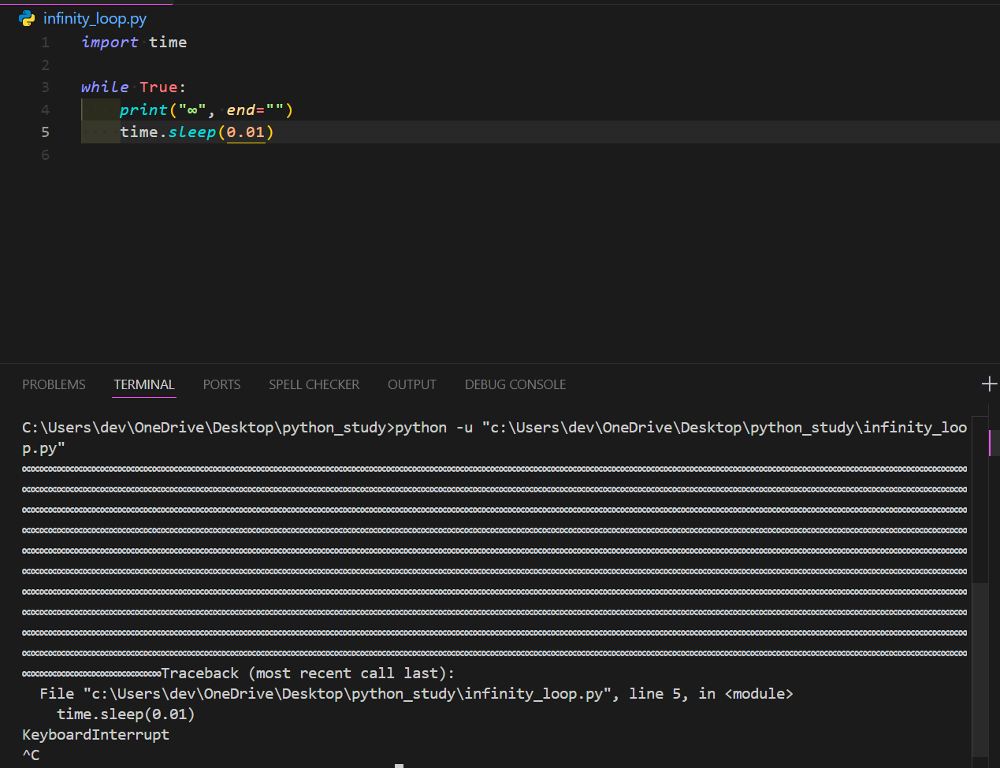

---

## 3. ループを自在にコントロール

ループ処理の途中で、「もうここでループを抜けたい！」とか「今回はこの処理を飛ばして次に進みたい！」と思うことがありますよね。そんな時に役立つのが `break` と `continue` という命令です。

### `break`：ループから脱出

`break` (ブレイク) は、`for`ループや`while`ループの処理の途中で、ループ全体を**強制的に終了**させ、ループの次の処理に進むための命令です。

例えば、リストの中から特定の数字を探していて、見つかったらそれ以降は探す必要がない、という場合に使えます。

```python
numbers = [10, 25, 8, 42, 15, 30, 7]
target = 42
found = False # 見つかったかどうかを記録するフラグ変数

print(f"{target} を探します...")
for num in numbers:
    print(f"現在調べている数: {num}")
    if num == target:
        print(f"{target} を見つけました！")
        found = True
        break # ループをここで抜ける！
    # もしbreakが実行されると、これ以降のprint("まだ見つかりません...")は実行されない

if not found: # ループが終わった後、foundがFalseのままなら見つからなかった
    print(f"{target} はリストにありませんでした。")
```

実行結果：

```
42 を探します...
現在調べている数: 10
現在調べている数: 25
現在調べている数: 8
現在調べている数: 42
42 を見つけました！
```

`target` の `42` が見つかった時点で `break` が実行され、その後の `15`, `30`, `7` は調べられずにループが終了しているのが分かりますね。

### `continue`：今回はパス！次の繰り返しへ

`continue` (コンティニュー) は、ループ内の現在の回の処理をそこで中断し、ループの**次の回の処理（次のイテレーション）にスキップ**するための命令です。`break` のようにループ全体を終了するのではなく、現在の回だけを飛ばします。

例えば、リストの数値の中で、奇数だけを合計したい（偶数は無視したい）場合などに使えます。

```python
numbers = [1, 2, 3, 4, 5, 6, 7, 8, 9, 10]
sum_of_odds = 0

for num in numbers:
    if num % 2 == 0: # もし数値が偶数なら...
        print(f"{num} は偶数なのでスキップします。")
        continue # この回の残りの処理 (sum_of_odds += num) を飛ばして、次のnumへ
    
    print(f"{num} は奇数なので加算します。")
    sum_of_odds += num

print(f"\n奇数の合計: {sum_of_odds}")
```

実行結果：

```
1 は奇数なので加算します。
2 は偶数なのでスキップします。
3 は奇数なので加算します。
4 は偶数なのでスキップします。
5 は奇数なので加算します。
6 は偶数なのでスキップします。
7 は奇数なので加算します。
8 は偶数なのでスキップします。
9 は奇数なので加算します。
10 は偶数なのでスキップします。

奇数の合計: 25
```

偶数の場合は `continue` が実行され、その下の `sum_of_odds += num` が実行されずに次のループに進んでいるのが分かりますね。

### ループの`else`節：ループが無事に終わった時だけ実行

Pythonのループ (`for` と `while`) には、ちょっと珍しい `else`節を付けることができます。この `else`節は、ループが **`break`文で中断されることなく、最後まで正常に完了した場合にのみ** 実行されます。

```python
# for...else の例
print("--- for...else ---")
for i in range(3): # 0, 1, 2 とループ
    print(f"ループ {i}")
    # if i == 1: # もしここでbreakすると...
    #     print("breakしました！")
    #     break
else:
    # ループがbreakされずに最後まで実行された場合にここが実行される
    print("forループが正常に完了しました。")

# while...else の例
print("\n--- while...else ---")
count = 0
while count < 3:
    print(f"カウント {count}")
    count += 1
    # if count == 2: # もしここでbreakすると...
    #     print("breakしました！")
    #     break
else:
    # ループがbreakされずに最後まで実行された場合にここが実行される
    print("whileループが正常に完了しました。")
```

もし上のコードでコメントアウトしている `break` を有効にすると、`else`節の中の `print` は実行されなくなります。
これは、例えば「リストの中に特定の要素を探し、見つからなかった場合（つまり`break`されなかった場合）に何か処理をしたい」といったシナリオで便利です。

---

## 4. ちょっと発展：リスト内包表記 (おまけ)

最後に、`for`ループと（場合によっては`if`文も）使って新しいリストを作成する処理を、非常に簡潔に1行で書ける「**リスト内包表記 (list comprehension)**」というテクニックを少しだけ紹介します。

例えば、0から9までの数値の二乗を要素とするリストを作りたい場合、普通に`for`ループで書くとこうなります。

```python
squares_normal = []
for x in range(10):
    squares_normal.append(x * x)
print(f"通常のforループ: {squares_normal}")
```

これをリスト内包表記で書くと、こうなります。

```python
squares_comprehension = [x * x for x in range(10)]
print(f"リスト内包表記: {squares_comprehension}")
```

スッキリしましたね！ `[式 for 変数 in イテラブル]` という形です。

さらに、`if`文と組み合わせて、条件に合う要素だけでリストを作ることもできます。
例えば、0から9までの数値の中で、偶数の二乗だけをリストにしたい場合。

```python
# 通常のforループとif文
even_squares_normal = []
for x in range(10):
    if x % 2 == 0: # 偶数なら
        even_squares_normal.append(x * x)
print(f"通常のforとif: {even_squares_normal}")

# リスト内包表記とif文
even_squares_comprehension = [x * x for x in range(10) if x % 2 == 0]
print(f"リスト内包表記とif: {even_squares_comprehension}")
```

リスト内包表記は、Pythonらしい非常に強力でエレガントな書き方の一つです。慣れるとコードが短くなり、可読性が上がることもあります。
ただ、最初は無理に使う必要はありません。「こんな書き方もあるんだな」と頭の片隅に置いておいて、人の書いたコードで見かけたときに「ああ、あれか！」と思い出せるくらいで十分です。まずは基本的な`for`ループをしっかりマスターしましょう！

---

## ✏️ 本日の演習

さあ、今日学んだ`if`文とループのテクニックを使って、実際に手を動かしてみましょう！

1. VSCodeで新しいPythonファイル（例: `practice05.py`）を作成してください。
2. **課題1：成績判定プログラム**
    * ユーザーに点数（0〜100の整数）を `input()` 関数で尋ねてください。
    * 入力された点数に応じて、以下のように成績を表示するプログラムを作成してください。
        * 90点以上： 「素晴らしい！評価は『優』です。」
        * 80点以上90点未満： 「良いですね！評価は『良』です。」
        * 60点以上80点未満： 「まずまずです。評価は『可』です。」
        * 60点未満： 「残念...評価は『不可』です。再挑戦しましょう。」
    * ヒント：`input()` で受け取った値は文字列なので、`int()` で数値に変換するのを忘れないでくださいね！
3. **課題2：FizzBuzzチャレンジ！**
    * 1から30までの数値を順番に調べます (`for`ループと`range()`を使いましょう)。
    * もし数値が3の倍数なら「Fizz」と表示します。
    * もし数値が5の倍数なら「Buzz」と表示します。
    * もし数値が3の倍数でもあり5の倍数でもあるなら「FizzBuzz」と表示します。
    * それ以外の数値の場合は、その数値をそのまま表示します。
    * （例：1, 2, Fizz, 4, Buzz, Fizz, 7, 8, Fizz, Buzz, 11, Fizz, 13, 14, FizzBuzz, ...）
4. **課題3：合言葉は？**
    * 正しい合言葉をプログラム内に決めておきます（例: `secret_word = "pythonista"`）。
    * ユーザーに「合言葉を入力してください: 」と尋ね、入力された言葉が正しい合言葉と一致するまで、`while`ループで繰り返し尋ね続けてください。
    * 正しい合言葉が入力されたら、「正解！ようこそ、秘密の部屋へ！」と表示してプログラムを終了します。
5. **課題4：ループ制御を使ってみよう**
    * 1から10までの数値を`for`ループで処理します。
    * ループの中で、もし数値が3の倍数だったら、その数値を表示せずに「(3の倍数はスキップ)」と表示して、その回の処理をスキップしてください (`continue`を使います)。
    * もし数値が8になったら、「8に到達したのでループを終了します。」と表示して、ループを強制的に終了してください (`break`を使います)。
    * それ以外の数値の場合は、その数値を表示してください。
6. **課題5 (発展)：友人の好きな食べ物チェッカー**
    * 前回の演習で作成したような、複数の友人の情報（名前と好きな食べ物の辞書）を要素とするリスト `friends_data` を使います。もし手元になければ、以下のようなものを作成してください。

        ```python
        friends_data = [
            {"name": "山田さん", "favorite_food": "ラーメン"},
            {"name": "田中さん", "favorite_food": "焼肉"},
            {"name": "鈴木さん", "favorite_food": "お寿司"},
            {"name": "加藤さん", "favorite_food": "ラーメン"}
        ]
        ```

    * ユーザーに食べ物の名前を `input()` で尋ねてください。
    * `friends_data` リストをループで調べ、入力された食べ物が好きな友人の名前を全員表示してください。
    * もし、入力された食べ物が好きな友人が一人もいなかった場合は、「その食べ物が好きな友人はいませんでした。」と表示してください。 (ヒント: `for...else` やフラグ変数を使うと良いかもしれません)

---
---
---

### 演習の解答例

```python
# practice05.py

# --- 課題1：成績判定プログラム ---
print("--- 課題1：成績判定プログラム ---")
try:
    score_str = input("あなたの点数（0-100の整数）を入力してください: ")
    score = int(score_str)

    if not (0 <= score <= 100):
        print("0から100の間の整数を入力してください。")
    elif score >= 90:
        print("素晴らしい！評価は『優』です。")
    elif score >= 80: # 90点未満であることは上の条件で弾かれている
        print("良いですね！評価は『良』です。")
    elif score >= 60: # 80点未満であることは上の条件で弾かれている
        print("まずまずです。評価は『可』です。")
    else: # 60点未満
        print("残念...評価は『不可』です。再挑戦しましょう。")
except ValueError:
    print("整数を入力してください。")
print("-" * 30)

# --- 課題2：FizzBuzzチャレンジ！ ---
print("--- 課題2：FizzBuzzチャレンジ！ ---")
for num in range(1, 31): # 1から30まで
    if num % 3 == 0 and num % 5 == 0: # 先に15の倍数をチェックするのがコツ
        print("FizzBuzz")
    elif num % 3 == 0:
        print("Fizz")
    elif num % 5 == 0:
        print("Buzz")
    else:
        print(num)
print("-" * 30)

# --- 課題3：合言葉は？ ---
print("--- 課題3：合言葉は？ ---")
secret_word = "pythonista"
user_guess = "" # 初期化
while user_guess != secret_word:
    user_guess = input("合言葉を入力してください: ")
    if user_guess == secret_word:
        print("正解！ようこそ、秘密の部屋へ！")
    else:
        print("違います。もう一度試してください。")
print("-" * 30)

# --- 課題4：ループ制御を使ってみよう ---
print("--- 課題4：ループ制御を使ってみよう ---")
for i in range(1, 11): # 1から10まで
    if i == 8:
        print("8に到達したのでループを終了します。")
        break
    if i % 3 == 0:
        print(f"({i}は3の倍数はスキップ)")
        continue
    print(i)
print("-" * 30)

# --- 課題5 (発展)：友人の好きな食べ物チェッカー ---
print("--- 課題5 (発展)：友人の好きな食べ物チェッカー ---")
friends_data = [
    {"name": "山田さん", "favorite_food": "ラーメン"},
    {"name": "田中さん", "favorite_food": "焼肉"},
    {"name": "鈴木さん", "favorite_food": "お寿司"},
    {"name": "加藤さん", "favorite_food": "ラーメン"},
    {"name": "佐藤さん", "favorite_food": "カレー"}
]

search_food = input("好きな食べ物を入力してください: ")
found_friends = [] # 見つかった友人を入れるリスト

for friend in friends_data:
    if friend["favorite_food"] == search_food:
        found_friends.append(friend["name"])

if len(found_friends) > 0:
    print(f"\n「{search_food}」が好きな友人はこちらです：")
    for name in found_friends:
        print(f"- {name}")
else:
    print(f"\n残念ながら、「{search_food}」が好きな友人はいませんでした。")

# for...else を使った別解
# print("\n--- for...else を使った別解 ---")
# for friend_info in friends_data:
#     if friend_info["favorite_food"] == search_food:
#         print(f"「{search_food}」が好きな友人: {friend_info['name']}さん")
#         break # 一人見つかったら終了する場合 (全員表示ならbreakしない)
# else:
#     # ループがbreakされずに最後まで終わった場合 (つまり見つからなかった場合)
#     # ただし、上の例のように全員表示したい場合はこのelseは使いにくい
#     print(f"「{search_food}」が好きな友人はいませんでした。 (for...else版)")

print("-" * 30)
print("\n演習お疲れ様でした！")
```

---

今回は、プログラムの流れをコントロールするための超重要テクニック、「条件分岐 (`if`文)」と「繰り返し処理 (ループ)」について学びました。プログラムに「考える力」と「繰り返す力」が備わったことで、より複雑で実用的な問題解決に挑戦できるようになります。

最初は条件式の組み立てやループの制御で戸惑うこともあるかもしれませんが、心配いりません。たくさんコードを書いて、実際に動かして、**時にはエラーと格闘しながら**、この感覚を自分のものにしていってください。それが上達への一番の近道です！

次回は、「**関数定義と標準ライブラリ**」について学びます。自分でオリジナルの命令（関数）を作れるようになると、プログラムがもっと整理されて、再利用しやすくなりますよ！さらに、Pythonが最初から用意してくれている便利な道具箱（標準ライブラリ）の中身も一緒に見ていきましょう。ますますプログラミングが楽しくなること間違いなしです！

分からないこと、つまづいたことがあれば、いつでも遠慮なく部長のカトに気軽に質問してくださいね！みんなで助け合いながら、スキルアップしていきましょう！
