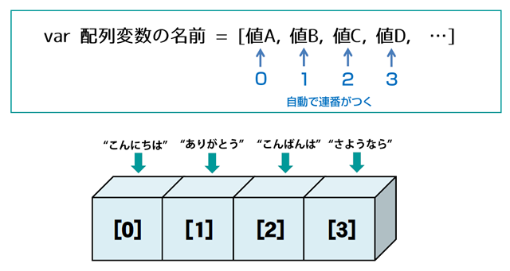

# 第3章: 演算子と基本的なデータ構造 – 計算、比較、そして情報の集まり

前回は、JavaScriptの心臓部とも言える「変数」と「データ型」について学びましたね。情報をしまう箱と、その中身の種類が分かれば、いよいよそれらを使って色々な操作ができるようになります！

この章では、まずプログラムの中で計算をしたり、値を比べたりするための「**演算子**」という記号たちと友達になります。四則演算はもちろん、条件によって処理を変えるための比較や論理の演算子も登場しますよ。

そして後半では、たくさんの情報をまとめてスッキリ管理するための「**配列**」と「**オブジェクト**」という、JavaScriptの強力な武器を手に入れます。これらを使いこなせるようになると、プログラムで表現できることの幅がぐーんと広がります！

## 目次

1. 計算や比較の達人になろう！ – 演算子の世界へ
    * 足し算、引き算だけじゃない！ – 算術演算子
    * どっちが大きい？同じ？ – 比較演算子 (`===` を使おう！)
    * かつ、または、そうじゃない！ – 論理演算子 (ショートサーキット評価も！)
    * 値をサッと代入！ – 代入演算子
    * もしAならB、そうでなければC – 三項演算子
    * (ちょっとマニアック？) ビット演算子 – 知っておくと役立つかも
    * 計算の順番は大丈夫？ – 演算子の優先順位
2. たくさんの情報をまとめて管理！ – 配列 (`Array`)
    * 配列って何？どうやって作るの？
    * 箱の中身を見てみよう！ – 要素へのアクセスと長さ
    * 配列を便利に操作！ – 基本的な配列メソッド
        * 末尾に追加・削除: `push()`, `pop()` (箱の中身が変わるよ！)
        * 先頭に追加・削除: `unshift()`, `shift()` (これも箱の中身が変わる！)
        * 一部分を切り取る: `slice()` (元の箱は変わらない！)
        * 途中に要素を入れたり消したり: `splice()` (箱の中身が大胆に変わる！)
        * 破壊的？非破壊的？ – メソッドの性質を知っておこう
3. 名前と値のペアで整理整頓！ – オブジェクト (`Object`)
    * オブジェクトってどんな箱？
    * 箱に名前をつけて中身を入れよう！ – オブジェクトの作成
    * 箱の中身を取り出す・書き換える – プロパティへのアクセス
        * ドット記法: `object.propertyName`
        * ブラケット記法: `object['propertyName']` (こんな時に便利！)
    * 箱に新しいものを入れたり、捨てたり – プロパティの追加・変更・削除
    * 本当にそのプロパティ、持ってる？ – `in` 演算子と `hasOwnProperty`
    * オブジェクト同士を比べると…？ – 参照の比較
4. オブジェクトに「得意技」を仕込もう！ – メソッド入門
    * `this` って誰のこと？ – メソッドと `this` の不思議な関係
5. 演習例: 「自己紹介するパーソンオブジェクト」を作ってみよう！

---

## 1. 計算や比較の達人になろう！ – 演算子の世界へ

プログラミングでは、数値を計算したり、条件を比較したりすることが頻繁にあります。そんな時に使うのが「**演算子**」です。算数で使った `+` や `-` といった記号も演算子の一種ですよ。

### 足し算、引き算だけじゃない！ – 算術演算子

まずは、おなじみの計算で使う**算術演算子**です。

| 演算子 | 意味                     | 例 (`let x = 10, y = 3;`) | 結果    |
| :----- | :----------------------- | :------------------------ | :------ |
| `+`    | 加算 (足し算)            | `x + y`                   | `13`    |
| `-`    | 減算 (引き算)            | `x - y`                   | `7`     |
| `*`    | 乗算 (掛け算)            | `x * y`                   | `30`    |
| `/`    | 除算 (割り算)            | `x / y`                   | `3.33…` |
| `%`    | 剰余 (割った余り)        | `x % y`                   | `1`     |
| `**`   | べき乗 (ES2016から)      | `x ** y` (10の3乗)        | `1000`  |
| `++`   | インクリメント (1増やす) | `x++` (後置) or `++x` (前置) | `x`が`11`に |
| `--`   | デクリメント (1減らす)   | `y--` (後置) or `--y` (前置) | `y`が`2`に  |

```javascript
let a = 15;
let b = 4;

console.log("a + b =", a + b); // 19
console.log("a - b =", a - b); // 11
console.log("a * b =", a * b); // 60
console.log("a / b =", a / b); // 3.75
console.log("a % b =", a % b); // 3 (15を4で割ると3余る)
console.log("2 ** 5 =", 2 ** 5); // 32 (2の5乗)

let counter = 0;
counter++; // counter が 1 になる
console.log("counter:", counter);
counter--; // counter が 0 に戻る
console.log("counter:", counter);

// ++ や -- の前置と後置の違い
let c = 5;
let d = 5;
let resultC = c++; // resultC に c の値(5)が代入された後、c がインクリメントされる
let resultD = ++d; // d がインクリメントされた後、その値(6)が resultD に代入される
console.log("c:", c, "resultC:", resultC); // c: 6, resultC: 5
console.log("d:", d, "resultD:", resultD); // d: 6, resultD: 6
```

**ポイント:** `++` や `--` は、変数の値を1だけ増やしたり減らしたりする便利な演算子ですが、変数の前に書くか（前置）、後に書くか（後置）で、式全体の値が変わることがあるので、少し注意が必要です。最初は無理に複雑な式で使わず、単独で `counter++;` のように使うのが分かりやすいでしょう。

### どっちが大きい？同じ？ – 比較演算子 (`===` を使おう！)

次に、2つの値を比べて、その結果を `true` (真) か `false` (偽) で教えてくれる**比較演算子**です。これは、後の章で学ぶ条件分岐（もし○○なら××する）で非常に重要になります。

| 演算子  | 意味                     | 例 (`let x = 5, y = "5", z = 10;`) | 結果    |
| :------ | :----------------------- | :------------------------------- | :------ |
| `==`    | 等価 (値が等しいか)      | `x == y`                         | `true`  |
| `===`   | **厳密等価** (値と型が等しいか) | `x === y`                        | `false` |
| `!=`    | 不等価 (値が等しくないか)  | `x != z`                         | `true`  |
| `!==`   | **厳密不等価** (値または型が等しくないか) | `x !== y`                        | `true`  |
| `>`     | より大きい               | `z > x`                          | `true`  |
| `<`     | より小さい               | `x < z`                          | `true`  |
| `>=`    | 以上                     | `x >= 5`                         | `true`  |
| `<=`    | 以下                     | `z <= x`                         | `false` |

```javascript
let num1 = 10;
let num2 = 20;
let strNum = "10";

console.log("num1 > num2:", num1 > num2);   // false
console.log("num1 < num2:", num1 < num2);   // true
console.log("num1 >= 10:", num1 >= 10); // true
console.log("num2 <= 10:", num2 <= 10); // false

// == と === の違いは超重要！
console.log("num1 == strNum (10 == '10'):", num1 == strNum);   // true (型変換されて比較される)
console.log("num1 === strNum (10 === '10'):", num1 === strNum); // false (型が違うのでfalse)

console.log("num1 != strNum (10 != '10'):", num1 != strNum);   // false
console.log("num1 !== strNum (10 !== '10'):", num1 !== strNum); // true
```

**超重要ポイント:**
前回の「型変換」でも少し触れましたが、`==` (等価演算子) は、比較する前に自動的に型変換を行うことがあります。これが思わぬバグの原因になることがあるんです。
例えば、`5 == "5"` は `true` になります。

一方、`===` (厳密等価演算子) は、型変換を行わずに、値とデータ型の両方が完全に一致している場合のみ `true` を返します。`5 === "5"` は `false` です。

**個人的な経験からも、バグを減らし、コードの意図を明確にするために、比較をするときは基本的に `===` と `!==` を使うことを強く、強く推奨します！** `==` や `!=` を使うのは、型変換を意図的に利用したい特別な場合だけにしましょう。

### かつ、または、そうじゃない！ – 論理演算子 (ショートサーキット評価も！)

複数の条件を組み合わせたり、条件を否定したりするときに使うのが**論理演算子**です。

| 演算子 | 意味     | 例 (`let a = true, b = false;`) | 結果    |
| :----- | :------- | :---------------------------- | :------ |
| `&&`   | 論理AND (かつ) | `a && b`                      | `false` |
| `||`   | 論理OR (または) | `a || b`                      | `true`  |
| `!`    | 論理NOT (ではない) | `!a`                          | `false` |

```javascript
let isSunny = true;
let isWarm = false;
let hasHomework = true;

// 外に遊びに行ける条件: 晴れていて、かつ、暖かい
let canGoOut = isSunny && isWarm;
console.log("遊びに行ける？:", canGoOut); // false (暖かくないから)

// ゲームができる条件: 晴れている、または、宿題がない
let canPlayGame = isSunny || !hasHomework;
console.log("ゲームできる？:", canPlayGame); // true (晴れているから)

console.log("宿題がない？:", !hasHomework); // false (宿題はある)
```

**ポイント: ショートサーキット評価**

論理演算子 `&&` と `||` には、「ショートサーキット評価」という面白い性質があります。

* **`&&` (AND)**: 左側の式が `false` と評価された時点で、右側の式は評価されずに全体が `false` と決まります。なぜなら、AND条件では片方が `false` なら結果は必ず `false` だからです。
* **`||` (OR)**: 左側の式が `true` と評価された時点で、右側の式は評価されずに全体が `true` と決まります。なぜなら、OR条件では片方が `true` なら結果は必ず `true` だからです。

これを利用すると、ちょっと賢いコードが書けます。

以下は、今後条件分岐、ifや関数、オブジェクトを学習した時に、真に理解ができますので、軽く流していただいてもOKです

```javascript
function processPayment(user) {
  // userが存在し、かつuser.isVerifiedがtrueの場合のみ支払い処理を実行
  if (user && user.isVerified && user.balance > 1000) {
    console.log(user.name + "さんの支払い処理を実行します。");
    return true;
  }
  console.log("支払い処理は実行されませんでした。");
  return false;
}

let user1 = { name: "高専太郎", isVerified: true, balance: 5000 };
let user2 = { name: "高専花子", isVerified: false, balance: 2000 }; // 未認証
let user3 = null; // ユーザー情報なし
let user4 = { name: "高専一郎", isVerified: true, balance: 500 }; // 残高不足

processPayment(user1); // 実行される
processPayment(user2); // 実行されない (isVerifiedでfalseになるため、balanceのチェックは行われない)
processPayment(user3); // 実行されない (userがnullでfalseになるため、それ以降のチェックは行われない)
processPayment(user4); // 実行されない (balance > 1000 でfalseになる)

// || の例: デフォルト値の設定
let preferredName = null;
let defaultName = "ゲスト";
let displayName = preferredName || defaultName;
console.log("表示名:", displayName); // "ゲスト" (preferredNameがnull(falsy)なのでdefaultNameが使われる)

let userName = "Alice";
displayName = userName || defaultName;
console.log("表示名:", displayName); // "Alice" (userNameが"Alice"(truthy)なのでuserNameが使われる)
```

`user && user.profile && user.profile.name` のような書き方は、`user` が `null` や `undefined` の場合にエラーになるのを防ぐためによく使われます。もし `user` が `null` なら、その時点で `&&` の評価が止まり、エラーを避けられるわけです。

### 値をサッと代入！ – 代入演算子

変数に値を代入するときに使うのが**代入演算子**です。一番基本的なのは `=` ですね。

| 演算子 | 意味                                 | 例 (`let x = 10;`) | 等価な式        |
| :----- | :----------------------------------- | :----------------- | :-------------- |
| `=`    | 代入                                 | `x = 20`           |                 |
| `+=`   | 加算して代入                         | `x += 5`           | `x = x + 5`     |
| `-=`   | 減算して代入                         | `x -= 3`           | `x = x - 3`     |
| `*=`   | 乗算して代入                         | `x *= 2`           | `x = x * 2`     |
| `/=`   | 除算して代入                         | `x /= 4`           | `x = x / 4`     |
| `%=`   | 剰余を計算して代入                   | `x %= 3`           | `x = x % 3`     |
| `**=`  | べき乗を計算して代入 (ES2016から)    | `x **= 2`          | `x = x ** 2`    |

```javascript
let score = 100;
console.log("初期スコア:", score); // 100

score += 50; // score = score + 50 と同じ
console.log("ボーナス後:", score); // 150

score -= 20; // score = score - 20 と同じ
console.log("ペナルティ後:", score); // 130

let message = "こんにちは、";
message += "高専太郎さん！"; // 文字列の結合にも使える
console.log(message); // こんにちは、高専太郎さん！
```

これらの複合代入演算子は、コードを少し短く書けるので便利ですよ。

### もしAならB、そうでなければC – 三項演算子

こちらも、演算子の一つですが、条件分岐 ifのところでも説明します。適当に流してください。

**三項演算子** (条件演算子とも呼ばれます) は、簡単な `if...else` 文を一行で書ける便利な演算子です。

構文: `条件 ? trueの場合の値 : falseの場合の値`

```javascript
let age = 20;
let beverage = (age >= 20) ? "ビール" : "ジュース";
console.log("あなたにおすすめの飲み物は:", beverage); // ビール

let score = 75;
let resultMessage = (score >= 80) ? "合格です！" : "残念、もう少し！";
console.log(resultMessage); // 残念、もう少し！
```

三項演算子は、単純な条件分岐で値を代入したい場合などにコードをスッキリさせることができます。ただし、条件や処理が複雑になる場合は、無理に使わずに `if...else` 文を使った方が読みやすくなることもあります。

### (ちょっとマニアック？) ビット演算子 – 知っておくと役立つかも

JavaScriptには、数値を2進数のビット列として扱い、ビット単位で操作を行う**ビット演算子**もあります。
これは、通常のウェブ開発ではあまり頻繁に使うことはないかもしれませんが、特定のアルゴリズムや低レベルな処理、グラフィック処理などで使われることがあります。

| 演算子 | 意味        |
| :----- | :---------- |
| `&`    | AND         |
| `|`    | OR          |
| `^`    | XOR         |
| `~`    | NOT         |
| `<<`   | 左シフト    |
| `>>`   | 符号付き右シフト |
| `>>>`  | 符号なし右シフト |

この段階では「こんなものもあるんだな」くらいに知っておけば十分です。興味がある人は、MDNなどで調べてみてくださいね。

### 計算の順番は大丈夫？ – 演算子の優先順位

一つの式の中に複数の演算子が含まれている場合、どの演算子から計算されるかという「優先順位」があります。これは数学の計算ルール（掛け算・割り算を足し算・引き算より先に計算する、など）と似ています。

例えば、`let result = 3 + 4 * 5;` という式では、`*` (乗算) の方が `+` (加算) より優先順位が高いので、まず `4 * 5` が計算され、その結果 `20` に `3` が足されて `result` は `23` になります。

もし計算の順序を明示したい場合や、優先順位が分かりにくい場合は、数学と同じように**括弧 `()`** を使います。
`let result = (3 + 4) * 5;` と書けば、まず `3 + 4` が計算され、その結果 `7` に `5` が掛けられて `result` は `35` になります。

**個人的には、複雑な式を書くときは、優先順位を暗記するよりも、括弧 `()` を適切に使って計算の順序を明確にするのが、バグを防ぎ、誰が見ても分かりやすいコードを書くためのコツだと思っています。**

演算子の優先順位の完全なリストはMDNなどのドキュメントで確認できますが、最初はよく使う算術演算子や比較演算子の関係を覚えておけば大丈夫でしょう。
(参考: [MDN - 演算子の優先順位](https://developer.mozilla.org/ja/docs/Web/JavaScript/Reference/Operators/Operator_Precedence))

---

## 2. たくさんの情報をまとめて管理！ – 配列 (`Array`)

さて、演算子を使って色々な計算や比較ができるようになりました。次に、複数のデータをまとめて扱いたい、という場面で大活躍するのが「**配列 (Array)**」です。

### 配列って何？どうやって作るの？

配列とは、**複数の値を順番に並べて格納できる、リストのようなもの**です。まるで、たくさんの引き出しがついた整理棚のようなイメージですね。それぞれの引き出しには、数値や文字列、真偽値、さらには別の配列やオブジェクトまで、どんな種類のデータでも入れることができます。

配列を作るには、角括弧 `[]` を使い、カンマ `,` で区切って値を並べます。

```javascript
// 空の配列
const emptyArray = [];
console.log("空の配列:", emptyArray);

// 数値の配列
const scores = [80, 95, 72, 100, 88];
console.log("点数リスト:", scores);

// 文字列の配列
const fruits = ["りんご", "バナナ", "みかん", "ぶどう"];
console.log("果物リスト:", fruits);

// いろいろなデータ型の値を混ぜることも可能 (でも、あまり推奨されないことも)
const mixedArray = [10, "こんにちは", true, null];
console.log("混合配列:", mixedArray);

// new Array() を使って作ることもできるけど、[] の方が一般的
const numbers = new Array(1, 2, 3, 4, 5);
console.log("new Array()で作った配列:", numbers);
```

### 箱の中身を見てみよう！ – 要素へのアクセスと長さ

配列の中の個々の値のことを「**要素 (element)**」と呼びます。そして、各要素には「**インデックス (index)**」という番号が、**0から順番に**割り振られています。このインデックスを使って、特定の要素にアクセスできます。

配列の長さを知りたいときは、`.length` プロパティを使います。

```javascript
const colors = ["赤", "緑", "青", "黄色"];

// インデックスを使って要素にアクセス (インデックスは0から始まる！)
console.log("0番目の色:", colors[0]); // 赤
console.log("2番目の色:", colors[2]); // 青

// 存在しないインデックスにアクセスしようとすると undefined になる
console.log("10番目の色:", colors[10]); // undefined

// 配列の長さを取得
console.log("色の数:", colors.length); // 4

// 最後の要素にアクセスするテクニック
console.log("最後の色:", colors[colors.length - 1]); // 黄色 (colors.length は 4 なので、インデックスは 4-1=3)

// 要素の値を書き換えることもできる
colors[1] = "紫"; // 1番目の要素 "緑" を "紫" に変更
console.log("変更後の色リスト:", colors); // ["赤", "紫", "青", "黄色"]
```

**超重要ポイント:** 配列のインデックスは **0から始まる** ということを絶対に忘れないでください！プログラミング初心者がよく間違えるポイントの一つです。「1番目」の要素はインデックス `0`、「2番目」の要素はインデックス `1` です。




### 配列を便利に操作！ – 基本的な配列メソッド

配列には、要素を追加したり、削除したり、検索したりするための便利な機能（**メソッド**と呼びます）がたくさん用意されています。ここでは、特によく使う基本的なメソッドをいくつか紹介します。

#### 末尾に追加・削除: `push()`, `pop()` (箱の中身が変わるよ！)

* `array.push(要素1, 要素2, ...)`: 配列の**末尾**に新しい要素を1つ以上追加します。元の配列を変更し（**破壊的**）、新しい配列の長さを返します。
* `array.pop()`: 配列の**末尾**の要素を1つ取り除きます。元の配列を変更し（**破壊的**）、取り除いた要素を返します。

```javascript
const tasks = ["課題A", "課題B"];
console.log("最初のタスク:", tasks);

tasks.push("課題C"); // 末尾に "課題C" を追加
console.log("課題C追加後:", tasks); // ["課題A", "課題B", "課題C"]
console.log("pushの戻り値 (新しい長さ):", tasks.push("課題D")); // 4

const removedTask = tasks.pop(); // 末尾の "課題D" を削除
console.log("popで取り除いたタスク:", removedTask); // 課題D
console.log("pop後のタスク:", tasks); // ["課題A", "課題B", "課題C"]
```

#### 先頭に追加・削除: `unshift()`, `shift()` (これも箱の中身が変わる！)

* `array.unshift(要素1, 要素2, ...)`: 配列の**先頭**に新しい要素を1つ以上追加します。元の配列を変更し（**破壊的**）、新しい配列の長さを返します。
* `array.shift()`: 配列の**先頭**の要素を1つ取り除きます。元の配列を変更し（**破壊的**）、取り除いた要素を返します。

```javascript
const queue = ["お客さんB", "お客さんC"];
console.log("最初の待ち行列:", queue);

queue.unshift("お客さんA"); // 先頭に "お客さんA" を追加
console.log("お客さんA追加後:", queue); // ["お客さんA", "お客さんB", "お客さんC"]
console.log("unshiftの戻り値 (新しい長さ):", queue.unshift("VIP客")); // 4

const nextCustomer = queue.shift(); // 先頭の "VIP客" を削除
console.log("shiftで呼び出されたお客さん:", nextCustomer); // VIP客
console.log("shift後の待ち行列:", queue); // ["お客さんA", "お客さんB", "お客さんC"]
```

**注意:** `unshift()` や `shift()` は、配列のすべての要素をずらす必要があるため、`push()` や `pop()` に比べて処理に時間がかかることがあります。非常に大きな配列で頻繁に使う場合は、パフォーマンスに影響が出る可能性も頭の片隅に置いておくと良いでしょう。

#### 一部分を切り取る: `slice(開始インデックス, 終了インデックス)` (元の箱は変わらない！)

* `array.slice(start, end)`: 配列の一部を切り取って、**新しい配列として**返します。元の配列は変更しません（**非破壊的**）。
  * `start`: 切り取りを開始するインデックス（この要素は含まれる）。
  * `end`: 切り取りを終了するインデックス（この要素は含まれない）。省略すると最後まで。
  * 引数を省略すると、配列全体のコピーを作成できます。

```javascript
const animals = ["犬", "猫", "鳥", "魚", "虫"];
console.log("元の動物リスト:", animals);

const pets = animals.slice(0, 2); // 0番目から2番目の直前まで (0番目と1番目)
console.log("ペット候補:", pets); // ["犬", "猫"]
console.log("slice後の元の動物リスト:", animals); // ["犬", "猫", "鳥", "魚", "虫"] (変わらない！)

const fishAndInsect = animals.slice(3); // 3番目から最後まで
console.log("魚と虫:", fishAndInsect); // ["魚", "虫"]

const allAnimalsCopy = animals.slice(); // 配列全体のコピー
console.log("コピーされた動物リスト:", allAnimalsCopy);
```

#### 途中に要素を入れたり消したり: `splice(開始インデックス, 削除する要素数, 追加要素1, 追加要素2, ...)` (箱の中身が大胆に変わる！)

* `array.splice(start, deleteCount, item1, item2, ...)`: 配列の指定した位置から要素を削除したり、新しい要素を挿入したりします。元の配列を変更し（**破壊的**）、削除された要素を配列として返します。
  * `start`: 操作を開始するインデックス。
  * `deleteCount`: 削除する要素の数。`0` を指定すると何も削除しません。
  * `item1, item2, ...`: 挿入する要素（省略可能）。

```javascript
const months = ["1月", "2月", "4月", "5月"];
console.log("元の月リスト:", months);

// 2番目の位置から0個削除し、"3月"を挿入
const deletedItems1 = months.splice(2, 0, "3月");
console.log("3月挿入後:", months); // ["1月", "2月", "3月", "4月", "5月"]
console.log("spliceで削除された要素1:", deletedItems1); // [] (何も削除していない)

// 1番目の位置から1個削除 ("2月"を削除)
const deletedItems2 = months.splice(1, 1);
console.log("2月削除後:", months); // ["1月", "3月", "4月", "5月"]
console.log("spliceで削除された要素2:", deletedItems2); // ["2月"]

// 1番目の位置から2個削除し ("3月", "4月")、"June", "July"を挿入
const deletedItems3 = months.splice(1, 2, "6月", "7月");
console.log("置換後:", months); // ["1月", "6月", "7月", "5月"]
console.log("spliceで削除された要素3:", deletedItems3); // ["3月", "4月"]
```

`splice()` は非常に強力で多機能なメソッドですが、引数の意味をしっかり理解して使うことが大切です。

#### 破壊的？非破壊的？ – メソッドの性質を知っておこう

配列メソッドの中には、呼び出すと元の配列そのものを変更してしまうもの（**破壊的メソッド**）と、元の配列は変更せずに新しい配列や値を返すもの（**非破壊的メソッド**）があります。

* **破壊的メソッドの例**: `push()`, `pop()`, `shift()`, `unshift()`, `splice()`, `sort()`, `reverse()`
* **非破壊的メソッドの例**: `slice()`, `concat()`, `join()`, `map()`, `filter()`, `reduce()` (これらは後の章で学びます)

どちらの性質を持つメソッドなのかを意識することは、意図しないバグを防ぐためにとても重要です。
「あれ、この配列の中身が変わっちゃった！なんで？」とならないように、メソッドを使うときはドキュメントで確認する癖をつけると良いでしょう。

---

## 3. 名前と値のペアで整理整頓！ – オブジェクト (`Object`)

配列は複数の値を「順番に」並べて管理するのに便利でした。一方、「**オブジェクト (Object)**」は、**名前（キーまたはプロパティ名と呼びます）と値のペア**でデータを管理します。順番は（基本的には）気にしません。

辞書で単語を引くように、「この名前のデータは何かな？」と取り出せるのがオブジェクトの特徴です。

### オブジェクトってどんな箱？

オブジェクトは、関連する情報や機能をひとまとめにした「便利な箱」だと第1章で説明しましたね。
例えば、「ユーザー」という情報を管理する場合、

* 名前: "高専太郎"
* 年齢: 18
* 所属学科: "情報工学科"

といった情報を、`user` という一つのオブジェクトにまとめて格納できます。

### 箱に名前をつけて中身を入れよう！ – オブジェクトの作成

オブジェクトを作る最も一般的な方法は、波括弧 `{}` を使った**オブジェクトリテラル**です。
キーと値をコロン `:` で結び、各ペアをカンマ `,` で区切ります。キーは通常文字列ですが、クォーテーションは省略できることが多いです（ただし、キーにスペースやハイフンが含まれる場合や、予約語と衝突する場合はクォーテーションが必須です）。

```javascript
// 空のオブジェクト
const emptyObject = {};
console.log("空のオブジェクト:", emptyObject);

// ユーザー情報を格納するオブジェクト
const student = {
  name: "高専花子", // name がキー, "高専花子" が値
  age: 17,
  major: "電気情報工学科",
  "favorite subject": "プログラミング", // キーにスペースがあるのでクォーテーションが必要
  hasClubActivity: true
};
console.log("学生情報:", student);

// new Object() を使って作ることもできるけど、{} の方が一般的
const car = new Object();
car.maker = "Toyota";
car.model = "Prius";
console.log("車の情報:", car);
```

### 箱の中身を取り出す・書き換える – プロパティへのアクセス

オブジェクトのプロパティ（キーに対応する値）にアクセスするには、主に2つの方法があります。

#### ドット記法: `object.propertyName`

一番よく使われる方法です。オブジェクト名の後にドット `.` を付け、その後にプロパティ名を記述します。

```javascript
const book = {
  title: "JavaScript冒険の書",
  author: "高専先輩",
  pages: 300
};

console.log("本のタイトル:", book.title); // JavaScript冒険の書
console.log("著者:", book.author);     // 高専先輩

// 値を書き換える
book.pages = 320; // ページ数を320に更新
console.log("改訂後のページ数:", book.pages); // 320
```

#### ブラケット記法: `object['propertyName']`

もう一つの方法は、角括弧 `[]` の中にプロパティ名を**文字列として**記述する方法です。

```javascript
const person = {
  name: "山田一郎",
  "job title": "エンジニア", // キーにスペース
  email: "yamada@example.com"
};

console.log("名前:", person['name']); // 山田一郎
console.log("役職:", person['job title']); // エンジニア (ドット記法ではエラーになる)

// プロパティ名を格納した変数を使ってアクセスすることも可能
let propertyToAccess = "email";
console.log("メールアドレス:", person[propertyToAccess]); // yamada@example.com
```

**ブラケット記法が特に役立つ場合:**

1. **プロパティ名にスペースやハイフンなどの特殊文字が含まれる場合**: `person."job title"` のようには書けませんが、`person['job title']` ならOKです。
2. **プロパティ名が変数に格納されている場合**: 上の例の `person[propertyToAccess]` のように、動的にプロパティにアクセスできます。これは非常に強力です！
3. **プロパティ名が数値で始まる場合** (あまりないケースですが)。

基本的にはドット記法の方がスッキリ書けますが、ブラケット記法も必要な場面があるので覚えておきましょう。

### 箱に新しいものを入れたり、捨てたり – プロパティの追加・変更・削除

* **プロパティの追加**: 存在しないプロパティ名に値を代入すると、新しいプロパティとして追加されます。
* **プロパティの変更**: 既存のプロパティ名に値を代入すると、値が上書きされます（これはアクセス方法のところで既にやりましたね）。
* **プロパティの削除**: `delete` 演算子を使います。

```javascript
const userProfile = {
  id: "user001",
  username: "kosen_taro"
};
console.log("初期プロフィール:", userProfile);

// プロパティの追加
userProfile.displayName = "高専太郎";
userProfile.age = 18;
console.log("情報追加後:", userProfile);

// プロパティの変更 (上書き)
userProfile.username = "nitac_taro";
console.log("ユーザー名変更後:", userProfile);

// プロパティの削除
delete userProfile.age;
console.log("年齢情報削除後:", userProfile);
```

### 本当にそのプロパティ、持ってる？ – `in` 演算子と `hasOwnProperty`

オブジェクトがあるプロパティを持っているかどうかを確認したい場合があります。

* **`in` 演算子**: `propertyName in object` の形で使い、オブジェクト自身またはそのプロトタイプチェーン（継承元、これはまた後の章で詳しく）に指定したプロパティが存在すれば `true` を返します。
* **`object.hasOwnProperty(propertyName)` メソッド**: オブジェクト**自身**が指定したプロパティを（継承ではなく直接）持っていれば `true` を返します。

```javascript
const smartphone = {
  brand: "Apple",
  model: "iPhone 15",
  storage: "256GB"
};

// toStringは全てのオブジェクトが基本的に持っているメソッド (プロトタイプチェーン経由)
console.log("'brand' in smartphone:", 'brand' in smartphone); // true
console.log("'color' in smartphone:", 'color' in smartphone); // false (colorプロパティはない)
console.log("'toString' in smartphone:", 'toString' in smartphone); // true (継承している)

console.log("smartphone.hasOwnProperty('model'):", smartphone.hasOwnProperty('model')); // true
console.log("smartphone.hasOwnProperty('price'):", smartphone.hasOwnProperty('price')); // false
console.log("smartphone.hasOwnProperty('toString'):", smartphone.hasOwnProperty('toString')); // false (直接持っているわけではない)
```

通常は、オブジェクトが直接持っているプロパティかどうかを気にする場面が多いので、`hasOwnProperty` の方が意図に合うことが多いかもしれません。プロトタイプについては、第13章で詳しく学びますので、今は「`in` はもっと広く探しに行くんだな」くらいでOKです。

### オブジェクト同士を比べると…？ – 参照の比較

プリミティブ型（数値や文字列など）は、値そのもので比較されました。
`10 === 10` は `true` ですし、`"hello" === "hello"` も `true` です。

しかし、オブジェクト（配列も含む）を `===` で比較すると、少し挙動が異なります。オブジェクトは「**参照**」で比較されるため、見た目が同じでも、メモリ上の別の場所に作られたオブジェクト同士は `false` になります。

```javascript
const obj1 = { name: "Alice" };
const obj2 = { name: "Alice" };
const obj3 = obj1; // obj3はobj1と同じものを指す

console.log("obj1 === obj2:", obj1 === obj2); // false (見た目は同じでも、別の箱)
console.log("obj1 === obj3:", obj1 === obj3); // true (同じ箱を指している)

const arr1 = [1, 2, 3];
const arr2 = [1, 2, 3];
const arr3 = arr1;

console.log("arr1 === arr2:", arr1 === arr2); // false
console.log("arr1 === arr3:", arr1 === arr3); // true
```

これは、「`obj1` と `obj2` は、中身が同じように見えるけど、実は別々の家（メモリ上のアドレス）に住んでいる他人同士。`obj3` は `obj1` と同じ家に住んでいる（同じものを指している）から同じだよ」というイメージです。
オブジェクトの中身が同じかどうかを比較したい場合は、プロパティを一つ一つ比べるなどの工夫が必要になります。

---

## 4. オブジェクトに「得意技」を仕込もう！ – メソッド入門

オブジェクトのプロパティには、データだけでなく、**関数**(関数については今後学びます)を格納することもできます。オブジェクトに格納された関数のことを特に「**メソッド (method)**」と呼びます。メソッドは、そのオブジェクトに関連する「振る舞い」や「操作」を定義するのに使います。

```javascript
const player = {
  name: "勇者",
  hp: 100,
  attack: function(target) { // attackという名前のメソッド
    console.log(this.name + "は" + target + "に攻撃した！");
    // ここでは簡単化のため、ダメージ計算などは省略
  },
  heal: function() { // healという名前のメソッド
    this.hp += 10;
    console.log(this.name + "は回復した！ HPが" + this.hp + "になった。");
  }
};

console.log("プレイヤー名:", player.name);
player.attack("スライム"); // メソッドの呼び出し
player.heal();
player.heal();

// console.log() も実は console オブジェクトの log メソッドなんです！
console.log(typeof console); // object
console.log(typeof console.log); // function
```

### `this` って誰のこと？ – メソッドと `this` の不思議な関係

上の `player` オブジェクトのメソッドの中で、`this.name` や `this.hp` という記述が出てきましたね。この `this` というキーワードは、JavaScriptの中でも特に重要で、そして少しややこしい概念の一つです。

メソッドの中で `this` を使うと、基本的には**そのメソッドを呼び出しているオブジェクト自身**を指します。
`player.attack(...)` のように呼び出された場合、`attack` メソッドの中の `this` は `player` オブジェクトを指すので、`this.name` は `player.name` (つまり "勇者") と同じ意味になります。

ただし、この `this` は時々気まぐれで、関数の呼び出され方によって誰を指すかが変わってしまうことがあります。この `this` の奥深い話は、また後の章（特に第5章や第13章）でじっくりと解説していきますので、今の段階では「**メソッドの中で `this` を使うと、そのメソッドが属しているオブジェクトのことを指すんだな（だいたいの場合）**」くらいに覚えておけば大丈夫です。

---

## ✏️ 本日の演習

さあ、今日学んだ演算子、配列、オブジェクトの知識を使って、簡単なプログラムを作ってみましょう！

**目標:**
自己紹介情報を格納し、操作できる「パーソンオブジェクト」を作成します。

**ステップ1: 基本的なパーソンオブジェクトの作成**

* `person` という名前のオブジェクトを作成してください。
* 以下のプロパティを持たせてください。
  * `name`: あなたの名前に置き換えてください (文字列)。
  * `age`: あなたの年齢に置き換えてください (数値)。
  * `hobbies`: あなたの趣味を3つ以上格納した配列 (文字列の配列)。
* 作成した `person` オブジェクトの `name` と `age` をコンソールに表示してみましょう。
* 次に、コンソールに「こんにちは、私の名前は [personオブジェクトのnameプロパティの値] です。[personオブジェクトのageプロパティの値] 歳です。」と表示するようにしてください。

**ステップ2: スキルの追加と表示**

* `person` オブジェクトに `skills` というプロパティを追加し、空の配列 `[]` で初期化してください。
* `person.skills` 配列に、`.push()` を使って2〜3個のスキル名（文字列）を追加してください。
  * スキルを1つ追加するごとに、コンソールに「[追加したスキル名]を習得しました！」と表示してみましょう。
* その後、`person.skills` の内容全体をコンソールに表示して確認してみましょう。

**ステップ3: スキルの表示（条件付き）**

* まず「私のスキルは以下の通りです：」とコンソールに表示します。
* 次に、`person.skills` 配列の長さを調べて、スキルが一つもなければ「まだスキルがありません。」とコンソールに表示してください。
* スキルが一つ以上ある場合は、`person.skills` 配列に格納されているスキルを一つずつコンソールに表示します。（ヒント: `console.log(person.skills[0]); console.log(person.skills[1]); ...` のように書いてもOKです。もしループ処理を知っていれば、それを使っても構いません。）
* `person.skills` が空の場合と、スキルがある場合の両方で、正しく表示されるか確認しましょう。

**ステップ4: 年齢の更新 (おまけ)**

* `person.age` の値を、あなたの好きな数値に直接更新してください。
* コンソールに「年齢が [更新後のperson.ageの値] 歳に更新されました。」と表示します。
* 再度、コンソールに「こんにちは、私の名前は [personオブジェクトのnameプロパティの値] です。[更新後のperson.ageの値] 歳です。」と表示して、自己紹介の内容が変わるか確認してみましょう。

---
---
---

### 演習の解答例

````javascript
// ステップ1
const person = {
  name: "高専ニタコ", // あなたの名前に置き換えてね！
  age: 19,          // あなたの年齢に置き換えてね！
  hobbies: ["プログラミング", "読書", "ゲーム"] // あなたの趣味に置き換えてね！
};

// 動作確認
console.log("--- ステップ1 ---");
console.log("名前:", person.name);
console.log("年齢:", person.age);
console.log("こんにちは、私の名前は" + person.name + "です。" + person.age + "歳です。");

// ステップ2
person.skills = []; // skillsプロパティを空の配列で初期化

console.log("\n--- ステップ2 ---");
person.skills.push("HTML");
console.log("HTMLを習得しました！");
person.skills.push("CSS");
console.log("CSSを習得しました！");
person.skills.push("JavaScriptの基礎");
console.log("JavaScriptの基礎を習得しました！");
console.log("現在のスキル:", person.skills);

// ステップ3
console.log("\n--- ステップ3 ---");
console.log("私のスキルは以下の通りです：");
if (person.skills.length === 0) {
  console.log("まだスキルがありません。");
} else {
  // 簡単な例として、インデックスを使って表示
  console.log("- " + person.skills[0]);
  if (person.skills.length > 1) {
    console.log("- " + person.skills[1]);
  }
  if (person.skills.length > 2) {
    console.log("- " + person.skills[2]);
  }
  // もし for...of を知っていればこちらでもOK
  // for (const skill of person.skills) {
  //   console.log("- " + skill);
  // }
}

// スキルがない場合も試す (以下の2行のコメントアウトを外して実行)
// person.skills = [];
// console.log("スキルを空にした場合の表示:");
// if (person.skills.length === 0) {
//   console.log("まだスキルがありません。");
// } else {
//   console.log("- " + person.skills[0]); // ここはエラーになるので注意
// }


// ステップ4
console.log("\n--- ステップ4 ---");
person.age = 20; // 年齢を直接更新
console.log("年齢が" + person.age + "歳に更新されました。");
console.log("こんにちは、私の名前は" + person.name + "です。" + person.age + "歳です。");
````

---

## まとめと次回予告

お疲れ様でした！この章では、プログラムの計算や比較を行うための「**演算子**」、そして複数のデータをまとめて扱うための「**配列**」と「**オブジェクト**」という、JavaScriptの基本的ながらも非常に強力な道具について学びました。

* 様々な**演算子**（算術、比較、論理、代入、三項）を使って、値を操作したり条件を判断したりできること。特に比較では `===` を使うのが重要でしたね。
* **配列 `[]`** は、値を順番に並べて管理するリストのようなもので、インデックス（0から始まる！）で要素にアクセスできること。`push`, `pop`, `slice`, `splice` などのメソッドで操作できること。
* **オブジェクト `{}`** は、名前（キー）と値のペアでデータを管理し、ドット記法やブラケット記法でプロパティにアクセスできること。オブジェクトに関数を格納すると、それが**メソッド**になること。
* メソッドの中で使われる `this` は、そのメソッドを呼び出したオブジェクト自身を指すことが多いこと。

これらの知識は、これからより複雑なプログラムを組んでいく上で、何度も何度も使うことになる土台です。特に配列とオブジェクトは、JavaScriptでデータを扱う際の中心的な役割を担います。

次回は、プログラムの流れを操るための「**制御フロー**」について学びます。条件によって処理を分けたり（`if`文、`switch`文）、同じ処理を繰り返したり（`for`ループ、`while`ループ）する方法をマスターすれば、いよいよ本格的なプログラムらしいプログラムが書けるようになりますよ！お楽しみに！
