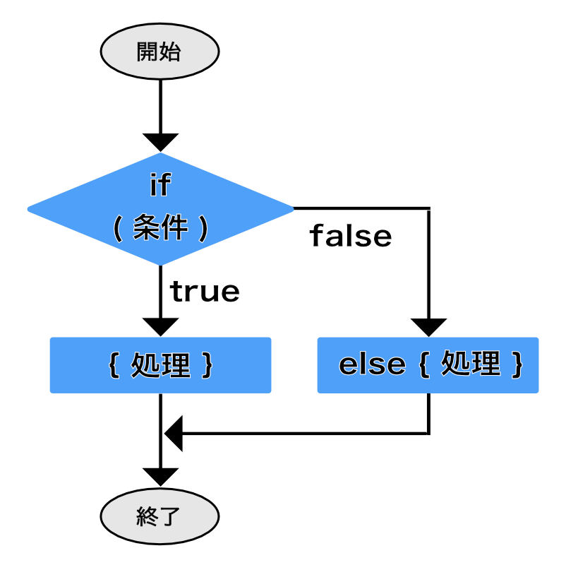
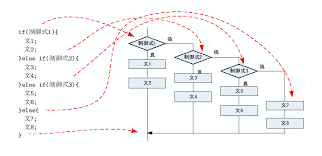
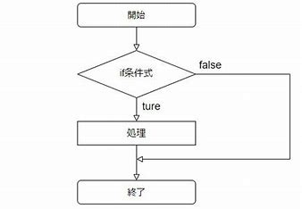
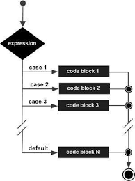
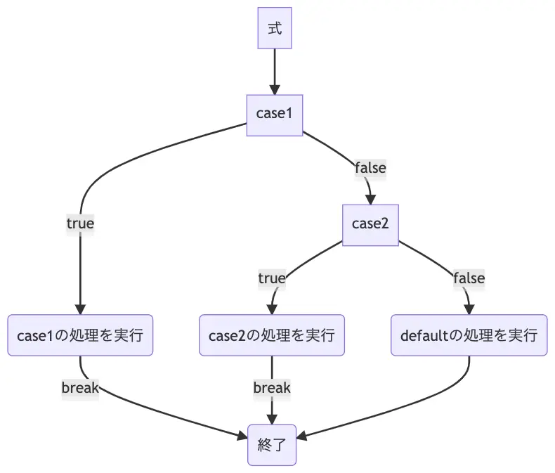
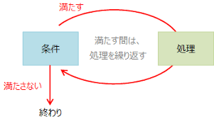
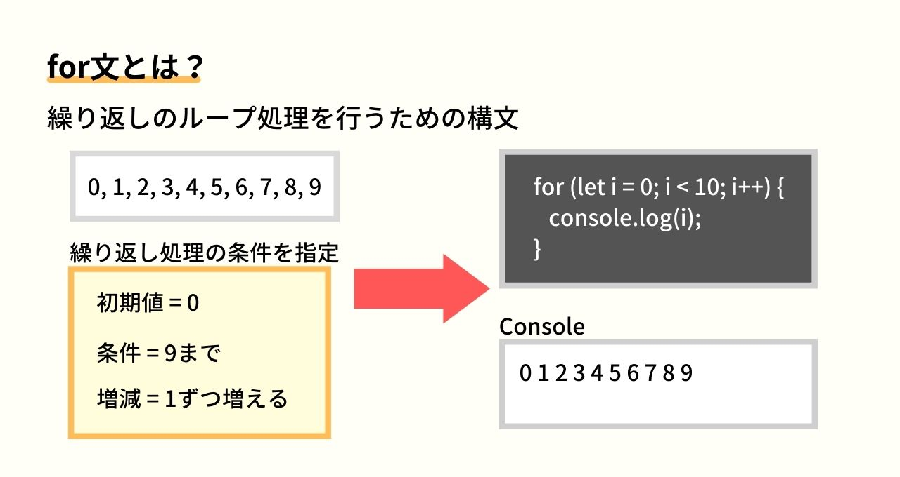
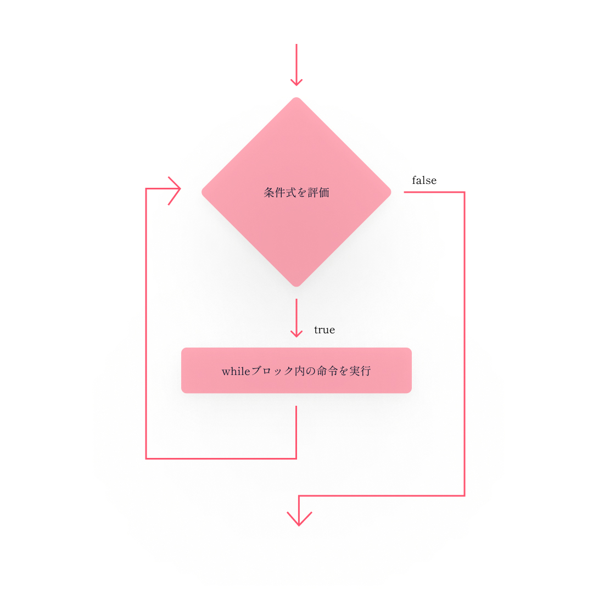
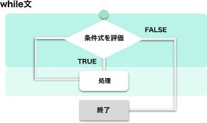
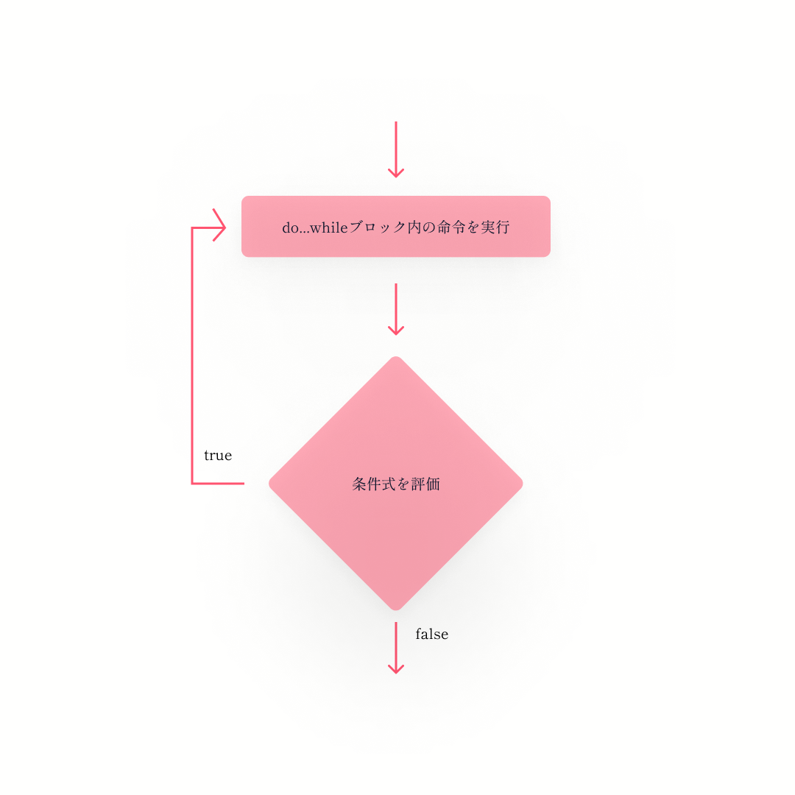

# 第4章: 制御フロー – プログラムの流れを操る

前回は、計算や比較に使う「演算子」と、たくさんの情報をまとめて扱える「配列」や「オブジェクト」という便利な道具について学びましたね。これで、プログラムで扱うデータの種類や操作の幅がぐっと広がったはずです！

さて今回は、いよいよプログラムの流れを自分でコントロールする方法、「**制御フロー**」について学んでいきます。「もし○○だったら△△する、そうでなければ□□する」といった条件による判断や、「この処理を10回繰り返す」といった反復処理は、プログラミングの基本中の基本であり、これらを使いこなせるようになると、作れるプログラムの複雑さや面白さが格段にアップします！

最初は少し頭を使うかもしれませんが、パズルのように条件を組み立てたり、処理を繰り返したりするのはとても楽しいですよ。この章をマスターすれば、あなたの書くJavaScriptコードが、まるで生き物のように状況に応じて賢く動くようになるはずです。さあ、プログラムの流れを自在に操る冒険に出かけましょう！

## 目次

1. 条件分岐 – もしも…だったら？
    * `if...else if...else` 文 – 基本の条件判断
    * `switch` 文 – たくさんの選択肢があるときに便利
        * `case` と `break` – スイッチの行き先と停止線
        * フォールスルーって何？ – `break` を忘れると…？
    * 三項演算子 – シンプルな条件分岐のショートカット
2. 繰り返し処理 (ループ) – 同じことを何度も！
    * ループってどんなイメージ？ (フローチャートで見てみよう)
    * `for` ループ – 回数が決まっている繰り返し
    * `while` ループ – 条件が満たされている間の繰り返し
    * `do...while` ループ – とりあえず1回はやってみる繰り返し
    * 無限ループにご注意！ – 終わらないループの恐怖
3. ループの達人になろう！ – ループの制御
    * `break` – ループから脱出！
    * `continue` – 今回はスキップして次へ！
    * (ちょっとだけ紹介) ラベル付きステートメント – 奥の手
4. コレクションとループの合わせ技
    * `for...in` ループ – オブジェクトの中身を順番に見てみよう
        * 配列に `for...in` は要注意！
    * `for...of` ループ (ES6+) – 配列や文字列の要素を一つずつ取り出す
5. 演習例で腕試し！

---

## 1. 条件分岐 – もしも…だったら？

プログラムを書いていると、「もしこの条件が満たされたら、この処理をしたい。でも、そうでなければ、別の処理をしたい」という場面がたくさん出てきます。そんなときに使うのが**条件分岐**です。

### `if...else if...else` 文 – 基本の条件判断

一番基本的な条件分岐の形が `if` 文です。

```javascript
let userAge = 18;

if (userAge >= 20) {
  console.log("あなたは成人です。");
} else {
  console.log("あなたは未成年です。");
}
// 出力: あなたは未成年です。

let score = 85;
if (score >= 90) {
  console.log("素晴らしい！S評価です。");
} else if (score >= 80) {
  console.log("良いですね！A評価です。");
} else if (score >= 70) {
  console.log("まずまずです。B評価です。");
} else {
  console.log("もう少し頑張りましょう。C評価です。");
}
// 出力: 良いですね！A評価です。
```

* `if (条件式)`: カッコの中の**条件式**が `true` (真) と評価された場合に、直後の `{}` ブロック内の処理が実行されます。
* `else if (別の条件式)`: (任意) 直前の `if` や `else if` の条件が `false` (偽) で、かつこの `else if` の条件式が `true` の場合に実行されます。いくつでも繋げられます。
* `else`: (任意) これまでの `if` や `else if` のどの条件も `false` だった場合に実行されます。





elseはなくても良いです。



**ポイント:** 条件式には、前回学んだ比較演算子 (`>`, `<`, `===` など) や論理演算子 (`&&`, `||`, `!`) を組み合わせて、複雑な条件を作ることもできますよ。

```javascript
let isLoggedIn = true;
let userRole = "admin";

if (isLoggedIn && userRole === "admin") {
  console.log("管理者としてログイン中です。全ての機能にアクセスできます。");
} else if (isLoggedIn) {
  console.log("一般ユーザーとしてログイン中です。");
} else {
  console.log("ログインしていません。");
}
// 出力: 管理者としてログイン中です。全ての機能にアクセスできます。
```

### `switch` 文 – たくさんの選択肢があるときに便利

`if...else if...else` 文でも複数の条件を扱えますが、ある一つの変数の値によって処理を細かく分けたい場合、`switch` 文を使うとコードがスッキリすることがあります。

```javascript
let signalColor = "yellow"; // "red", "blue", "yellow" などを試してみてください

switch (signalColor) {
  case "red":
    console.log("止まれ！");
    break; // これがないと次のcaseも実行されてしまう！
  case "yellow":
    console.log("注意して進め！");
    break;
  case "blue": // 青信号は国際的にはgreenですが、日本ではblueと表現されることも
  case "green":
    console.log("進め！");
    break;
  default: // どのcaseにも当てはまらない場合
    console.log("信号の色が認識できません。");
    break;
}
// signalColorが "yellow" の場合、出力: 注意して進め！
```

* `switch (式)`: カッコの中の**式** (通常は変数) の値を評価します。
* `case 値:`: `switch` の式の値が、この `case` の `値` と厳密に等しい (`===`) 場合に、ここから処理が実行されます。
* `break;`: `switch` 文の処理をここで終了させます。**これを書き忘れると、次の `case` の処理も続けて実行されてしまう（フォールスルー）ので、基本的には各 `case` の最後に書くようにしましょう！**
* `default:`: (任意) どの `case` にも一致しなかった場合に実行されます。




#### `case` と `break` – スイッチの行き先と停止線

`switch` 文は、電車のポイント切り替えのようなものだとイメージしてください。`switch` の式の結果によって、どの `case` という線路に進むかが決まります。そして、`break` は「ここで停車！」という合図です。もし `break` がないと、電車は止まらずに次の駅（次の `case`）まで進んでしまいます。

#### フォールスルーって何？ – `break` を忘れると…？

`break` を意図的に書かないことで、複数の `case` で同じ処理を行わせるテクニックを**フォールスルー (fall-through)** と言います。上の信号機の例で `case "blue":` の後に `break` がないのは、`"blue"` の場合も `"green"` の場合も同じ「進め！」という処理をしたいからです。

```javascript
let fruit = "apple";

switch (fruit) {
  case "apple":
  case "orange":
  case "banana":
    console.log(`${fruit}は果物です。`);
    // ここに break がないので、もし fruit が "apple" なら次の case も評価される...
    // ...わけではなく、case の条件に一致したら、そこから break に出会うか switch の終わりまで実行される。
    break; // ここで止まる
  case "carrot":
  case "potato":
    console.log(`${fruit}は野菜です。`);
    break;
  default:
    console.log(`${fruit}が何か分かりません。`);
}
// fruit が "apple" の場合、出力: appleは果物です。
```

意図的なフォールスルーは便利なこともありますが、うっかり `break` を書き忘れてバグの原因になることも多いので、使うときは「本当にフォールスルーさせたいんだな」と分かるようにコメントを残すなど、注意して使いましょう。

### 三項演算子 – シンプルな条件分岐のショートカット

もし条件が非常にシンプルで、「条件がtrueならA、falseならB」というような処理をしたい場合、**三項演算子 (Conditional Ternary Operator)** を使うと `if` 文よりも短く書けます。

構文: `条件式 ? trueの場合の値 : falseの場合の値`

```javascript
let age = 20;
let message = (age >= 20) ? "成人です" : "未成年です";
console.log(message); // 出力: 成人です

let score = 75;
let grade = (score >= 80) ? "A" : (score >= 60) ? "B" : "C";
console.log(`あなたの評価は${grade}です。`); // 出力: あなたの評価はBです。
```

三項演算子は便利ですが、ネストしすぎたり複雑な条件になったりすると、逆にコードが読みにくくなることがあります。**個人的には、条件が複雑になる場合は無理せず `if...else` 文を使う方が、後から見たときに分かりやすいコードになると思います。** 可読性（コードの読みやすさ）はとても大事ですよ！

---

## 2. 繰り返し処理 (ループ) – 同じことを何度も

プログラムでは、同じような処理を何度も繰り返したい、という場面がよくあります。例えば、「リストの各項目に対して同じ操作をしたい」「1から100までの数字を順番に表示したい」などです。このような繰り返し処理を実現するのが**ループ (Loop)** です。

### ループってどんなイメージ？ (フローチャートで見てみよう)

ループは、特定の条件が満たされている間、同じ処理のブロックをぐるぐると回り続けるイメージです。



JavaScriptには、主に3種類のループ構文があります。

### `for` ループ – 回数が決まっている繰り返し

`for` ループは、繰り返す回数があらかじめ分かっている場合や、特定の範囲の数値を順番に使いたい場合によく使われます。

構文: `for (初期化式; 条件式; 更新式) { /* 繰り返す処理 */ }`

1. **初期化式**: ループが始まる前に一度だけ実行されます。主にループカウンター変数の初期化に使います。
2. **条件式**: 各繰り返しの前に評価されます。この式が `true` の間、ループが続きます。`false` になるとループが終了します。
3. **繰り返す処理**: 条件式が `true` の場合に実行される処理ブロックです。
4. **更新式**: 処理ブロックが実行された後に毎回実行されます。主にループカウンター変数の更新に使います。
5. その後、再び2.の条件式の評価に戻ります。

```javascript
// 1から5までの数字を表示
for (let i = 1; i <= 5; i++) {
  console.log(i);
}
// 出力:
// 1
// 2
// 3
// 4
// 5

// 配列の要素を順番に表示 (これは後で出てくる for...of の方がもっと簡単に書けます)
const fruits = ["りんご", "バナナ", "みかん"];
for (let i = 0; i < fruits.length; i++) {
  console.log(fruits[i]);
}
// 出力:
// りんご
// バナナ
// みかん
```



### `while` ループ – 条件が満たされている間の繰り返し

`while` ループは、特定の条件が `true` である限り、処理を繰り返します。繰り返す回数が事前に分からない場合などに使われます。

構文: `while (条件式) { /* 繰り返す処理 */ }`

1. **条件式**: ループの各繰り返しの前に評価されます。この式が `true` の間、ループが続きます。
2. **繰り返す処理**: 条件式が `true` の場合に実行される処理ブロックです。
3. 処理ブロックが終わると、再び1.の条件式の評価に戻ります。

```javascript
let count = 0;
while (count < 3) {
  console.log("現在のカウント:", count);
  count++; // この行がないと無限ループになるので注意！
}
// 出力:
// 現在のカウント: 0
// 現在のカウント: 1
// 現在のカウント: 2

console.log("ループ終了後のカウント:", count); // 出力: ループ終了後のカウント: 3
```

**注意:** `while` ループでは、ループ内の処理でいつか条件式が `false` になるようにしないと、**無限ループ**に陥ってしまう可能性があります。カウンター変数を更新し忘れるなどがよくある原因です。




### `do...while` ループ – とりあえず1回はやってみる繰り返し

`do...while` ループは `while` ループと似ていますが、**条件式の評価が処理ブロックの後に行われる**点が異なります。そのため、条件式の結果に関わらず、処理ブロックは**最低でも1回は必ず実行されます**。

構文: `do { /* 繰り返す処理 */ } while (条件式);`

1. **繰り返す処理**: まず処理ブロックが実行されます。
2. **条件式**: 処理ブロックの後に評価されます。この式が `true` なら、再び1.の処理ブロックに戻ります。`false` ならループを終了します。

```javascript
let num = 5;
do {
  console.log("do...whileループ内のnum:", num);
  num--;
} while (num > 5); // 条件は最初からfalseだが、doブロックは1回実行される
// 出力: do...whileループ内のnum: 5

let input;
do {
  // input = prompt("何か入力してください（'exit'で終了）："); // ブラウザ環境で試す場合
  // console.log("入力された文字:", input);
} while (input !== "exit" && input !== null); // Node.js環境ではpromptは使えないのでコメントアウト

// (参考) Node.jsでユーザー入力を受け取るのは少し複雑なので、ここでは概念だけ。
// 実際の入力処理は、readlineモジュールなどを使います。
```



`do...while` は、例えば「ユーザーに何か入力してもらい、それが特定の条件を満たすまで繰り返す（ただし、最初は必ず入力してもらう）」といった場面で使えます。

### 無限ループにご注意！ – 終わらないループの恐怖

ループの条件式がいつまでも `false` にならなかったり、ループを抜ける処理がなかったりすると、プログラムは永遠に同じ処理を繰り返し続ける**無限ループ**という状態に陥ります。

```javascript
// ！！！注意：以下のコードは無限ループを引き起こします！！！
// 実行するとブラウザが固まったり、Node.jsのプロセスが止まらなくなったりします。
// 試す場合は、どうやって止めるかを知っておいてください。
// (Node.jsなら Ctrl+C, ブラウザならタブを閉じるかタスクマネージャーで強制終了)

/*
let i = 0;
while (true) { // 条件が常にtrueなので無限ループ
  console.log("無限ループ中..." + i);
  i++;
  // if (i > 10000) break; // こういう脱出条件がないと止まらない
}
*/
```

無限ループは、CPU資源を大量に消費し、ブラウザをフリーズさせたり、サーバーをダウンさせたりする原因にもなり得るので、ループの条件や終了条件は慎重に設計しましょう。もし意図せず無限ループに陥ってしまったら、Node.jsの場合はターミナルで `Ctrl + C` を押すことで強制的にプログラムを停止できます。ブラウザの場合は、そのタブを閉じるか、それでもダメならブラウザ自体をタスクマネージャーなどから終了させる必要があります。

---

## 3. ループの達人になろう！ – ループの制御

ループの途中で、「もうこのループは終わりにしたい！」とか「今回の処理だけ飛ばして次に進みたい！」という場合があります。そんなときに使うのが、ループ制御文です。

### `break` – ループから脱出

`break` 文は、`switch` 文だけでなく、`for`, `while`, `do...while` ループの中でも使えます。ループ内で `break` が実行されると、そのループは即座に終了し、ループの次の処理に進みます。

```javascript
for (let i = 0; i < 10; i++) {
  if (i === 5) {
    console.log("iが5になったのでループを抜けます。");
    break; // ループを終了
  }
  console.log("現在のi:", i);
}
// 出力:
// 現在のi: 0
// 現在のi: 1
// 現在のi: 2
// 現在のi: 3
// 現在のi: 4
// iが5になったのでループを抜けます。
```

### `continue` – 今回はスキップして次へ

`continue` 文は、ループ内で実行されると、その回の残りの処理をスキップし、すぐに次の繰り返し処理（`for`なら更新式の実行と条件式の評価、`while`なら条件式の評価）に進みます。

```javascript
// 0から9までの数字のうち、偶数だけを表示する
for (let i = 0; i < 10; i++) {
  if (i % 2 !== 0) { // iが奇数だったら
    continue; // 今回の処理をスキップして、次のiへ
  }
  console.log("偶数:", i);
}
// 出力:
// 偶数: 0
// 偶数: 2
// 偶数: 4
// 偶数: 6
// 偶数: 8
```

### (ちょっとだけ紹介) ラベル付きステートメント – 奥の手

通常、`break` や `continue` は、それらが書かれている一番内側のループにしか作用しません。もし、ネストした（入れ子になった）ループの外側のループまで一気に抜けたい、といった特殊なケースでは、**ラベル付きステートメント**という機能を使うこともできます。

```javascript
outerLoop: // "outerLoop" というラベルを付ける
for (let i = 0; i < 3; i++) {
  console.log("外側ループ:", i);
  innerLoop: // "innerLoop" というラベル
  for (let j = 0; j < 3; j++) {
    console.log("  内側ループ:", j);
    if (i === 1 && j === 1) {
      console.log("    条件に一致！外側のループを抜けます。");
      break outerLoop; // outerLoopラベルが付いたループを抜ける
    }
    if (i === 2 && j === 0) {
      console.log("    iが2, jが0なので、内側ループの今回の処理をスキップします。");
      continue innerLoop; // innerLoopの次の繰り返しへ
    }
  }
}
// 出力:
// 外側ループ: 0
//   内側ループ: 0
//   内側ループ: 1
//   内側ループ: 2
// 外側ループ: 1
//   内側ループ: 0
//   内側ループ: 1
//     条件に一致！外側のループを抜けます。
```

ラベル付きステートメントは、コードが複雑になりがちなので、あまり頻繁には使われません。**「こんなこともできるんだな」くらいに留めておいて、基本的には使わなくても済むようなシンプルなループ構造を心がけるのが良いでしょう。**

---

## 4. コレクションとループの合わせ技

配列やオブジェクトといった「コレクション（データの集まり）」の中身を一つずつ取り出して処理したい、ということは非常によくあります。そんなときに便利なループ構文を見ていきましょう。

### `for...in` ループ – オブジェクトの中身を順番に見てみよう

`for...in` ループは、オブジェクトが持つ**列挙可能なプロパティ名**を順番に取り出して処理するのに使います。

```javascript
const user = {
  name: "高専太郎",
  age: 20,
  department: "情報工学科"
};

for (let key in user) {
  // key にはプロパティ名 ("name", "age", "department") が順番に入る
  console.log(`プロパティ名: ${key}, 値: ${user[key]}`);
}
// 出力 (順序は保証されないことがあります):
// プロパティ名: name, 値: 高専太郎
// プロパティ名: age, 値: 20
// プロパティ名: department, 値: 情報工学科
```

**注意:** `for...in` ループでオブジェクトのプロパティを列挙する際、その順序は必ずしも定義された順序になるとは限りません。また、オブジェクトのプロトタイプチェーン（継承元）にあるプロパティまで列挙してしまう可能性があります。オブジェクト自身のプロパティだけを対象にしたい場合は、`hasOwnProperty()` メソッドと組み合わせて使うことがあります（これは少し高度な話なので、また後で触れます）。

#### 配列に `for...in` は要注意

`for...in` ループは配列に対しても使えますが、これは**非推奨**です。なぜなら、

1. 配列のインデックス（`0`, `1`, `2`...）だけでなく、もし配列にカスタムプロパティが追加されていた場合、それも列挙してしまう可能性があります。
2. インデックスは文字列として扱われることがあります。
3. 処理の順序が保証されない場合があります（ほとんどの場合はインデックス順になりますが）。

```javascript
const numbers = [10, 20, 30];
numbers.customProperty = "これはカスタムプロパティ"; // 配列にプロパティを追加

console.log("for...in で配列をループ (非推奨):");
for (let index in numbers) {
  console.log(`インデックス: ${index}, 型: ${typeof index}, 値: ${numbers[index]}`);
}
// 出力例 (環境によって customProperty の位置が変わる可能性あり):
// インデックス: 0, 型: string, 値: 10
// インデックス: 1, 型: string, 値: 20
// インデックス: 2, 型: string, 値: 30
// インデックス: customProperty, 型: string, 値: これはカスタムプロパティ

// 配列の要素を順番に処理したい場合は、次に紹介する for...of や、
// 従来の for ループ (for (let i = 0; i < array.length; i++))、
// または配列のメソッド (forEach など、後の章で学びます) を使いましょう。
```

**結論：配列の要素を順番に処理したい場合は、`for...in` ではなく、次に紹介する `for...of` ループや、通常の `for` ループ、または配列専用のメソッド（`forEach`など、後の章で詳しく学びます）を使いましょう！**

### `for...of` ループ (ES6+) – 配列や文字列の要素を一つずつ取り出す

ES2015 (ES6) で導入された `for...of` ループは、**イテラブル (iterable) なオブジェクト**（反復可能なオブジェクト、例えば配列や文字列、Map, Setなど）の各要素を順番に取り出して処理するのに非常に便利です。

```javascript
const colors = ["red", "green", "blue"];
console.log("配列の要素をfor...ofでループ:");
for (const color of colors) {
  // color には配列の要素 ("red", "green", "blue") が順番に入る
  console.log(color);
}
// 出力:
// red
// green
// blue

const message = "こんにちは";
console.log("\n文字列の文字をfor...ofでループ:");
for (const char of message) {
  // char には文字列の各文字 ("こ", "ん", "に", "ち", "は") が順番に入る
  console.log(char);
}
// 出力:
// こ
// ん
// に
// ち
// は
```

`for...of` ループは、シンプルで直感的に配列や文字列の各要素にアクセスできるため、非常に人気があります。特に配列の要素を一つずつ処理したい場合には、これが最も推奨される方法の一つです。
`for...of` は、絵文字のような複数のコードユニットで構成される文字（サロゲートペア）も正しく1文字として扱ってくれるというメリットもあります。

---

## ✏️ 本日の演習

さあ、今日学んだ制御フローを使って、いくつかの簡単なプログラムを書いてみましょう！

1. **FizzBuzz問題に挑戦！**
    * 1から30までの数字を順番に表示するプログラムを書いてください。
    * ただし、その数字が3で割り切れる場合は数字の代わりに "Fizz" と表示してください。
    * 5で割り切れる場合は数字の代わりに "Buzz" と表示してください。
    * 3でも5でも割り切れる場合は数字の代わりに "FizzBuzz" と表示してください。
    * ヒント: `for` ループと `if...else if...else` 文、そして剰余演算子 `%` を使うと良いでしょう。
2. **配列の要素の合計を計算しよう！**
    * 数値が入った配列 `const numbers = [10, 25, 8, 42, 17];` を用意します。
    * `for...of` ループ (または通常の `for` ループ) を使って、この配列の全ての要素の合計値を計算し、コンソールに表示してください。
    * ヒント: 合計値を保存しておくための変数をループの外で初期化し、ループの中で各要素をその変数に足し込んでいくと良いでしょう。
3. **(おまけ) 九九の表を作ってみよう！**
    * `for` ループをネスト（入れ子に）して、九九の表（1の段から9の段まで）をコンソールに表示するプログラムを書いてみましょう。
    * 表示形式の例: `1 x 1 = 1`, `1 x 2 = 2`, ..., `9 x 9 = 81`
    * ヒント: 外側のループで段の数 (1から9)、内側のループでかける数 (1から9) を変化させます。

---
---
---

### 演習の解答例

```javascript
// 演習1: FizzBuzz問題
console.log("演習1: FizzBuzz問題");
for (let i = 1; i <= 30; i++) {
  if (i % 3 === 0 && i % 5 === 0) { // i % 15 === 0 でもOK
    console.log("FizzBuzz");
  } else if (i % 3 === 0) {
    console.log("Fizz");
  } else if (i % 5 === 0) {
    console.log("Buzz");
  } else {
    console.log(i);
  }
}
console.log("---");

// 演習2: 配列の要素の合計を計算
console.log("演習2: 配列の要素の合計");
const numbersForSum = [10, 25, 8, 42, 17];
let sum = 0;
for (const num of numbersForSum) {
  sum += num; // sum = sum + num; と同じ
}
console.log("配列numbersForSumの合計:", sum); // 出力: 102
console.log("---");

// 演習3: (おまけ) 九九の表
console.log("演習3: 九九の表");
for (let i = 1; i <= 9; i++) { // 段の数 (1の段から9の段まで)
  console.log(`--- ${i}の段 ---`);
  for (let j = 1; j <= 9; j++) { // かける数 (1から9まで)
    console.log(`${i} x ${j} = ${i * j}`);
  }
}
console.log("---");
```

---

## まとめと次回予告

お疲れ様でした！今回は、プログラムの流れをコントロールするための「制御フロー」について、条件分岐 (`if`, `switch`, 三項演算子) と繰り返し処理 (`for`, `while`, `do...while`, `for...in`, `for...of`) を学びました。

* **条件分岐**を使えば、状況に応じて異なる処理を実行できること。
* **ループ**を使えば、同じ処理を効率的に繰り返せること。
* `break` や `continue` でループの挙動を細かく制御できること。
* `for...in` はオブジェクトのプロパティ列挙に、`for...of` は配列などのイテラブルなオブジェクトの要素列挙に便利であること。

これらの制御フロー構文は、プログラミングのあらゆる場面で使われる非常に重要なものです。最初はどの構文をいつ使えばいいか迷うかもしれませんが、実際に色々なコードを読んだり書いたりしていくうちに、自然と使い分けができるようになってきますよ。演習問題などを通して、ぜひ自分の手で試してみてくださいね。

次回は、処理をひとまとめにして名前を付け、何度も再利用できるようにする「**関数**」について詳しく学びます。関数は、プログラムを部品化し、より整理された、読みやすいコードを書くための強力なツールです。また、変数が使える範囲である「スコープ」や、もしもの時のための「エラー処理」についても触れていきます。プログラミングの世界がさらに広がりますので、お楽しみに！
