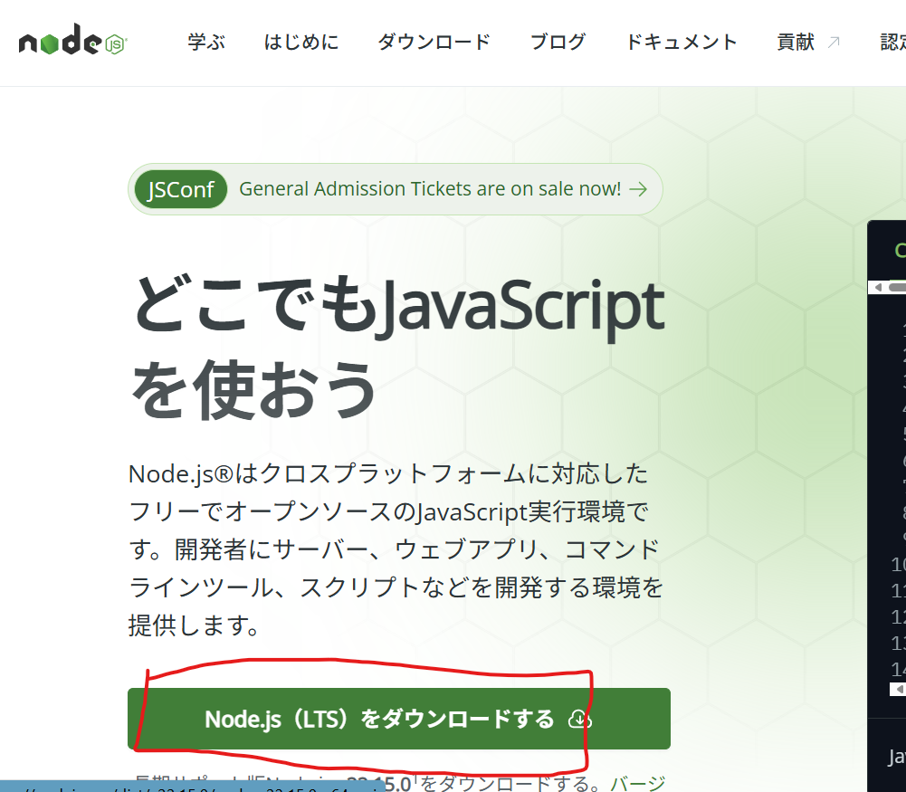
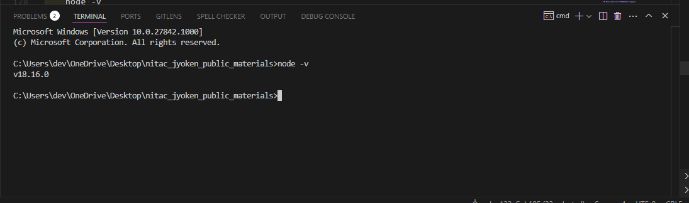

# 序章: JavaScript学習の冒険へ出発！ – 準備と心構え

ここでは、ウェブアプリケーションを作るための第一歩、JavaScriptの学習を一緒に進めていきます。JavaScriptは、ウェブページをインタラクティブにするだけでなく、ゲームを作ったり、サーバーサイドで動いたりと、本当にたくさんのことができるパワフルな言語なんです。

ここでは、実際にJavascriptの学習を進める前の、準備や心構えについて解説していきます。この部分は、後々本当に大切になる部分です。最初は、少し面倒で、「本当に必要なの？」と思うかもしれませんが、もし困ったときにはここに戻ってくるとヒントになることもあると思います。

## 目次

1. はじめの一歩：なぜJavaScriptを学ぶの？この冒険の地図を広げよう！
2. 冒険の装備を整えよう！学習環境のセットアップ
    * 相棒となるテキストエディタ：Visual Studio Code (VSCode)
    * ウェブの世界を映す鏡：ウェブブラウザと開発者ツール
    * JavaScriptの実行エンジン：Node.js
3. 書いたコードは宝物！バージョン管理システムGitとGitHub入門
    * コードのタイムマシン：Gitの基本
    * コードの保管庫＆共同作業の拠点：GitHub
4. 迷子のしるべ：デバッグの心構えと基本スキル
    * 名探偵の虫眼鏡：`console.log()`
    * エラーは道しるべ：エラーメッセージを恐れない！
    * 強力な捜査ツール：ブラウザ開発者ツールのデバッガ
    * VSCodeデバッガとの連携
    * 問題解決のコツ：問題を小さく分けて考えよう
5. 冒険の心得：学習の進め方と心構え
    * 一歩ずつ、着実に進もう
    * 「習うより慣れろ！」とにかく手を動かそう
    * 小さな「できた！」が大きな力に
    * 信頼できる情報源を活用しよう
    * 困ったときは仲間を頼ろう！コミュニティと質問のマナー
    * 「なぜ？」は魔法の呪文：探求心を持ち続けよう

---

## 1. はじめの一歩：なぜJavaScriptを学ぶの？この冒険の地図を広げよう

**学習プランで目指すこと：**

* **ウェブページに動きをつけられるようになる！**: ボタンを押したらメッセージが変わる、画像がスライドする、そんな「おっ！」と思わせる動きを自分で作れるようになります。
* **ウェブアプリケーションの仕組みがわかるようになる！**: 普段使っているウェブサービスがどうやって動いているのか、その裏側を少し覗けるようになります。
* **プログラミング的思考が身につく！**: 問題を解決するための論理的な考え方や、効率的な手順を考える力が養われます。これはプログラミング以外の場面でも役立つ、一生もののスキルですよ！
* **そして、ゆくゆくはJavaScript専門家へ！**: このプランを最後までやり遂げれば、本格的なウェブ開発プロジェクトに参加できるだけの力がついているはずです。

各段階でどんなスキルが身につくのか、どんなことができるようになるのか、ワクワクしながら一緒に進んでいきましょう！

**これからの資料は網羅的に作りました。初心者でも理解はできますが、本当に時間がかかって大変だと思います。**適当にプログラミングしたいのだったら、全部流し読みして、演習だけでもやってもらえれば大丈夫なはずです。とはいえ、真のエンジニアになりたい人は一個一個理解しながら（時には分からない言葉を、調べたり、人に聞いたりしながら）進めて行ってほしいです。

---

## 2. 冒険の装備を整えよう！学習環境のセットアップ

### 相棒となるテキストエディタ：Visual Studio Code (VSCode)

プログラムのコードは、専用の「テキストエディタ」というソフトを使って書きます。世の中には色々なエディタがありますが、ここでは世界中の多くの開発者に愛用されている**Visual Studio Code (VSCode)** を使います。無料で高機能、そして何より使いやすいのが魅力です！

**VSCodeのインストール手順:**

1. まずはVSCodeの公式サイトからインストーラーをダウンロードしましょう。
    * 公式サイト: [https://code.visualstudio.com/](https://code.visualstudio.com/)
    * お使いのOS（Windows, Mac, Linux）に合ったものをダウンロードしてくださいね。
    * !VSCode公式サイトのダウンロードページ
2. ダウンロードしたインストーラーを実行します。
    * 基本的には「次へ」や「同意する」を選んで進めばOKです。
    * **ポイント:** Windowsのインストール時、「PATHへの追加」という項目があったら**必ず**チェックを入れてください。これをしておくと、後々コマンドプロンプトやターミナルからVSCodeを簡単に起動できるようになって便利です。
    * !VSCodeインストーラーのPATH設定画面例
3. インストールが完了したら、VSCodeを起動してみましょう！かっこいい画面が表示されれば成功です。

**VSCodeの基本操作とターミナル連携:**

VSCodeは多機能ですが、最初はこの2つを覚えておけば大丈夫。

* **フォルダを開く**: プログラミングでは、関連するファイルを一つのフォルダにまとめて管理します。VSCodeのメニューから「ファイル」>「フォルダーを開く...」で、作業用のフォルダを開きましょう。デスクトップに `javascript_study` みたいな名前でフォルダを作っておくと良いですよ。
  * 
  * 
* **ターミナル**: VSCodeには「ターミナル」という、コンピュータに直接命令を送るための画面が内蔵されています。プログラムを実行したり、後で紹介するGitコマンドを使ったりするのに使います。メニューの「ターミナル」>「新しいターミナル」で開けます。
  

**VSCodeをさらにパワーアップ！推奨拡張機能:**

VSCodeは「拡張機能」を追加することで、さらに便利になります。自転車にカゴやライトをつけるようなイメージですね。ここでは、JavaScript学習に役立つ3つの拡張機能を紹介します。左側の四角いアイコン（拡張機能ビュー）から検索してインストールしてください。


* **Live Server**: 「リアルタイムプレビューの魔法。」
  * HTMLファイルを保存するたびに、ブラウザの表示を自動で更新してくれます。いちいち手動でリロードする手間が省けて、めちゃくちゃ便利！
  * インストール後、HTMLファイルを開いた状態で右下の「Go Live」ボタンを押すと起動します。
  * 
* **ESLint**: 「コードの文法・品質チェッカー先生。」
  * JavaScriptのコードを書いているそばから、文法的な間違いや、あまり良くない書き方（「もっとこう書いた方がいいよ」という提案）を教えてくれます。バグを未然に防いだり、綺麗なコードを書く習慣をつけたりするのに役立ちます。
  * 設定ファイル（`.eslintrc.js`など）を作ることで、チェックのルールを細かくカスタマイズできますが、最初はデフォルトの設定でも十分です。もしチームで開発するようになったら、ルールを統一するとコードの品質が保てますよ。
* **Prettier - Code formatter**: 「コード整形職人。」
  * あなたが書いたコードのインデント（字下げ）やスペース、改行などを、設定に基づいて自動で綺麗に整えてくれます。コードが見やすくなるのはもちろん、チーム開発でコードの見た目を統一するのにも役立ちます。
  * **ポイント:** VSCodeの設定で「Format On Save」（保存時に自動整形）を有効にしておくのが超おすすめです！設定画面（歯車アイコン > 設定）で "Format On Save" と検索してチェックを入れてください。これで、ファイルを保存するたびにPrettierが自動でコードを綺麗にしてくれます。もう手放せません！

### ウェブの世界を映す鏡：ウェブブラウザと開発者ツール

JavaScriptは主にウェブブラウザ上で動きます。皆さんが普段インターネットを見るときに使っているアレですね。開発には**Google Chrome**か**Microsoft Edge**がおすすめです。どちらも高機能な「開発者ツール」が内蔵されていて、JavaScriptのデバッグ（エラー探しや動作確認）に非常に役立ちます。

**開発者ツールの基本操作:**

開発者ツールは、ウェブページ上で右クリックして「検証」や「要素を調査」などを選ぶか、キーボードショートカット（Windowsなら`F12`キー、Macなら`Option + Command + I`など）で開けます。

* **コンソール (Console) タブ**: JavaScriptのエラーメッセージが表示されたり、後述する`console.log()`で値を確認したりする場所です。JavaScript学習では一番お世話になるタブかもしれません。
* **要素 (Elements / Inspector) タブ**: 表示されているウェブページのHTML構造やCSSスタイルを確認・編集できます。「この文字の色、なんでこうなってるんだろう？」と思ったときに便利です。
* **ソース (Sources) タブ**: 読み込まれているJavaScriptファイルの中身を見たり、後で説明する「デバッガ」を使ってプログラムの動きを一行ずつ追ったりできます。


### JavaScriptの実行エンジン：Node.js

「JavaScriptってブラウザで動くんじゃないの？」と思った人もいるでしょう。その通りですが、実は**Node.js**というものを使うと、ブラウザの外でもJavaScriptを動かすことができるんです！

**Node.jsとは？**

簡単に言うと、「パソコン上で直接JavaScriptを実行するための環境」です。これがあると、ウェブサイトの裏側（サーバー）をJavaScriptで動かしたり、開発を助ける便利な道具（ビルドツールなど）を使ったりできるようになります。

**Node.jsのインストール:**

1. Node.jsの公式サイトからインストーラーをダウンロードします。
    * 公式サイト: [https://nodejs.org/](https://nodejs.org/)
    * **ポイント:** 「**LTS**」と書かれているバージョンをダウンロードしましょう。LTSはLong Term Supportの略で、長期間サポートされる安定版です。
    * 
2. ダウンロードしたインストーラーを実行します。
    * 基本的には「Next」や「I accept the agreement」を選んで進めばOKです。
    * このNode.jsでは、適当に「Next」を押してもらえれば、オッケーですあ、他のソフト等のインストール中に「Add to PATH」やそれに類する項目があったら、**必ず**チェックされていることを確認してください！これを忘れると、後でコマンドプロンプトやターミナルから`node`コマンドが使えなくて本当に困ります。（もし忘れてしまったら、再インストールするか、手動で環境変数PATHを設定する必要がありますが、それはちょっと面倒です…）
    * !Node.jsインストーラーのPATH設定画面例
3. インストールが完了したら、VSCodeのターミナルやコマンドプロンプトで以下のコマンドを打って、バージョンが表示されれば成功です。

    ```bash
    node -v
    npm -v
    ```

    * `node -v` はNode.js本体のバージョン、`npm -v` はNode.jsと一緒にインストールされる「npm (Node Package Manager)」というツールのバージョンを表示します。npmは、便利なJavaScriptライブラリ（部品）を管理するのに使います。これはまた後で詳しく説明しますね。
    *   

**簡単なJavaScriptファイルの実行方法:**

1. VSCodeで新しいファイルを作り、例えば `hello.js` という名前で保存します。
2. ファイルに以下のように書いてみましょう。

    ```javascript
    // filepath: (どこかのフォルダ)/hello.js
    console.log("Hello from Node.js!");
    ```

    ここで、ファイルを保存することを忘れない。Control + S (Windows) または Command + S (Mac) で保存できます。

3. VSCodeのターミナルで、`hello.js` を保存したフォルダに移動していることを確認し、以下のコマンドを実行します。

    ```bash
    node hello.js
    ```

    ターミナルに "Hello from Node.js!" と表示されれば大成功です！

**Node.jsの役割の展望:**

「今は簡単なJS実行に使うけど、実はウェブサイトの裏側（、企業や大学のでっかいパソコン上のサーバー）を動かしたり、開発を助ける便利な道具（ビルドツール）を動かしたりする、とてもパワフルなやつなんだ。その話はまたずっと後でね！」という感じで、今は「ブラウザ以外でもJavaScriptを動かせるんだな」くらいに思っておけばOKです。

---

## 3. 書いたコードは宝物！バージョン管理システムGitとGitHub入門

プログラミングをしていると、「あー！昨日までは動いてたのに、どこを触ったら動かなくなったんだっけ…？」「前の状態に戻したい！」なんてことがしょっちゅう起こります。そんな時に役立つのが「バージョン管理システム」です。

### コードのタイムマシン：Gitの基本

**Git (ギット)** は、ファイルの変更履歴を記録・管理してくれるシステムです。「あの時の状態に戻りたい！」とか「どこを変更したか確認したい！」、「データを皆で共有しながら開発したい」などが簡単にできます。

**Gitのインストール:**

1. Gitの公式サイトからインストーラーをダウンロードします。
    * 公式サイト: [https://git-scm.com/](https://git-scm.com/)
    * お使いのOSに合ったものをダウンロードしてください。
    * !Git公式サイトのダウンロードページ
2. インストーラーを実行します。
    * Windowsの場合、たくさんの設定項目が出てきて戸惑うかもしれませんが、基本的にはデフォルトのままで大丈夫です。「Git Bash Here」などの便利な機能も一緒にインストールされます。
    * !Gitインストーラーのオプション選択画面例
3. インストール後、VSCodeのターミナルやコマンドプロンプトで `git --version` と入力し、バージョンが表示されれば成功です。

**Gitの初期設定 (初回のみ):**

Gitを使う前に、自分の名前とメールアドレスを登録しておきましょう。これは、誰が変更を加えたのかを記録するために使われます。

```bash
git config --global user.name "あなたの名前"
git config --global user.email "あなたのメールアドレス"
```

**Gitの基本コマンド (まずはこれだけ！):**

* `git init`: 「このフォルダをGitで管理し始めます！」という宣言。作業フォルダのトップで最初に一度だけ実行します。`.git` という隠しフォルダが作られ、ここに履歴が保存されます。
* `git status`: 「今のフォルダの状態はどうなってる？」とGitに尋ねるコマンド。変更されたファイルや、まだGitに登録されていないファイルなどを教えてくれます。こまめに確認する癖をつけると良いですよ。
* `git add <ファイル名>` または `git add .`: 「このファイル（または全ての変更されたファイル）の今の状態を、次の記録（コミット）の対象にします！」とGitに伝えるコマンド。ステージングエリアという場所にファイルが追加されるイメージです。
* `git commit -m "変更内容を説明するメッセージ"`: 「`git add`したファイル群の今の状態を、メッセージ付きで記録します！」というコマンド。これがタイムマシンのセーブポイントのようなものです。メッセージは、後から見て「ああ、この時こんな変更をしたんだな」と分かるように具体的に書くのがコツです。例: `"ログイン機能のボタンを追加"`
* `git log`: 「今までの記録（コミット履歴）を見せて！」というコマンド。誰がいつどんな変更をしたかの一覧が表示されます。
* `git diff`: 「前回記録した状態から、どこがどう変わったの？」と、変更差分を表示するコマンド。

**ブランチ戦略入門 (ちょっとだけ先取り):**

Gitには「ブランチ」という便利な機能があります。これは、今の作業本流（例えば`main`ブランチ）から分岐して、新しい機能を試したり、バグを修正したりするための専用の作業スペースを作るイメージです。

* `git branch <新しいブランチ名>`: 新しいブランチを作成します。例: `git branch feature/login-form` (ログインフォームを作るぞ！というブランチ)
* `git checkout <ブランチ名>`: 作業するブランチを切り替えます。

「ログインフォームを作るぞ！」という時に、本流から分岐して`feature/login-form`という専用の作業スペースを作るイメージです。もしそこで何か失敗しても、本流の`main`ブランチは安全なまま！安心して新しいことに挑戦できますね。このブランチの詳しい使い方は、また別の機会に。

### コードの保管庫＆共同作業の拠点：GitHub

**GitHub (ギットハブ)** は、Gitで作ったリポジトリ（変更履歴が保存されているフォルダ）をインターネット上に保存・公開できるサービスです。

**GitHubでできること:**

* **バックアップ**: 自分のPCが壊れても、GitHubにコードがあれば安心！
* **共同作業**: 複数人で同じプロジェクトのコードを編集・管理できます。
* **ポートフォリオ**: 自分が作ったプログラムを公開して、スキルをアピールできます。

**GitHubの始め方:**

1. **アカウント作成**: GitHubの公式サイト ([https://github.com/](https://github.com/)) でアカウントを作成しましょう。メールアドレスとパスワード、ユーザー名を決めます。
    * !GitHubのサインアップページ
2. **リモートリポジトリ作成**: GitHub上で、ローカル（自分のPC）のGitリポジトリに対応する「リモートリポジトリ」を作成します。サイト右上の「+」アイコンから「New repository」を選び、リポジトリ名などを設定します。
    * !GitHubで新しいリポジトリを作成する画面
3. **ローカルリポジトリとリモートリポジトリを接続**:
    * リモートリポジトリを作成すると、`https://github.com/あなたのユーザー名/リポジトリ名.git` のようなURLが表示されます。これをコピーしておきます。
    * VSCodeのターミナルで、Git管理しているローカルの作業フォルダに移動し、以下のコマンドを実行します。

        ```bash
        git remote add origin <コピーしたURL>
        ```

        これは、「`origin`という名前で、さっき作ったGitHub上のリモートリポジトリを登録しますよ」という意味です。
4. **ローカルの変更をGitHubにアップロード (Push)**:

    ```bash
    git push -u origin main
    ```

    これは、「ローカルの`main`ブランチの内容を、`origin`（つまりGitHub上のリポジトリ）にアップロード（プッシュ）しますよ」という意味です。`-u`オプションは最初の一回だけでOKで、次回からは `git push` だけで済むようになります。

最初はコマンドが多くて大変かもしれませんが、使いながら少しずつ覚えていきましょう！「とりあえず`git add .`して`git commit -m "メッセージ"`して`git push`する」という流れを覚えておけば、基本的なバックアップはできますよ。

---

## 4. 迷子のしるべ：デバッグの心構えと基本スキル

プログラミングにエラーはつきものです。どんなベテラン開発者でも、必ずどこかで間違えたり、思った通りに動かなかったりします。大切なのは、エラーを恐れずに、原因を見つけ出して修正する「デバッグ」のスキルを身につけることです。

### 名探偵の虫眼鏡：`console.log()`

`console.log()` は、JavaScriptで最もシンプルかつ強力なデバッグツールの一つです。「プログラムのこの時点で、この変数の値はどうなってるかな？」「この処理はちゃんと通ってるかな？」というのを確認したいときに使います。

**ここでいろいろなコードを示しますが、まだ理解しなくても大丈夫です。最初はただ、コピーして貼り付けて実行してみてください。**

```javascript
let myName = "高専太郎";
console.log(myName); // ターミナルやブラウザのコンソールに "高専太郎" と表示される

let score = 85;
console.log("現在のスコア:", score); // "現在のスコア: 85" と表示される

function add(a, b) {
  console.log("add関数が呼び出されました。引数a:", a, "引数b:", b);
  let result = a + b;
  console.log("計算結果:", result);
  return result;
}
add(10, 5);
```

**ポイント:** 配列やオブジェクトのような複雑なデータを見たいときは、`console.table()` を使うと表形式で分かりやすく表示してくれます。

```javascript
const users = [
  {name: "Alice", age: 30, city: "Tokyo"},
  {name: "Bob", age: 25, city: "Osaka"}
];
console.table(users);
```

!console.table(users)の出力例

`console.log()` は、プログラムの途中に仕掛ける「探偵の聞き込み」のようなものです。怪しい場所にどんどん仕掛けて、手がかりを集めましょう！

### エラーは道しるべ：エラーメッセージを恐れない

プログラムがエラーで止まると、赤い文字で何やら難しいメッセージが表示されてドキッとするかもしれません。でも、エラーメッセージは敵ではなく、**問題解決のための最大のヒント**なんです！

**エラーメッセージを読む習慣をつけよう:**

エラーメッセージには、主に以下の情報が含まれています。

* **エラーの種類**: どんな種類のエラーなのか (例: `ReferenceError`, `TypeError`, `SyntaxError`)。
* **エラーの内容**: 何が問題だったのか (例: `myFunction is not defined`, `Cannot read property 'name' of undefined`)。
* **エラーの発生場所**: どのファイルの何行目でエラーが起きたのか。

例えば、こんなエラーが出たとします。

`ReferenceError: myFunction is not defined (at script.js:10)`

これは、「`script.js`ファイルの10行目で、`myFunction`という名前のものが見つからないよ（定義されてないよ）」というエラーです。この情報をもとに、`script.js`の10行目あたりを見直して、「関数名や変数名のタイプミスはないかな？」「`myFunction`を定義する前に呼び出そうとしてないかな？」と確認できます。

最初は英語で難しく感じるかもしれませんが、よく出るエラーはパターンがあるので、だんだん慣れてきます。エラーメッセージをGoogleで検索してみるのも有効な手段ですよ。

### 強力な捜査ツール：ブラウザ開発者ツールのデバッガ

`console.log()` も便利ですが、もっと詳しくプログラムの動きを調べたいときには、ブラウザの開発者ツールに内蔵されている「デバッガ」が役立ちます。

**デバッガの主な機能:**

* **ブレークポイント (Breakpoint)**: プログラムの特定の行で一時停止させる目印です。ソースタブでコードの行番号のあたりをクリックすると設定できます。
  * !ブラウザ開発者ツールでブレークポイントを設定する様子
* **ステップ実行 (Step Execution)**: ブレークポイントで一時停止した後、プログラムを一行ずつ実行できます。
  * **ステップオーバー (Step Over)**: 関数呼び出しがあっても、その関数の内部には入らずに実行し、次の行へ進みます。
  * **ステップイン (Step In)**: 関数呼び出しがあった場合、その関数の内部へ入って一行ずつ実行します。
  * **ステップアウト (Step Out)**: 現在実行中の関数の残りを実行し、呼び出し元の次の行へ戻ります。
  * !デバッガのステップ実行ボタン群
* **ウォッチ式 (Watch Expressions)**: 特定の変数や式の値を常に監視できます。プログラムがステップ実行されるたびに、その値がどう変化するかを確認できます。
  * !デバッガのウォッチ式で変数を監視する様子
* **コールスタック (Call Stack)**: 現在どの関数がどの関数を呼び出しているか、その呼び出し階層を表示します。複雑なプログラムで「今どこを実行してるんだっけ？」となった時に役立ちます。
  * !デバッガのコールスタック表示例

デバッガは、まるでプログラムの内部を透視できるレントゲンのようなものです。使いこなせるようになると、問題解決のスピードが格段に上がりますよ！

### VSCodeデバッガとの連携

実は、VSCodeにも強力なデバッガ機能が内蔵されていて、特にNode.jsで動かすJavaScriptのデバッグに便利です。ブラウザのデバッガと似たような感覚で、ブレークポイントを設定したり、ステップ実行したりできます。

1. VSCodeの左側のアクティビティバーから、虫のアイコン（実行とデバッグ）を選びます。
2. 「実行とデバッグ」ボタンを押し、環境として「Node.js」などを選択します。（初回は`launch.json`という設定ファイルが作られることがあります）
3. JavaScriptファイルを開き、ブレークポイントを設定したい行の左側をクリックします。赤い丸が表示されればOKです。
4. デバッグを開始（通常は`F5`キー）すると、プログラムがブレークポイントで一時停止し、変数の中身を見たり、ステップ実行したりできます。

VSCodeのデバッガは、サーバーサイドのコードや、ちょっと複雑なスクリプトをデバッグする際に非常に強力です。

### 問題解決のコツ：問題を小さく分けて考えよう

複雑な問題に直面したとき、一度に全部解決しようとするとパニックになってしまいます。そんな時は、問題をできるだけ小さな部分に分けて、一つずつ確認していくのがコツです。

「この大きな機能が動かない…」
→ 「まず、この機能Aの部分は単体で動くかな？」
　→ 「機能Aの中の、この関数Xは正しい値を返してるかな？」
　　→ 「関数Xに渡しているデータYは正しい形式かな？」

というように、原因となっていそうな箇所を絞り込んでいきます。`console.log()`やデバッガを使いながら、一つ一つ仮説を立てて検証していく地道な作業が、結局は解決への一番の近道だったりします。

---

## 5. 冒険の心得：学習の進め方と心構え

さあ、道具も揃ったし、トラブル対処法も少し学びました。最後に、この長いJavaScript学習の旅を楽しみながら進むための心構えをお伝えします。

### 一歩ずつ、着実に進もう

この学習プランは、基礎から応用へと段階的に進むように作られています。焦らず、各章の内容をじっくりと消化していくことが大切です。もし分からないことがあっても、すぐに諦めずに、少し時間を置いてみたり、別の角度から考えてみたりしましょう。

### 「習うより慣れろ！」とにかく手を動かそう

プログラミングは、スポーツや楽器の練習と似ています。本を読んだり説明を聞いたりするだけでは、なかなか上達しません。実際に自分でコードを書いて、動かしてみて、エラーを出して、それを修正して…という経験を繰り返すことが何よりも重要です。

この資料に出てくるコード例は、ただ眺めるだけでなく、ぜひ自分の手で打ち込んでみてください。そして、少し内容を変えてみたらどうなるか、色々試してみるのがおすすめです。「百聞は一見にしかず、百見は一触にしかず」です！

### 小さな「できた！」が大きな力に

学習を続けていると、時には「難しいな…」「自分には向いてないかも…」と感じることもあるかもしれません。そんな時は、小さな目標を立てて、それをクリアする喜びを味わうのが効果的です。

「今日はこの関数を理解できた！」「エラーを自力で解決できた！」「簡単なプログラムが思った通りに動いた！」

どんなに小さなことでもいいんです。その「できた！」という成功体験が、次のステップへ進むための大きなモチベーションになります。

### 信頼できる情報源を活用しよう

学習中に分からないことや、もっと詳しく知りたいことが出てきたら、信頼できる情報源を頼りましょう。

* **MDN Web Docs (Mozilla Developer Network)**: JavaScriptやHTML、CSSといったウェブ技術に関する、最も信頼性が高く詳しい情報源の一つです。最初は難しく感じるかもしれませんが、辞書のように使うと便利です。
  * [https://developer.mozilla.org/ja/docs/Web/JavaScript](https://developer.mozilla.org/ja/docs/Web/JavaScript)
* **公式ドキュメント**: 使っているライブラリやフレームワーク（例えばReactやVue.jsなど）の公式サイトには、使い方やAPIリファレンスが載っています。
* **質の高い技術ブログや書籍**: たくさんの開発者が、分かりやすい解説記事や書籍を公開しています。例えば、**Qiita**や**Zenn**などの技術系SNSはおすすめです。

**個人的には、Qiita、Zennの記事を見れば間違いないと思っています。**何か分からないがあったら、例えば「Javascript ループ Qiita」、[Javascript for Qiita]のような言葉で検索するのが押すすんです。

### 困ったときは仲間を頼ろう

一人で悩んでいても解決しないことは、誰かに質問してみましょう！部長のかとには、DMでもいつでも、質問をしてほしいです。
また、ぜひこの演習できた！等の報告もしてほしいです。喜びます。

### 「なぜ？」は魔法の呪文：探求心を持ち続けよう

プログラミング学習では、「これはこう書くものだ」と覚えるだけでなく、「なぜそう書くんだろう？」「他の書き方はないのかな？」「この仕組みはどうなってるんだろう？」と疑問を持つことが、より深い理解に繋がります。

* 「このAPIはなぜGETリクエストでデータを取得するのだろう？POSTではダメなのか？」
* 「このライブラリはなぜこのような設計思想で作られたのだろう？他のアプローチはなかったのか？」
* 「`var`じゃなくて`let`や`const`を使うのは、具体的にどんなメリットがあるからなんだろう？」
* 「このエラーメッセージは、どういう理屈でこのタイミングで表示されるんだろう？」

すぐに答えが見つからなくても構いません。「なぜ？」と問い続ける姿勢が、皆さんをただのコード書きから、真の「問題解決者」へと成長させてくれるはずです。

---

## ✏️ 本日の演習

さあ、今日学んだことを早速試してみましょう！

1. **VSCodeとNode.jsの環境チェック！**
    * VSCodeを起動し、新しいターミナルを開いてください。
    * ターミナルで `node -v` と `npm -v` を実行し、バージョン番号が正しく表示されることを確認しましょう。
    * 簡単なJavaScriptファイル（例: `test.js`）を作成し、`console.log("環境構築OK！");` と書いて保存してください。
    * ターミナルで `node test.js` を実行し、メッセージが表示されるか確認しましょう。
2. **GitとGitHubの初体験！**
    * デスクトップなど、分かりやすい場所に新しいフォルダを作成してください（例: `my-first-repo`）。
    * VSCodeでそのフォルダを開き、ターミナルで `git init` を実行してみましょう。
    * 何か簡単なテキストファイル（例: README.md）を作成し、「これは初めてのGitリポジトリです！」などと書いて保存してください。
    * `git status` で状態を確認し、`git add README.md`、`git commit -m "最初のコミット"` を実行してみましょう。
    * （任意）GitHubに新しいリモートリポジトリを作成し、ローカルリポジトリと接続して `git push` まで試してみましょう！

---

## まとめと次回予告

お疲れ様でした！今回は、JavaScript学習を始めるための環境構築と、大切な心構えについて学びましたね。ツールをインストールしたり設定したりと、少し地味な作業が多かったかもしれませんが、これで冒険の準備はバッチリです！

特に、**VSCodeの拡張機能**、**Node.jsのPATH設定**、**Gitの基本操作**、そして**エラーメッセージを恐れない心**は、これからの学習で何度も役立つはずです。

実際に手を動かしてツールを触ってみることで、少しずつ慣れていくことができます。もし途中でうまくいかないことがあっても、焦らずに一つ一つ確認してみてくださいね。

次回からは、いよいよJavaScriptの言語そのものの学習に入っていきます！最初のテーマは「**JavaScriptとは – 言語特性と最初の一歩**」です。JavaScriptがどんな特徴を持った言語なのか、HTMLやCSSとどう連携するのか、そしてお決まりの「Hello, World!」を実際に表示してみるところから始めます。お楽しみに！
