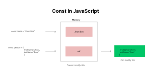

# 第2章: 変数とデータ型 – 情報の入れ物と種類

前回は、JavaScriptがどんな言語で、HTMLやCSSとどう連携するのか、そしてプログラムを書く上での基本的なお作法について学びましたね。いよいよ今回は、プログラミングの本当に基本的な部品となる「変数」と「データ型」について深く掘り下げていきます！

「変数」と聞くと、なんだか数学みたいで難しそう…と感じるかもしれませんが、心配しないでください！プログラミングにおける変数は、情報を一時的にしまっておくための「名前付きの箱」のようなものなんです。そして「データ型」は、その箱にどんな種類の情報を入れられるか、というルールのようなものです。

この章をマスターすれば、プログラムの中で情報を扱ったり、計算したりするための基礎がバッチリ身につきます。最初は覚えることが少し多いかもしれませんが、一つ一つ丁寧に解説していきますので、一緒に頑張りましょう！ここを乗り越えれば、JavaScriptでできることの幅がぐっと広がりますよ！

## 目次

1. 変数ってなんだろう？ – データに名前をつけよう
    * `var` はもう使わない？ – 歴史と注意点
    * `let` – 書き換えできる箱
    * `const` – 書き換えできない箱 (基本はコレ！)
    * `const` でオブジェクトや配列を扱うときの注意点
    * 宣言と代入 – 箱の用意と中身の投入
2. データ型っていろいろあるんだ！ – 情報の種類を知ろう
    * プリミティブ型 – JavaScriptの基本的な材料
        * `string` (文字列) – 言葉や文章を扱う
        * `number` (数値) – 計算はおまかせ！
        * `boolean` (真偽値) – YesかNoか、ハッキリさせよう
        * `null` – 「何もない」ことを意図的に示す
        * `undefined` – 「まだ何もない」状態
        * `symbol` – ちょっと特別な名札 (ES6から登場)
        * `bigint` – とっても大きな数値を扱う (ES2020から登場)
    * オブジェクト型 – 複雑なものをまとめる便利な箱
3. このデータの種類は何？ – `typeof` で調べてみよう
4. 変数が使える範囲 – スコープを理解しよう
    * グローバルスコープ – どこからでも見える
    * 関数スコープ – 関数の中だけの秘密
    * ブロックスコープ – `{}` の中だけの話 (`let` と `const` の得意技)
    * スコープのイメージ図
5. 変数の巻き上げ (Hoisting) – ちょっと不思議な現象
    * `var` の場合の巻き上げ
    * `let` と `const` の場合の巻き上げ (TDZって何？)
6. 型変換 – データ型が変わっちゃう！？
    * 明示的な型変換 – 自分でハッキリ変える
    * 暗黙的な型変換 – JavaScriptが気を利かせてくれる…けど？

---

## 1. 変数ってなんだろう？ – データに名前をつけよう

プログラミングをしていると、例えばユーザーが入力した名前、計算結果、ウェブサイトの現在の状態など、様々な「情報」を扱います。これらの情報を一時的にコンピューターのメモリに保存しておき、後で使いたいときに取り出せるようにする仕組みが**変数**です。

変数とは、データ（値）を入れておくための「名前付きの箱」だとイメージしてください。箱に名前を付けておくことで、後から「あの箱の中身を見たい！」とか「この箱に新しい中身を入れたい！」といった操作ができるようになります。

JavaScriptで変数を使うには、まず「こんな名前の箱を用意しますよ」と宣言し、必要に応じてその箱に値を入れる（代入する）という手順を踏みます。

### `var` はもう使わない？ – 歴史と注意点

昔のJavaScriptでは、変数を宣言するために `var` というキーワードが使われていました。

```javascript
var oldStyleMessage = "これは古いスタイルの変数です";
console.log(oldStyleMessage);
```

しかし、この `var` には、少し分かりにくい挙動（例えば「巻き上げ」や「関数スコープ」といった特性）があり、それがバグの原因になることもありました。

そのため、最近のJavaScript (ES2015以降) では、より安全で分かりやすい `let` と `const` という新しいキーワードを使って変数を宣言するのが一般的です。**基本的に、これから皆さんが新しくコードを書くときには `var` は使わない、と覚えておいて大丈夫です。** もし古いコードを読む機会があったときに「あ、これは昔の書き方だな」と分かればOKです。

### `let` – 書き換えできる箱

`let` は、後から中身を書き換えることができる変数を宣言するときに使います。まさに「書き換え可能な箱」ですね。

```javascript
let userAge = 20; // userAgeという名前の箱を用意し、20を入れる
console.log("現在の年齢:", userAge); // 現在の年齢: 20

userAge = 21; // userAgeの箱の中身を21に書き換える
console.log("新しい年齢:", userAge); // 新しい年齢: 21
```

一度宣言した変数をもう一度 `let` で宣言しようとするとエラーになります。これは、同じ名前の箱を二重に用意しようとしているようなものなので、JavaScriptが「それはできませんよ！」と教えてくれるわけです。

```javascript
let userName = "高専太郎";
// let userName = "高専花子"; // ここでエラー！ SyntaxError: Identifier 'userName' has already been declared
```

### `const` – 書き換えできない箱 (基本はコレ！)

`const` は、一度値を入れたら後から中身を書き換えられない（再代入できない）変数を宣言するときに使います。「定数 (constant)」の略で、まさに「書き換え不可能な、頑丈な箱」です。

```javascript
const siteName = "NITAC Web Club";
console.log("ようこそ、" + siteName + "へ！");

// siteName = "別の名前"; // ここでエラー！ TypeError: Assignment to constant variable.
```

「え、書き換えられない箱なんて、使い道が少ないんじゃないの？」と思うかもしれません。でも実は、プログラムの中では「この値は途中で変わってほしくない」というケースが非常に多いんです。例えば、円周率のような数学的な定数や、一度設定したら変わらない設定値などです。

`const` を使うことで、意図せずに値を書き換えてしまうミスを防ぐことができます。そのため、**変数を宣言するときは、まず `const` で宣言できないか考え、後から値を変更する必要がある場合にのみ `let` を使う、という習慣をつけるのがおすすめです。** これ、本当に大事なポイントですよ！

### `const` でオブジェクトや配列を扱うときの注意点

ここで一つ、`const` に関する重要な注意点があります。`const` で宣言された変数がオブジェクトや配列（これらは後で詳しく学びます）を参照している場合、そのオブジェクトや配列の「中身」は変更できてしまうんです。

「えっ、`const` は書き換えられないんじゃないの？」と混乱するかもしれませんね。これは、`const` が禁止するのは「変数（箱）が指し示すもの（メモリアドレス）自体を別のものに差し替えること」だからです。箱自体を別の箱と交換するのはダメだけど、箱の中に入っているものの一部をいじるのはOK、というイメージです。

とはいえ、オブジェクトはまた今後やる内容なので、軽く流してもらってもOK

```javascript
const userProfile = {
  name: "高専一郎",
  age: 18
};
console.log(userProfile.name); // 高専一郎

// userProfileの「中身」であるnameプロパティを変更するのはOK
userProfile.name = "高専次郎";
console.log(userProfile.name); // 高専次郎

// userProfileという箱自体を、別のオブジェクトに差し替えようとするとエラー
// userProfile = { name: "高専三郎", age: 19 }; // TypeError: Assignment to constant variable.

const favoriteFruits = ["りんご", "バナナ", "みかん"];
console.log(favoriteFruits[0]); // りんご

// favoriteFruitsの「中身」である配列の要素を変更したり追加したりするのはOK
favoriteFruits[0] = "ぶどう";
favoriteFruits.push("いちご");
console.log(favoriteFruits); // ["ぶどう", "バナナ", "みかん", "いちご"]

// favoriteFruitsという箱自体を、別の配列に差し替えようとするとエラー
// favoriteFruits = ["メロン", "スイカ"]; // TypeError: Assignment to constant variable.
```




* `alt text`: `const`で宣言された変数がオブジェクトを指している図。変数の箱は固定されているが、箱の中のオブジェクトのプロパティ（中身）は変更可能であることを示すイラスト。

この挙動は最初は少しややこしく感じるかもしれませんが、「`const` は変数の再代入を防ぐもので、中身の変更まで完全に禁止するわけではない（特にオブジェクトや配列の場合）」と覚えておきましょう。

### 宣言と代入 – 箱の用意と中身の投入

変数を使う流れを整理すると、以下のようになります。

1. **宣言 (Declaration)**: `let` や `const` を使って、変数の名前（箱の名前）をJavaScriptに教えます。

    ```javascript
    let score;       // scoreという名前の箱を用意 (中身はまだ空っぽ)
    const gravity = 9.8; // gravityという名前の箱を用意し、9.8を入れる (constなので宣言と同時に値を入れるのが一般的)
    ```

2. **代入 (Assignment)**: `=` (イコール記号) を使って、変数（箱）に値（中身）を入れます。

    ```javascript
    score = 100;     // scoreの箱に100を入れる
    console.log(score); // 100
    ```

`let` の場合は、宣言と代入を別々に行うことも、同時に行うこともできます。
`const` の場合は、宣言と同時に値を代入する必要があります。後から代入しようとするとエラーになります。

```javascript
// let の場合
let currentTemperature; // 宣言
currentTemperature = 25.5; // 代入
console.log("現在の気温:", currentTemperature);

let currentHumidity = 60; // 宣言と代入を同時に
console.log("現在の湿度:", currentHumidity);

// const の場合
const PI = 3.14159; // 宣言と代入を同時に
console.log("円周率:", PI);

// const G; // エラー！ SyntaxError: Missing initializer in const declaration
// G = 9.8;
```

---

## 2. データ型っていろいろあるんだ！ – 情報の種類を知ろう

変数という「箱」には、様々な種類の情報（データ）を入れることができます。この情報の種類のことを**データ型 (Data Type)** と呼びます。JavaScriptには、いくつかの基本的なデータ型が用意されています。

### プリミティブ型 – JavaScriptの基本的な材料

まずは、JavaScriptの最も基本的なデータの種類である**プリミティブ型 (Primitive Types)** を見ていきましょう。これらは、それ以上分解できない単一の値を表します。

#### `string` (文字列) – 言葉や文章を扱う

`string` は、文字の集まり、つまり「文字列」を表すデータ型です。シングルクォーテーション (`'`)、ダブルクォーテーション (`"`)、またはバッククォート (`` ` ``) で囲んで表現します。

```javascript
let greeting = "こんにちは！";
const myName = '高専太郎';
const message = `私の名前は${myName}です。`; // バッククォートはテンプレートリテラルと呼ばれ、${}で変数を埋め込める

console.log(greeting);
console.log(myName);
console.log(message);
```

**ポイント:** シングルクォートとダブルクォートは基本的に同じように使えますが、プロジェクトやチームでどちらかに統一するのが一般的です。バッククォートは、文字列の中に変数の値を埋め込みたいときや、複数行の文字列を書きたいときに特に便利ですよ。

#### `number` (数値) – 計算はおまかせ

`number` は、整数や小数といった「数値」を表すデータ型です。

```javascript
let itemCount = 10;
const price = 1980.5;
let total = itemCount * price;

console.log("個数:", itemCount);
console.log("単価:", price);
console.log("合計:", total);

// 特殊な数値
console.log(1 / 0); // Infinity (無限大)
console.log(-1 / 0); // -Infinity (負の無限大)
console.log("abc" / 2); // NaN (Not a Number - 数値ではない)
```

`Infinity` や `NaN` も `number` 型の一種です。計算結果が無限になったり、数値として表現できない結果になったりした場合にこれらの値が登場します。

#### `boolean` (真偽値) – YesかNoか、ハッキリさせよう

`boolean` は、「真 (true)」か「偽 (false)」のどちらかの値だけを持つデータ型です。条件分岐（もし○○なら××する、など）で非常によく使われます。

```javascript
let isLoggedIn = true;
const isAdmin = false;

if (isLoggedIn) {
  console.log("ログイン済みです。");
} else {
  console.log("ログインしていません。");
}

console.log("管理者ですか？:", isAdmin);
```

#### `null` – 「何もない」ことを意図的に示す

`null` は、ちょっと特殊な値で、「値が存在しない」または「空である」ことを**意図的に**示すために使われます。プログラマーが「ここには今、有効なデータが入っていませんよ」と明示したい場合などに使います。

```javascript
let selectedUser = null; // まだユーザーが選択されていない状態
console.log(selectedUser); // null

// 例: DOM要素の取得に失敗した場合 (これは後の章で詳しく学びます)
// const nonExistentElement = document.getElementById('存在しないID');
// console.log(nonExistentElement); // null (もし要素が見つからなければ)
```

#### `undefined` – 「まだ何もない」状態

`undefined` もまた特殊な値で、「値がまだ代入されていない」または「定義されていない」状態を示します。変数を宣言しただけで値を代入していない場合、その変数の値は `undefined` になります。

```javascript
let userEmail; // 値を代入せずに宣言
console.log(userEmail); // undefined

function greet(name) {
  console.log("こんにちは、" + name + "さん！");
}
greet(); // 引数を渡さなかったので、関数内のnameはundefinedになり、"こんにちは、undefinedさん！"と表示される

const person = { name: "Alice" };
console.log(person.age); // personオブジェクトにageプロパティは存在しないのでundefined
```

**`null` と `undefined` の違いは少しややこしいですが、ざっくり言うと:**

* `null`: 開発者が「ここには意図的に何も入れていません」と示す場合。
* `undefined`: システムが「まだ値がセットされていませんよ」または「そんなものはありませんよ」と示す場合。

最初は区別が難しいかもしれませんが、使っていくうちに感覚が掴めてくると思います。

#### `symbol` – ちょっと特別な名札 (ES6から登場)

`symbol` は、ES2015 (ES6) で追加された比較的新しいプリミティブ型で、必ず一意（ユニーク）な値を生成します。主に、オブジェクトのプロパティ名が他と衝突するのを防ぎたい場合などに使われます。

```javascript
const id1 = Symbol("id");
const id2 = Symbol("id");

console.log(id1 === id2); // false (同じ説明文字列でも、生成されるSymbolは別物)

const user = {
  name: "高専花子",
  [id1]: "ユーザーID123" // Symbolをオブジェクトのキーとして使う
};
console.log(user[id1]); // ユーザーID123
```

`symbol` は少し高度な使い方をすることが多いので、今は「こんなものもあるんだな」くらいに知っておけば大丈夫です。

#### `bigint` – とっても大きな数値を扱う (ES2020から登場)

`bigint` は、ES2020で追加された、非常に大きな整数を扱うためのデータ型です。通常の `number` 型では安全に表現できないような大きな数値を扱いたい場合（例えば、金融計算や暗号処理の一部など）に使います。数値の末尾に `n` を付けて表現します。

```javascript
const veryLargeNumber = 1234567890123456789012345678901234567890n;
const anotherLargeNumber = BigInt("9876543210987654321098765432109876543210");

console.log(veryLargeNumber);
console.log(anotherLargeNumber * 2n);

// 通常のnumber型との演算は明示的な変換が必要
// console.log(veryLargeNumber + 10); // エラー！ TypeError: Cannot mix BigInt and other types
console.log(veryLargeNumber + BigInt(10)); // OK
```

`bigint` も特定の状況で使われる型なので、初めのうちはあまり出会わないかもしれません。

### オブジェクト型 – 複雑なものをまとめる便利な箱

プリミティブ型以外のデータは、基本的にすべて**オブジェクト型 (Object Type)** に分類されます。オブジェクトは、複数のデータ（プロパティと呼ばれる）や機能（メソッドと呼ばれる）をひとまとめにしたものです。

例えば、配列（複数の値を順番に並べたもの）や関数（特定の処理を行うもの）、そして前回少し触れた「オブジェクトリテラル」で作るようなデータ構造もオブジェクト型の一種です。

```javascript
const fruits = ["りんご", "バナナ", "みかん"]; // 配列 (オブジェクト型)
console.log(typeof fruits); // "object"

function sayHello() { // 関数 (オブジェクト型)
  console.log("こんにちは！");
}
console.log(typeof sayHello); // "function" (特殊なオブジェクトとして扱われる)

const student = { // オブジェクトリテラル (オブジェクト型)
  name: "情報太郎",
  grade: 3
};
console.log(typeof student); // "object"
```

オブジェクトについては、後の章でさらに詳しく、そして深く学んでいきますので、ここでは「プリミティブ型じゃないものは、だいたいオブジェクトなんだな」くらいに思っておいてくださいね。

---

## 3. このデータの種類は何？ – `typeof` で調べてみよう

変数がどんなデータ型を持っているかを確認したいときには、`typeof` 演算子を使います。

```javascript
console.log(typeof "こんにちは");    // "string"
console.log(typeof 123);           // "number"
console.log(typeof true);          // "boolean"
console.log(typeof undefined);     // "undefined"
console.log(typeof Symbol("test"));// "symbol"
console.log(typeof 123n);          // "bigint"

let myVariable;
console.log(typeof myVariable);    // "undefined" (まだ値が代入されていない)

myVariable = null;
console.log(typeof myVariable);    // "object" (これは歴史的な経緯によるもので、少し注意が必要！)

const myArray = [1, 2, 3];
console.log(typeof myArray);       // "object"

function greet() {}
console.log(typeof greet);         // "function"
```

**注意点:**
`typeof null` の結果が `"object"` になるのは、JavaScriptの初期のバージョンからの歴史的なバグ（仕様）のようなものです。`null` はプリミティブ型の一種ですが、`typeof` で調べると `"object"` と表示されてしまうので、少し紛らわしいですね。
また、配列 (`myArray`) も `typeof` では `"object"` と表示されます。配列かどうかを正確に判定するには、`Array.isArray(myArray)` という別の方法を使います（配列、についてもまた後で出てきます）。

`typeof` は、デバッグ（プログラムの間違い探し）の際などに、「あれ、この変数にはどんな種類のデータが入っているんだろう？」と確認するのに役立ちます。

---

## 4. 変数が使える範囲 – スコープを理解しよう

変数は、プログラムのどこでも使えるわけではなく、宣言された場所によって「有効な範囲」が決まっています。この変数が有効な範囲のことを**スコープ (Scope)** と呼びます。スコープを理解することは、変数が予期せぬ場所で書き換えられたり、逆に使いたい場所で使えなかったりするのを防ぐために非常に重要です。

JavaScriptのスコープには、主に以下の種類があります。

### グローバルスコープ – どこからでも見える

関数の外側（プログラムの最も外側のレベル）で宣言された変数は、**グローバルスコープ**を持ちます。グローバルスコープで宣言された変数は、プログラムのどこからでもアクセスできます。

```javascript
const globalMessage = "これはグローバル変数です。"; // グローバルスコープ

function showMessage() {
  console.log(globalMessage); // 関数の中からグローバル変数にアクセスできる
}

showMessage();
console.log(globalMessage); // 関数の外からもアクセスできる
```

便利そうに見えますが、グローバル変数を多用すると、どこでその変数が使われているか、どこで変更されたかが分かりにくくなり、プログラムが複雑になったときに管理が難しくなることがあります。そのため、グローバル変数の使用は最小限に抑えるのが良いとされています。

### 関数スコープ – 関数の中だけの秘密

`var` (古い書き方) で関数の中で宣言された変数は、その関数の中でのみ有効な**関数スコープ**を持ちます。関数の外からはアクセスできません。

```javascript
function greetUser() {
  var functionScopedVar = "これは関数スコープの変数です。"; // 関数スコープ (varの場合)
  console.log(functionScopedVar);
}

greetUser();
// console.log(functionScopedVar); // エラー！ ReferenceError: functionScopedVar is not defined
```

### ブロックスコープ – `{}` の中だけの話 (`let` と `const` の得意技)

`let` や `const` で宣言された変数は、**ブロックスコープ**を持ちます。ブロックとは、波括弧 `{}` で囲まれた範囲のことです。例えば、`if`文の `{}` や `for`ループの `{}` などがブロックにあたります。ブロックスコープで宣言された変数は、そのブロックの中でしか使えません。

```javascript
if (true) {
  let blockScopedLet = "これはブロックスコープのlet変数です。";
  const blockScopedConst = "これもブロックスコープのconst変数です。";
  console.log(blockScopedLet);
  console.log(blockScopedConst);
}

// console.log(blockScopedLet); // エラー！ ReferenceError: blockScopedLet is not defined
// console.log(blockScopedConst); // エラー！ ReferenceError: blockScopedConst is not defined

function testScope() {
  if (true) {
    let innerVar = "内側のブロック";
    console.log(innerVar);
  }
  // console.log(innerVar); // エラー！
}
testScope();
```

このブロックスコープのおかげで、変数が意図しない範囲に影響を与えるのを防ぎやすくなり、より安全なコードを書くことができます。`let` と `const` が推奨される大きな理由の一つです。

### スコープのイメージ図

スコープの関係を視覚的にイメージすると、以下のようになります。


プログラムは、内側のスコープから外側のスコープにある変数にはアクセスできますが、外側のスコープから内側のスコープにある変数には（基本的に）アクセスできません。また、同じレベルの別のスコープにある変数にもアクセスできません。

---

## 5. 変数の巻き上げ (Hoisting) – ちょっと不思議な現象

JavaScriptには、**巻き上げ (Hoisting)** という、変数の宣言がそのスコープの先頭に「巻き上げられる」ように見える挙動があります。これは特に `var` を使っていた時代によく話題になりました。

### `var` の場合の巻き上げ

`var` で宣言された変数は、宣言部分だけがそのスコープ（関数スコープまたはグローバルスコープ）の先頭に巻き上げられます。ただし、代入部分は巻き上げられません。

```javascript
console.log(myVar); // undefined (エラーにはならない！)
var myVar = "Hello";
console.log(myVar); // Hello

// 上のコードは、JavaScriptエンジンによって以下のように解釈されるイメージ
// var myVar; // 宣言だけが先頭に巻き上げられる
// console.log(myVar); // undefined
// myVar = "Hello"; // 代入は元の位置
// console.log(myVar); // Hello
```

このように、`var` で宣言された変数は、実際に宣言される行よりも前で参照してもエラーにならず、`undefined` となります。これが時々、予期せぬバグの原因になることがありました。

### `let` と `const` の場合の巻き上げ (TDZって何？)

`let` や `const` で宣言された変数も、実は宣言自体はスコープの先頭に巻き上げられます。しかし、`var` とは異なり、実際に変数が宣言される行（初期化される行）よりも前でアクセスしようとすると、**ReferenceError** というエラーが発生します。

この、変数が巻き上げられてから実際に初期化されるまでの間、その変数にアクセスできない期間のことを **TDZ (Temporal Dead Zone)**、日本語で「一時的死角」と呼びます。

```javascript
// console.log(myLet); // エラー！ ReferenceError: Cannot access 'myLet' before initialization (TDZのため)
let myLet = "Hello from let";
console.log(myLet);

// console.log(myConst); // エラー！ ReferenceError: Cannot access 'myConst' before initialization (TDZのため)
const myConst = "Hello from const";
console.log(myConst);
```

TDZの存在により、`let` や `const` は `var` よりも安全で予測しやすい挙動になります。変数は必ず宣言してから使う、という基本的なルールを守っていれば、TDZで困ることはあまりありません。

個人的には、巻き上げという言葉自体をあまり意識しすぎなくても、「変数は使う前に必ず `let` か `const` で宣言する！」というルールを守っていれば、大抵の場合は大丈夫だと思いますよ。

---

## 6. 型変換 – データ型が変わっちゃう！？

JavaScriptは**動的型付け言語**なので、状況に応じて自動的にデータ型を変換することがあります。また、プログラマーが意図的にデータ型を変換することもできます。

### 明示的な型変換 – 自分でハッキリ変える

プログラマーが意図してデータ型を変換することを**明示的な型変換 (Explicit Type Conversion)** と言います。JavaScriptには、そのための組み込み関数や方法が用意されています。

* **文字列への変換**: `String()` 関数や `toString()` メソッドを使います。

    ```javascript
    // filepath: (どこかのフォルダ)/explicit_conversion_string.js
    let num = 123;
    let bool = true;

    let strNum = String(num);
    let strBool = bool.toString();

    console.log(typeof strNum, strNum);   // string 123
    console.log(typeof strBool, strBool); // string true
    ```

* **数値への変換**: `Number()` 関数、`parseInt()` 関数、`parseFloat()` 関数を使います。

    ```javascript
    // filepath: (どこかのフォルダ)/explicit_conversion_number.js
    let str = "456";
    let strFloat = "3.14";
    let strInvalid = "abc";
    let boolTrue = true;
    let boolFalse = false;

    let numStr = Number(str);
    let numParseInt = parseInt(strFloat); // 整数部分だけを取り出す
    let numParseFloat = parseFloat(strFloat); // 小数点以下も取り出す
    let numInvalid = Number(strInvalid); // 数値に変換できない場合はNaNになる
    let numBoolTrue = Number(boolTrue);   // trueは1になる
    let numBoolFalse = Number(boolFalse); // falseは0になる

    console.log(typeof numStr, numStr);             // number 456
    console.log(typeof numParseInt, numParseInt);   // number 3
    console.log(typeof numParseFloat, numParseFloat); // number 3.14
    console.log(typeof numInvalid, numInvalid);       // number NaN
    console.log(typeof numBoolTrue, numBoolTrue);     // number 1
    console.log(typeof numBoolFalse, numBoolFalse);   // number 0
    ```

    **ポイント:** `parseInt()` は文字列の先頭から数値として解釈できる部分だけを変換します。`parseFloat()` も同様ですが、小数点を認識します。
* **真偽値への変換**: `Boolean()` 関数を使います。

    ```javascript
    // filepath: (どこかのフォルダ)/explicit_conversion_boolean.js
    console.log(Boolean(0));          // false
    console.log(Boolean(""));         // false (空文字列)
    console.log(Boolean(null));       // false
    console.log(Boolean(undefined));  // false
    console.log(Boolean(NaN));        // false

    console.log(Boolean(123));        // true (0以外の数値)
    console.log(Boolean("hello"));    // true (空でない文字列)
    console.log(Boolean({}));         // true (オブジェクト)
    console.log(Boolean([]));         // true (配列)
    ```

    `0`, 空文字列 `""`, `null`, `undefined`, `NaN` は `false` に変換され、それ以外のほとんどの値は `true` に変換されると覚えておくと便利です。これらを「falsyな値」、それ以外を「truthyな値」と呼んだりします。

### 暗黙的な型変換 – JavaScriptが気を利かせてくれる…けど？

JavaScriptは、演算子（例えば `+` や `==` など）が使われたときに、文脈に応じて自動的にデータ型を変換することがあります。これを**暗黙的な型変換 (Implicit Type Conversion)** と言います。

これは便利な場合もありますが、時々予期せぬ結果を引き起こすこともあるので注意が必要です。

```javascript
// 文字列と数値の + 演算
console.log(1 + "2");       // "12" (数値の1が文字列に変換されて結合される)
console.log("5" - 1);       // 4 (文字列の"5"が数値に変換されて計算される)
console.log("5" * "2");       // 10 (両方数値に変換されて計算される)

// == 演算子 (等価演算子)
console.log(5 == "5");      // true (型変換して比較するため)
console.log(0 == false);    // true
console.log(null == undefined); // true

// === 演算子 (厳密等価演算子) - 型変換せずに比較する
console.log(5 === "5");     // false (型が違うため)
console.log(0 === false);   // false
console.log(null === undefined); // false
```

**個人的には、`==` 演算子は意図しない型変換で混乱を招くことがあるので、型と値の両方が等しいことを厳密に比較する `===` 演算子を使うことを強く推奨します！**

他にも、トリッキーな暗黙の型変換の例があります。

```javascript
console.log(true + false); // 1 (trueが1に、falseが0に変換されて計算される)
console.log([] + {});      // "[object Object]" (配列とオブジェクトが文字列に変換されて結合される)
console.log({} + []);      // 0 または "[object Object]" (環境や解釈により異なる場合がある、非常に紛らわしい！)
```

JavaScriptは賢く型を推測しようとしますが、時にはおせっかいなこともあります。意図しない型変換に注意し、できるだけ明示的な型変換を心がけるか、`===` のように型変換を前提としない比較方法を使うのが、バグの少ないコードを書くコツですよ。

もし途中で分からなくなったり、エラーが出たりしたら、遠慮なく誰かに聞いてみてくださいね

---

## ✏️ 本日の演習

さあ、今日学んだことを早速試してみましょう！

1. **自己紹介変数を作ろう！**
    * 自分の名前を格納する変数 `myName` を `const` で宣言し、あなたの名前を文字列で代入してください。
    * 自分の年齢を格納する変数 `myAge` を `let` で宣言し、あなたの年齢を数値で代入してください。
    * 自分が学生であるかどうかを格納する変数 `isStudent` を `const` で宣言し、真偽値 (`true` または `false`) で代入してください。
    * これらの変数の値を `console.log()` を使って、以下のように表示してみてください。
        * 例: `console.log("私の名前は" + myName + "です。");`
        * 例: `console.log("年齢は" + myAge + "歳です。");`
        * 例: `console.log("学生ですか？: " + isStudent);`
    * （おまけ）`myAge` の値を1増やして、再度表示してみましょう。
2. **データ型クイズ！**
    * 以下の値のデータ型が何になるか、`typeof` を使って確認し、コンソールに表示してください。
        * `"NITAC"`
        * `2023`
        * `3.14159`
        * `true`
        * `null`
        * `undefined`
        * `["apple", "banana"]` (これは配列です)
        * `{ school: "NITAC", department: "IT" }` (これはオブジェクトです)
3. **型変換実験！**
    * 数値の `100` を文字列に変換して、そのデータ型と値をコンソールに表示してください。
    * 文字列の `"50"` を数値に変換して、そのデータ型と値をコンソールに表示してください。
    * `0` と `1` と空文字列 `""` と文字列 `"hello"` を、それぞれ `Boolean()` を使って真偽値に変換し、結果をコンソールに表示してください。何が `true` になり、何が `false` になるか確認しましょう。

---

## まとめと次回予告

お疲れ様でした！今回は、プログラミングの基本中の基本である「変数」と「データ型」、そしてそれらに関連する「スコープ」や「型変換」について学びましたね。

* 変数はデータを入れておくための**名前付きの箱**であること。
* 変数の宣言には、基本的に**`const`**（書き換え不可）を使い、必要な場合のみ**`let`**（書き換え可）を使うこと。
* JavaScriptには、**`string`**, **`number`**, **`boolean`**, **`null`**, **`undefined`**, **`symbol`**, **`bigint`** といったプリミティブ型と、**オブジェクト型**があること。
* **`typeof`** 演算子でデータ型を確認できること。
* 変数が使える範囲である**スコープ**（グローバル、関数、ブロック）の概念。
* 意図した型変換（**明示的型変換**）と、自動で行われる型変換（**暗黙的型変換**）があり、特に暗黙の型変換には注意が必要なこと。

たくさんの新しい言葉や概念が出てきて大変だったかもしれませんが、これらの知識は今後のJavaScript学習の土台となります。実際に手を動かしてコードを書いてみることで、少しずつ体に染み込んでいきますよ。

次回は、計算や比較を行うための「**演算子**」と、複数の情報をまとめて扱うための基本的なデータ構造である「**配列**」と「**オブジェクト**」について詳しく見ていきます。プログラムでできることが、さらにぐっと広がりますので、お楽しみに！
