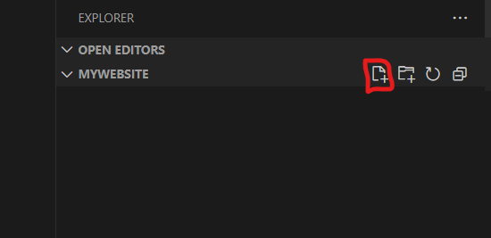
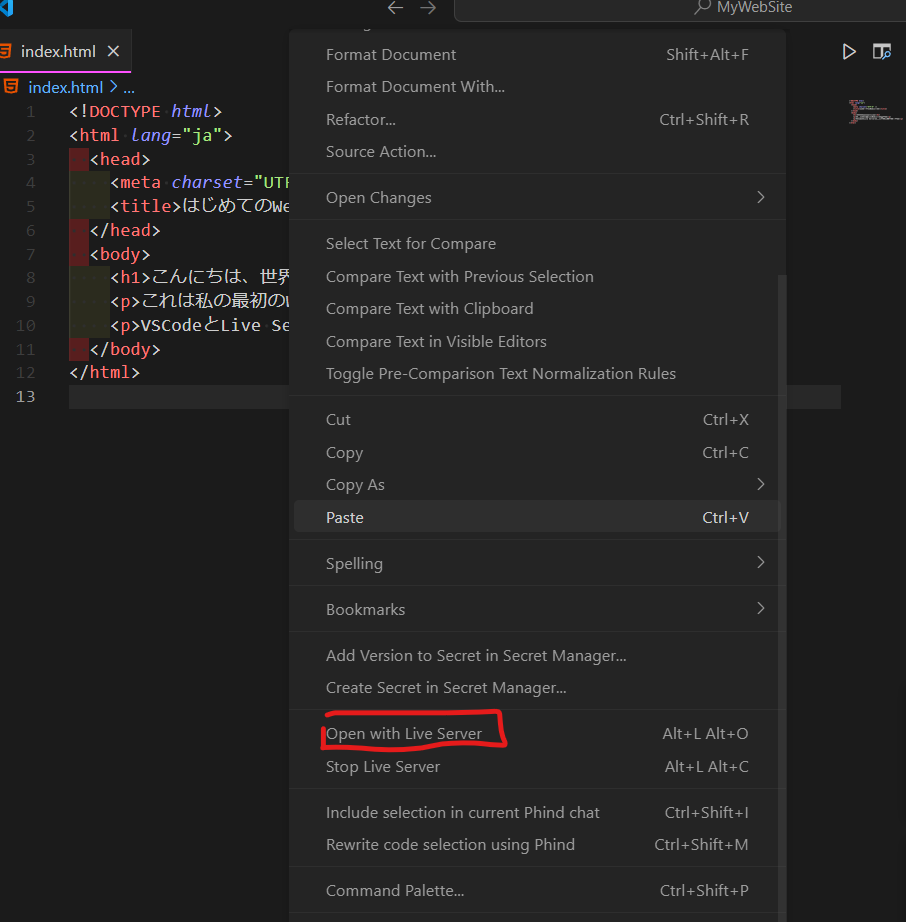

# HTMLファイルを実行（表示）してみよう

HTMLファイルを実際にコンピューターで表示させる方法を学びます。HTMLファイルはWebブラウザ（Google Chrome, Microsoft Edge, Firefoxなど）があれば見ることができますが、Webページを作りながら確認するには、もっと便利なツールを使うのがおすすめです。

ここでは、多くのプロの開発者も使っている高機能なテキストエディタ **Visual Studio Code (VSCode)** と、その拡張機能 **Live Server** を使って、HTMLファイルを簡単に表示する方法を紹介します。

## 1. Visual Studio Code (VSCode) の準備

### VSCodeってなに？

VSCodeは、Microsoftが無料で提供している、プログラムを書くための多機能なメモ帳（テキストエディタ）です。HTMLやCSS、JavaScriptなど、Web制作に必要なファイルを効率よく書くための便利な機能がたくさん詰まっています。

### VSCodeのダウンロード

まず、VSCodeをパソコンにインストールしましょう。

1. Webブラウザを開き、「VSCode ダウンロード」と検索するか、以下のURLにアクセスします。
    [https://code.visualstudio.com/download](https://code.visualstudio.com/download)

2. お使いのパソコン（Windows）用のダウンロードボタンをクリックして、インストーラーをダウンロードします。

### VSCodeのインストール

ダウンロードしたインストーラーファイル（`.exe`ファイル）をダブルクリックして、インストールを開始します。

1. **ライセンス契約書**: 内容を確認し、「同意する」にチェックを入れて「次へ」をクリックします。

2. **インストール先の指定**: 通常は変更せず、そのまま「次へ」をクリックします。

3. **プログラムグループの指定**: そのまま「次へ」をクリックします。

4. **追加タスクの選択**: ここは重要です！以下の項目にチェックを入れることを強くおすすめします。
    * **「PATHへの追加」**: チェックが入っていることを確認します（通常はデフォルトでチェック）。
    * **「エクスプローラーのファイルコンテキストメニューに[Codeで開く]アクションを追加する」**: チェックを入れます。
    * **「エクスプローラーのディレクトリコンテキストメニューに[Codeで開く]アクションを追加する」**: チェックを入れます。
    * **「サポートされているファイルの種類のエディターとして Code を登録します」**: チェックを入れておくと便利です。
    * **「デスクトップ上にアイコンを作成する」**: 必要であればチェックを入れます。

    チェックを入れたら「次へ」をクリックします。

5. **インストール準備完了**: 「インストール」ボタンをクリックします。

6. インストールが完了するまで待ちます。

7. **完了**: 「完了」ボタンをクリックしてウィザードを閉じます。「Visual Studio Code を実行する」にチェックが入っていれば、VSCodeが起動します。

これでVSCodeの準備は完了です！

## 2. 拡張機能「Live Server」の導入

次に、HTMLファイルをブラウザで簡単に確認できるようにする拡張機能「Live Server」をVSCodeに追加します。

### Live Serverってなに？

Live Serverは、HTMLファイルを編集して保存するたびに、**自動的にブラウザの表示を最新の状態に更新してくれる** 便利な拡張機能です。これがないと、HTMLを修正するたびに手動でブラウザの更新ボタンを押す必要があり、少し面倒です。

### Live Serverのインストール手順

1. VSCodeを起動します。
2. 画面左側にあるアイコンが並んだバー（アクティビティバー）から、**四角が組み合わさったようなアイコン（拡張機能）** をクリックします。

    

3. 検索ボックスが表示されるので、「**Live Server**」と入力します。
4. 検索結果に「Live Server」（作者: Ritwick Dey）が表示されるので、それをクリックします。

    

5. 右側にLive Serverの詳細が表示されるので、「**Install**」(Install)ボタンをクリックします。

インストールが完了すると、「インストール」ボタンが「アンインストール」や歯車アイコンに変わります。これでLive Serverの導入は完了です。

## 3. プロジェクトを作成して最初のページを作ろう

いよいよ、Webサイト制作の第一歩です。まず、プロジェクト用のフォルダを作り、そこに最初のHTMLファイル (`index.html`) を作成して、基本的な内容を書き込んでみましょう。

1. **プロジェクトフォルダの作成**:
    * まず、これからWebサイトのファイルをまとめて入れておくための「箱」となるフォルダを作成します。
    * デスクトップやドキュメントフォルダなど、自分が分かりやすい場所に新しいフォルダを作成してください。（おすすめは、どこかにProgrammingというフォルダを作成、その下にWEBというフォルダを作成し、その中にさらにフォルダを作成することです。）
    * フォルダ名は自由ですが、ここでは例として `MyWebSite` という名前にします。（半角英数字で、スペースを含まない名前がおすすめです）

2. **VSCodeでプロジェクトフォルダを開く**:
    * VSCodeを起動します。
    * メニューバーの「ファイル」>「フォルダーを開く...」を選択します。
    * 先ほど作成した `MyWebSite` フォルダを選んで「フォルダーの選択」ボタンをクリックします。
    * または、エクスプローラーで `MyWebSite` フォルダを右クリックし、「Code で開く」を選択してもOKです。（VSCodeインストール時に「追加タスクの選択」でチェックを入れていれば使えます）

    * VSCodeの画面左側に `MYWEBSITE` (または作成したフォルダ名) と表示されればOKです。これがあなたのプロジェクトの作業スペースになります。

3. **最初のHTMLファイル (`index.html`) の作成**:

    * VSCodeの左側のエクスプローラービュー（フォルダのアイコンがあるエリア）で、開いているフォルダ名 (`MyWebSite`) にマウスカーソルを合わせます。
    * フォルダ名の右横に表示される「新しいファイル」アイコン（紙に＋マークが付いたようなアイコン）をクリックします。
    * ファイル名の入力欄が表示されるので、`index.html` と入力して `Enter` キーを押します。
    * これで、`MyWebSite` フォルダの中に `index.html` という空のファイルが作成され、右側のエディタ画面で開かれます。

    

    

    * `index.html` は、多くの場合Webサイトのトップページ（最初に表示されるページ）として使われる特別なファイル名です。

4. **HTMLテンプレートの貼り付け**:
    * 新しく作成した `index.html` はまだ空っぽです。ここに、すべてのHTMLファイルの基本となる骨組み（テンプレート）を書き込みます。
    * 以下のコードを**すべて選択してコピー** (`Ctrl + C`) し、VSCodeの `index.html` のエディタ画面に**貼り付け** (`Ctrl + V`) してください。

    ```html
    <!DOCTYPE html>
    <html lang="ja">
    <head>
      <meta charset="UTF-8">
      <title>はじめてのWebページ</title>
    </head>
    <body>
      <h1>こんにちは、世界！</h1>
      <p>これは私の最初のWebページです。</p>
      <p>VSCodeとLive Serverを使って表示しています。</p>
    </body>
    </html>
    ```

    * これで、基本的なHTMLの構造が書き込まれました。各タグの意味は前の章で学びましたね！

5. **ファイルを保存**:
    * コードを貼り付けたら、必ずファイルを保存します。保存しないと変更が反映されません。
    * メニューバーの「ファイル」>「保存」を選択するか、ショートカットキー `Ctrl + S` を押します。
    * VSCodeのファイル名の横にある「●」マークが消えれば、保存完了です。

6. **Live Serverで表示**:
    * いよいよブラウザで表示します！ index.html が開かれているエディタ画面内を右クリックします。
    * 表示されたメニューから「**Open with Live Server**」を選択します。
    * または、VSCodeウィンドウ右下のステータスバーに「**Go Live**」というボタンがあれば、それをクリックしてもOKです。

    

7. **ブラウザで確認**:
    * 自動的に既定のWebブラウザが起動し、`index.html` に書いた内容が表示されるはずです！
    * ブラウザのアドレスバーに `http://127.0.0.1:5500/index.html` のようなURLが表示されていることを確認してください。（`127.0.0.1` は自分のPCを表す特別なアドレスで、`5500` の部分は環境によって異なる場合があります）

8. **自動更新の確認**:
    * Live Serverのすごいところはここからです！ VSCodeに戻って index.html の内容を少し変更してみましょう。
    * 例えば、`<h1>` タグの中の「こんにちは、世界！」を「My Web Siteへようこそ！」などに書き換えてみてください。
    * 変更したら、ファイルを**必ず保存** (`Ctrl + S`) します。
    * ブラウザの画面を見てください！ 手動で更新ボタンを押さなくても、**自動的に表示が変わり、変更内容が反映されている** はずです。これがLive Serverの力です！

## 4. まとめ

お疲れ様でした！これで、VSCodeとLive Serverを使って、HTMLファイルを書きながらリアルタイムでブラウザ表示を確認する環境が整いました。

* **VSCode** は高機能なテキストエディタで、Web制作に便利。
* **Live Server** はVSCodeの拡張機能で、HTMLファイルを保存すると自動でブラウザを更新してくれる。
* VSCodeでフォルダを開き、HTMLファイルを作成・編集し、右クリックメニューやステータスバーからLive Serverを起動すればOK！

この環境があれば、HTMLやCSSの学習がよりスムーズに進みます。どんどんコードを書いて、表示を確認しながらWeb制作のスキルを身につけていきましょう！
