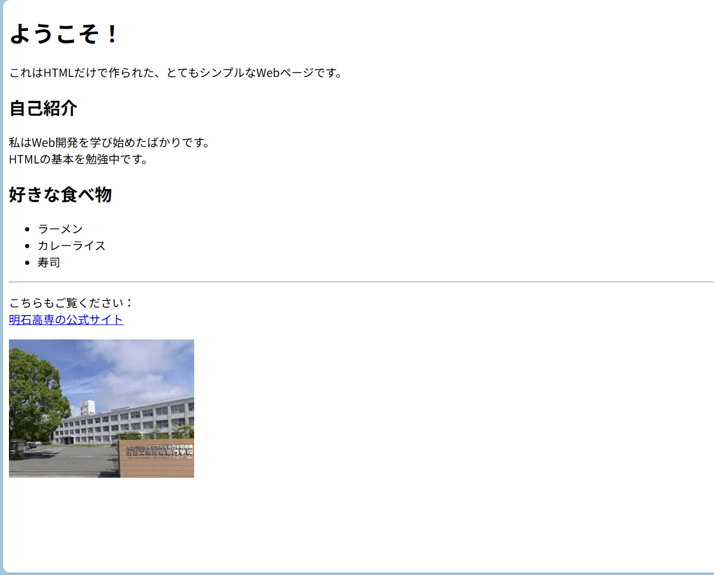
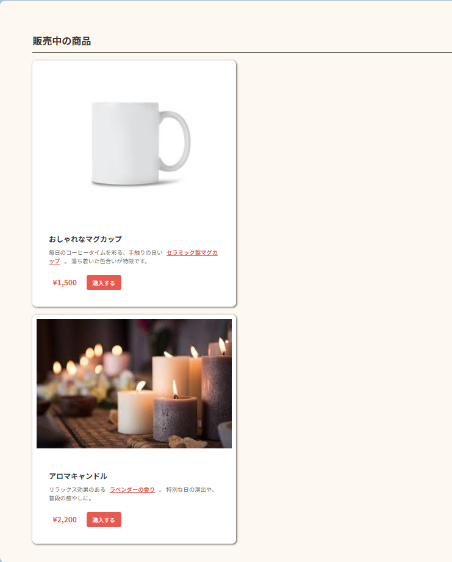
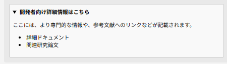

# WEB班 ミッション

## 1. 環境構築

VSCode上で、LiveServerをインストールし、ローカルサーバーを立ち上げ、簡単な(任意の)HTMLを表示させる。

## 2. HTMLの基礎

以下のサンプルページをHTMLで再現する

## 3. CSSの基礎

以下のサンプルページをHTML・CSSで再現する
(画像については適当にそれっぽいのでよい)

## 4. 発展HTML

以下のサンプルページをHTML・CSSで再現する

クリックすると
