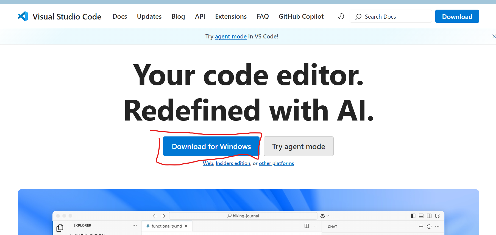
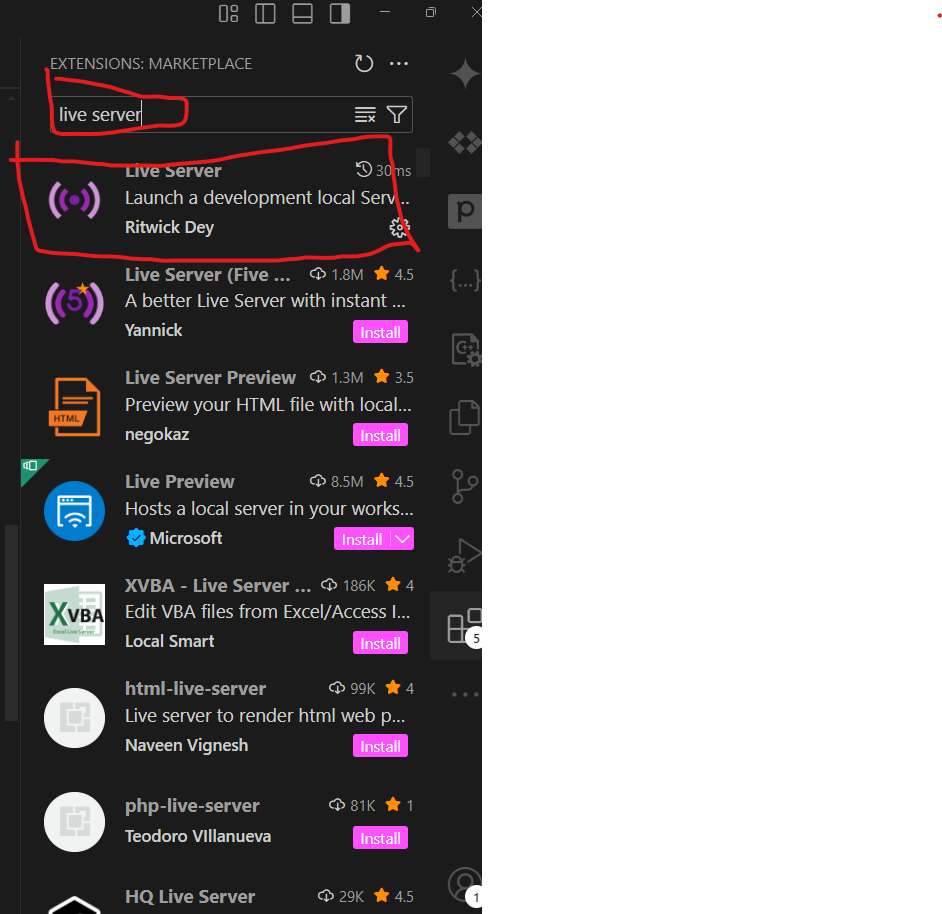
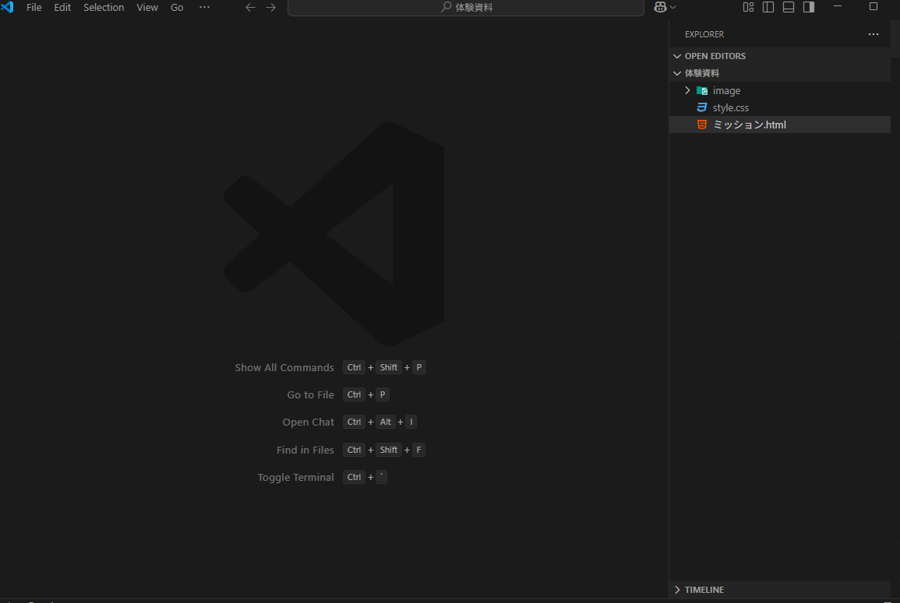
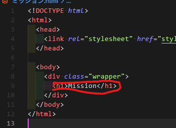
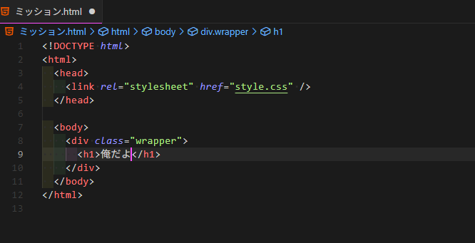
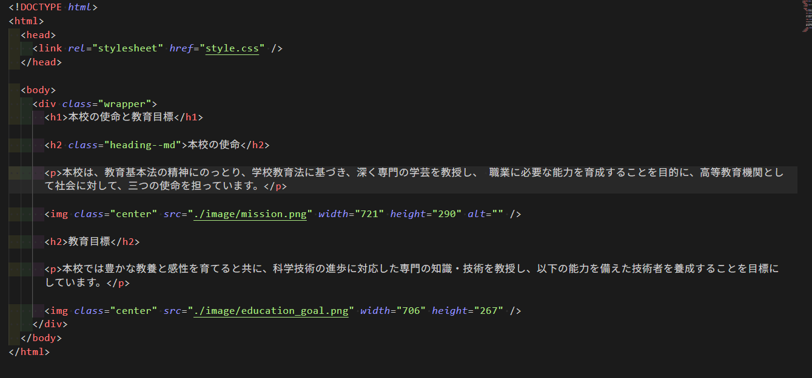

# WEB班体験会へWELCOME

## はじめに

皆さん、一緒にWEBサイトを創ってみましょう。今回は、皆が大好きな明石高専のWEBサイトをコピーします。

## WEBサイトってなんやねん

WEBサイトは、プログラミング言語によって書かれたテキストをパソコンで処理して読み込むと、表示されるものです。


こんな感じの英語のテキストを、パソコンが読み込むと、WEBサイトが表示されます。


今日は、この英語のテキスト、つまり**プログラム**を書いて、WEBサイトを作ってみましょう。

## エディターのインストール

早速始めていきます。
まずは、この**プログラム**を書くためのソフトウェアである**エディター**をインストールします。

[こちら](https://code.visualstudio.com/)をクリックしてください。

(もしくはブラウザ(Edge推奨)で「VSCode」と検索してください。)



ここをクリックして、ダウンロードしてください。


次に、「開く」をクリックしてください。

するとインストールが始まりますよ

基本的には、「次へ」や「はい」をクリックしていけば大丈夫です。

そうして、インストールが終わったら、VSCodeを開いてください。

## 拡張機能をインストール

Live Serverという拡張機能(追加機能)をインストールします。

Control(Ctrl) + Shift + Xを全て同時に押して、拡張機能のページを開きます。


この部分に 「Live Server」と入力してください。



そんで、インストールボタンをクリック


完了！

## フォルダを開く

次に、今回使うプロジェクトをこのVSCodeで開いてみましょう！！！
なので、「Control(Ctrl) + J」キーを同時に押して、ターミナルを開きます。
そして、以下のコマンドをコピー&&ペーストしてください

```bash
powershell -Command "Invoke-WebRequest -Uri 'https://drive.google.com/uc?export=download&id=1ZWuMAd8hAv_ZD2rabZOSCfkW4ozBl4xf' -OutFile "$env:USERPROFILE\Downloads\jouken.zip"; New-Item -ItemType Directory -Path "$env:USERPROFILE\Downloads\jouken" -Force; Expand-Archive -Path "$env:USERPROFILE\Downloads\jouken.zip" -DestinationPath "$env:USERPROFILE\Downloads\jouken" -Force; code "$env:USERPROFILE\Downloads\jouken\体験資料""
```

これで、インターネットから、データをダウンロードしてきて、VSCodeでフォルダが開かれます。

## 実際にプログラムを書いてみよう

長い準備が終わりました
では、実際にプログラムを書いてみましょう！



こんな感じだと思います。


次には「ミッション.html」というところをクリックすると、


これが出てくる。

これを、実際にブラウザで表示してみましょう。
右クリックして、「Open with Live Server」をクリックしてください。


すると、ブラウザー(Edge)において、こんな風に表示されるでしょうか？


いい感じです。VSCodeの方に戻ってみて、



この「Mission」の部分を書き換えてみましょう



そんで、ここ重要。
しっかり保存しなきゃいけないので。
「Control(Ctrl) + S」を同時に押してください。
(編集したたびに毎回保存しなきゃいけないので、注意してください。)


(上の部分が少し変化してるのがわかりますか？これが、保存されている証拠です。)

ブラウザの方を見てみると、


なんと、更新されてます。
こうやって、プログラムを書いて、保存して、ブラウザで確認するという流れを繰り返していきます。

## いまからやること

今日のゴールは、こんな感じのプログラムを書くことです。



少しお勉強をしましょう

---

1. 見出し1(h1)
1. 見出し2(h2)
1. 本文(p)
1. 画像(img)
1. 見出し2(h2)
1. 本文(p)
1. 画像(img)

このウェブページの構成要素はこれらです。
つまり、見出し(h1,h2)と本文(p)と画像(img)を理解していただければ、これを書けるぞということですね。

## 見出しの書き方

見出し(ヘッダー、header)はHTMLでは `<h1>` から `<h6>` までのタグで表現します。これで、見出しにしたい内容を囲むのです。
始まりは\<h1>そして、終わりは\</h1>です。

```html
<h1>これは見出し1です（最も大きい見出し）</h1>
<h2>これは見出し2です（見出し1より小さい）</h2>
```

## 本文（段落）の書き方

本文はpタグ（paragraph）で表現します。

```html
<p>これは段落（本文）です。長い文章を書くときに使います。</p>
```

## 画像の挿入方法

画像は `` タグで挿入します。

```html

```

- `src` 属性：画像ファイルへのパス
- `alt` 属性：画像が表示できない時の代替テキスト
この画像ファイルへのパスというのは、画像が保存されている場所を指定するものです。今回は./imageというフォルダに画像を保存しているので、`src="image/画像ファイル名.png"` という形になります。

## 実際に書いてみよう

では、皆様は、


この赤い部分を以下のコードのように書いてください。
これらを使って、目標のページを作ってみましょう：

```html
<h1>本校の使命と教育目標</h1>

<h2>本校の使命</h2>

<p>本校は、教育基本法の精神にのっとり、学校教育法に基づき、深く専門の学芸を教授し、 職業に必要な能力を育成することを目的に、高等教育機関として社会に対して、三つの使命を担っています。</p>


<h2>教育目標</h2>

<p>本校では豊かな教養と感性を育てると共に、科学技術の進歩に対応した専門の知識・技術を教授し、以下の能力を備えた技術者を養成することを目標にしています。</p>


```

分からないこととか、おかしいってときは、遠慮せずに聞いてください。

## まとめ

実際のアプリケーション(instagram, twitter, youtubeなど)は、この技術を発展させていったものです。HTML, CSS, JavaScript、Vue.js、Pythonといろんな技術が出てきます。
WEB班では、そんなアプリケーション開発をみんなで楽しく学んでいこうと頑張っています。高専プログラミングコンテストに出てヤッホーすることをモチベーションにして、頑張っていきましょう。
