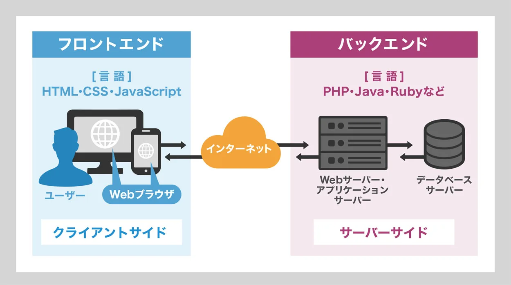
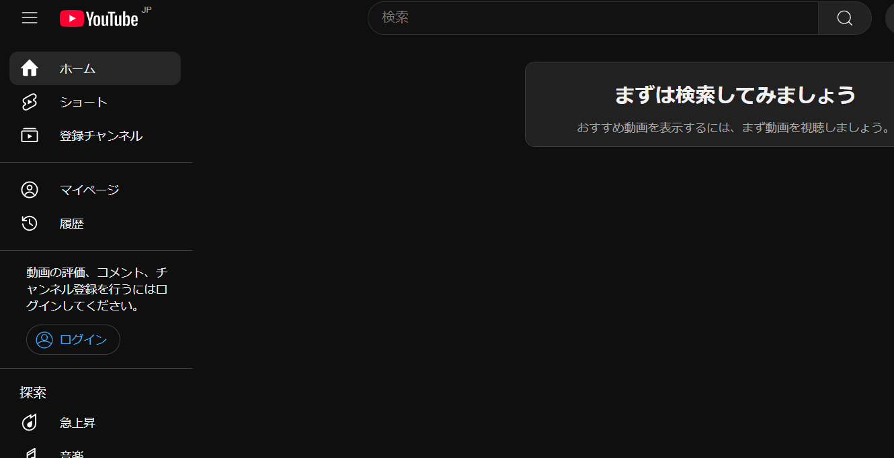
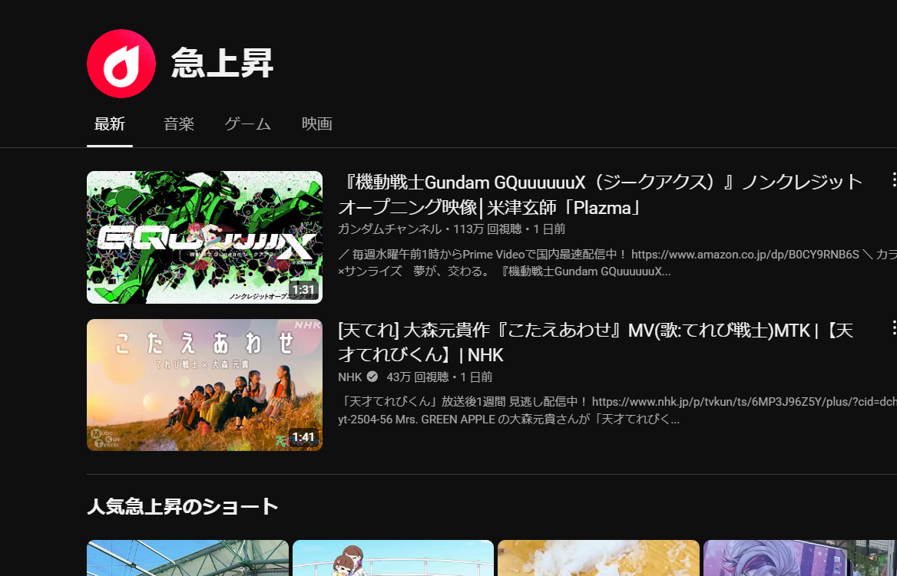
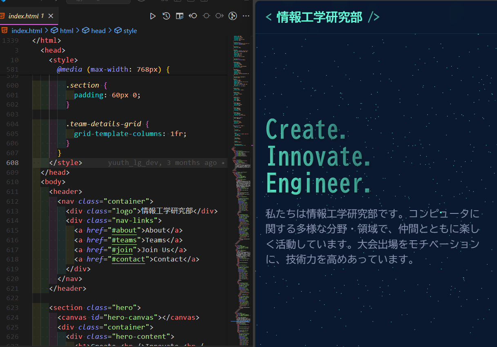

# HTML・CSS入門

## WEB班の目的

WEB技術を中心に、実際のアプリケーション開発に必要な技術を一通り、楽しく学ぼう。

大会では、全員がアプリ開発の全体像を理解したうえで、アイデア出しや、協力ができるように。

## 全体像

### クライアント側

各々のスマホ上で、

プログラムコード(HTML,CSS,Javascript)を、処理すると

こんなアプリやWEBの画面ができる。

このプログラムコードの書き方や、処理の仕方を学ぶ

### サーバー側

サーバー(でっかいパソコン)で、データを保存したり、処理したりして、クライアント（みんなのスマホ上)にデータを送る。

例えば、Youtubeの動画のサムネイルや動画のタイトルなどを、処理して、サーバーに送る。

※クライアントで実行されるプログラムコード(HTML,CSS,Javascript)はテキスト形式で、サーバーからクライアントに送られている。

## 今回、次回でやること

最初はこのクライアント側のコードの書き方を勉強します。

具体的には、
右のようなWEBを作るために、
どのように左側のプログラムコードを書けばよいのかを勉強します。

### 重要用語

フロントエンド：クライアント側で動くプログラムコードにおける技術全般

これからやること

### 見通し

1. HTMLの基礎
1. CSSの基礎
1. モダンHTML(Flexbox,Grid)
1. モダンCSS(animation,Transition)
1. Javascriptの基本文法
1. javascriptのEventListener, DOM操作

これ以降はサーバー側(Python,Database)、サーバとクライアントの連携について、
