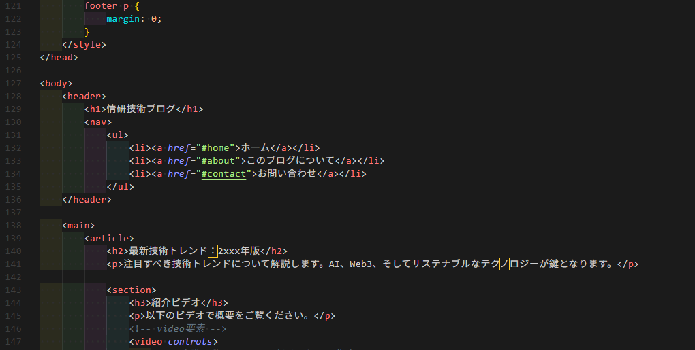
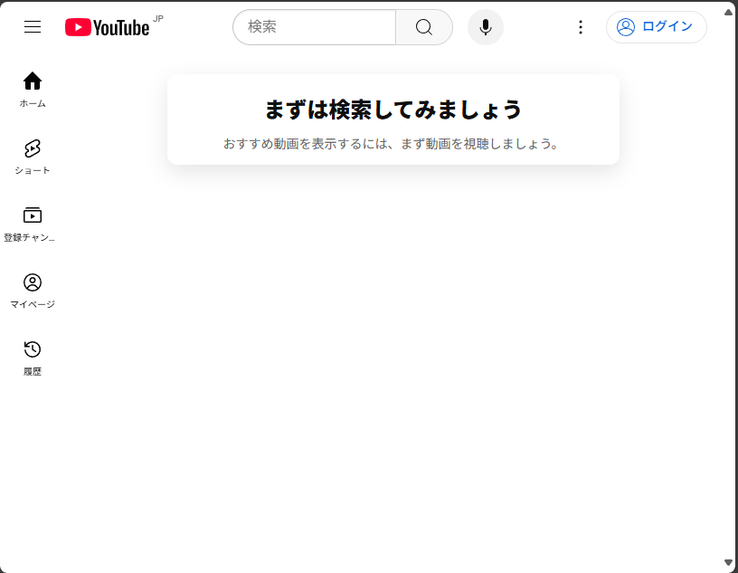

# WEB班第１回

---

## WEB班の目的

WEB技術を中心に、実際のアプリケーション開発に必要な技術を一通り、楽しく学ぼう。

---

## 全体像

---

### クライアント側

---

各々のスマホ上で、プログラムコード(HTML,CSS,Javascript)を、処理すると

---
例） Youtube

---

このようなWEBの画面が出てくる。

**スマホ上で、プログラムコードがWEBの画面に変換される。**

このプログラムコードの書き方を学ぶ

---

### サーバー側

サーバー(でっかいパソコン)で、データを保存したり、処理したりして、クライアント（みんなのスマホ上）にデータを送る。

---

例）Youtubeでは、動画のタイトルやサムネイルや動画がサーバーで処理され、送信される。
スマホ上で、データを受け取り、それを表示している。

---

## 今回、次回でやること

**クライアント側**のコードの書き方を勉強します。

---

具体的には、
右のようなWEBを作るために、
どのように左側のプログラムコードを書けばよいのかを勉強します。

---

**フロントエンド**：クライアント側で動くプログラムコードにおける技術全般

これからは、まずフロントエンドについて学んでいきます。

---

### 見通し

1. HTMLの基礎
1. CSSの基礎
1. 発展HTML
1. 発展CSS
1. CSSレイアウト
1. Javascriptの基本文法
1. javascriptのEventListener, DOM操作

これ以降はサーバー側(Python,Database)、サーバとクライアントの連携について。

---

### 活動の進め方

各グループごとに、**ミッション**を一つずつ解いていってもらいます。

ミッションでは、「このWEBページを再現せよ！」というような課題を出します。

---

もちろん、私が配布する資料を参考にしてもらってもよいです。

ですが、それよりは**自分たちで調べる力**の方が重要です。（私見）

---

例えば、**インターネット**で検索してみてください。良質なページ、悪質なページもあります。そこを自分たちで見分ける力を身に着けてほしいです。

また、今の時代、 **AI(ChatGPT)** を使えば、より簡単に必要な知識にアクセスできます。
