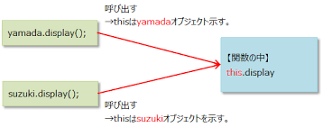
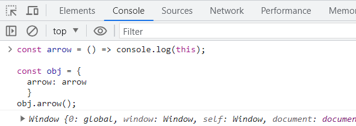
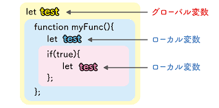

# 第5章: 関数とスコープ、エラー処理 – 処理の部品化とその周辺知識

前回は、計算や比較を行うための「演算子」と、複数の情報をまとめて扱う「配列」や「オブジェクト」について学びましたね。プログラムで扱えるデータの種類が増え、少しずつ複雑なことも表現できるようになってきたのではないでしょうか。

さて今回は、プログラミングの非常に強力な概念である「**関数**」について深く掘り下げていきます！関数とは、特定の処理をひとまとめにして名前をつけた「部品」のようなものです。この部品をうまく使うことで、同じ処理を何度も書く手間を省いたり、プログラム全体をスッキリ整理したり、さらには他の人が作った便利な部品を借りてきたりすることもできるようになります。

そして、関数と密接に関わってくるのが「**スコープ**」という考え方です。これは以前にも少し触れましたが、変数がどの範囲で有効なのか、というルールでしたね。関数を使うことで新しいスコープが生まれるので、その仕組みをしっかり理解することが大切です。

さらに、プログラムを書いていると避けて通れないのが「**エラー**」です。でも心配しないでください！エラーは敵ではなく、プログラムを正しく動かすためのヒントをくれる味方なんです。この章では、エラーが発生したときにどう対処すればよいか（**エラーハンドリング**）についても学んでいきます。

この章をマスターすれば、あなたの書くJavaScriptコードは格段に読みやすく、管理しやすく、そして堅牢になります。まるで、よく整理された工具箱と、どんなトラブルにも対応できる修理マニュアルを手に入れるようなものです。最初は覚えることが多いかもしれませんが、一つ一つ丁寧に解説していきますので、一緒に頑張りましょう！

## 目次

1. 関数ってなんだろう？ – 処理をまとめる魔法の箱
    * 関数宣言 – 基本の形
    * 関数式 – 変数に関数を代入？
    * アロー関数 (ES6+) – モダンで便利な書き方
    * 引数 (parameters) と戻り値 (`return`) – 関数の入出力
    * デフォルト引数 (ES6+) – 引数が省略されたときの備え
    * レストパラメータ (ES6+) – たくさんの引数をまとめて受け取る
2. アロー関数と従来の関数の主な違い – どっちを使う？
    * 巻き上げ (Hoisting) の違い
    * `this` の挙動 – 最大の注意点！
    * `arguments` オブジェクトの有無
    * `new` 演算子での呼び出し
    * `prototype` プロパティの有無
3. 関数の正体はオブジェクト！？ – JavaScriptの柔軟な一面
    * 関数もプロパティを持てる！
    * 関数は第一級オブジェクト – 変数に入れたり、引数にしたり
    * コールバック関数 – 「後で呼んでね」と処理を渡す
    * クロージャの基礎 – 関数が「覚えている」情報
    * `typeof` 演算子の不思議な挙動
4. スコープ再訪 – 変数が見える範囲を再確認！
    * グローバルスコープ、関数スコープ、ブロックスコープ (復習)
    * レキシカルスコープ (静的スコープ) – 関数が「生まれた場所」で決まるルール
5. 即時実行関数 (IIFE) – ちょっと特殊な関数の使い方
    * 定義してすぐに実行！
    * 主な目的 – グローバル汚染を防ぐ (昔ながらのテクニック)
6. エラーハンドリング – 予期せぬ事態に備えよう
    * `try...catch...finally` 構文 – エラーを捕まえて対処する
    * `throw new Error('メッセージ')` – 自分でエラーを発生させる
    * エラーオブジェクトの種類 – エラーにも色々あるんです
7. 高階関数への再言及 – 関数の可能性は無限大！

---

## 1. 関数ってなんだろう？ – 処理をまとめる魔法の箱

関数とは、一連の処理をひとまとめにし、名前を付けて再利用可能にしたものです。同じようなコードを何度も書く必要がなくなり、プログラムが読みやすく、修正しやすくなります。

例えば、誰かに挨拶する処理を考えてみましょう。

```javascript
console.log("こんにちは、高専太郎さん！");
console.log("今日の天気は晴れですね。");

console.log("こんにちは、高専花子さん！");
console.log("今日の天気は晴れですね。");
```

名前が違うだけで、同じようなメッセージを繰り返していますね。これを関数にすると、もっとスッキリ書けます。

```javascript
// "greet" という名前の関数を定義
function greet(name) {
  console.log("こんにちは、" + name + "さん！");
  console.log("今日の天気は晴れですね。");
}

// 関数を呼び出す (使う)
greet("高専太郎");
greet("高専花子");
```

どうでしょう？ `greet` という部品を作って、名前を変えながら再利用できるようになりました。これが関数の基本的な考え方です。

JavaScriptで関数を定義する方法はいくつかあります。

### 関数宣言 – 基本の形

最も基本的な関数の定義方法が**関数宣言**です。`function` キーワードの後に、関数名と丸括弧 `()`、そして処理内容を波括弧 `{}` で囲んで書きます。

```javascript
function sayHello() {
  console.log("やあ！");
}

// 関数を呼び出す
sayHello(); // "やあ！" と表示される
```

### 関数式 – 変数に関数を代入？

関数は、実は変数に代入することもできます。これを**関数式**と呼びます。

```javascript
const sayGoodbye = function() {
  console.log("またね！");
}; // ← 式なので、最後にセミコロンを付けるのが一般的

// 関数を呼び出す
sayGoodbye(); // "またね！" と表示される

// 関数式は、定義する前には呼び出せない（巻き上げの挙動が関数宣言と異なる）
// tryThis(); // エラー！ ReferenceError: Cannot access 'tryThis' before initialization

const tryThis = function() {
  console.log("これは動くかな？");
};
tryThis(); // これは動く
```

関数宣言と関数式の大きな違いの一つに「巻き上げ (Hoisting)」があります。関数宣言は、コードのどこで定義されていても、そのスコープの先頭に巻き上げられるように扱われるため、定義より前で呼び出せます。一方、関数式は変数への代入なので、変数が初期化されるまでは使えません。
（巻き上げについては、前回の「変数とデータ型」の章でも少し触れましたね！）

**個人的には、関数式（特に `const` を使ったもの）を好んで使うことが多いです。** なぜなら、変数のスコープルール（`const` なら再代入不可）が適用されるため、意図しない関数の上書きを防ぎやすいからです。

### アロー関数 (ES6+) – モダンで便利な書き方

ES2015 (ES6) から導入された、より短く、そしていくつかの特徴的な挙動を持つ関数の書き方が**アロー関数**です。

```javascript
// 従来の関数式
const addOld = function(a, b) {
  return a + b;
};
console.log("従来の方法:", addOld(5, 3)); // 従来の方法: 8

// アロー関数
const addNew = (a, b) => {
  return a + b;
};
console.log("アロー関数:", addNew(5, 3)); // アロー関数: 8

// アロー関数の省略形 (処理が1行で、その結果を返す場合)
const multiply = (a, b) => a * b; // {} と return を省略できる
console.log("アロー関数 (省略形):", multiply(5, 3)); // アロー関数 (省略形): 15

// アロー関数の省略形 (引数が1つの場合)
const square = x => x * x; // () も省略できる
console.log("アロー関数 (引数1つ):", square(5)); // アロー関数 (引数1つ): 25

// アロー関数の省略形 (引数がない場合)
const getRandom = () => Math.random();
console.log("アロー関数 (引数なし):", getRandom());

// アロー関数でオブジェクトリテラルを返す場合
// NG例: {} がブロックと解釈されてしまう
// const createPersonBad = (name, age) => { name: name, age: age };
// OK例: () で囲む
const createPersonGood = (name, age) => ({ name: name, age: age });
console.log("アロー関数 (オブジェクト):", createPersonGood("高専一郎", 18));
```

アロー関数は見た目がスッキリするだけでなく、後述する `this` の扱いが従来の関数と異なるという重要な特徴があります。最初は少し戸惑うかもしれませんが、現代のJavaScriptでは非常によく使われるので、ぜひ慣れていきましょう。

### 引数 (parameters) と戻り値 (`return`) – 関数の入出力

関数は、外部から情報を受け取って処理を行い、その結果を外部に返すことができます。

* **引数 (ひきすう, parameters/arguments)**: 関数に渡す情報のことです。関数定義時の丸括弧 `()` の中に書かれるのが「仮引数 (parameter)」、関数呼び出し時に渡す具体的な値が「実引数 (argument)」です。
* **戻り値 (もどりち, return value)**: 関数が処理を終えた後に返す値のことです。`return` キーワードを使って指定します。`return` が実行されると、その時点で関数の処理は終了します。`return` がない関数や、`return;` とだけ書かれた関数は `undefined` を返します。

```javascript
function calculateArea(width, height) { // width と height が仮引数
  if (width <= 0 || height <= 0) {
    console.error("幅と高さは正の数で指定してください。");
    return; // 何も返さずに処理を終了 (undefinedが返る)
  }
  const area = width * height;
  return area; // 計算結果 (area) を戻り値として返す
}

const area1 = calculateArea(10, 5); // 10 と 5 が実引数
console.log("面積1:", area1); // 面積1: 50

const area2 = calculateArea(8, 0); // 不正な引数
console.log("面積2:", area2); // 面積2: undefined (コンソールにはエラーメッセージも表示)

function greet(name, greetingWord) {
  const message = greetingWord + "、" + name + "さん！";
  return message;
}

const greeting1 = greet("高専太郎", "おはよう");
console.log(greeting1); // おはよう、高専太郎さん！

// 引数の数が合わなくてもエラーにはならない (足りない引数は undefined になる)
const greeting2 = greet("高専花子");
console.log(greeting2); // undefined、高専花子さん！ (greetingWord が undefined に)
```

**ポイント:** 関数に渡す引数の数と、関数定義時の仮引数の数が一致していなくても、JavaScriptではエラーになりません。(ほかの言語だとエラーを吐いてくれて、分かりやすいんだけど...)

* 実引数が多い場合: 余分な実引数は無視されます。
* 実引数が少ない場合: 足りない仮引数には `undefined` が入ります。

### デフォルト引数 (ES6+) – 引数が省略されたときの備え

ES6からは、関数の仮引数にデフォルト値を設定できるようになりました。これにより、引数が渡されなかった場合に自動的にそのデフォルト値が使われます。

```javascript
function greetWithDefault(name, greeting = "こんにちは") { // greeting のデフォルト値を "こんにちは" に設定
  console.log(greeting + "、" + name + "さん！");
}

greetWithDefault("高専太郎", "おはよう"); // おはよう、高専太郎さん！
greetWithDefault("高専花子");           // こんにちは、高専花子さん！ (greeting が省略されたのでデフォルト値が使われる)
```

これは、引数が省略される可能性がある場合に非常に便利ですね！

### レストパラメータ (ES6+) – たくさんの引数をまとめて受け取る

ES6からは、関数の仮引数の最後に `...` (三点リーダー) を付けた引数を置くことで、残りの実引数をすべて配列として受け取ることができます。これを**レストパラメータ (Rest Parameters)** と呼びます。

```javascript
function sumAll(...numbers) { // numbers がレストパラメータ (配列になる)
  let total = 0;
  for (const num of numbers) {
    total += num;
  }
  return total;
}

console.log(sumAll(1, 2, 3));       // 6 (numbers は [1, 2, 3] になる)
console.log(sumAll(10, 20, 30, 40)); // 100 (numbers は [10, 20, 30, 40] になる)
console.log(sumAll());              // 0 (numbers は [] になる)

function printProfile(name, age, ...hobbies) { // hobbies がレストパラメータ
  console.log("名前:", name);
  console.log("年齢:", age);
  console.log("趣味:", hobbies.join(", ")); // 配列なので join メソッドなどが使える
}

printProfile("高専一郎", 19, "プログラミング", "読書", "ゲーム");
// 名前: 高専一郎
// 年齢: 19
// 趣味: プログラミング, 読書, ゲーム
```

レストパラメータは、可変長の引数を扱う関数を作るときに非常に役立ちます。

---

## 2. アロー関数と従来の関数の主な違い – どっちを使う？

アロー関数は便利ですが、従来の関数（関数宣言や関数式）と全く同じというわけではありません。いくつかの重要な違いがあり、これらを理解しないと思わぬ挙動に繋がることがあります。

| 特徴                       | 関数宣言 (function declaration) | 関数式 (function expression)   | アロー関数 (=>)                                          |
| :------------------------- | :------------------------------ | :----------------------------- | :------------------------------------------------------- |
| **巻き上げ (Hoisting)**      | 巻き上げられる                  | 変数と同様のルール (TDZあり)   | 変数と同様のルール (TDZあり)                             |
| **`this` の挙動**          | 呼び出し方によって動的に決まる  | 呼び出し方によって動的に決まる | 定義された場所の `this` を引き継ぐ (レキシカル `this`) |
| **`arguments` オブジェクト** | 持つ (関数に渡された引数のリスト) | 持つ (関数に渡された引数のリスト)  | 持たない (レストパラメータで代替)                        |
| **`new` での呼び出し**       | 可能 (コンストラクタとして使える) | 可能 (コンストラクタとして使える)  | 不可 (コンストラクタになれない)                          |
| **`prototype` プロパティ**   | 持つ (コンストラクタとして使われる場合) | 持つ (コンストラクタとして使われる場合)  | 持たない                                                 |

### 巻き上げ (Hoisting) の違い

* **関数宣言**: スコープの先頭に巻き上げられるため、定義前に呼び出せます。
* **関数式・アロー関数**: 変数への代入なので、`let` や `const` で宣言された変数と同様に、初期化されるまではTDZ (Temporal Dead Zone) にありアクセスできません。

```javascript
canCallThis(); // OK! 関数宣言は巻き上げられる

function canCallThis() {
  console.log("関数宣言は呼び出せました！");
}

// cannotCallThisArrow(); // エラー！ ReferenceError: Cannot access 'cannotCallThisArrow' before initialization
const cannotCallThisArrow = () => {
  console.log("アロー関数はまだ呼び出せません。");
};
cannotCallThisArrow(); // OK!

// cannotCallThisExpression(); // エラー！
const cannotCallThisExpression = function() {
  console.log("関数式もまだ呼び出せません。");
};
cannotCallThisExpression(); // OK!
```

### `this` の挙動 – 最大の注意点

これがアロー関数と従来の関数との**最も重要で、かつ混乱しやすい違い**です。

* **従来の関数**: `this` の値は、関数が**どのように呼び出されたか**によって決まります。
  * オブジェクトのメソッドとして呼び出された場合: `this` はそのオブジェクトを指します。
  * 単純な関数として呼び出された場合 (非厳格モード): `this` はグローバルオブジェクト (`window` または `global`) を指します。
  * 単純な関数として呼び出された場合 (厳格モード `'use strict';`): `this` は `undefined` になります。
  * `new` と一緒に呼び出された場合: `this` は新しく作られるインスタンスを指します。
  * `call()`, `apply()`, `bind()` で呼び出された場合: `this` は明示的に指定された値を指します。
* **アロー関数**: `this` の値は、アロー関数が**定義された時点の、外側のスコープの `this`** をそのまま引き継ぎます（これを「レキシカル `this`」と呼びます）。アロー関数自身は `this` を束縛しません。

言葉で説明すると難しいので、例を見てみましょう。

```javascript
// 従来の関数の this
const traditionalObject = {
  name: "従来のオブジェクト",
  greet: function() {
    console.log("従来:", this.name); // this は traditionalObject を指す
    setTimeout(function() {
      // このコールバック関数は単純な関数として呼び出されるため、
      // this はグローバルオブジェクト (ブラウザなら window) を指す (非厳格モードの場合)
      // または undefined (厳格モードの場合)
      console.log("従来setTimeout内:", this ? this.name : this); // undefined (Node.js環境や厳格モード) または window.name
    }, 100);
  }
};
traditionalObject.greet();

// アロー関数の this
const arrowObject = {
  name: "アローオブジェクト",
  greet: function() {
    console.log("アローgreet直下:", this.name); // this は arrowObject を指す
    setTimeout(() => {
      // アロー関数は外側の greet 関数の this (つまり arrowObject) を引き継ぐ
      console.log("アローsetTimeout内:", this.name); // アローsetTimeout内: アローオブジェクト
    }, 200);
  },
  greetArrow: () => {
    // このアロー関数が定義された時点の this は、このオブジェクトリテラルが評価される
    // スコープの this (通常はグローバルオブジェクトまたは undefined) を指す。
    // オブジェクトのメソッドとしてアロー関数を使うのは、通常この挙動のため不適切。
    console.log("アローメソッド:", this ? this.name : this);
  }
};
arrowObject.greet();
arrowObject.greetArrow(); // undefined (またはグローバルオブジェクトのnameプロパティ)

// (おまけ) 従来の関数のthis問題を解決する古い方法 (that = this)
const oldSolutionObject = {
  name: "古い解決策オブジェクト",
  greet: function() {
    console.log("古い解決策:", this.name);
    const that = this; // this を別の変数に退避
    setTimeout(function() {
      console.log("古い解決策setTimeout内:", that.name); // 退避した that を使う
    }, 300);
  }
};
oldSolutionObject.greet();
```

従来の関数の場合


アロー関数の場合

(従来の関数であれば、objを返すところが、arrowを定義したところでのthis=windowが与えられている)

**`this` の挙動はJavaScriptの中でも特に難しい部分の一つです。**
アロー関数は、コールバック関数（他の関数に渡される関数）の中で、外側の `this` をそのまま使いたい場合に非常に便利です。一方、オブジェクトのメソッドを定義する場合は、通常、従来の関数式を使った方が意図通りに `this` がそのオブジェクトを指すため、適切です。

**個人的な使い分けの目安:**

* オブジェクトのメソッドを定義するとき: **従来の関数式** (`methodName: function() { ... }`)
* コールバック関数や、`this` を束縛したくない短い関数: **アロー関数** (`() => { ... }`)
* コンストラクタ関数 (後述): **従来の関数宣言/式**

最初は混乱すると思いますが、実際にコードを書きながら「今、`this` は何を指しているんだろう？」と意識することが大切です。分からなくなったら `console.log(this)` で確認してみましょう！

### `arguments` オブジェクトの有無

* **従来の関数**: 関数内で `arguments` という特別なオブジェクトが使えます。これは、関数に渡された実引数が順番に格納された、配列のようなオブジェクトです（完全な配列ではありません）。
* **アロー関数**: `arguments` オブジェクトを持ちません。代わりに、ES6で導入された**レストパラメータ (`...args`)** を使って引数を配列として受け取ります。

```javascript
function traditionalArgs() {
  console.log("--- 従来の arguments ---");
  console.log(arguments); // Arguments(3) [1, 2, 3, callee: ƒ, Symbol(Symbol.iterator): ƒ] (環境により表示は異なる)
  console.log("最初の引数:", arguments[0]); // 1
  // arguments.forEach(arg => console.log(arg)); // エラー！ arguments は真の配列ではない
  Array.from(arguments).forEach(arg => console.log("要素:", arg)); // 配列に変換すれば使える
}
traditionalArgs(1, 2, 3);

const arrowArgs = (...args) => { // レストパラメータで引数を受け取る
  console.log("--- アロー関数のレストパラメータ ---");
  console.log(args); // [10, 20, 30] (真の配列)
  console.log("最初の引数:", args[0]); // 10
  args.forEach(arg => console.log("要素:", arg)); // 配列なので直接 forEach などが使える
};
arrowArgs(10, 20, 30);
```

現代のJavaScriptでは、可変長の引数を扱う場合はレストパラメータを使うのが一般的で、より安全で分かりやすいです。

### `new` 演算子での呼び出し

前回、オブジェクトは普通、波括弧 `{}` を使った**オブジェクトリテラル**によって作成すると学習しました。

```javascript
// ユーザー情報を格納するオブジェクト
const student = {
  name: "高専花子", // name がキー, "高専花子" が値
  age: 17,
};
console.log("学生情報:", student);

```

だけど、これと同じものを従来の関数に対して、newを使って生成することもできます。（だけどこの書き方は全く推奨しません。ただ、知ってもらうだけで、実際につかわなくてもよい）

* **従来の関数**: `new` 演算子と一緒に呼び出すことで、コンストラクタ関数として機能し、新しいオブジェクトのインスタンスを生成できます。
* **アロー関数**: `new` 演算子と一緒に呼び出すことはできません。コンストラクタにはなれません。

```javascript
function Person(name,age) {
  this.name = name;
  this.age= age;
}
const person1 = new Person("高専太郎",17);
console.log(person1.name); // 高専太郎

// const PersonArrow = (name) => {
//   this.name = name; // アロー関数は this を持たないので、意図通りに動かない
// };
// const person2 = new PersonArrow("高専花子"); // エラー！ TypeError: PersonArrow is not a constructor
```

オブジェクト指向プログラミングでクラスのようなものを作る場合（詳しくは後の章で学びます）、コンストラクタは従来の関数を使う必要があります。（ES6以降は `class` 構文を使うのが一般的です。）

### `prototype` プロパティの有無

* **従来の関数**: `prototype` という特別なプロパティを持ちます。これは、その関数がコンストラクタとして使われたときに、生成されるインスタンスの「原型 (プロトタイプ)」となるオブジェクトを指します。
* **アロー関数**: `prototype` プロパティを持ちません。

```javascript
function TraditionalFunction() {}
console.log(typeof TraditionalFunction.prototype); // "object"

const ArrowFunction = () => {};
console.log(typeof ArrowFunction.prototype);    // "undefined"
```

プロトタイプについては、オブジェクト指向プログラミングを学ぶ際にもう少し詳しく触れます。今は「アロー関数には `prototype` がないんだな」くらいで大丈夫です。

---

## 3. 関数の正体はオブジェクト！？ – JavaScriptの柔軟な一面

ここまでの説明で、関数は「処理をまとめたもの」というイメージが強いかもしれません。しかし、JavaScriptの世界では、**関数も実は「オブジェクト」の一種**なんです！

「えっ、どういうこと？」と驚くかもしれませんが、この性質がJavaScriptの柔軟性や表現力を支える重要な要素の一つになっています。
（めんどくさくしている、一因でもある）

### 関数もプロパティを持てる

オブジェクトなので、関数もプロパティを持つことができます。

```javascript
function myAwesomeFunction() {
  console.log("すごい関数が実行された！");
}

// 関数にプロパティを追加
myAwesomeFunction.version = "1.0";
myAwesomeFunction.description = "これはテスト用のすごい関数です。";
myAwesomeFunction.author = "私";

// 関数のプロパティにアクセス
console.log("バージョン:", myAwesomeFunction.version); // バージョン: 1.0
console.log("説明:", myAwesomeFunction.description); // 説明: これはテスト用のすごい関数です。

// もちろん関数として呼び出すこともできる
myAwesomeFunction(); // すごい関数が実行された！
```

このように、関数自体に情報を付加することができるのです。あまり多用するテクニックではありませんが、「関数もオブジェクトなんだ」という証拠の一つとして覚えておくと良いでしょう。

### 関数は第一級オブジェクト – 変数に入れたり、引数にしたり

JavaScriptでは、関数は**第一級オブジェクト (First-class Object)** として扱われます。これは、関数が他のデータ型（数値や文字列、オブジェクトなど）とほぼ同じように扱える、という意味です。

具体的には、以下のことができます。

* 変数に代入できる（関数式ですでにやりましたね！）
* オブジェクトのプロパティの値にできる（メソッドのことです！）
* 配列の要素にできる
* **他の関数の引数として渡せる**
* **他の関数の戻り値として返せる**

この「他の関数の引数として渡せる」「他の関数の戻り値として返せる」という性質が、特に重要で強力です。

### コールバック関数 – 「後で呼んでね」と処理を渡す

他の関数に引数として渡される関数のことを、**コールバック関数 (Callback Function)** と呼びます。
これは、「ある処理が終わった後で、この関数を呼び出してね」というように、処理の実行タイミングを制御したい場合によく使われます。

```javascript
// taskRunner関数は、実行したい処理 (action) と、その処理に渡す値 (value) を受け取る
function taskRunner(action, value) {
  console.log(value + " を使って処理を開始します...");
  // ここで action (コールバック関数) を実行する
  action(value);
  console.log("処理が完了しました。");
}

// コールバック関数1: 数値を2倍にする
function doubleValue(num) {
  console.log(num + " の2倍は " + (num * 2) + " です。");
}

// コールバック関数2: 文字列を大文字にする
const shout = (text) => {
  console.log(text.toUpperCase() + "!!!");
};

// taskRunner に doubleValue 関数を渡す
taskRunner(doubleValue, 10);
/*
出力:
10 を使って処理を開始します...
10 の2倍は 20 です。
処理が完了しました。
*/

// taskRunner に shout 関数を渡す
taskRunner(shout, "こんにちは");
/*
出力:
こんにちは を使って処理を開始します...
コンニチハ!!!
処理が完了しました。
*/

// イベントリスナーもコールバック関数の代表例 (これは後の章で詳しく)
// buttonElement.addEventListener('click', function() {
//   console.log("ボタンがクリックされました！"); // この無名関数がコールバック
// });
```

`setTimeout` も、指定した時間後に実行されるコールバック関数を受け取りますね。
コールバック関数は、非同期処理（時間がかかる処理）を扱う際にも非常に重要な役割を果たします。

### クロージャの基礎 – 関数が「覚えている」情報

関数が他の関数の戻り値として返される場合、その返された関数は、自分が定義されたときの「環境（スコープ）」を覚えています。この仕組みを**クロージャ (Closure)** と呼びます。

ちょっと難しい概念ですが、簡単な例で見てみましょう。

```javascript
function createGreeter(greeting) {
  // greeting は createGreeter 関数のスコープ内にある変数

  // 内部関数 (これが返される)
  function greeter(name) {
    console.log(greeting + "、" + name + "さん！");
  }

  return greeter; // 内部関数 greeter を返す
}

// createGreeter を呼び出して、戻り値 (greeter関数) を変数に格納
const sayHello = createGreeter("こんにちは"); // greeting に "こんにちは" が設定された greeter 関数
const sayGoodMorning = createGreeter("おはようございます"); // greeting に "おはようございます" が設定された greeter 関数

// 返された関数を実行
sayHello("高専太郎");      // こんにちは、高専太郎さん！
sayGoodMorning("高専花子"); // おはようございます、高専花子さん！
sayHello("高専次郎");      // こんにちは、高専次郎さん！
```

`sayHello` や `sayGoodMorning` は、`createGreeter` 関数から返された `greeter` 関数です。
注目すべきは、`sayHello` が呼び出されたとき、`createGreeter` 関数の実行はとっくに終わっているにも関わらず、`greeting` の値（"こんにちは"）を覚えている点です。同様に `sayGoodMorning` は "おはようございます" を覚えています。

これがクロージャの力です。関数が、それが定義されたときの「周りの状況（変数など）」を閉じ込めて持ち運んでいるようなイメージです。
クロージャは、プライベートな変数を実現したり、状態を保持する関数を作ったりするのに役立ちます。最初は少し難解に感じるかもしれませんが、JavaScriptの強力な機能の一つなので、徐々に慣れていきましょう。

### `typeof` 演算子の不思議な挙動

関数がオブジェクトの一種であるにも関わらず、`typeof` 演算子で関数の型を調べると、`"object"` ではなく `"function"` と表示されます。

```javascript
function myFunction() {}
const myArrowFunction = () => {};

console.log(typeof myFunction);      // "function"
console.log(typeof myArrowFunction); // "function"
console.log(typeof {});              // "object"
```

これは、JavaScriptの仕様で、関数が「呼び出し可能なオブジェクト (Callable Object)」という特別な種類のオブジェクトとして扱われるためです。内部的に `[[Call]]` という特別な仕組みを持っています。

---

## 4. スコープ再訪 – 変数が見える範囲を再確認

「変数とデータ型」の章で、変数が有効な範囲である**スコープ**について学びましたね。関数は新しいスコープを作り出すため、ここで改めてスコープの概念を深掘りしましょう。

### グローバルスコープ、関数スコープ、ブロックスコープ (復習)

* **グローバルスコープ**: プログラムの最も外側で宣言された変数が持つスコープ。どこからでもアクセス可能ですが、多用は避けるべきです。
* **関数スコープ**: `var` (古い書き方) で関数内で宣言された変数が持つスコープ。その関数内でのみ有効。
* **ブロックスコープ**: `let` や `const` で `{}` (ブロック) 内で宣言された変数が持つスコープ。そのブロック内でのみ有効。

```javascript
const globalVar = "私はグローバル";

function myFunctionScope() {
  var functionVar = "私は関数スコープ (var)"; // 関数スコープ
  let blockVarInFunc = "私は関数内のブロックスコープ (let)"; // ブロックスコープ

  if (true) {
    let blockVar = "私はifブロック内のブロックスコープ (let)";
    const anotherBlockVar = "私もifブロック内のブロックスコープ (const)";
    console.log(globalVar);       // OK
    console.log(functionVar);     // OK
    console.log(blockVarInFunc);  // OK
    console.log(blockVar);        // OK
    console.log(anotherBlockVar); // OK
  }
  // console.log(blockVar); // エラー！ ReferenceError: blockVar is not defined
}

myFunctionScope();
// console.log(functionVar); // エラー！
// console.log(blockVarInFunc); // エラー！
```

### レキシカルスコープ (静的スコープ) – 関数が「生まれた場所」で決まるルール

JavaScriptのスコープは、**レキシカルスコープ (Lexical Scope)** または**静的スコープ (Static Scope)** と呼ばれるルールに従います。これは、「**変数がどのスコープに属するかは、コードが書かれた時点で決まり、関数の呼び出し方によって変わることはない**」というルールです。

つまり、関数は、それが**定義された場所の「空気」（スコープチェーン）を覚えている**のです。

```javascript
const x = 10; // グローバルスコープの x

function outerFunc() {
  const y = 20; // outerFunc のスコープの y

  function innerFunc() {
    const z = 30; // innerFunc のスコープの z
    console.log("innerFunc内:");
    console.log("x:", x); // 10 (グローバルスコープのxを参照)
    console.log("y:", y); // 20 (outerFuncのスコープのyを参照)
    console.log("z:", z); // 30 (自身のスコープのzを参照)
  }

  console.log("outerFunc内 (innerFunc呼び出し前):");
  console.log("x:", x); // 10
  console.log("y:", y); // 20
  // console.log("z:", z); // エラー！ innerFuncのスコープのzにはアクセスできない

  innerFunc(); // innerFunc を呼び出す
}

outerFunc();

// イメージ図
// +-------------------------------- グローバルスコープ (x=10)
// |
// |  function outerFunc() {
// |    +---------------------------- outerFuncのスコープ (y=20)
// |    |
// |    |  function innerFunc() {
// |    |    +---------------------- innerFuncのスコープ (z=30)
// |    |    |                      アクセス可能: z, y, x
// |    |    +----------------------
// |    |  }
// |    |                          アクセス可能: y, x (zには不可)
// |    +----------------------------
// |  }
// |                                アクセス可能: x (y, zには不可)
// +--------------------------------
```

`innerFunc` は `outerFunc` の中で定義されているため、`innerFunc` は `outerFunc` のスコープ（`y` がある場所）と、さらにその外側のグローバルスコープ（`x` がある場所）にアクセスできます。
この「関数が定義された場所でスコープが決まる」という性質が、先ほど説明したクロージャの基礎にもなっています。




---

## 5. 即時実行関数 (IIFE) – ちょっと特殊な関数の使い方

**即時実行関数 (Immediately Invoked Function Expression, IIFE)** とは、関数を定義すると同時に実行する書き方です。

### 定義してすぐに実行

構文は少し変わっていて、関数全体を `()` で囲み、その直後にさらに `()` を付けて呼び出します。

```javascript
(function() {
  const message = "これはIIFEからのメッセージです！";
  console.log(message);
  // この中の変数は、このIIFEのスコープ内に閉じ込められる
})(); // ← ここで即時実行！

// アロー関数でも書けます
(() => {
  const arrowMessage = "アロー関数を使ったIIFEです！";
  console.log(arrowMessage);
})();

// 引数を渡すことも可能
(function(name) {
  console.log("こんにちは、" + name + "さん！ (IIFEより)");
})("高専ゲスト");
```

### 主な目的 – グローバル汚染を防ぐ (昔ながらのテクニック)

IIFEの主な目的は、**プライベートなスコープを作成し、グローバルスコープを汚染するのを防ぐ**ことです。
IIFE内で宣言された変数は、そのIIFEの外部からはアクセスできません。

昔のJavaScriptでは、モジュールシステム（コードを部品化する仕組み）が標準で備わっていなかったため、ライブラリなどが自身のコードをIIFEで囲み、グローバル変数名を汚さないようにするテクニックがよく使われていました。

```javascript
let globalCounter = 100;

(function() {
  let localCounter = 10; // この変数はIIFEの外からは見えない
  globalCounter += localCounter; // グローバル変数は参照・変更できる
  console.log("IIFE内のglobalCounter:", globalCounter); // 110
  console.log("IIFE内のlocalCounter:", localCounter);   // 10
})();

console.log("IIFE後のglobalCounter:", globalCounter); // 110
// console.log(localCounter); // エラー！ ReferenceError: localCounter is not defined
```

現代のJavaScriptでは、ES Modulesという標準のモジュールシステムが使えるようになったため、グローバル汚染を防ぐ目的でのIIFEの必要性は薄れています。しかし、古いコードを読む際や、特定の状況（例えばビルドツールが生成するコードなど）で見かけることがあるかもしれません。

---

## 6. エラーハンドリング – 予期せぬ事態に備えよう

プログラムを書いていると、どうしてもエラーが発生することがあります。例えば、ユーザーが予期しない値を入力したり、ネットワーク接続が切れたり、あるいは単純なタイプミスだったり。
エラーが発生するとプログラムは停止してしまいますが、**エラーハンドリング**を行うことで、エラーを優雅に処理し、プログラムのクラッシュを防いだり、ユーザーに分かりやすいメッセージを伝えたりすることができます。

### `try...catch...finally` 構文 – エラーを捕まえて対処する

JavaScriptでエラーハンドリングを行う基本的な構文が `try...catch...finally` です。

* `try` ブロック: エラーが発生する可能性のあるコードをここに書きます。
* `catch` ブロック: `try` ブロック内でエラーが発生した場合に、このブロックのコードが実行されます。エラーオブジェクトを引数として受け取ることができます。
* `finally` ブロック (任意): エラーが発生したかどうかに関わらず、`try` または `catch` ブロックの処理が終わった後に**必ず**実行されるコードをここに書きます。リソースの解放処理（例えばファイルを開いたら閉じるなど）によく使われます。

```javascript
function divide(a, b) {
  try {
    console.log("計算を開始します...");
    if (b === 0) {
      throw new Error("0で割ることはできません！"); // 意図的にエラーを発生させる
    }
    const result = a / b;
    console.log("計算結果:", result);
    return result;
  } catch (error) { // error オブジェクトにはエラーに関する情報が入る
    console.error("エラーが発生しました！");
    console.error("エラー名:", error.name);       // 例: "Error"
    console.error("メッセージ:", error.message); // 例: "0で割ることはできません！"
    // console.error("スタックトレース:", error.stack); // どこでエラーが起きたかの詳細情報
    return undefined; // エラー時は undefined を返すなど、適切な処理を行う
  } finally {
    console.log("計算処理を終了します。"); // エラーがあってもなくても実行される
  }
}

console.log("--- 成功するケース ---");
divide(10, 2);
/*
出力:
計算を開始します...
計算結果: 5
計算処理を終了します。
*/

console.log("\n--- エラーが発生するケース ---");
divide(10, 0);
/*
出力:
計算を開始します...
エラーが発生しました！
エラー名: Error
メッセージ: 0で割ることはできません！
計算処理を終了します。
*/

console.log("\n--- finally のみのテスト ---");
try {
  console.log("tryブロック実行");
  // throw new Error("テストエラー"); // これを有効にするとcatchも実行される
} catch (e) {
  console.log("catchブロック実行:", e.message);
} finally {
  console.log("finallyブロックは必ず実行");
}
```

### `throw new Error('メッセージ')` – 自分でエラーを発生させる

プログラムの特定の条件で、処理を続行できないと判断した場合、`throw` 文を使って意図的にエラーを発生させることができます。
通常、`new Error('エラーメッセージ')` のように、`Error` オブジェクト（またはその派生オブジェクト）を `throw` します。

```javascript
function processUserData(user) {
  if (!user) {
    throw new Error("ユーザーデータが指定されていません。");
  }
  if (typeof user.name !== 'string' || user.name.trim() === '') {
    throw new TypeError("ユーザー名が不正です。文字列で、空であってはいけません。");
  }
  if (typeof user.age !== 'number' || user.age < 0) {
    throw new RangeError("年齢が不正です。0以上の数値を指定してください。");
  }

  console.log(user.name + " (" + user.age + "歳) の処理を開始します。");
  // ... 実際の処理 ...
}

try {
  // processUserData({ name: "高専太郎", age: 20 }); // 成功ケース
  // processUserData({ name: " ", age: 25 }); // TypeErrorケース
  processUserData({ name: "高専花子", age: -5 }); // RangeErrorケース
  // processUserData(null); // Errorケース
} catch (e) {
  console.error("処理中にエラー:", e.message, `(エラータイプ: ${e.name})`);
}
```

### エラーオブジェクトの種類 – エラーにも色々あるんです

JavaScriptには、いくつかの標準的なエラーオブジェクトの種類があります。これらを適切に使い分けることで、エラーの原因をより特定しやすくなります。

* **`Error`**: 最も一般的なエラーオブジェクト。特定のカテゴリに当てはまらない場合に使います。
* **`TypeError`**: 値が期待される型でない場合に発生します。例えば、数値を期待する場所に関数が渡された場合など。
* **`SyntaxError`**: JavaScriptの文法が間違っている場合に発生します。これは通常、`try...catch` で捕まえる前にパーサーが検出します。
* **`ReferenceError`**: 存在しない変数を参照しようとした場合に発生します。
* **`RangeError`**: 数値が許容される範囲を超えた場合に発生します。例えば、配列の不正な長さなど。
* **`URIError`**: `encodeURI()` や `decodeURI()` などのURI関連関数が不正なURIを扱おうとした場合に発生します。


`catch` ブロックでエラーオブジェクトの `name` プロパティを見ることで、どんな種類のエラーが発生したかを知ることができます。

エラーハンドリングは、堅牢でユーザーフレンドリーなアプリケーションを作るために不可欠なスキルです。エラーメッセージを恐れずに、積極的に `try...catch` を活用していきましょう！

---

## 7. 高階関数への再言及 – 関数の可能性は無限大

この章の最初の方で、「関数は第一級オブジェクト」であり、「他の関数の引数として渡せる（コールバック関数）」「他の関数の戻り値として返せる（クロージャの基礎）」という話をしましたね。

このように、**関数を引数に取ったり、関数を戻り値として返したりする関数のことを、一般に高階関数 (Higher-Order Function)** と呼びます。

高階関数は、JavaScriptプログラミングにおいて非常に強力なパターンです。

* **処理の抽象化**: 特定の処理パターンを共通化し、具体的な動作だけをコールバック関数で差し替えることができます。
  * 例: 配列の各要素に対して同じ操作を行う `forEach`, `map`, `filter` (これらは後の章で詳しく学びます！)
* **コードの再利用性向上**: 汎用的な高階関数を作れば、様々な場面で使い回せます。
* **非同期処理の制御**: コールバック関数やPromise (これも後の章で) と組み合わせることで、複雑な非同期処理を分かりやすく記述できます。
* **関数型プログラミングスタイル**: JavaScriptで関数型プログラミングの考え方を取り入れる際の基礎となります。

```javascript
// 配列の各要素を処理する高階関数の例 (mapもどき)
function mapArray(array, transformFn) {
  const newArray = [];
  for (const item of array) {
    newArray.push(transformFn(item)); // コールバック関数で要素を変換
  }
  return newArray;
}

const numbers = [1, 2, 3, 4];
const doubled = mapArray(numbers, (num) => num * 2);
console.log("2倍:", doubled); // 2倍: [ 2, 4, 6, 8 ]

const squared = mapArray(numbers, (num) => num * num);
console.log("2乗:", squared); // 2乗: [ 1, 4, 9, 16 ]

// 関数を返す高階関数の例 (クロージャの応用)
function createMultiplier(factor) {
  return function(number) { // この内部関数が返される (factorを覚えている)
    return number * factor;
  };
}

const multiplyByFive = createMultiplier(5); // 5倍する関数を生成
const multiplyByTen = createMultiplier(10);  // 10倍する関数を生成

console.log("5倍:", multiplyByFive(7));   // 5倍: 35
console.log("10倍:", multiplyByTen(7));  // 10倍: 70
```

高階関数は、最初は少し抽象的で難しく感じるかもしれませんが、使いこなせるようになるとJavaScriptで書けるプログラムの表現力が格段に向上します。今後の学習でも度々登場しますので、頭の片隅に置いておいてくださいね。

---

## ✏️ 本日の演習

さあ、今日学んだことを早速試してみましょう！

1. **挨拶関数を作ろう！**
    * `greetUser` という名前の関数を**関数宣言**で作成してください。
    * この関数は、引数として `userName` (文字列) と `greetingWord` (文字列、デフォルト値は "こんにちは") を受け取ります。
    * 関数内で、`greetingWord + "、" + userName + "さん！素敵な一日を！"` というメッセージを組み立て、それを**戻り値**として返してください。
    * 作成した関数を何度か呼び出し、戻り値を `console.log()` で表示してください。
        * 例1: `greetUser("高専一郎", "ヤッホー")`
        * 例2: `greetUser("高専花子")` (デフォルトの挨拶が使われることを確認)
2. **計算機アロー関数！**
    * 二つの数値を受け取り、それらの和を返すアロー関数 `add` を作成してください。
    * 二つの数値を受け取り、それらの差を返すアロー関数 `subtract` を作成してください。
    * 二つの数値と、処理内容を表す文字列（"add" または "subtract"）を受け取る関数 `calculate` を**関数式**で作成してください。
    * `calculate` 関数は、処理内容の文字列に応じて、`add` 関数または `subtract` 関数を呼び出し、その結果を返すようにしてください。もし処理内容の文字列が "add" でも "subtract" でもない場合は、エラーメッセージをコンソールに表示し、`null` を返してください。
    * `calculate` 関数を使って、いくつかの計算結果を `console.log()` で表示してください。
3. **`this` の探求！ (少し難しいかも)**
    * 以下のオブジェクトを作成してください。

        ```javascript
        const myCounter = {
          count: 0,
          incrementTraditional: function() {
            // ここで this.count を1増やす
            // console.log("Traditional this:", this);
          },
          incrementArrow: () => {
            // ここで this.count を1増やす (どうなるか予想してみよう)
            // console.log("Arrow this:", this);
          },
          showCount: function() {
            console.log("現在のカウント:", this.count);
          }
        };
        ```

    * `incrementTraditional` メソッドと `incrementArrow` メソッドを完成させてください。
    * `myCounter.incrementTraditional();` と `myCounter.incrementArrow();` をそれぞれ数回呼び出し、`myCounter.showCount();` で結果を確認してください。
    * なぜそのような結果になったのか、`this` の挙動を踏まえて説明を試みてください。（コメントアウトされている `console.log(this)` を有効にして、`this` が何を指しているか確認するのも良いでしょう。）
4. **エラーキャッチ練習！**
    * 引数として数値を受け取り、その数値が負の場合は `RangeError` を `throw` し、そうでなければその数値の平方根を返す関数 `getSafeSquareRoot` を作成してください。（平方根は `Math.sqrt()` で計算できます）
    * `try...catch` 構文を使って `getSafeSquareRoot` 関数を呼び出し、以下のケースを試してください。
        * 正の数を渡した場合（例: `getSafeSquareRoot(9)`）
        * 負の数を渡した場合（例: `getSafeSquareRoot(-4)`）
        * エラーが発生した場合は、`catch` ブロックでエラーメッセージをコンソールに表示してください。
        * `finally` ブロックで「平方根計算処理を試みました。」と表示してください。

---
---
---

### 演習の解答例

```javascript
// 演習1: 挨拶関数を作ろう！
console.log("--- 演習1 ---");
function greetUser(userName, greetingWord = "こんにちは") {
  return greetingWord + "、" + userName + "さん！素敵な一日を！";
}

const greeting1_ex1 = greetUser("高専一郎", "ヤッホー");
console.log(greeting1_ex1);

const greeting2_ex1 = greetUser("高専花子");
console.log(greeting2_ex1);

// 演習2: 計算機アロー関数！
console.log("\n--- 演習2 ---");
const add = (a, b) => a + b;
const subtract = (a, b) => a - b;

const calculate = function(num1, num2, operation) {
  if (operation === "add") {
    return add(num1, num2);
  } else if (operation === "subtract") {
    return subtract(num1, num2);
  } else {
    console.error("不正な操作が指定されました:", operation);
    return null;
  }
};

console.log("10 + 5 =", calculate(10, 5, "add"));
console.log("10 - 5 =", calculate(10, 5, "subtract"));
console.log("10 * 5 =", calculate(10, 5, "multiply")); // エラーメッセージが表示され null が返る

// 演習3: this の探求！
console.log("\n--- 演習3 ---");
const myCounter = {
  count: 0,
  incrementTraditional: function() {
    this.count++; // この this は myCounter オブジェクトを指す
    // console.log("Traditional this:", this);
  },
  incrementArrow: () => {
    // アロー関数内の this は、定義された場所の this を引き継ぐ。
    // この場合、myCounter オブジェクトリテラルが評価されるスコープの this。
    // グローバルスコープで定義されていれば、ブラウザなら window、Node.jsならグローバルオブジェクトかundefined。
    // そのため、意図した myCounter.count は増えない。
    // this.count++; // これを実行すると、グローバルスコープに count プロパティが作られるか、エラーになる可能性がある
    // console.log("Arrow this:", this);
    console.warn("incrementArrow: アロー関数内のthisはmyCounterを指さないため、カウントは増えません。");
  },
  showCount: function() {
    console.log("現在のカウント:", this.count);
  }
};

myCounter.incrementTraditional();
myCounter.incrementTraditional();
myCounter.showCount(); // 現在のカウント: 2

myCounter.incrementArrow(); // 警告が表示される
myCounter.incrementArrow(); // 警告が表示される
myCounter.showCount(); // 現在のカウント: 2 (変わらない)

/*
演習3の解説:
- incrementTraditional: 従来の関数なので、メソッドとして呼び出されたとき (`myCounter.incrementTraditional()`) の `this` は `myCounter` オブジェクト自身を指します。そのため、`this.count` は `myCounter.count` となり、正しくカウントアップされます。
- incrementArrow: アロー関数なので、`this` はレキシカルスコープの `this` を引き継ぎます。このオブジェクトリテラルがグローバルスコープで定義されている場合、アロー関数内の `this` はグローバルオブジェクト (ブラウザなら `window`) または `undefined` (厳格モードやNode.jsのモジュールスコープなど) を指します。そのため、`this.count` は `myCounter.count` ではなく、グローバルな `count` (存在しなければ `undefined.count` でエラーになるか、`window.count` が作られる) を参照しようとします。結果として、`myCounter.count` は変更されません。
オブジェクトのメソッドを定義する際は、通常、従来の関数式を使う方が意図通りに動作します。
*/

// 演習4: エラーキャッチ練習！
console.log("\n--- 演習4 ---");
function getSafeSquareRoot(number) {
  if (typeof number !== 'number') {
    throw new TypeError("引数は数値である必要があります。");
  }
  if (number < 0) {
    throw new RangeError("負の数の平方根は計算できません（実数の範囲では）。");
  }
  return Math.sqrt(number);
}

function testSquareRoot(value) {
  try {
    console.log(`getSafeSquareRoot(${value}) を試します...`);
    const result = getSafeSquareRoot(value);
    if (result !== undefined) { // エラーなく結果が返ってきた場合
        console.log(`${value} の平方根は ${result} です。`);
    }
  } catch (e) {
    console.error(`エラー発生: ${e.message} (タイプ: ${e.name})`);
  } finally {
    console.log("平方根計算処理を試みました。");
    console.log("---");
  }
}

testSquareRoot(9);
testSquareRoot(-4);
testSquareRoot("abc"); // TypeErrorを発生させるテスト

```

---

## まとめと次回予告

お疲れ様でした！今回は、JavaScriptプログラミングの中核をなす「関数」について、その定義方法から、アロー関数との違い、スコープとの関係、そしてエラーへの対処法まで、幅広く学びました。

* 関数は処理をまとめた**部品**であり、**関数宣言**、**関数式**、**アロー関数**といった定義方法があること。
* 関数は**引数**を受け取り、**戻り値**を返すことができること。
* アロー関数は従来の関数と、特に **`this` の挙動**が大きく異なること。
* JavaScriptでは**関数もオブジェクトの一種**であり、変数に代入したり、他の関数に渡したり（**コールバック関数**）、返したり（**クロージャ**）できること。
* 変数の有効範囲である**スコープ**は、関数が定義された場所で決まる**レキシカルスコープ**であること。
* **`try...catch...finally`** を使って、エラーを適切に処理（**エラーハンドリング**）できること。

関数を使いこなせるようになると、プログラムの見通しが格段に良くなり、より複雑な処理も組み立てられるようになります。特に `this` の挙動やクロージャは、最初は少し難しく感じるかもしれませんが、実際にコードを書きながら試行錯誤することで、だんだんと感覚が掴めてくるはずです。

もし途中で分からなくなったり、エラーが出たりしたら、遠慮なく部長のかとーに質問してください。

ここで、まずJavascriptというプログラミング言語の勉強はひとまず区切りにしましょう。

次回は、いよいよブラウザ上でJavaScriptを動かすための第一歩、「**DOMの探求 – HTMLをJavaScriptで操る**」です！JavaScriptを使ってウェブページの内容を動的に変更したり、ユーザーの操作に反応したりする方法を学んでいきます。ウェブ開発の面白さが一気に花開く章ですので、お楽しみに！
