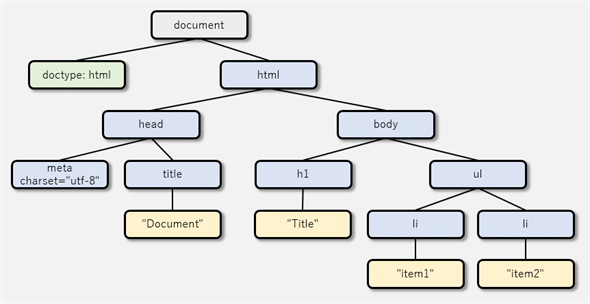
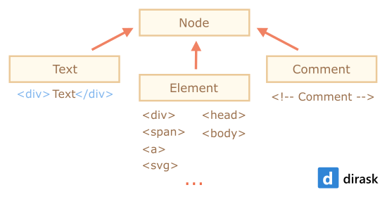
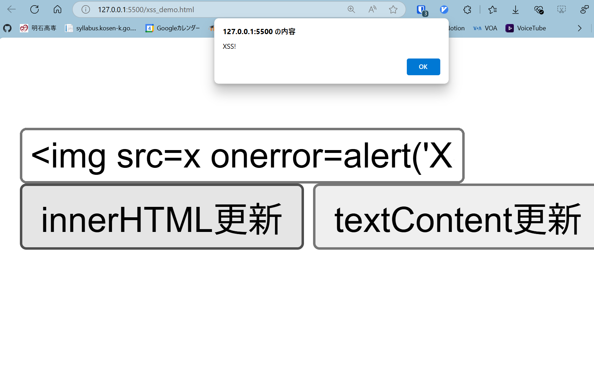
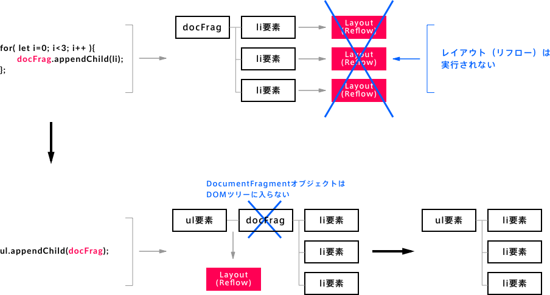
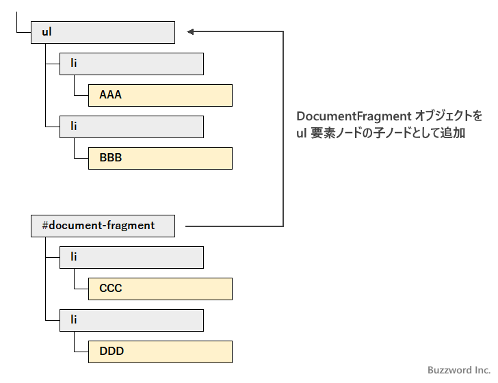
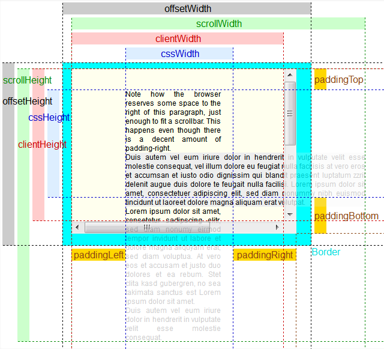
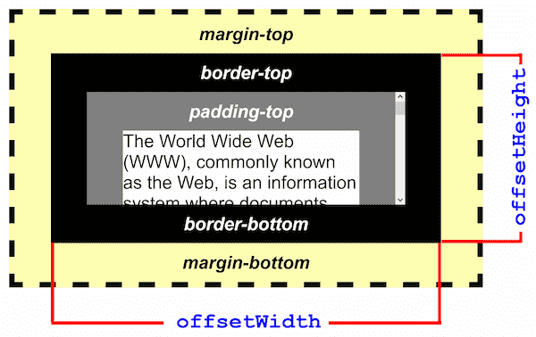

# 第6章: DOMの探求 – HTMLをJavaScriptで操る

前回は、プログラムの流れを自在に操る「制御フロー」について学びましたね！`if`文で条件によって処理を変えたり、`for`ループで同じ処理を繰り返したりできるようになり、作れるプログラムの幅がぐっと広がったことと思います。

さて今回は、いよいよJavaScriptの真骨頂とも言える「**DOM操作**」について学んでいきます。DOMって何？って思うかもしれませんが、簡単に言うと「**JavaScriptを使ってウェブページのHTML要素を自由自在に操るための仕組み**」のことです。これができるようになると、ユーザーのアクションに応じてウェブページの内容を動的に変えたり、アニメーションをつけたりと、インタラクティブなウェブサイトを作れるようになります！

例えば、「ボタンをクリックしたら新しいメッセージが表示される」「入力フォームに文字を入れたらリアルタイムでプレビューが変わる」といった動きは、このDOM操作の技術が使われています。最初は覚えることが少し多く感じるかもしれませんが、一つ一つ丁寧に見ていけば大丈夫。この章をマスターすれば、あなたのウェブページがまるで生きているかのように動き出すはずです。さあ、HTMLを自在に操る魔法使いになるための第一歩を踏み出しましょう！

## 目次

1. DOMって何？ – HTMLをオブジェクトとして捉える
    * DOMツリー – HTMLの構造を図で見てみよう
    * `document`オブジェクト – DOM操作の入り口
2. HTML要素を捕まえよう！ – DOM要素の取得
    * IDで取得: `document.getElementById()`
    * タグ名で取得: `document.getElementsByTagName()`
    * クラス名で取得: `document.getElementsByClassName()`
    * ちょっと寄り道：CSSセレクタってなんだっけ？（復習）
    * CSSセレクタで取得 (万能選手！): `document.querySelector()`, `document.querySelectorAll()`
    * ライブコレクション vs 静的コレクション – ちょっとした罠に注意！
3. ノードって色々あるの？ – ノードの種類
    * 要素ノード、テキストノード、コメントノード
    * `element.childNodes` と `element.children` の違い
4. 見た目を変えよう！ – DOM要素の内容変更
    * テキストだけ変更: `element.textContent` (安全！)
    * HTMLごと変更: `element.innerHTML` (XSSに注意！)
5. 属性を操ろう！ – DOM要素の属性操作
    * 属性の値を取得: `element.getAttribute()`
    * 属性の値を設定: `element.setAttribute()`
    * 属性を削除: `element.removeAttribute()`
    * データ属性 (`data-*`) – HTMLに情報を埋め込む便利な方法
6. スタイルを動的に変えよう！ – DOM要素のスタイル操作
    * 直接スタイルを変更: `element.style.property` (あまりオススメしない？)
    * クラスを付け外し: `element.classList` (こっちが本命！)
7. HTML要素を動的に作ったり消したり！ – DOM要素の変更
    * 新しい要素を作る: `document.createElement()`
    * 要素を追加する: `parentElement.appendChild()`, `parentElement.insertBefore()`
    * 要素を置き換える: `parentElement.replaceChild()`
    * 要素を削除する: `childElement.remove()`, `parentElement.removeChild()`
    * 要素をコピーする: `element.cloneNode()`
8. DOM操作のパフォーマンス – ちょっとだけ意識してみよう
    * `DocumentFragment` – まとめて追加で効率アップ！
    * ループの外で要素を参照
    * CSSの `display: none` の活用
9. 要素の大きさや位置を知りたい！
    * `offsetWidth`, `offsetHeight`
    * `getBoundingClientRect()` – ビューポート基準の情報

---

## 1. DOMって何？ – HTMLをオブジェクトとして捉える

**DOM (Document Object Model)** とは、ウェブページ (HTMLやXML文書) をプログラムから利用できるようにするための「取り決め」や「表現方法」のことです。なんだか難しそうに聞こえますが、要するに**HTMLのタグやテキストなどを、JavaScriptが扱いやすい「オブジェクト」の集まりとして表現したもの**、とイメージしてください。

例えば、こんなHTMLがあったとします。

```html
<!DOCTYPE html>
<html>
<head>
  <title>Document</title>
</head>
<body>
  <h1>Title</h1>
  <ul>
    <li>Item1</li>
    <li>Item2</li>
  </ul>
</body>
</html>
```

このHTMLを、JavaScriptはDOMを通して、下のような階層構造（ツリー構造）として認識します。

### DOMツリー – HTMLの構造を図で見てみよう



* 一番上の `<html>` が木の根っこ（ルート）で、そこから `<head>` や `<body>` が枝分かれし、さらにその下に `<title>`, `<h1>`, `<ul>`, `<li>` といった要素が葉っぱのようにつながっています。
* この一つ一つの要素やテキスト、コメントなどを**ノード (Node)** と呼びます。
* JavaScriptは、このDOMツリーを辿って特定の要素にアクセスしたり、新しい要素を追加したり、既存の要素の内容を変更したりできるのです。

### `document`オブジェクト – DOM操作の入り口

JavaScriptでDOMを操作するとき、その全ての操作の出発点となるのが `document` オブジェクトです。これはブラウザが自動的に用意してくれる特別なオブジェクトで、現在表示しているウェブページ全体のDOMツリーを表しています。

例えば、ページのタイトルを取得したり、URLを取得したりできます。

```javascript
console.log(document.title); // HTMLの<title>タグの中身が表示される
console.log(document.URL);   // 現在のページのURLが表示される
```

この `document` オブジェクトを使って、HTML要素を捕まえたり、新しい要素を作ったりしていくわけですね。

---

## 2. HTML要素を捕まえよう！ – DOM要素の取得

ウェブページ上の特定のHTML要素をJavaScriptで操作するには、まずその要素を「捕まえる」必要があります。DOMには、要素を取得するための便利なメソッドがたくさん用意されています。

### IDで取得: `document.getElementById()`

HTML要素に付けられた**ID属性**は、ページ内で一意（ユニーク）でなければなりません。このIDを使って要素を取得するのが `document.getElementById('id名')` です。

**HTML例:**

```html
<div id="main-title">ようこそ！</div>
```

**JavaScript例:**

```javascript
const titleElement = document.getElementById('main-title');
if (titleElement) { // 要素が見つかった場合のみ処理
  console.log(titleElement.textContent); // 出力: ようこそ！
} else {
  console.log('ID "main-title" の要素は見つかりませんでした。');
}
```

* **ポイント:** `getElementById()` は、指定したIDを持つ要素を**1つだけ**返します。もし見つからなければ `null` を返します。なので、取得した要素を使う前には、ちゃんと存在するかどうかを確認する（`if (element)` のように）のが安全な書き方ですよ。

### タグ名で取得: `document.getElementsByTagName()`

指定した**タグ名**（例: `p`, `li`, `div`）を持つ全ての要素を取得するのが `document.getElementsByTagName('タグ名')` です。

**HTML例:**

```html
<p>段落1です。</p>
<p>段落2です。</p>
<div>これはdivです。</div>
```

**JavaScript例:**

```javascript
const paragraphs = document.getElementsByTagName('p');
console.log(paragraphs.length); // 出力: 2 (p要素が2つある)

for (let i = 0; i < paragraphs.length; i++) {
  console.log(paragraphs[i].textContent);
}
// 出力:
// 段落1です。
// 段落2です。
```

* **ポイント:** `getElementsByTagName()` は、見つかった要素を **HTMLCollection** という特殊な形のリスト（配列に似たもの）で返します。要素が一つも見つからなくてもエラーにはならず、空のHTMLCollectionを返します。
* HTMLCollectionは「生きている (live)」ので、DOMが変更されると自動的に内容が更新されます。これについては後で詳しく説明しますね。

### クラス名で取得: `document.getElementsByClassName()`

指定した**クラス名**を持つ全ての要素を取得するのが `document.getElementsByClassName('クラス名')` です。

**HTML例:**

```html
<div class="highlight">注目ポイント1</div>
<p>普通のテキスト</p>
<span class="highlight">注目ポイント2</span>
```

**JavaScript例:**

```javascript
const highlightedElements = document.getElementsByClassName('highlight');
console.log(highlightedElements.length); // 出力: 2

for (let i = 0; i < highlightedElements.length; i++) {
  console.log(highlightedElements[i].tagName + ': ' + highlightedElements[i].textContent);
}
// 出力:
// DIV: 注目ポイント1
// SPAN: 注目ポイント2
```

* **ポイント:** これも `getElementsByTagName()` と同様に、HTMLCollectionを返します。

### ちょっと寄り道：CSSセレクタってなんだっけ？（復習）

次に学ぶ`querySelector` や `querySelectorAll` を使いこなすには、**CSSセレクタ**の知識が不可欠です。CSSセレクタは、HTML文書の中から特定の要素を指定するための「パターン」や「条件式」のようなものです。CSSでスタイルを適用するときに、どの要素にスタイルを当てるかを指定するのに使いますよね。あれと同じものをJavaScriptでも使えるんです！

ここで、よく使う基本的なCSSセレクタをいくつかおさらいしておきましょう。忘れてしまった人も、ここでもう一度思い出せば大丈夫ですよ！

* **タイプセレクタ (Type Selector)**: HTMLタグ名をそのまま書きます。
  * 例: `p` (全てのp要素を選択)、`div` (全てのdiv要素を選択)
* **クラスセレクタ (Class Selector)**: ピリオド `.` の後にクラス名を書きます。
  * 例: `.my-class` (クラス名が `my-class` の要素を選択)
  * 複数のクラスを持つ要素を指定することもできます: `.class1.class2` (class1とclass2の両方を持つ要素)
* **IDセレクタ (ID Selector)**: シャープ `#` の後にID名を書きます。IDはページ内で一意であるべきなので、通常は1つの要素だけが選択されます。
  * 例: `#unique-id` (IDが `unique-id` の要素を選択)
* **属性セレクタ (Attribute Selector)**: 角括弧 `[]` を使って、特定の属性を持つ要素や、属性が特定の値である要素を選択します。
  * 例: `[disabled]` (disabled属性を持つ要素)
  * 例: `[type="text"]` (type属性の値が "text" である要素)
  * 例: `a[target="_blank"]` (target属性が "_blank" であるa要素)
* **子孫セレクタ (Descendant Combinator)**: 半角スペースで区切って、ある要素の「中にある」要素（子孫要素）を選択します。
  * 例: `div p` (div要素の中にある全てのp要素を選択)
* **子セレクタ (Child Combinator)**: 大なり記号 `>` で区切って、ある要素の「直接の子要素」を選択します。
  * 例: `ul > li` (ul要素の直接の子であるli要素を選択)
* **隣接兄弟セレクタ (Adjacent Sibling Combinator)**: プラス記号 `+` で区切って、ある要素の「直後にある兄弟要素」を選択します。
  * 例: `h2 + p` (h2要素のすぐ隣にあるp要素を選択)
* **一般兄弟セレクタ (General Sibling Combinator)**: チルダ `~` で区切って、ある要素の「後にある全ての兄弟要素」を選択します。
  * 例: `h2 ~ p` (h2要素の後にある全ての兄弟p要素を選択)
* **ユニバーサルセレクタ (Universal Selector)**: アスタリスク `*` で、全ての要素を選択します。
  * 例: `*` (ページ内の全ての要素)
  * 例: `div *` (div要素の中の全ての子孫要素)
* **グループ化 (Grouping)**: カンマ `,` で区切ることで、複数のセレクタをまとめて指定できます。
  * 例: `h1, h2, h3` (全てのh1要素、h2要素、h3要素を選択)
  * 例: `p, .important-text, #main-content`

**擬似クラス (Pseudo-classes)** も便利です。これらは要素の特定の状態や位置に基づいて要素を選択します。

* `:first-child`: 親要素の中で最初の子要素である要素。
* `:last-child`: 親要素の中で最後の子要素である要素。
* `:nth-child(n)`: 親要素の中でn番目の子要素である要素。`n` には数値や `odd` (奇数番目), `even` (偶数番目) などを指定できます。
  * 例: `li:nth-child(2)` (2番目のli要素)
  * 例: `tr:nth-child(even)` (偶数番目のtr要素)
* `:hover`: マウスカーソルが乗っている要素 (JavaScriptの `querySelector` ではあまり意味がないですが、CSSではよく使いますね)。
* `:focus`: フォーカスが当たっている要素 (入力フォームなどで)。

**擬似要素 (Pseudo-elements)** は、要素の特定の部分を選択します（例: `::before`, `::after`）。これらは `querySelector` や `querySelectorAll` で直接要素として取得することはできませんが、CSSの知識として覚えておくと良いでしょう。

これらのセレクタを組み合わせることで、非常に複雑な条件でHTML要素をピンポイントに指定することができます。例えば、`#main-content div.article p:first-child` のようなセレクタは、「IDが `main-content` の要素の中にある、クラス名が `article` のdiv要素の中の、最初のp要素」という意味になります。

CSSセレクタは非常に奥が深いですが、まずは基本的なものを覚えて、実際に `querySelector` などで試しながら慣れていくのが一番です。もし「こんな要素を選択したいんだけど、どんなセレクタを書けばいいんだろう？」と迷ったら、遠慮なく `[特定の担当者名やチャットチャンネル]` で質問してくださいね！

CSSを書くときと同じように**CSSセレクタ**を使って要素を取得できる、非常に強力で便利なメソッドです。個人的には、これが一番よく使うかなと思います！

### CSSセレクタで取得 (万能選手！): `document.querySelector()`, `document.querySelectorAll()`

* `document.querySelector('CSSセレクタ')`: セレクタに一致する**最初の1つの要素**を返します。見つからなければ `null` を返します。
* `document.querySelectorAll('CSSセレクタ')`: セレクタに一致する**全ての要素**を **NodeList** というリスト（これも配列に似たもの）で返します。見つからなければ空のNodeListを返します。

**HTML例:**

```html
<div id="container">
  <p class="text-blue important">青い重要なテキスト</p>
  <p class="text-red">赤いテキスト</p>
  <ul>
    <li>リスト項目1</li>
    <li class="special">特別なリスト項目</li>
  </ul>
</div>
```

**JavaScript例:**

```javascript
// querySelector (最初の一つだけ)
const firstParagraph = document.querySelector('p'); // 最初のp要素
console.log(firstParagraph.textContent); // 出力: 青い重要なテキスト

const specialItem = document.querySelector('#container ul li.special'); // 複雑なセレクタもOK
console.log(specialItem.textContent); // 出力: 特別なリスト項目

const nonExistent = document.querySelector('.non-existent-class');
console.log(nonExistent); // 出力: null

// querySelectorAll (全て)
const allParagraphs = document.querySelectorAll('p');
console.log(allParagraphs.length); // 出力: 2
allParagraphs.forEach(function(p) {
  console.log(p.textContent);
});
// 出力:
// 青い重要なテキスト
// 赤いテキスト

const blueText = document.querySelectorAll('.text-blue.important'); // 複数クラスもOK
console.log(blueText[0].textContent); // 出力: 青い重要なテキスト
```

* **ポイント:**
  * `querySelector` はIDで要素を取得する場合 (`document.querySelector('#my-id')`) でも使えますし、より柔軟な指定が可能です。
  * `querySelectorAll` が返す NodeList は、ほとんどの場合「静的 (static)」です。つまり、取得した後にDOMが変更されても、NodeListの内容は自動的には更新されません（例外もありますが、基本は静的と思って大丈夫です）。

### ライブコレクション vs 静的コレクション – ちょっとした罠に注意

`getElementsByTagName()` や `getElementsByClassName()` が返す **HTMLCollection** は「**ライブ (live)**」コレクションです。これは、DOMツリーが変更されると、そのコレクションの内容も**自動的に更新される**という性質を持っています。

一方、`querySelectorAll()` が返す **NodeList** は、ほとんどの場合「**静的 (static)**」です。これは、NodeListが作成された**時点でのスナップショット**であり、その後にDOMが変更されてもNodeListの内容は変わりません。

今後、実際にDOMを操作する方法を学んでいきますが、そういう時に問題になります。

例えばループ処理中にDOM要素を削除するような場合です。

**ライブコレクションの問題例 (注意！):**

```html
<ul id="myList">
  <li>アイテム1</li>
  <li>アイテム2</li>
  <li>アイテム3</li>
</ul>
<script>
  // filepath: script.js
  const listItemsLive = document.getElementById('myList').getElementsByTagName('li');
  console.log('削除前 (Live):', listItemsLive.length); // 3

  // ループで要素を削除しようとすると...
  for (let i = 0; i < listItemsLive.length; i++) {
    // listItemsLive[i].remove(); // これを実行すると問題が起きる！
    // 1回目: listItemsLive[0] を削除 -> listItemsLive の length が 2 になる
    // 2回目: i が 1 になる。listItemsLive[1] は元々のアイテム3を指す (アイテム2はスキップされる)
    console.log(`i=${i}, length=${listItemsLive.length}, item=${listItemsLive[i] ? listItemsLive[i].textContent : 'undefined'}`);
  }
  // もし remove() を実行した場合、期待通りに全ての要素が削除されないことがあります。
  // 例えば、アイテム1とアイテム3だけが削除され、アイテム2が残る、といった現象が起こりえます。
  // これは、削除するたびにコレクションの長さやインデックスが変わってしまうためです。
</script>
```

**静的コレクションなら安全:**

```html
<!-- HTMLは上記と同じ -->
<script>
  // filepath: script.js
  const listItemsStatic = document.querySelectorAll('#myList li');
  console.log('削除前 (Static):', listItemsStatic.length); // 3

  // 静的なNodeListなら、ループ中にDOMを変更しても安全に処理できる
  listItemsStatic.forEach(function(item) {
    // item.remove(); // これなら期待通りに全てのli要素が削除される
    console.log('削除対象:', item.textContent);
  });
  // もし remove() を実行した場合、コンソールには全てのアイテムが表示され、その後DOMから消えます。
</script>
```

**個人的なアドバイス:** ループ処理などでDOM要素を扱っていて、予期せぬ挙動に悩まされたら、もしかしたらライブコレクションが原因かもしれません。そういう場合は、`querySelectorAll` を使うか、取得したHTMLCollectionを `Array.from()` を使って本物の配列に変換してから処理すると、混乱を避けられることが多いですよ。

```javascript
// HTMLCollectionを配列に変換
const liveCollection = document.getElementsByTagName('div');
const staticArray = Array.from(liveCollection);

staticArray.forEach(function(divElement) {
  // これで安心して処理できる
});
```

---

## 3. ノードって色々あるの？ – ノードの種類

DOMツリーは、様々な種類の**ノード (Node)** で構成されています。主なものには以下のようなものがあります。

* **要素ノード (Element Node)**: `<html>`, `<body>`, `<div>`, `<p>`, `` といったHTMLタグそのものを表すノードです。普段私たちが一番よく操作するノードですね。
* **テキストノード (Text Node)**: HTMLタグの中にある文字列（テキストコンテンツ）を表すノードです。例えば `<p>こんにちは</p>` の「こんにちは」の部分です。
* **コメントノード (Comment Node)**: HTML内のコメント `<!-- コメント -->` を表すノードです。
* 他にも属性ノードなどがありますが、まずは要素ノードとテキストノードを意識できれば十分です。

### `element.childNodes` と `element.children` の違い

ある要素ノードの子ノードを取得する際に、`childNodes` と `children` という2つのプロパティがあります。これらは似ているようで少し挙動が違います。

* `element.childNodes`:
  * その要素の**全ての子ノード**（要素ノード、テキストノード、コメントノードなど全て）を含む **NodeList** を返します。
  * テキストノードには、要素間の改行やスペースも含まれることがあるので注意が必要です。
* `element.children`:
  * その要素の**子要素ノードのみ**を含む **HTMLCollection** を返します。テキストノードやコメントノードは含まれません。



**HTML例:**

```html
<div id="parent">
  <!-- これはコメントです -->
  <p>最初の段落</p>
  テキストノードもどき
  <span>スパン要素</span>
</div>
```

**JavaScript例:**

```javascript
const parentDiv = document.getElementById('parent');

console.log("--- childNodes ---");
const childNodes = parentDiv.childNodes;
console.log('childNodesの数:', childNodes.length); // 改行やコメントも含むので数が多くなることがある
childNodes.forEach(function(node, index) {
  console.log(`Node ${index}: type=${node.nodeType}, name=${node.nodeName}, value=${node.nodeValue ? node.nodeValue.trim() : null}`);
  // nodeType: 1 (要素), 3 (テキスト), 8 (コメント)
});

console.log("\n--- children ---");
const childrenElements = parentDiv.children;
console.log('childrenの数:', childrenElements.length); // 要素ノードのみなので数が少なくなる
for (let i = 0; i < childrenElements.length; i++) {
  console.log(`Element ${i}: tagName=${childrenElements[i].tagName}`);
}
```

**個人的には、特定のタグの子要素だけを扱いたい場合は `children` の方が直感的で使いやすいことが多いです。** テキストノードを含めて細かく制御したい場合は `childNodes` を使う、という感じですね。

---

## 4. 見た目を変えよう！ – DOM要素の内容変更

取得したHTML要素の中身（テキストやHTML構造）を変更する方法を見ていきましょう。

### テキストだけ変更: `element.textContent` (安全！)

要素内の**テキストコンテンツだけ**を取得したり設定したりします。HTMLタグは解釈されず、そのまま文字列として扱われます。

**HTML例:**

```html
<h1 id="greeting">こんにちは</h1>
```

**JavaScript例:**

```javascript
const greetingElement = document.getElementById('greeting');

// テキスト内容を取得
console.log(greetingElement.textContent); // 出力: こんにちは

// テキスト内容を設定
greetingElement.textContent = "こんばんは！ JavaScriptで変更しました。";
// HTMLは <h1 id="greeting">こんばんは！ JavaScriptで変更しました。</h1> になる

// もしHTMLタグを含めて設定しようとしても...
greetingElement.textContent = "<i>斜体になるかな？</i>";
// HTMLは <h1 id="greeting">&lt;i&gt;斜体になるかな？&lt;/i&gt;</h1> のようになる
// ブラウザ上ではタグがそのまま表示されてしまう（エスケープされる）
```

* **ポイント:** `textContent` は、ユーザーが入力した文字列などを安全に表示したい場合に非常に便利です。HTMLタグとして解釈されないため、**クロスサイトスクリプティング (XSS) というセキュリティ上の脆弱性を防ぐのに役立ちます。** 基本的にはこちらを使うことを推奨します。

### HTMLごと変更: `element.innerHTML` (XSSに注意！)

要素内の**HTML構造を含めて**内容を取得したり設定したりします。文字列の中にHTMLタグが含まれていれば、それはHTMLとして解釈されます。

**HTML例:**

```html
<div id="content-area">
  <p>初期コンテンツ</p>
</div>
```

**JavaScript例:**

```javascript
const contentArea = document.getElementById('content-area');

// HTML内容を取得
console.log(contentArea.innerHTML); // 出力: <p>初期コンテンツ</p>

// HTML内容を設定
contentArea.innerHTML = "<h2>新しいタイトル</h2><p>新しい段落です。<strong>太字</strong>にもできます。</p>";
// content-areaの中身が丸ごと置き換わる

// ユーザー入力をそのままinnerHTMLに入れるのは危険！
// const userInput = ""; // 悪意のある入力例
// contentArea.innerHTML = userInput; // これを実行するとアラートが表示されてしまう！
```

* **警告: `innerHTML` を使うときは、セキュリティに十分注意してください！**
    ユーザーが入力した内容や、信頼できない外部から取得したデータを `innerHTML` に直接設定すると、悪意のあるスクリプトが埋め込まれて実行されてしまう **クロスサイトスクリプティング (XSS) 攻撃** の原因になる可能性があります。
* **XSSデモ:**
    下のHTMLファイルを作成し、ブラウザで開いてみてください。「innerHTML更新」ボタンを押す前に、入力欄に `` と入力してボタンを押すと、アラートが表示されるはずです。これがXSSの一例です。「textContent更新」ボタンなら安全です。

    ```html
    <!-- filepath: xss_demo.html -->
    <!DOCTYPE html>
    <html>
    <head><title>XSS Demo</title></head>
    <body>
      <div id="target">ここに結果が表示されます</div>
      <input type="text" id="userInput" placeholder=" を入力">
      <button onclick="updateWithInnerHTML()">innerHTML更新</button>
      <button onclick="updateWithTextContent()">textContent更新</button>

      <script>
        function updateWithInnerHTML() {
          const userInput = document.getElementById('userInput').value;
          document.getElementById('target').innerHTML = userInput;
        }
        function updateWithTextContent() {
          const userInput = document.getElementById('userInput').value;
          document.getElementById('target').textContent = userInput;
        }
      </script>
    </body>
    </html>
    ```

    

* **使い所:** HTML構造を動的に生成してページに埋め込みたい場合など、`innerHTML` が便利な場面もありますが、その際は**入力される値を厳格にサニタイズ（無害化）する処理が必須**です。初学者のうちは、できるだけ `textContent` を使うように心がけ、`innerHTML` を使う場合はその危険性を常に意識しましょう。

---

## 5. 属性を操ろう！ – DOM要素の属性操作

HTML要素の属性（例: `` タグの `src` 属性や `alt` 属性、`<a>` タグの `href` 属性など）をJavaScriptから操作することもできます。

### 属性の値を取得: `element.getAttribute('属性名')`

指定した属性の値を取得します。

```javascript
//  があるとして
const myImage = document.getElementById('myImage');
if (myImage) {
  const srcValue = myImage.getAttribute('src');
  console.log(srcValue); // 出力: image.jpg
  const altValue = myImage.getAttribute('alt');
  console.log(altValue); // 出力: 風景写真
}
```

### 属性の値を設定: `element.setAttribute('属性名', '新しい値')`

指定した属性に新しい値を設定します。もしその属性が存在しなければ、新しく追加されます。

```javascript
// <a id="myLink" href="#">リンク</a> があるとして
const myLink = document.getElementById('myLink');
if (myLink) {
  myLink.setAttribute('href', 'https://example.com');
  myLink.setAttribute('target', '_blank'); // target属性を新しく追加
  console.log(myLink.outerHTML); // <a id="myLink" href="https://example.com" target="_blank">リンク</a>
}
```

### 属性を削除: `element.removeAttribute('属性名')`

指定した属性を要素から削除します。

```javascript
// <input type="text" id="myInput" disabled> があるとして
const myInput = document.getElementById('myInput');
if (myInput) {
  myInput.removeAttribute('disabled'); // disabled属性を削除
  console.log(myInput.outerHTML); // <input type="text" id="myInput">
}
```

### データ属性 (`data-*`) – HTMLに情報を埋め込む便利な方法

HTML5から導入された**データ属性 (data attributes)** は、`data-` で始まるカスタム属性を使って、HTML要素にJavaScriptから利用するための追加情報を埋め込むことができる仕組みです。

**HTML例:**

```html
<div id="user-profile" data-user-id="123" data-user-role="admin">
  ユーザー名: 高専太郎
</div>
```

JavaScriptからは `element.dataset` プロパティを使ってアクセスできます。`data-` の後の名前がキャメルケース（例: `user-id` → `userId`）に変換されてプロパティ名になります。

**JavaScript例:**

```javascript
const userProfile = document.getElementById('user-profile');
if (userProfile) {
  console.log(userProfile.dataset.userId);    // 出力: 123
  console.log(userProfile.dataset.userRole);  // 出力: admin

  // データ属性の値を変更
  userProfile.dataset.userRole = 'editor';
  console.log(userProfile.getAttribute('data-user-role')); // 出力: editor

  // 新しいデータ属性を追加
  userProfile.dataset.joinedDate = '2024-01-15';
  console.log(userProfile.getAttribute('data-joined-date')); // 出力: 2024-01-15
}
```

* **ポイント:** データ属性は、要素にちょっとした情報を紐付けておきたいけど、そのために専用のJavaScript変数を作るほどでもない、といった場合に非常に便利です。例えば、商品のIDや、リストアイテムの状態などを保持するのに使えます。

---

## 6. スタイルを動的に変えよう！ – DOM要素のスタイル操作

JavaScriptを使って、HTML要素の見た目（CSSスタイル）を動的に変更することもできます。

### 直接スタイルを変更: `element.style.property` (あまりオススメしない？)

`element.style` プロパティを使うと、要素のインラインスタイル（HTMLの `style` 属性に書くスタイル）を直接操作できます。CSSプロパティ名はキャメルケース（例: `background-color` → `backgroundColor`）で指定します。

**HTML例:**

```html
<p id="myText">このテキストの色が変わります。</p>
```

**JavaScript例:**

```javascript
const myText = document.getElementById('myText');
if (myText) {
  myText.style.color = 'red';
  myText.style.fontSize = '20px';
  myText.style.backgroundColor = '#f0f0f0'; // 背景色
  myText.style.padding = '10px';
}
```

* **なぜあまりオススメしないか:**
  * JavaScriptでスタイルを直接書き換えると、CSSファイルで管理しているスタイルと混在し、どこでスタイルが定義されているのか分かりにくくなることがあります（**CSSの詳細度の問題**）。
  * たくさんのスタイルをJavaScriptで一つ一つ設定するのは冗長になりがちです。
  * **保守性が低下する**可能性があります。デザインの変更があった場合に、CSSファイルだけでなくJavaScriptのコードも修正する必要が出てくるかもしれません。

* **使い所:** ちょっとした動的な変更（例えば、マウスの位置に応じて要素を動かすなど、CSSだけでは難しい場合）や、ごく一部のスタイルをピンポイントで変更したい場合には便利です。

### クラスを付け外し: `element.classList` (こっちが本命！)

より推奨される方法は、**CSSクラスをJavaScriptで動的に付け外しする**ことです。あらかじめCSSファイルに変更後のスタイルを定義したクラスを用意しておき、JavaScriptはそのクラスを要素に追加したり削除したりするだけ、というやり方です。

`element.classList` プロパティには、クラスを操作するための便利なメソッドが用意されています。

* `add('クラス名')`: 指定したクラスを追加します。
* `remove('クラス名')`: 指定したクラスを削除します。
* `toggle('クラス名')`: 指定したクラスがあれば削除し、なければ追加します（トグル動作）。
* `contains('クラス名')`: 指定したクラスを持っているかどうかを `true`/`false` で返します。

**CSS例 (style.css):**

```css
.highlight-text {
  color: blue;
  font-weight: bold;
  background-color: yellow;
}

.dark-mode {
  background-color: #333;
  color: #eee;
}
```

**HTML例:**

```html
<p id="messageArea">メッセージエリアです。</p>
<button id="highlightButton">ハイライト</button>
<button id="darkModeToggle">ダークモード切替</button>
```

**JavaScript例 (script.js):**

```javascript
const messageArea = document.getElementById('messageArea');
const highlightButton = document.getElementById('highlightButton');
const darkModeToggle = document.getElementById('darkModeToggle');

if (highlightButton && messageArea) {
  highlightButton.addEventListener('click', function() {
    messageArea.classList.add('highlight-text');
  });
}

if (darkModeToggle) {
  darkModeToggle.addEventListener('click', function() {
    document.body.classList.toggle('dark-mode'); // body要素全体に適用
    // ボタン自身のテキストも変えてみる
    if (document.body.classList.contains('dark-mode')) {
      darkModeToggle.textContent = 'ライトモードに戻す';
    } else {
      darkModeToggle.textContent = 'ダークモード切替';
    }
  });
}
```

* **メリット:**
  * **関心の分離:** 見た目の定義 (CSS) と振る舞いの制御 (JavaScript) をきれいに分けられます。
  * **保守性の向上:** スタイルの変更はCSSファイルだけで済みます。
  * **コードの簡潔化:** JavaScript側はクラスを操作するだけなのでスッキリします。
  * **パフォーマンス:** ブラウザはCSSのクラス変更の方が効率的に再描画できることが多いです。

**個人的には、スタイルの動的な変更は、可能な限り `classList` を使うことを強くオススメします！** これがモダンなやり方ですね。

---

## 7. HTML要素を動的に作ったり消したり！ – DOM要素の変更

既存の要素を変更するだけでなく、JavaScriptを使って新しいHTML要素を動的に作成し、ページに追加したり、既存の要素を削除したりすることもできます。

### 新しい要素を作る: `document.createElement('タグ名')`

指定したタグ名の新しいHTML要素ノードを作成します。この時点ではまだページには表示されず、メモリ上に作られるだけです。

```javascript
const newDiv = document.createElement('div');
const newParagraph = document.createElement('p');
const newImage = document.createElement('img');

// 作成した要素に内容や属性を設定できる
newParagraph.textContent = "これは新しく作られた段落です。";
newImage.setAttribute('src', 'new-image.png');
newImage.setAttribute('alt', '新しい画像');

console.log(newParagraph.outerHTML); // <p>これは新しく作られた段落です。</p>
```

### 要素を追加する: `parentElement.appendChild(newChild)`, `parentElement.insertBefore(newNode, referenceNode)`

作成した要素をDOMツリーに追加することで、実際にページに表示されるようになります。

* `parentElement.appendChild(newChild)`: `parentElement` の**最後の子要素として** `newChild` を追加します。

    ```javascript
    // filepath: script.js
    // <div id="container"></div> があるとして
    const container = document.getElementById('container');
    const newP = document.createElement('p');
    newP.textContent = "appendChildで追加されました。";

    if (container) {
      container.appendChild(newP);
      // containerの中身: <p>appendChildで追加されました。</p>
    }
    ```

* `parentElement.insertBefore(newNode, referenceNode)`: `parentElement` の子要素である `referenceNode` の**直前に** `newNode` を追加します。もし `referenceNode` が `null` の場合は `appendChild` と同じ動き（末尾に追加）になります。

    ```javascript
    // filepath: script.js
    // <div id="list-container">
    //   <p id="item2">アイテム2</p>
    // </div>
    // があるとして
    const listContainer = document.getElementById('list-container');
    const item2 = document.getElementById('item2');

    const newItem1 = document.createElement('p');
    newItem1.textContent = "アイテム1 (insertBeforeで追加)";

    if (listContainer && item2) {
      listContainer.insertBefore(newItem1, item2);
      // list-containerの中身:
      // <p>アイテム1 (insertBeforeで追加)</p>
      // <p id="item2">アイテム2</p>
    }
    ```

### 要素を置き換える: `parentElement.replaceChild(newChild, oldChild)`

`parentElement` の子要素である `oldChild` を `newChild` で置き換えます。

```javascript
// <div id="content-box">
//   <p id="old-message">古いメッセージです。</p>
// </div>
// があるとして
const contentBox = document.getElementById('content-box');
const oldMessage = document.getElementById('old-message');

const newMessage = document.createElement('h3');
newMessage.textContent = "新しいメッセージに置き換わりました！";

if (contentBox && oldMessage) {
  contentBox.replaceChild(newMessage, oldMessage);
  // content-boxの中身: <h3>新しいメッセージに置き換わりました！</h3>
}
```

### 要素を削除する: `childElement.remove()`, `parentElement.removeChild(childElement)`

要素をDOMツリーから削除します。

* `childElement.remove()`: (モダンな方法) `childElement` 自身をDOMから削除します。シンプルで分かりやすいですね。

    ```javascript
    // filepath: script.js
    // <p id="to-remove">この要素を削除します。</p> があるとして
    const elementToRemove = document.getElementById('to-remove');
    if (elementToRemove) {
      elementToRemove.remove(); // これで要素が消える
    }
    ```

* `parentElement.removeChild(childElement)`: (旧来の方法) `parentElement` から子要素である `childElement` を削除します。

    ```javascript
    // filepath: script.js
    // <ul id="my-list"><li id="item-to-delete">削除するアイテム</li></ul> があるとして
    const myList = document.getElementById('my-list');
    const itemToDelete = document.getElementById('item-to-delete');

    if (myList && itemToDelete) {
      myList.removeChild(itemToDelete);
    }
    ```

    **個人的には、`childElement.remove()` の方が直感的でコードも短くなるのでオススメです。**

### 要素をコピーする: `element.cloneNode(deep)`

`element` のコピー（クローン）を作成します。

* 引数 `deep` (真偽値):
  * `true` の場合: その要素と、その要素が持つ全ての子孫ノード（テキストノードも含む）を丸ごとコピーします（ディープコピー）。
  * `false` の場合 (または省略時): その要素自身だけをコピーし、子孫ノードはコピーしません（シャローコピー）。

**注意:** `cloneNode()` でコピーされるのは要素の構造と属性だけです。**イベントリスナー（後で学びます）はコピーされません。**

```javascript
// <div id="original-item">
//   <p><strong>元のアイテム</strong>です。</p>
// </div>
// があるとして
const originalItem = document.getElementById('original-item');
const targetContainer = document.body; // 例としてbodyに追加

if (originalItem && targetContainer) {
  // ディープコピー (子要素も全てコピー)
  const clonedItemDeep = originalItem.cloneNode(true);
  clonedItemDeep.id = "cloned-deep"; // IDは重複しないように変更するのが普通
  clonedItemDeep.appendChild(document.createTextNode(" (ディープコピー)"));
  targetContainer.appendChild(clonedItemDeep);

  // シャローコピー (要素自身だけコピー、子要素はなし)
  const clonedItemShallow = originalItem.cloneNode(false);
  clonedItemShallow.id = "cloned-shallow";
  clonedItemShallow.textContent = "シャローコピーされたdiv"; // 中身を上書き
  targetContainer.appendChild(clonedItemShallow);
}
```

---

## 8. DOM操作のパフォーマンス – ちょっとだけ意識してみよう

たくさんの要素を一度に追加したり、頻繁にDOMを変更したりすると、ブラウザの描画処理に負荷がかかり、ウェブページの動作が遅くなることがあります。ここでは、パフォーマンスを少しでも良くするための簡単なテクニックをいくつか紹介します。初学者のうちはそこまで神経質になる必要はありませんが、頭の片隅に置いておくと良いでしょう。

### `DocumentFragment` – まとめて追加で効率アップ

複数の要素をDOMに一度に追加したい場合、一つずつ `appendChild` するよりも、**`DocumentFragment`** という特殊なノードにまとめて追加してから、最後にその `DocumentFragment` をDOMに追加する方が効率的です。

`DocumentFragment` は、DOMツリーには直接存在しない軽量な「仮の入れ物」のようなものです。これに要素を追加しても、ブラウザの再描画は発生しません。最後に `DocumentFragment` を実際のDOMに追加する時に、一度だけ再描画が行われます。

```javascript
// <ul id="myListContainer"></ul> があるとして
const myListContainer = document.getElementById('myListContainer');

if (myListContainer) {
  const fragment = document.createDocumentFragment();
  const fruits = ["りんご", "バナナ", "みかん", "ぶどう", "もも"];

  fruits.forEach(function(fruitName) {
    const li = document.createElement('li');
    li.textContent = fruitName;
    fragment.appendChild(li); // DocumentFragmentに追加 (この時点では再描画されない)
  });

  myListContainer.appendChild(fragment); // 最後にまとめてDOMに追加 (ここで1回再描画)
}
```




### ループの外で要素参照

ループの中で何度も同じDOM要素を取得するようなコードは避け、ループの前に一度だけ取得して変数に保存しておきましょう。

```javascript
// 悪い例 (ループ内で毎回要素を取得)
// for (let i = 0; i < 100; i++) {
//   const container = document.getElementById('container');
//   if (container) {
//     // containerを使った処理...
//   }
// }

// 良い例 (ループ前に取得)
const container = document.getElementById('container');
if (container) {
  for (let i = 0; i < 100; i++) {
    // containerを使った処理...
  }
}
```

### CSSの `display: none` の活用

多数の要素を一度に表示/非表示したり、内容を大きく変更したりする場合、変更前に要素を `display: none` で非表示にし、変更が終わってから再度表示する（または `display` プロパティを元に戻す）ことで、ブラウザの再描画の回数を減らせることがあります。

```javascript
const contentToUpdate = document.getElementById('content-to-update');
if (contentToUpdate) {
  // 変更前に非表示
  contentToUpdate.style.display = 'none';

  // ここで contentToUpdate の中身をたくさん変更する処理
  // 例: contentToUpdate.innerHTML = '新しい大量のコンテンツ...';

  // 変更後に表示
  contentToUpdate.style.display = ''; // または 'block' など元のdisplay値
}
```

---

## 9. 要素の大きさや位置を知りたい

JavaScriptを使って、HTML要素の現在の寸法（幅や高さ）や、ページ上の位置を取得することもできます。

* `element.offsetWidth`, `element.offsetHeight`:
  * 要素の**レイアウト上の幅と高さ**をピクセル単位で返します。これには、padding（内側の余白）とborder（境界線）が含まれますが、margin（外側の余白）は含まれません。
  * 要素が非表示 (`display: none`) の場合は `0` を返します。

* `element.getBoundingClientRect()`:
  * 要素のサイズと、**ビューポート（ブラウザの表示領域）の左上を基準とした相対位置**に関する情報を持つオブジェクトを返します。
  * 返されるオブジェクトには、`left`, `top`, `right`, `bottom`, `width`, `height`, `x`, `y` といったプロパティが含まれます。
  * スクロール位置によって `top` や `left` の値が変わることに注意してください。

**HTML例:**

```html
<div id="myBox" style="width: 200px; height: 100px; padding: 10px; border: 5px solid black; margin: 20px;">
  ボックスです
</div>
```

**JavaScript例:**

```javascript
const myBox = document.getElementById('myBox');
if (myBox) {
  console.log('offsetWidth:', myBox.offsetWidth);   // 200 (width) + 10*2 (padding) + 5*2 (border) = 230
  console.log('offsetHeight:', myBox.offsetHeight); // 100 (height) + 10*2 (padding) + 5*2 (border) = 130

  const rect = myBox.getBoundingClientRect();
  console.log('getBoundingClientRect:', rect);
  // 出力例 (スクロール位置によってtop/leftは変わる):
  // {
  //   x: 25, y: 25, (margin 20 + border 5)
  //   width: 230, height: 130,
  //   top: 25, right: 255, bottom: 155, left: 25
  // }
}
```





これらのプロパティは、要素の位置やサイズに基づいて何か処理を行いたい場合（例えば、ツールチップを要素の隣に表示するなど）に役立ちます。

---

## ✏️ 本日の演習

さあ、今日学んだDOM操作を使って、実際にウェブページを動かしてみましょう！
以下のHTMLファイル (`dom_exercise.html`) とJavaScriptファイル (`dom_exercise_script.js`) を同じフォルダに作成して、`dom_exercise.html` をブラウザで開いて試してみてください。

**`dom_exercise.html`:**

```html
<!DOCTYPE html>
<html lang="ja">
<head>
  <meta charset="UTF-8">
  <title>DOM操作演習</title>
  <style>
    body { font-family: sans-serif; }
    .task-item { padding: 8px; border-bottom: 1px solid #eee; }
    .task-item.completed { text-decoration: line-through; color: #aaa; }
    .delete-button { margin-left: 10px; color: red; cursor: pointer; }
    #error-message { color: red; margin-top: 5px;}
  </style>
</head>
<body>
  <h1>シンプルなTODOリスト</h1>

  <div>
    <input type="text" id="newTaskInput" placeholder="新しいタスクを入力">
    <button id="addTaskButton">タスク追加</button>
    <div id="error-message"></div>
  </div>

  <ul id="taskList">
    <!-- ここにタスクが追加されます -->
  </ul>

  <script src="dom_exercise_script.js"></script>
</body>
</html>
```

**`dom_exercise_script.js` (これを完成させましょう！):**

```javascript
// 必要なHTML要素を取得
const newTaskInput = document.getElementById('newTaskInput');
const addTaskButton = document.getElementById('addTaskButton');
const taskList = document.getElementById('taskList');
const errorMessage = document.getElementById('error-message');

// 「タスク追加」ボタンがクリックされたときの処理
addTaskButton.addEventListener('click', function() {
  const taskText = newTaskInput.value.trim(); // 入力されたテキストを取得し、前後の空白を削除

  // 1. 入力チェック:
  //    - もし taskText が空っぽだったら、errorMessage要素のtextContentに "タスクを入力してください。" と表示し、処理を中断 (return) しましょう。
  //    - そうでなければ、errorMessageのtextContentを空にしましょう。


  // 2. 新しいタスク要素 (li) を作成:
  //    - `document.createElement('li')` を使って、新しい `<li>` 要素を作成しましょう。
  //    - 作成した `<li>` 要素に `task-item` というクラス名を追加しましょう (`classList.add`)。
  //    - `<li>` 要素の `textContent` に `taskText` を設定しましょう。


  // 3. 削除ボタンを作成:
  //    - `document.createElement('span')` を使って、新しい `<span>` 要素（削除ボタン用）を作成しましょう。
  //    - 作成した `<span>` 要素に `delete-button` というクラス名を追加しましょう。
  //    - `<span>` 要素の `textContent` に "削除" と設定しましょう。
  //    - この削除ボタン(`<span>`)がクリックされたら、その親要素であるタスク(`<li>`)を `remove()` で削除する処理を追加しましょう。
  //      (ヒント: イベントリスナーの中で `liElement.remove()` のようにします)


  // 4. タスク要素に削除ボタンを追加:
  //    - 2で作成した `<li>` 要素に、3で作成した削除ボタン(`<span>`)を `appendChild` で追加しましょう。


  // 5. タスク要素をリストに追加:
  //    - `taskList` (ul要素) に、2で作成した `<li>` 要素を `appendChild` で追加しましょう。


  // 6. おまけ: タスク完了機能
  //    - 2で作成した `<li>` 要素がクリックされたら、`completed` というクラスをトグル (`classList.toggle`) する処理を追加してみましょう。
  //      (CSSで .completed クラスには打ち消し線がつくようになっています)


  // 7. 入力欄を空にする:
  //    - `newTaskInput.value` を空文字列 `''` に設定しましょう。
  //    - `newTaskInput` にフォーカスを戻しましょう (`newTaskInput.focus()`)。

});

// 初期タスクの例 (もしあれば)
function addInitialTask(text) {
  // 上記の2-6とほぼ同じロジックで初期タスクを追加する関数
  // (演習なので、ここはコピペや自力で実装してみてください！)
  // 例:
  // const liElement = document.createElement('li');
  // liElement.classList.add('task-item');
  // liElement.textContent = text;
  // /* ... 削除ボタンと完了機能も同様に ... */
  // taskList.appendChild(liElement);
}

// addInitialTask("牛乳を買う");
// addInitialTask("部屋を掃除する");
```

**演習のヒント:**

* まずは1つずつコメントの指示に従ってコードを書いてみましょう。
* ブラウザの開発者ツール（コンソールや要素タブ）を積極的に使って、要素が正しく取得できているか、クラスが追加されているかなどを確認しながら進めると良いですよ。
* もし行き詰まったら、この資料の各セクションのコード例を見返してみてください。
* `addInitialTask` 関数は、余裕があれば挑戦してみてください。ボタンクリック時の処理とほとんど同じロジックで作れるはずです。

---
---
---

### 演習の解答例

```javascript
// 必要なHTML要素を取得
const newTaskInput = document.getElementById('newTaskInput');
const addTaskButton = document.getElementById('addTaskButton');
const taskList = document.getElementById('taskList');
const errorMessage = document.getElementById('error-message');

// 「タスク追加」ボタンがクリックされたときの処理
addTaskButton.addEventListener('click', function() {
  const taskText = newTaskInput.value.trim(); // 入力されたテキストを取得し、前後の空白を削除

  // 1. 入力チェック:
  if (taskText === '') {
    errorMessage.textContent = "タスクを入力してください。";
    return; // 処理を中断
  } else {
    errorMessage.textContent = ""; // エラーメッセージをクリア
  }

  // 2. 新しいタスク要素 (li) を作成:
  const liElement = document.createElement('li');
  liElement.classList.add('task-item');
  liElement.textContent = taskText;

  // 3. 削除ボタンを作成:
  const deleteButton = document.createElement('span');
  deleteButton.classList.add('delete-button');
  deleteButton.textContent = "削除";
  deleteButton.addEventListener('click', function() {
    // この削除ボタンの親要素であるliElementを削除
    liElement.remove();
  });

  // 4. タスク要素に削除ボタンを追加:
  liElement.appendChild(deleteButton);

  // 5. タスク要素をリストに追加:
  taskList.appendChild(liElement);

  // 6. おまけ: タスク完了機能
  liElement.addEventListener('click', function(event) {
    // クリックされたのが削除ボタンでなければ、タスクの完了状態をトグル
    // (削除ボタン自身をクリックしたときに、liのクリックイベントも発火するのを防ぐため)
    if (event.target !== deleteButton) {
      liElement.classList.toggle('completed');
    }
  });

  // 7. 入力欄を空にする:
  newTaskInput.value = '';
  newTaskInput.focus(); // 入力欄にフォーカスを戻す
});

// 初期タスクの例 (もしあれば)
function addInitialTask(text) {
  // 上記の addTaskButton のクリック処理内の 2 から 6 とほぼ同じロジック
  const liElement = document.createElement('li');
  liElement.classList.add('task-item');
  liElement.textContent = text;

  const deleteButton = document.createElement('span');
  deleteButton.classList.add('delete-button');
  deleteButton.textContent = "削除";
  deleteButton.addEventListener('click', function() {
    liElement.remove();
  });

  liElement.appendChild(deleteButton);

  liElement.addEventListener('click', function(event) {
    if (event.target !== deleteButton) {
      liElement.classList.toggle('completed');
    }
  });

  taskList.appendChild(liElement);
}

// 初期タスクを追加したい場合は、以下のコメントを外してください
// addInitialTask("牛乳を買う");
// addInitialTask("部屋を掃除する");
// addInitialTask("JavaScriptの宿題をやる");

```

この解答例では、コメントで指示された各ステップを実装しています。特に「おまけ」のタスク完了機能では、タスクアイテム（`<li>`要素）自体がクリックされたときに `completed` クラスをトグルするようにしています。ただし、削除ボタンをクリックした際にも親要素である `<li>` のクリックイベントが発火してしまう（イベントのバブリング）ため、`event.target` をチェックして、クリックされたのが削除ボタン自身ではない場合のみクラスをトグルするようにしています。

`addInitialTask` 関数も、ボタンクリック時の処理とほぼ同様のロジックで実装しています。これにより、ページ読み込み時にいくつかのタスクをあらかじめ表示しておくことができます。

実際にこのコードを `dom_exercise_script.js` として保存し、`dom_exercise.html` をブラウザで開いて動作を確認してみてください。タスクの追加、削除、完了状態の切り替えができるはずです！もしうまく動かない場合は、ブラウザの開発者コンソールでエラーメッセージが出ていないか確認してみましょう。

---

## まとめと次回予告

お疲れ様でした！今回は、JavaScriptを使ってHTMLを自在に操るための「DOM操作」について、その基本をたっぷり学びました。

* **DOM** がHTML文書をオブジェクトのツリーとして表現するものであること。
* `document.getElementById` や `document.querySelector` などを使って、特定の**HTML要素を取得**する方法。
* `textContent` や `innerHTML` を使って**要素の内容を変更**する方法（XSSの危険性も！）。
* `setAttribute` や `dataset` を使って**要素の属性を操作**する方法。
* `element.style` や `element.classList` を使って**要素のスタイルを動的に変更**する方法（`classList`が推奨！）。
* `createElement`, `appendChild`, `remove` などを使って**要素を動的に作成・追加・削除**する方法。
* DOM操作の**パフォーマンス**に関するいくつかのTIPS。
* 要素の**寸法や位置を取得**する方法。

これらの知識は、ユーザーインターフェースを動的に変化させたり、ユーザーのアクションに応じたインタラクティブな機能を作ったりする上で、絶対に欠かせないものです。最初は覚えることが多いと感じるかもしれませんが、実際に手を動かしてコードを書いていくうちに、自然と身についていきます。演習問題などを通して、ぜひ色々なDOM操作を試してみてくださいね。

次回は、ユーザーのクリックやキーボード入力といった「**イベント**」をJavaScriptでどう扱うか、そしてそのイベントに応じてDOM操作を実行する方法、つまり「**イベント処理**」について詳しく学んでいきます。これができるようになると、いよいよ本格的なウェブアプリケーションの動きを作れるようになりますよ！お楽しみに！
