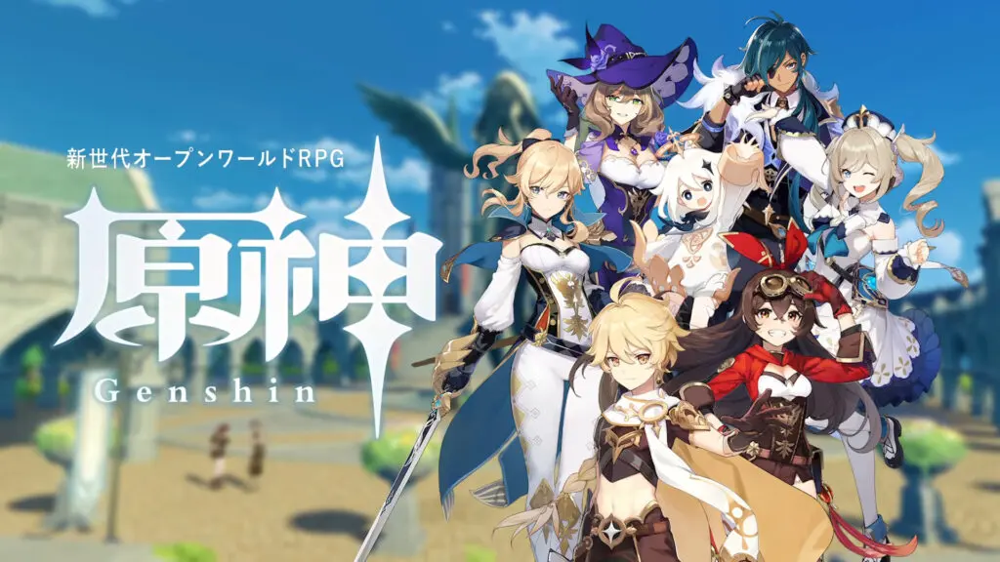

# unity導入

## ゲームエンジンとは

ゲームエンジンの1つで、ゲームエンジンとは生のコードからゲームを開発するのではなく、物理演算機能や画面の描画などの機能を備えて、ゲーム開発を効率的に行うために使用されるソフトのことです。なので別にゲームエンジンはなくてもゲームは作れます。
他のゲームエンジンにはUnreal Engineなどがあります。

## unityとは

unityはスマホゲームや個人開発のゲームで多く用いられています。有名なゲームでは以下のものがあります。

unityはunity technologies 社が開発しているゲームエンジンで、2Dと3D両方に対応しています。

## ダウンロードとインストール

ここでは基本公式の説明に準じて説明しているので、わからない場合は各々調べるか公式のサイトを見てみてください。[公式サイト](https://unity3d.jp/installguide/#index_id2)  
[unityダウンロード](https://unity.com/download)このサイトからunity Hubのインストーラーをダウンロードしてください。
<https://unity.com/download>  
その後、インストーラーを起動して、ダウンロードを開始してください。  
unity Hub起動後Unity IDがあるならサインインしてください。    
大体画像の辺りからサインインできると思います。Unity IDがない人は作成してから同じようにサインインしてください。[Unity ID作成](https://id.unity.com/ja/account/new/)  
その後Unity Hub左側のInstallsのタブから右上のInstall Editorを選択してお好みのバージョンをインストールしてください。進めていくと画像のような選択する画面に行くと思いますが、「unityによるゲーム開発」と「C++によるゲーム開発」を最低限選択していれば大丈夫です。

そのままインストールが終了したら、unity Hubに戻り、Projectのタブから右上のNew Projectを選択してください。  
こんな画面になると思います。ここで今から作るゲームが2Dか3Dかとかを決めます。今回は2Dを選択して右下からProject Nameを変更した後、Create Projectからプロジェクトを作成してください。

## プロジェクト作成

読み込みが終わったら画像のような画面が開かれると思います。またそれぞれの使い方は後程、ここでは大雑把な説明をします。
  
画像に書いてあるように、左側のヒエラルキーと書いているところがヒエラルキーウィンドウ、真ん中上がシーン、左側がインスペクターウィンドウ、下側がプロジェクトウィンドウと呼びます。それぞれ以下の役割があります。

### ヒエラルキー 　

シーンウィンドウに配置されているオブジェクトが表示されており、実際にゲームに使用されているオブジェクトの一覧がみられる。

### シーン

開発するゲーム自体のプレビューを確認することができる。実際にソフトとしてビルドした後はこの画面で起こっていたことが画面上に表示される

### インスペクター

エディター上で(ヒエラルキーウィンドウなどで)選択したオブジェクトの詳細を確認できる。ここで物理演算の有無や、当たり判定の有無などを設定する。

### プロジェクト

ゲームにそのまま使用するわけではないが、いわゆる素材などを置く場所。ここにゲームの部品を集め、それらを利用して開発する。(画像とかC#のファイルとか)

## Visual Studioのダウンロード

unityはVisual Studioと連携することができ、便利なのでテキストエディタはVisual Studioをお勧めします。別にほかのテキストエディタでも問題ありません。
[Visual Studio](https://visualstudio.microsoft.com/ja/)ここからインストーラをダウンロードしてください。完了したら起動し、ワークロードには「unityによるゲーム開発」を選択してください。
  
その後処理が終わったらインストール完了です。

## VSとunityの連携

再びunityに戻ってください。左上の Edit > Preferences > External Toolsを選択し、一番上の項目をVisual Studioなんたらに変更してください。  
以上で最低限のセットアップは終了です。
