# その他ツールのインストールとサンプルプロジェクトの起動

## Git

### 手順1: インストーラのダウンロード

以下のURLを開きます

- [Git公式ダウンロードページ](https://git-scm.com/download/win)

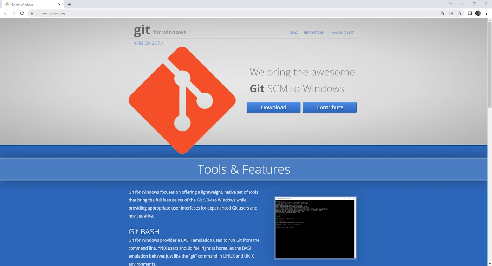

ダウンロードボタンをクリックすると、`Git-2.37.1-64-bit.exe`（バージョン番号は異なる場合があります）が自動的にダウンロードされます。

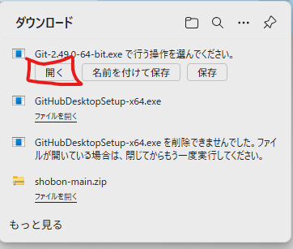
これを開きます

### 手順2: Gitのインストール

ダウンロードしたインストーラー（`Git-2.37.1-64-bit.exe`）を実行します。

「Next」をクリックします。(ライセンスの確認)
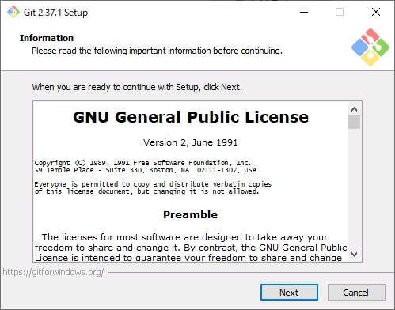

「Next」をクリックします。(インストール先の選択)
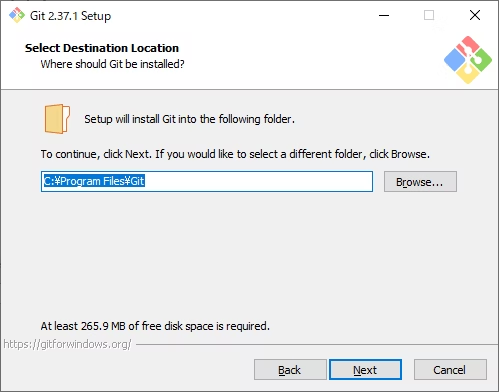

「Next」をクリックします。(コンポーネント選択)
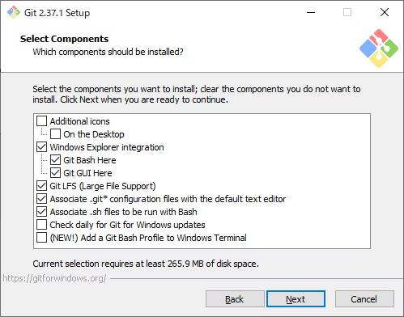

「Next」をクリックします。(スタートメニューのフォルダ選択)
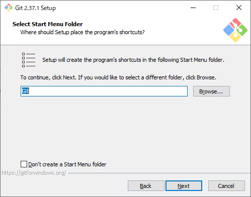

Use Visual Studio Code を選択してください
(もし、Next連打をしている場合、Backを押して戻れますよ)
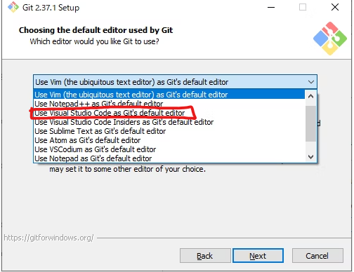

「Next」をクリックします。


「Next」をクリックします。(branch名の設定)


Use Git from the command line and also from 3rd-party software を選択してください。そして、「Next」をクリックします。
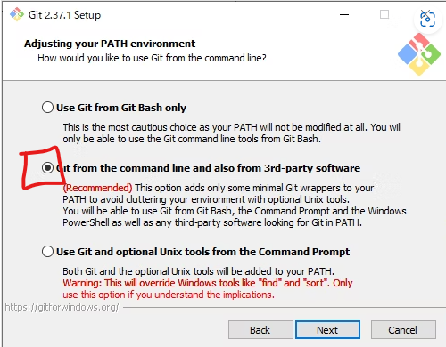

「Next」をクリックします。(OpenSSHの設定)
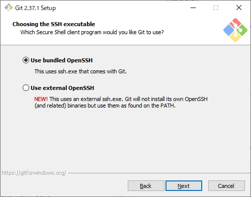

「Next」をクリックします。(HTTPSの設定)
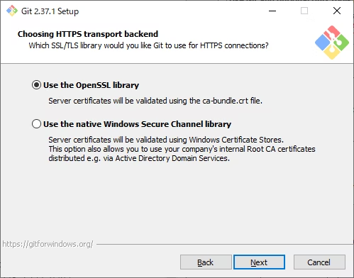

Windows-style, commit Unix-style line endings を選択してください。
そして、「Next」をクリックします。
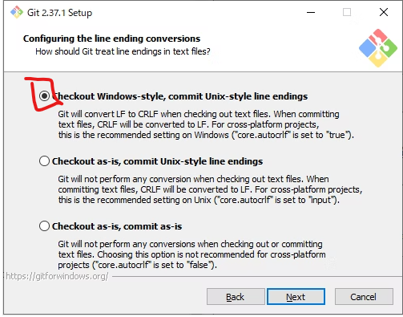

「Next」をクリックします。(terminalの設定)
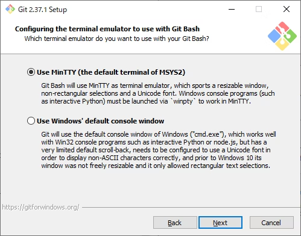

「Next」をクリックします。(git pushの設定)
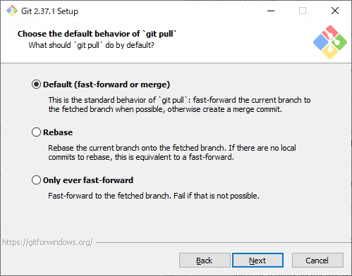

「Next」をクリックします。(credential managerの設定)
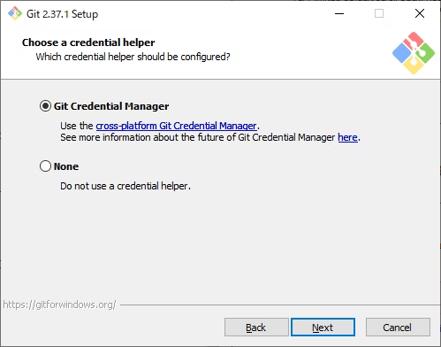

「Enable symbolic links」も選択してください。
そして、「Install」をクリックします。
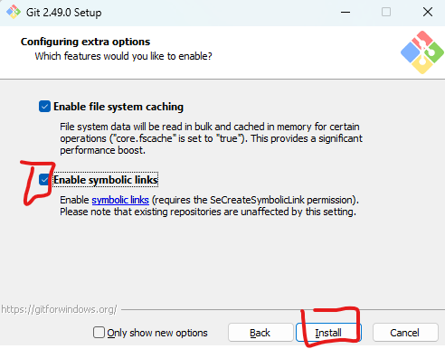

インストールが完了したら、「Finish」をクリックします。


### 手順3: Gitの設定

ターミナルを起動します。
ターミナルは、`Windows + R`を押して、`cmd`と入力してEnterを押すか、
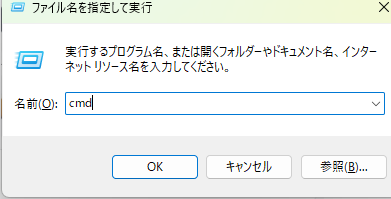

`Windows`ボタンを押して、`cmd`と入力してEnterを押します。
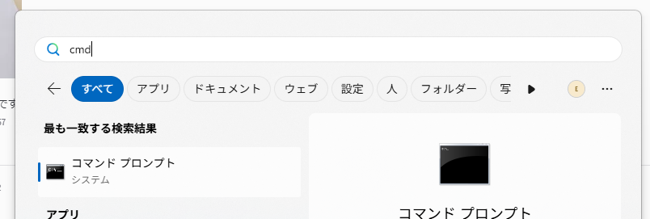

ユーザー名を設定します。以下のコマンドを実行してください。

```bash
git config --global user.name ユーザー名
```

私の場合は

```bash
git config --global user.name yuu-th
```

です。あなたが、Githubで使っているユーザー名を入力してください。

メールアドレスを設定します。以下のコマンドを実行してください。

```bash
git config --global user.email メールアドレス
```

私の場合は

```bash
git config --global user.email yutakato333@gmail.com
```

です。あなたが、Githubに登録(sign up)したメールアドレスを入力してください。

SSHキーを作成します。以下のコマンドを実行してください。そして、なんかでてきますけど、Enterを何回か押してください。

```bash
ssh-keygen
```


## Github Desktopのインストール

常に、赤く示した部分をクリックしていけばよいです

まず、以下のURLを開きます

[GithubDesktopのサイト](https://github.com/apps/desktop)


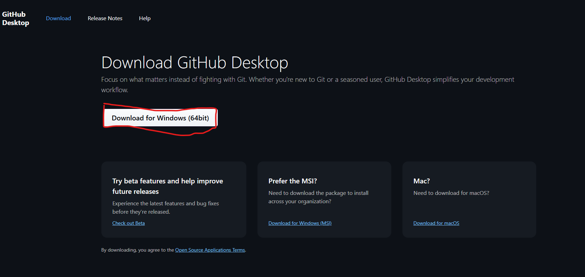

とりあえず、ダウンロードしたファイルを開く、実行するのです

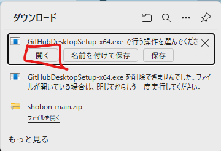

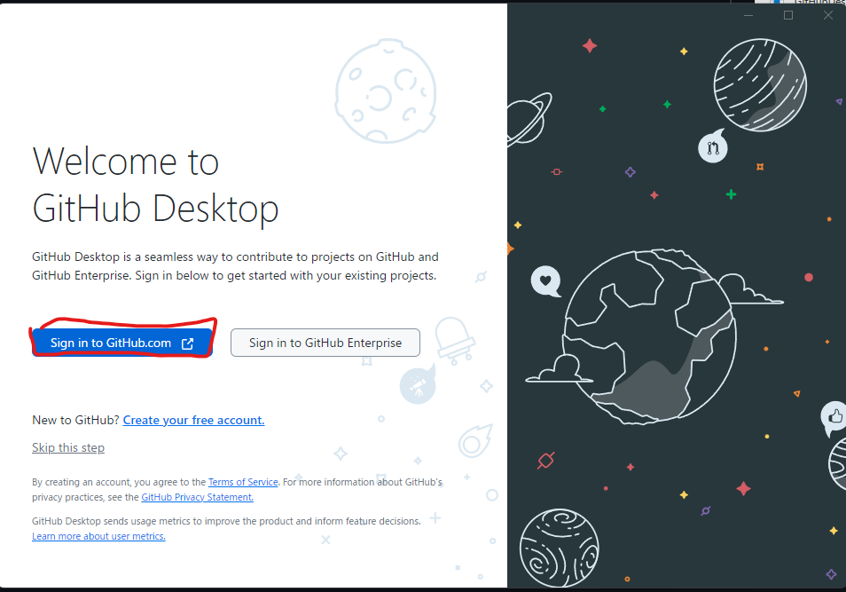

おそらく皆さん、Githubのアカウントがないと思うので、アカウントを作ります。
（既にアカウントを持っている方は、サインインしてください。）
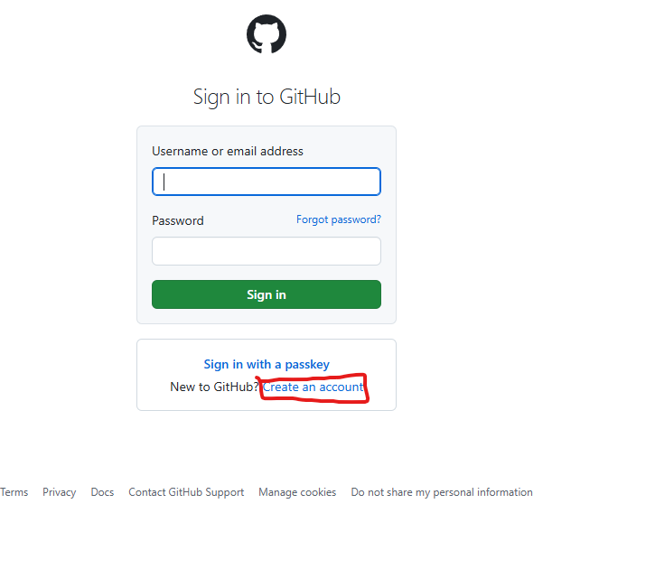

全ての画面を埋めて、Continueを押してください。
そして、いろいろ進めて、Githubのアカウントを作成してください。

(※ここで余談。部長カトーは、様々なアプリでアカウントを100個以上持っています。ですが、パスワードをひとつも覚えていません。パスワード管理ソフトを使っています。無料で結構おすすめなのはBitwardenです。)
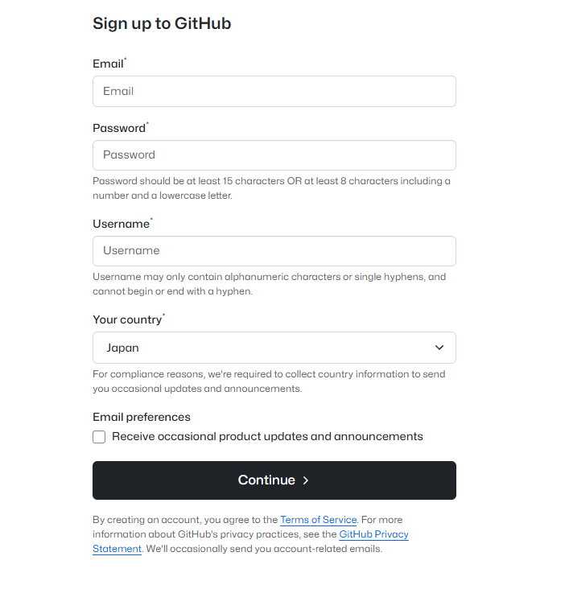

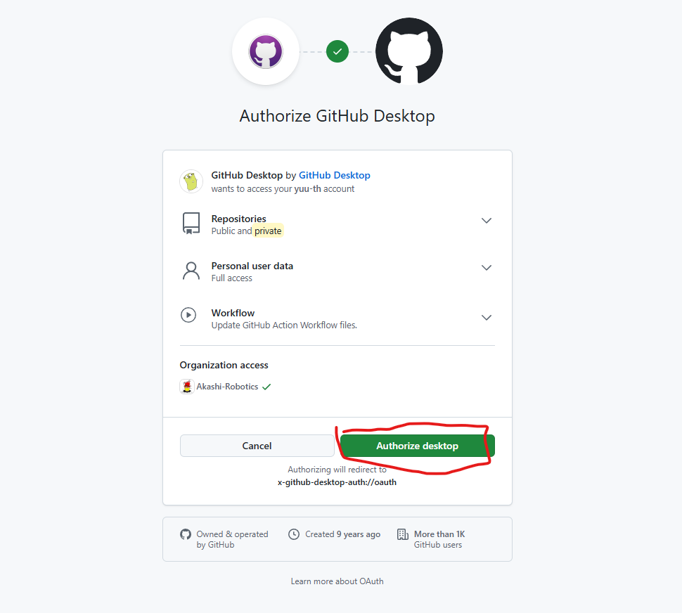

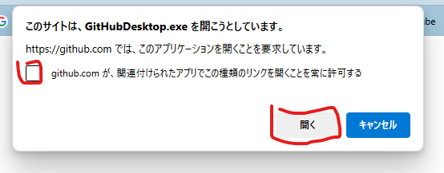

Nameとかに表示されているテキストは異なっていますが、Finishを押して
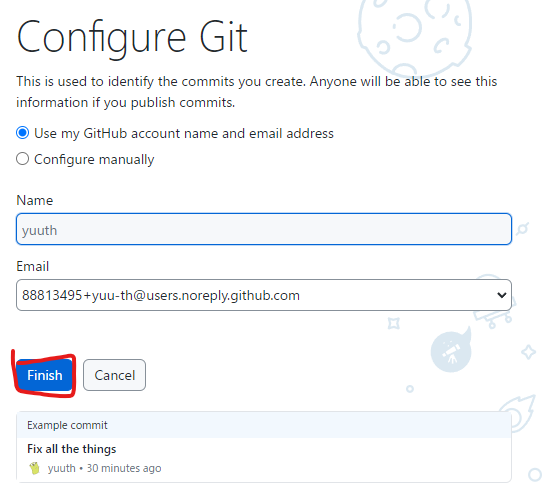

## Github Desktopを用いてサンプルプロジェクトをクローンする

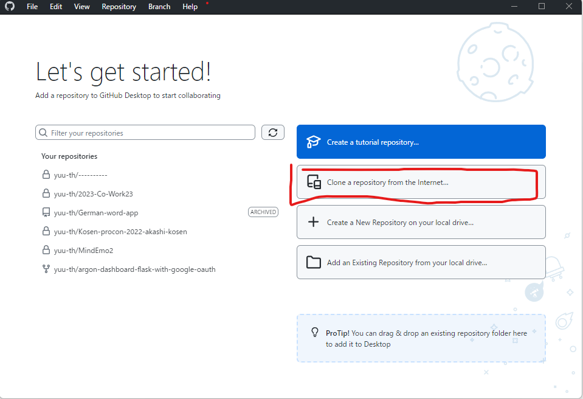


ここに、以下のURLをコピペしてください(Control + C　同時押しでコピー、 Control + Vでペーストしてください。)

```plain
https://github.com/yuu-th/shobon.git
```

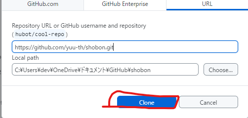
コピペしたら、Cloneをクリック

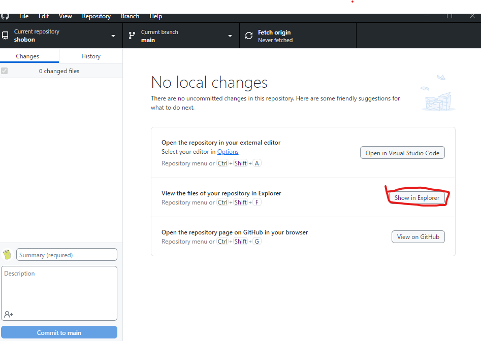

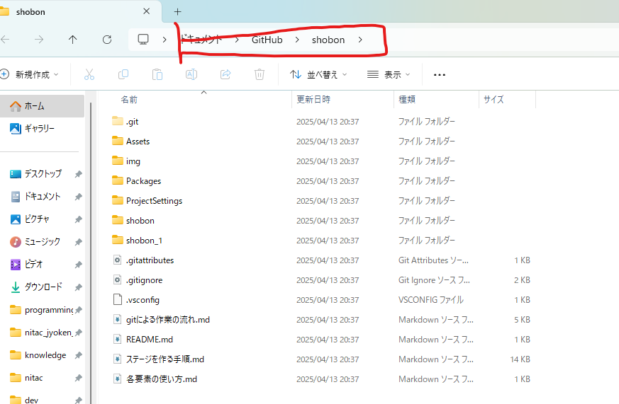

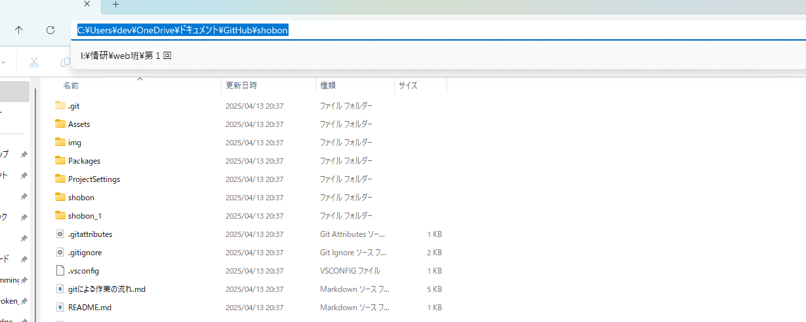
このように青く表示されている状態で、コピー(Control + C)してください。

## Unity Hubでプロジェクトを開く

次にUnity Hubを開きます。

windowsのスタートボタンを押して、「Unity Hub」と入力して、Enterを押してください。


Unity Hubが開いたら、左上の「Open」をクリックします。


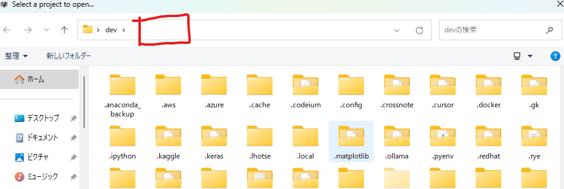


ペースト(Control + V)して、Enterを押してください。ここのテキスト(パス)はユーザーによって異なります。


そしたら、Openを押してください。
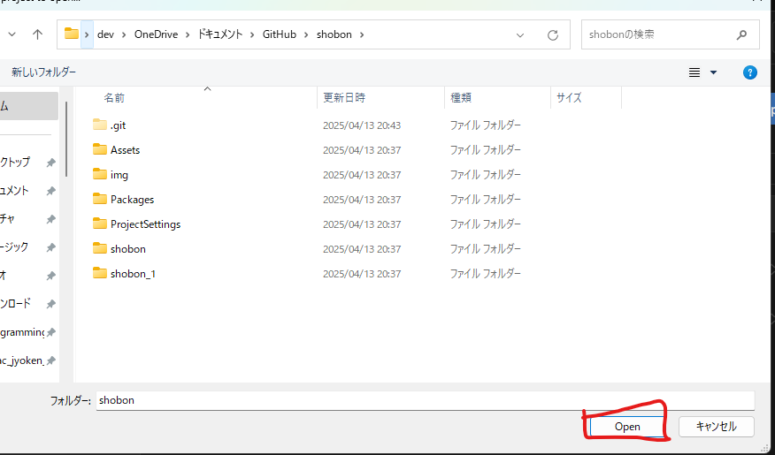

これで、プロジェクトをUnityで開くことができました。起動迄は少し時間がかかります。
