# 開発体験

## 開発体験

Unityでサンプルプロジェクトを起動していただけたと思います。

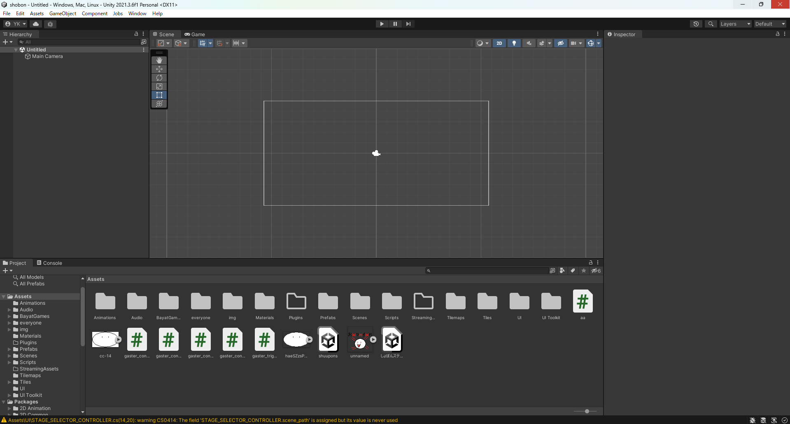

sampleという名前のファイルをダブルクリックしてください
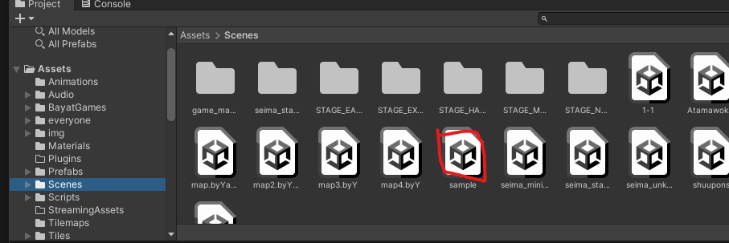

すると、なんか見覚えがありそうなステージが出てきます。

じゃあ、遊んでみましょう。
操作はAで左、Dで右に移動、スペースでジャンプです。

なんかてきっぽいやつがいますが、なんか変ですよね。
こいつを直しましょう。いったん止めます。

「Prefab」というフォルダを開きます
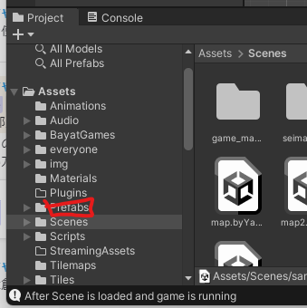

そして、「Enemy」というフォルダを**ダブルクリック**で開きます。

では、好きな敵を選んで、ドラッグ&ドロップでシーンの上においてください。（マウスを押し込んで、そのままシーンの上まで動かし、そこでマウスを離す）

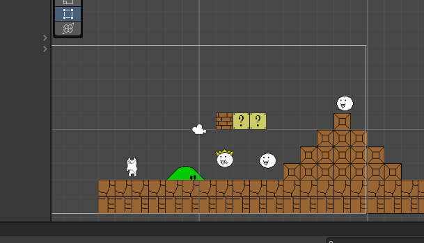

そして、さっきのおかしかった敵を消します。
おかしい敵をクリックして、

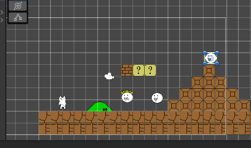
「Delete」キーを押してください。(Back spaceは消えないので注意)
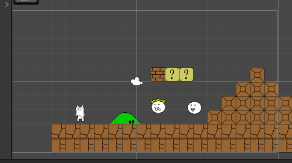

では、もう一度先ほどの手順で遊んでみましょう

ここからは、あなたはあなただけのステージを作ってみましょう。

先ほどの「Prefab」というフォルダの中の、
Decorations、Enemies、Items、Trapsのフォルダをダブルクリックして、自分の好きなものを探して、ステージの上に設置してみましょう。

自分だけのステージを創ってみましょう。そして、仲間とも共有してみましょう。

---

## チョイ発展

今までは、まるでマリオメーカーみたいな感じですけど、ちょっと発展したことをしみます。
それは、アイテムとアイテムを関連させることです。

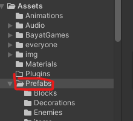

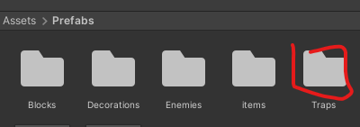

この土管っぽいアイテムをドラッグ&ドロップで設置してください。

ここで、２つ土管を設置します。

そして、**一つ目の土管の上の部分**をダブルクリックして、Inspectorのウィンドウを開いてください。
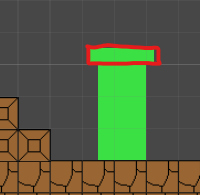

すると、右側にこんなのが出てくる
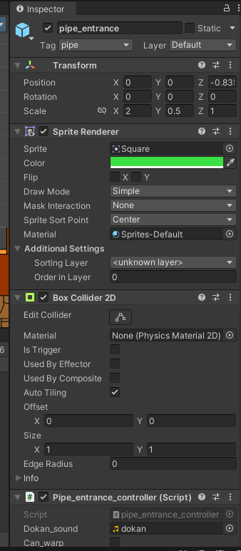

少し下にスライドして

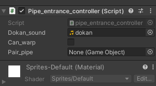

Can_warpという項目があるので、チェックを入れます。

そして

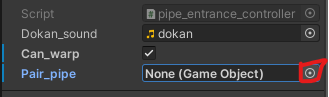

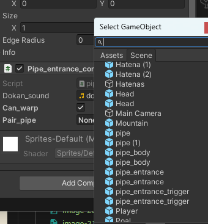

「pipe(1)」という項目を選択します

これで、一つ目の土管が二つ目の土管にワープするようになります。

実際に遊んで試してみてください。

これと同様のことが、warpでもできます。

このWarpの使用は、どのオブジェクトにも移動できるので、pipeやwarpやそれ以外でも、なんでもペアに設定してみてください

---

あと、
この雲も試してみてください。
先ほどと同様に、ドラッグアンドドロップで設置して、設置された雲をクリックして、

can_killにチェックを入れてください。

そして、遊んでみてください。雲にプレイヤーが触れるとどうなるでしょうか？

---

## まとめ

今回、ゲーム開発の一番楽しい部分を体験してみました。
