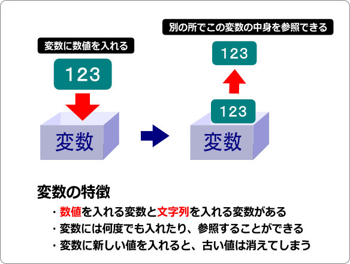
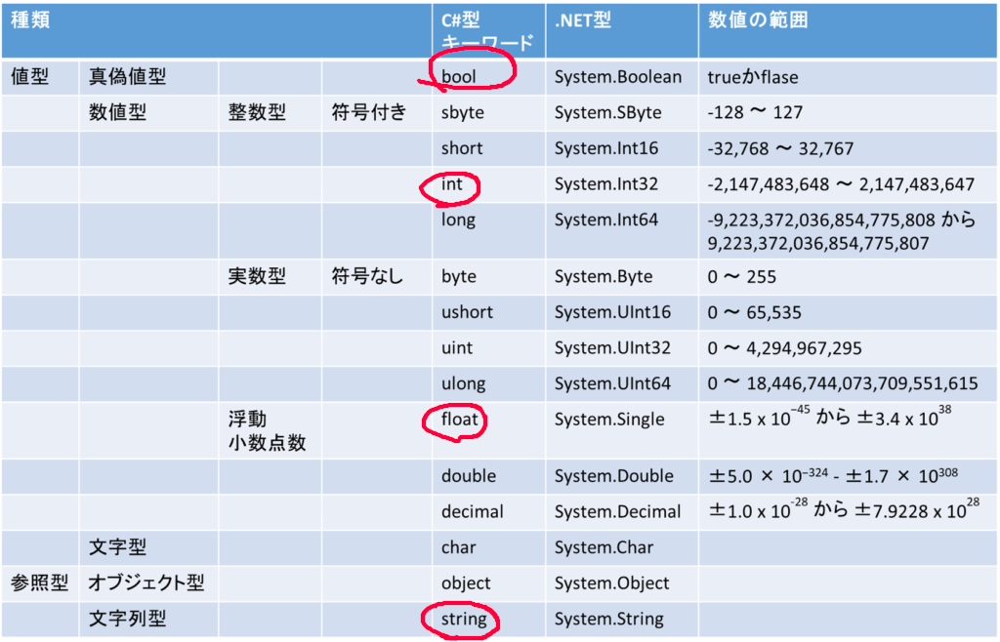

# C#導入
## unityにおけるC#
unityで開発するうえで使用される言語はC#とJavaScriptですがほとんどの場合C#です。また、C#を使用するといっていますがC#というよりUnity言語といえるほどunity特有の関数や機能があります。ので理解するのはC#の基本的な構文のみでOKです。unity特有のものは追々覚えていけばいいと思います。

## C#について
C#はマイクロソフト社が開発した言語で、名前からC言語から派生した言語のように見えますが実際は特に互換性はないです。また、その内容はCとJavaを良いとこ取りしたような言語で、文法は大体C言語を踏襲しています。ので実際はC言語がわかれば大体は理解できると思います。

### 変数と型
変数とは数値とか諸々データを置いておくための箱のようなものでそれぞれに保存できるデータのタイプ(型)が存在します。また、一度に保存しておけるデータは一つで、参照することもできます。  
  
図では数値を変数に代入していますが、これが文字列だったり、少数だったりもします。これらを指定する必要があり、そのタイプのことを型と言います。型には以下のものがあります。都度都度覚えたらいいと思います。  
上の画像の表が型の一覧です。丸がついてる方をよく使うので覚えたほうがいいです。また、これに追加してunity特有のものもあるので都度都度言います。
また、変数は
```
int a;
```
のように使用する前にあらかじめ宣言する必要があります。

### 論理演算
真か偽であるかを判断する演算のことです。要はある条件式が正しいか間違っているか確認する処理のことです。条件式にも様々なものがあり、ある整数型の変数がある値より大きいか小さいかだったり、ある文字列がまた別の文字列と等しいかどうかを確認したりなどがあります。
  
いろいろ書いてますが赤線のあるとこがよく使うものです。説明で書いてもわかりにくいので使っていってついでに覚えていくのがいいと思います。

### 文法いろいろ
#### if文
名前もifということで、もし～ならという処理を行います。条件が正しい場合、{}内の処理を実行します。
```
if(a>1){ //ここの()の中身で"～なら"を指示する
    Debug.Log("123");
}
```
上のコードの場合、変数a(整数型)が1より大きいなら2行目の処理が実行されます。
また、if文はこの後にelse文をつなげることで もし～でなく、～なら だったり もし～でないなら～する　といった処理もできます。
```
if(a>5){ 
    Debug.Log("123");
} else if(a>1){
    Debug.Log("456");
} else {
    Debug.Log("789");
}
```
この場合、aが5より大きいなら2行目を、5よりは小さいが1より大きいなら4行目を、どの条件にも当てはまらないなら6行目を実行します。

#### for文
これは繰り返し処理です。一定の条件式が成り立っている限り{}の中の処理を繰り返します。
```
for(i<5){
    Debug.Log("aa");
}
```
if文と同様に()内の内容が条件です。この場合、整数型の変数iが5未満である限り、中の処理を実行し続けます。

### 関数
関数とは、一定の処理をまとめたものでこれを実行することで実際に処理を開始することができます。また、作成した関数は他の関数で呼び出すこともでき、処理のワンセットとして使うこともできます。また、関数には返り値というものがあり、関数を実行すると必ず何かしらの値が返ってきます。返り値が存在しない場合でも存在しない何かが返ってきます。返り値はreturn ~ で表現します。
```
void function(){
    Debug.Log("Hello World);
    return ; //ここで返り値を指定(今回は存在しない何かを返り値としています)
}
```
返り値は関数の名前の前に指定します。(上の例ならvoidの部分)また、今回はvoidとなっているので返り値は存在しない何かです。ここがintだったら整数値を返り値する必要があります。
```
void function(){
    Debug.Log("Hello World);
    return ; 
}

int hoge(){
    function();
    return ;
}
```
この場合、関数hogeを実行すると関数functionが実行されます。このように他の関数からほかの関数を呼び出すこともできます。  
以上でC#の最低限です