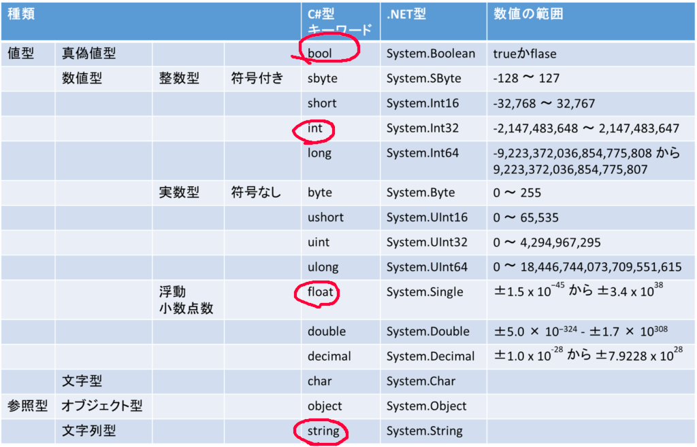

# C#導入

## UnityにおけるC #

Unityで開発する上で使用される言語は主にC#です。JavaScriptも使用可能ですが、現在の開発環境ではC#が標準です。Unityの場合、一般的なC#に加えて「Unity特有の関数や機能」が多数存在するため、「Unity言語」と呼べるほどの特殊性があります。

まずはC#の基本構文を理解し、Unity特有の機能は開発を進めながら徐々に習得していくことをお勧めします。

## C#について

C#はマイクロソフト社が開発した言語です。名前からC言語から派生したように見えますが、実際には直接の互換性はありません。C#はCとJavaの良い部分を取り入れた言語で、文法の多くはC言語に似ています。そのため、C言語の知識があれば比較的理解しやすいでしょう。

## 学習の流れ

1. プログラミングの基礎となる変数
2. 変数の様々な種類と型
3. 変数を使った演算
4. 制御構造
   1. 条件分岐（if-else文）
   2. ループ処理
      1. while文
      2. for文
5. 関数

## 変数と型

変数とは、データを一時的に保存するための「箱」のようなものです。変数にはそれぞれ保存できるデータの種類（型）が決まっており、一度に保存できるデータは1つだけです。


変数には整数、小数、文字列など様々な型があります。C#では使用前に変数の型を宣言する必要があります。



上の画像の表が型の一覧です。丸がついてる方をよく使います。また、これに追加してunity特有のものもあるので都度都度言います。

**今、理解すべき型：**

- `int`：整数型（例: 1, 42, -10）
- `string`：文字列型（例: "Hello"）

将来的に皆さんが理解する型：

- `float`：単精度浮動小数点型（例: 3.14f）
- `double`：倍精度浮動小数点型（例: 3.14159）
- `bool`：論理型（true/false）
- `char`：文字型（例: 'A'）

変数の宣言は以下のように行います：

```csharp
int score; // 整数型の変数scoreを宣言
score = 100; // 値を代入

// 宣言と代入を同時に行うこともできます
string playerName = "Player1";
```

## 演算

### 変数を使った演算

先ほど紹介したように、まずintとstring型だけ覚えてほしいです。実際に使ってみましょう。

**整数(int)を使ってみる**

`int`型の変数には数字を入れられます。足し算や引き算などの計算ができます。

```csharp
// 整数型の変数を宣言して、値を入れる
int score = 50;
int bonus = 10;

// 足し算をする
int totalScore = score + bonus; // totalScoreには 60 が入る

// 結果をUnityのコンソールに表示する
Debug.Log("合計スコア: " + totalScore); // "合計スコア: 60" と表示される
```

**文字列(string)を使ってみる**

`string`型の変数には文字を入れられます。文字同士を `+` で繋げることができます。

```csharp
// 文字列型の変数を宣言して、文字を入れる
string greeting = "こんにちは";
string name = "勇者";

// 文字列を繋げる
string message = greeting + "、" + name + "！"; // messageには "こんにちは、勇者！" が入る

// 結果をUnityのコンソールに表示する
Debug.Log(message); // "こんにちは、勇者！" と表示される
```

**整数と文字列を組み合わせる**

`int`型の数字と`string`型の文字を `+` で繋げて表示することもよくあります。

```csharp
int level = 5;
string playerName = "スライム";

// 文字列と数値を組み合わせて表示
Debug.Log(playerName + "のレベルは " + level + " です。"); // "スライムのレベルは 5 です。" と表示される
```

このように、変数はプログラムの中でデータを扱ったり、情報を表示したりするために非常に重要です。

### 論理演算

論理演算とは、ある条件が「真」か「偽」かを判断する演算です。つまり、「正しい」か「間違ってる」か。正しいか、間違っているかを調べる**条件式**にはさまざまな**比較演算子**を使用できます。

  
いろいろ書いてますが赤線のあるとこがよく使うものです。

**今、理解すべき比較演算子：**

- `==` ：等しい（例: `a == b`）
- `!=` ：等しくない（例: `a != b`）
- `<` ：より小さい（例: `a < b`）
- `>` ：より大きい（例: `a > b`）
- `<=` ：以下（例: `a <= b`）
- `>=` ：以上（例: `a >= b`）

**皆さんが将来的に理解する比較演算子**

- `&&` ：AND（かつ）
- `||` ：OR（または）
- `!` ：NOT（否定）

## 基本的な制御構造

### if文（条件分岐）

名前もifということで、もし～ならという処理を行います。条件が正しい場合、{}内の処理を実行します。

```csharp
if(a>1){ //ここの()の中身で"～なら"を指示する
    Debug.Log("123");
}
```

上のコードの場合、変数a(整数型)が1より大きいなら2行目の処理が実行されます。
また、if文はこの後にelse文をつなげることで もし～でなく、～なら だったり もし～でないなら～する　といった処理もできます。

```csharp
if(a>5){ 
    Debug.Log("123");
} else if(a>1){
    Debug.Log("456");
} else {
    Debug.Log("789");
}
```

この場合、aが5より大きいなら2行目を、5よりは小さいが1より大きいなら4行目を、どの条件にも当てはまらないなら6行目を実行します。

### くり返し処理、ループ

#### while

繰り返し処理です。一定の条件式が成り立っている限り{}の中の処理を繰り返します。

```csharp
int count = 0;
while (count < 3) {
    Debug.Log("カウント: " + count);
    count = count + 1;
}
```

if文と同様に()内の内容が条件です。この場合、整数型の変数iが5未満である限り、中の処理を実行し続けます。
このコードでは、countは0,1,2と変化し、

```plain
カウント: 0
カウント: 1
カウント: 2
```

というように表示され、終了します

#### for文（繰り返し処理）

これはWhile文を進化させたやつです。
例えば、3回繰り返す処理をしたい場合、while文だと以下のように書きましたね。

```csharp
int count = 0; // ここ省略したい
while (count < 3) {
    Debug.Log("カウント: " + count);
    count= count + 1; // ここ省略したい。
}
```

for文を使うと、countという変数を定義したり、count変数に1を足して、更新するのを省略できます。(初期化、条件式、更新処理を1行でまとめて書けます。)

具体的には

```csharp
// iを0から始めて、5未満の間、1ずつ増やしながら繰り返す
for (int count = 0; count < 3; count=count + 1) {
    Debug.Log("カウント: " + i);
}
```

というように書くのです。
実際に書くときは、とても難しいので皆さん最初は調べたり、この資料を見ながらやって一魔将。

for文の構造：`for (初期化; 条件式; 更新処理) { 繰り返す処理 }`

## 関数（メソッド）

関数（C#では一般的に「メソッド」と呼ばれます）は、一連の処理をまとめたものです。必要なときに呼び出すことで、同じ処理を効率的に再利用できます。

関数の構造：

```csharp
void 関数名() {

    // 処理内容、ここで何かしらの処理を実行する

    return;
}
```

実際のゲーム開発では、例えば、「プレイヤーをジャンプさせる関数」としてJump()という関数を作成します。
Jumpするときは、例えば、プレイヤーの位置を上に移動させる処理を書きますが、実際にJumpさせたいときに、その中身の処理を考えずに、Jump()と書くだけで、プレイヤーがジャンプする処理を実行できます。

その他の例：

```csharp
// 引数なし、戻り値なしの関数
void ShowMessage() {
    Debug.Log("こんにちは！");
    return; // voidの場合、returnは省略可能
}
```

### 引数ありの関数

引数とは、関数に渡すデータのことです。関数を呼び出すときに必要な情報を渡すために使用します。引数は関数の定義時に指定します。

例えば、ジャンプさせるときに、ジャンプの高さを指定したい場合、関数の引数として高さを渡すことができます。
例えば、`Jump(3)`と書くと、3mジャンプするという意味になります。

その他の例：

```csharp
void Hallo(string name) {
    Debug.Log("こんにちは、" + name + "！"); // 引数nameを使って挨拶
}

Hallo("勇者"); // "こんにちは、勇者！"と表示
```

### 戻り値ありの関数

戻り値とは、関数が処理を終えた後に返す値のことです。戻り値は関数の定義時に指定します。戻り値がある場合、関数の型を指定する必要があります。
と問えば、プレイヤーの残り体力を知りたいときには、PlayerHP()という関数を作成し、HPの値を戻り値として返すことができます。
例えば、`int HP = PlayerHP()`と書くと、HP変数にPlayerHP()の戻り値が代入されます。

その他の例：

```csharp
int Calculate(int a, int b) { // 返り値の型は関数の名前の前に指定する
    int result = a + b;
    return result; // 整数値を返す
}
```

実際のゲームプログラミングでは、関数の中から別の関数を呼び出すことになります。

例：

```csharp
// ゲームが始まったら、このStart関数が実行される
void Start() {
    ShowMessage(); // "こんにちは！"と表示

    int sum = Calculate(5, 3); // 関数の結果を変数に代入
    Debug.Log("計算結果: " + sum); // "計算結果: 8"と表示
}
```

### 関数の書き方のまとめ

関数の基本的な書き方は共通しています。引数（受け取る情報）や戻り値（返す結果）があるかないかで、書き方が少し変わるだけです。

```csharp
戻り値の型 関数名(引数１の型 引数1, 引数2の型 引数2, ...) {

    // 処理内容

    return 戻り値; // 戻り値がある場合は必須
}
```

引数がない場合は、関数名の後の()の中身を空にする。

戻り値がない場合は、戻り値の型をvoidにする。

引数や戻り値がない場合：

```csharp
void 関数名() {

    // 処理内容

    return; // 戻り値がない場合はreturnは省略可能
}
```

以上がC#プログラミングの基本です。Unityでの実践を通じて、これらの基礎を身につけていきましょう。

また、分からないことが必ず出てきます。カトーとか、他の先輩がいるときは聞いてみてください。でも、今の時代自分で調べても何とかできます。

例えば、

「C# 変数 宣言」
「C# if文」などで調べると、たくさんの情報が出てきます。

WEBサイトには粗悪なものがトップに出てくることがよくあります。(googleが金儲けのために...)
そのため、一番上に出てきたサイトだけでなく、他のサイトも見る**根気**が必要です。
