# ゲームを作りましょう
やっと本編です。今回は2Dアクションゲームを作りましょう(簡単なマリオ的な)
今回作るゲームの素材はここでダウンロードしてください。[フリー素材](https://kenney.nl/assets/pico-8-platformer)  
また、今回作るゲームの完成品はこちらです。[github](https://github.com/maguro256/joken_sampleGame)
## ステージづくり
unityにはシーンという概念があり、場面的なもので例えば1つのステージに1つのシーンを使ったりします。unityのプロジェクトを初めて開くとシーンが開かれます。1度シーンを作ってみましょう。プロジェクトウィンドウで右クリックしてCreate > Sceneを押して下さい  
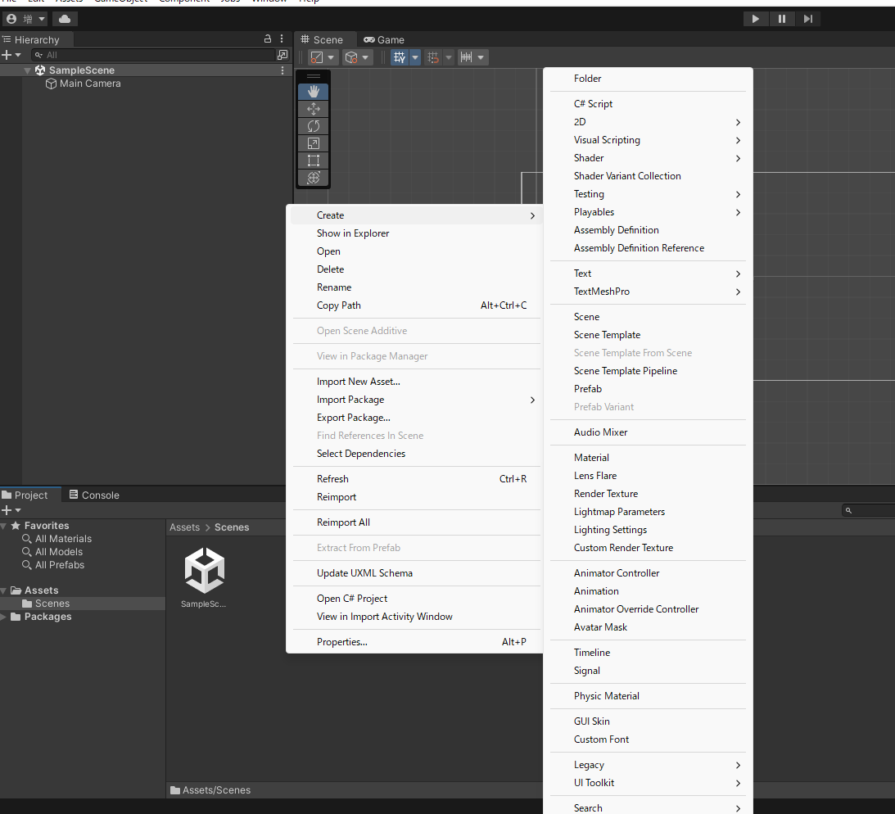  
できたら下のプロジェクトウィンドウに新しくシーンが作られます。名前をMainSceneとしましょう。その後MainSceneをダブルクリックするとそのシーンが開かれます。  
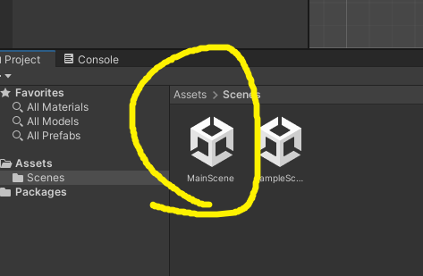  
また、サンプルシーンは削除してしまいましょう。SampleSceneの上で右クリックしてDeleteを選択してください。そのあとに出てくるポップアップもDeleteで大丈夫です。  
素材をプロジェクトに入れます。上でダウンロードしたzipファイルをAssets内で解凍しておいてください  
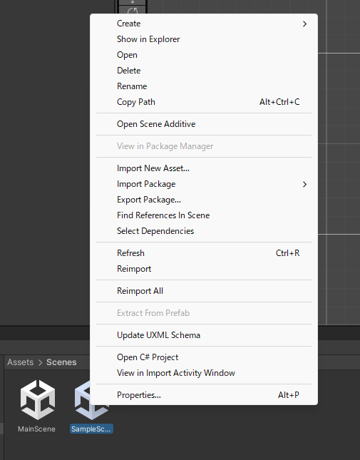  
ここからステージづくりです。2Dアクションのステージ作りにはunityの機能のTilemapという機能が便利ですので今回はそれを使用します。右上のwindow > 2D > tile Paletteを押してください  
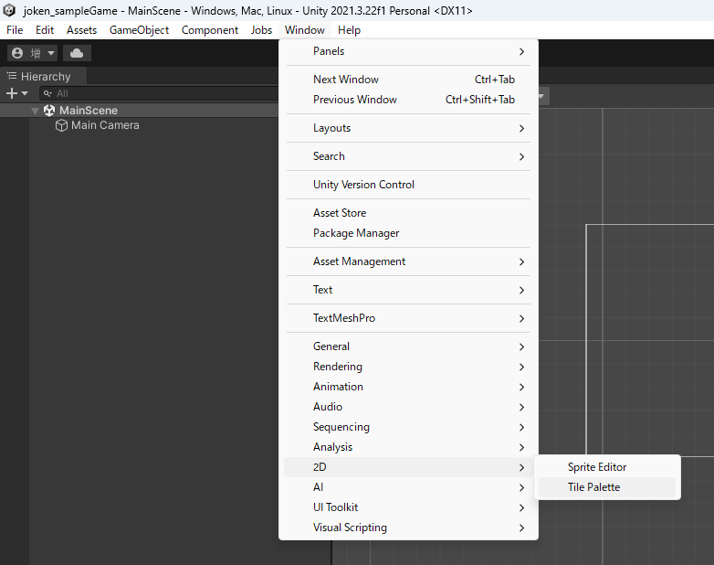  
その後開かれたウィンドウでCreate new Paletteを押してNameをなんでもいいので変更してください。そのあとCreateを押してください。  
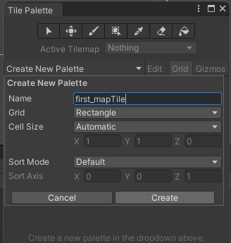  
素材のフォルダ内 Transparent > tilemapからTilemap_packedを選択してください。その後PexelPerUnitを8にして、インスペクターウィンドウのSplite ModeをMultipleに変更してからSplite Editorを選択してください。出てくるポップアップはApplyで大丈夫です。    
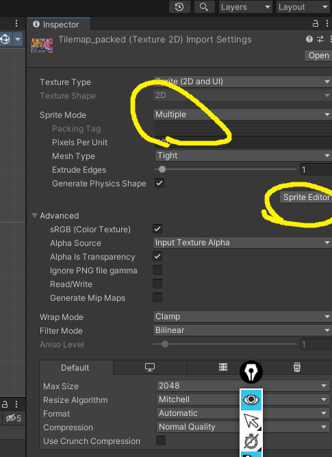  
出てきたウィンドウの左上Sliceを選択して画像の通りに変更して、Sliceを押してください。終わったらこのウィンドウは閉じて大丈夫です。  
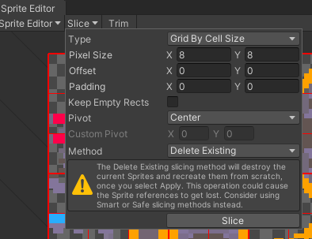  
これでTilemap用のスプライトができました。このスプライトをTile Paletteに入れて下さい。ドラッグアンドドロップで大丈夫です。  
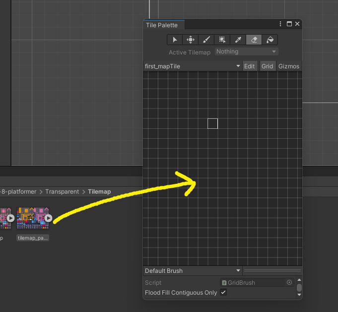  
次はヒエラルキーで右クリックから、2D object > Tilemap > Rectangular を選択してください。  
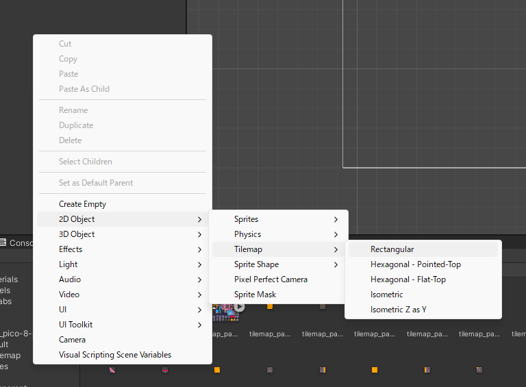  
これで、シーンにtilemapを設置できます。ヒエラルキーのTilemapを選択して、Tile paletteの選択モードで赤丸のグリッドを選択してください。  
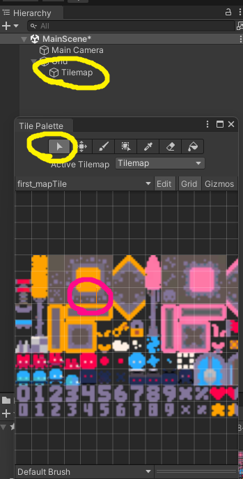  
次にTile paletteのペンを選択して、シーンウィンドウに書き込んでください。そのまま画面を押すことで書き込めます。　　
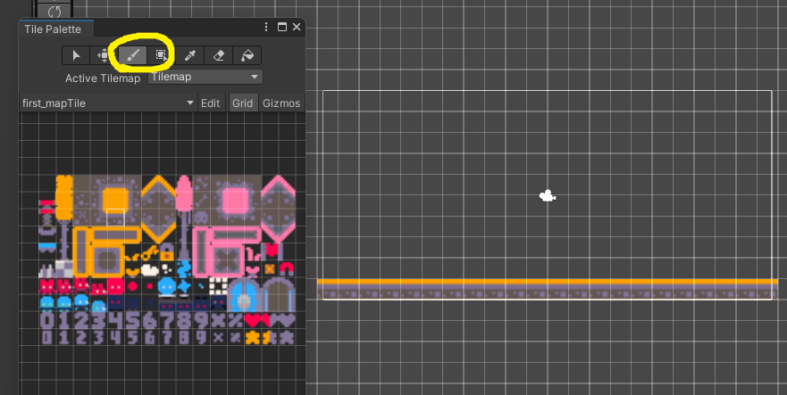  
次はプレイヤーを作ります。ヒエラルキーで右クリックから2D object > Sprites > Square を選択してください。また、そのオブジェクト名はPlayerにしてください。
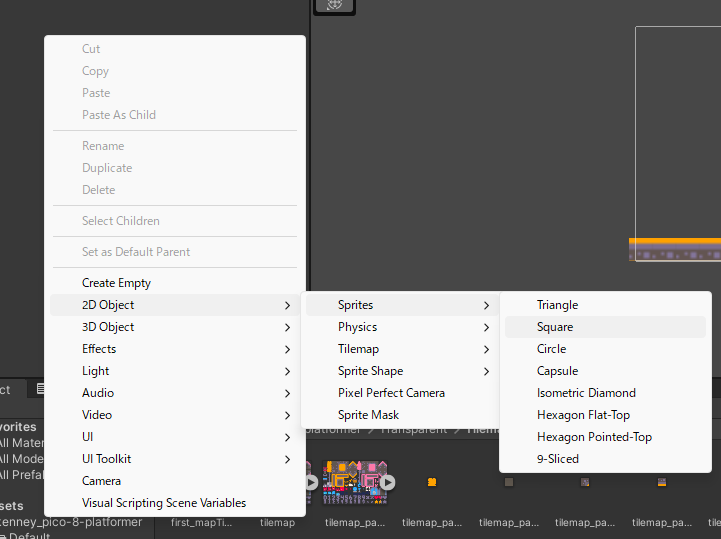  
白い四角が作られると思います。これが今回のプレイヤーです。ただの四角だと面白くないので見た目を変えましょう。ヒエラルキーウィンドウからPlayerを選択して、インスペクターウィンドウからSpriteを変更しましょう。画像の丸の部分を押すとプロジェクト内の画像を検索できるので、今回は素材のTilemap_packed_104という画像を使用しましょう。  
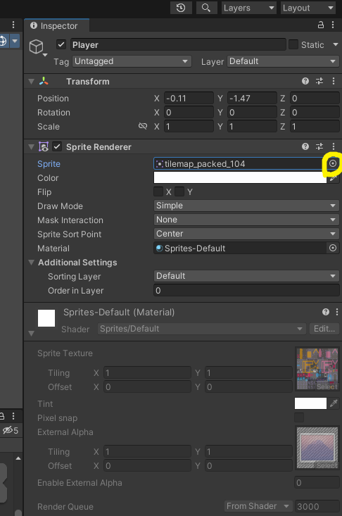  
なんかいい感じのキャラクターができたと思います。次はこいつに重力と当たり判定を与えましょう。インスペクターウィンドウからAdd Componentを選択して、Rigidbody2DとBoxcollider2Dを選択してください。Rigidbody2Dが物理演算を行うコンポーネントで、Boxcollider2Dが当たり判定を与えるコンポーネントです。このようにオブジェクトにはコンポーネントを付けることでそれぞれに特徴を与えることができます。  
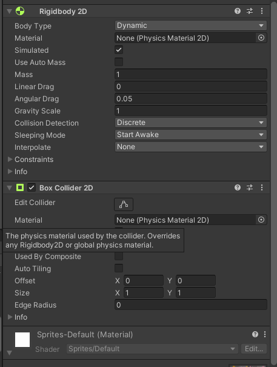  
ここで一旦ゲームを実行してみましょう。シーンウィンドウの上にある再生ボタンを押してみましょう。これでゲームのプレビューを確認できます。　　
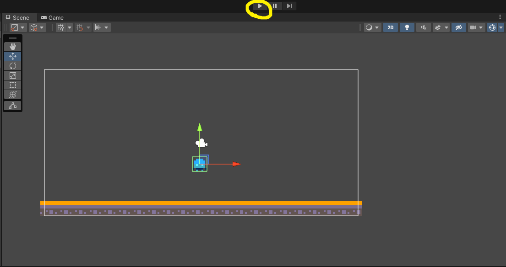  
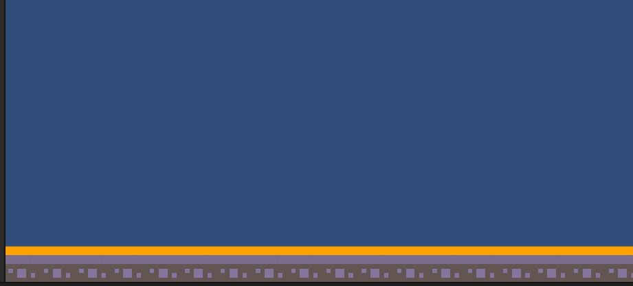  
実行するとPlayerが下に落ちていったと思います。でもこれは理想の動きではありません。おそらく皆さんが求めている挙動は画面にある地面のようなものに立つ挙動だと思います。当たり判定をうまく機能させないといけません。先ほどPlayerにつけたBoxcollider2Dコンポーネントは当たり判定を付けるものです。しかしこれはお互いに当たり判定がついているもの同士でしか作用しません。つまり地面にも当たり判定を与える必要があります。ヒエラルキーからTilemapを選択してインスペクターウィンドウからTilemapCollider2Dコンポーネントをつけましょう。  
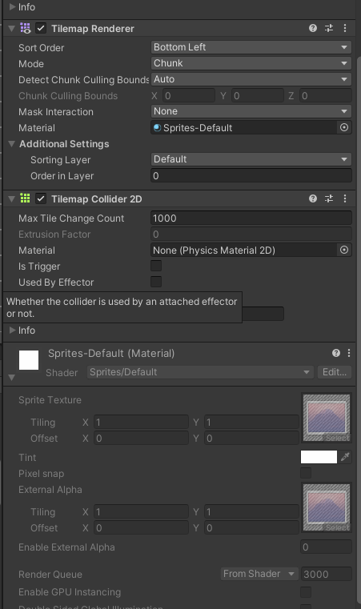  
これでもう一度プレビューを確認しましょう。  
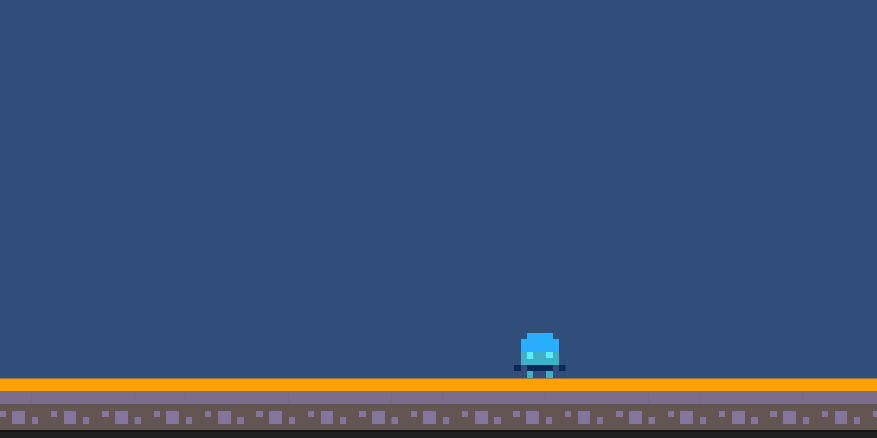  
立てました。次はプレイヤーの移動を作りましょう。今回は操作が単純なので使用しませんがある程度操作が複雑なゲームを作る際はInputSysyemという機能を使った方がいいです。

## プレイヤーの移動
[input system参考](https://nekojara.city/unity-input-system-intro)  
いよいよ皆さんお待ちかねのコーディングです。まず書き込むファイルを作成しましょう。プロジェクトウィンドウで右クリックからCreate > FolderでScriptフォルダーを作りましょう(任意)  
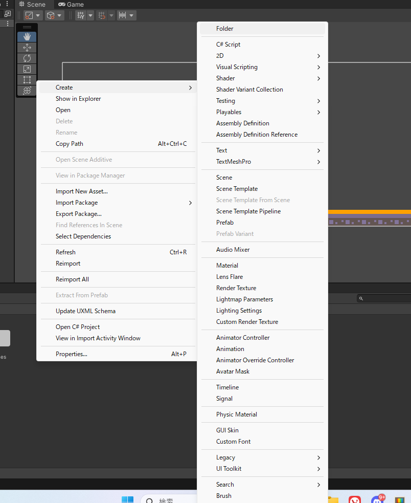  
Scriptフォルダーを開いた状態でプロジェクトウィンドウ内で右クリックからCreate > C#scriptを選択し名前をPlayerControllerとしましょう  
  
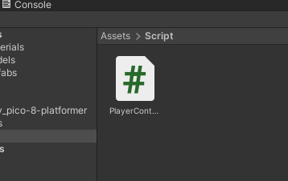  
ファイルを作成できたらそれをダブルクリックしましょう。次のような画面が開かれると思います。  
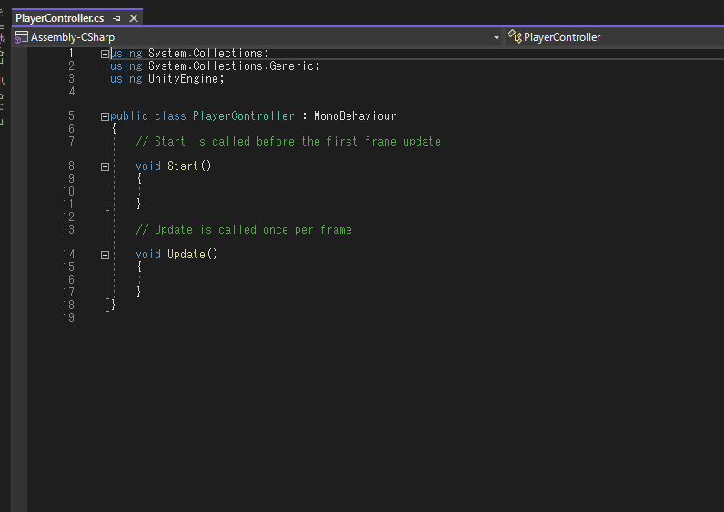  
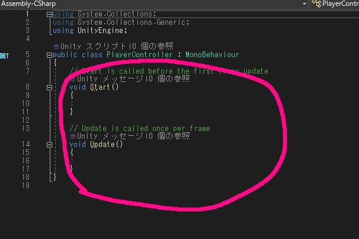  
とりあえず今必要なのは丸の部分です。それ以外は呪文だと思ってもらって大丈夫です。画像の内容を簡単に説明すると、上側のStart関数はゲームを実行か、このオブジェクトが初めて有効化されたときに実行される関数です。例えばキャラクターのHPを設定したり初期位置の設定をしたりします。今回はPlayerの初期位置を設定しましょう。
```
using System.Collections;
using System.Collections.Generic;
using UnityEngine;

public class PlayerController : MonoBehaviour
{
    // Start is called before the first frame update
    void Start()
    {
        this.gameObject.transform.position = new Vector2(-9, -2);
    }

    // Update is called once per frame
    void Update()
    {
        
    }
}
```
このように書き込んでみましょう。意味としてはこのオブジェクトの位置を座標(-9,-2)に変更するというものです。このtransformという部分がオブジェクトの位置とか角度を変更するためのコンポーネントです。これの値をいじるという指示を今、スクリプトを通じで書きました。  
これを実際のゲームに反映させましょう。このままではPlayerにこの変更は反映されないので、このファイルをPlayerにコンポーネントとして追加しましょう。PlayerのインスペクターウィンドウにPlayerControllerファイルをドラッグアンドドロップで追加できます。  
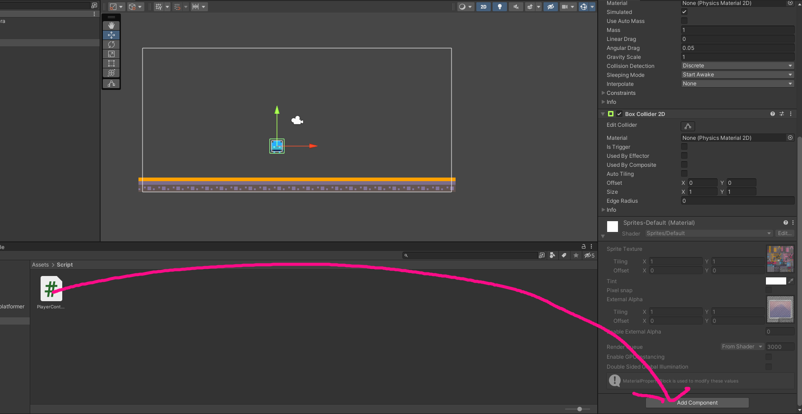  
これができたらまたプレビューを確認しましょう。上の再生ボタンを押してください。　　
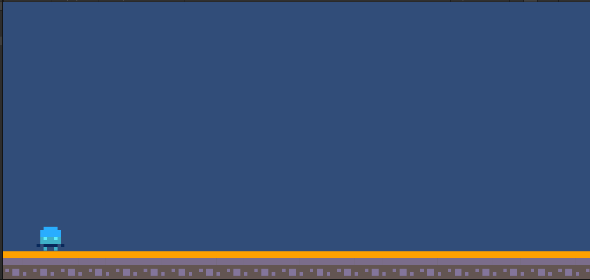  
プレイヤーの位置がなんかいい感じのところになったと思います。次はプレイヤーの移動を作りましょう。Update関数を書き換えます。PlayerControllerに戻ってください。次はUpdate関数を変更します。これはゲームを起動している間は常に繰り返される関数です。一応考え方としては右矢印を押されている間は右方向に力を加え、左矢印を押されている間は左方向に力を加えるという感じです。ただし、今回は諸藩の事情によりUpdate関数ではなくFixedUpdate関数を使用します。  
```
void FixedUpdate()
    {
        if(Input.GetAxisRaw("Horizontal") > 0)//もし右矢印が押されていたら
        {
            //右に力を加える処理
        } else if(Input.GetAxisRaw("Horizontal") < 0)//もし左矢印が押されていたら
        {
            //左に力を加える処理
        }
    }
```
このコードを説明すると、Input.GetAxisRawはあらかじめ設定された2つのキー(今回は初期設定)のそれぞれに正負を設定して(今回は左矢印に負、右矢印に正)として、そのキーを押されたときにHorizontalの値を-1か1に変化させるものです。ので、今回はその値が0より大きいか小さいかで条件分岐をしています。  
力を加える処理を書き込んでいきましょう。力を加える処理といってもどういうことかよくわからないと思います。今回は先ほどPlayerにつけたRigidbody2Dの機能を使って物理演算でPleyerの移動を作りましょう。(これ以外のやり方もあります)力を加えるにはRigidbody2Dをいじる必要があるのでコード内でRigidbody2Dを取得する必要があります。Start関数とその上を次のように書き換えてください  
```
    Rigidbody2D rb;//Rigidbody2D型の変数
    void Start()
    {
        rb = GetComponent<Rigidbody2D>();//ここでRigidbidy2DをPlayerオブジェクトから取得
        this.gameObject.transform.position = new Vector2(-9, -2);
    }
```
これで、rbという変数にPlayerオブジェクトのRigidbody2Dコンポーネントを代入することができました。これ以降はrbという変数を用いることでPlayerオブジェクトの物理演算を操作することができます。
```
    void FixedUpdate()
    {
        if(Input.GetAxisRaw("Horizontal") > 0)//もし右矢印が押されていたら
        {
            //右に力を加える処理
            rb.AddForce(new Vector2(50, 0));
        } else if(Input.GetAxisRaw("Horizontal") < 0)//もし左矢印が押されていたら
        {
            //左に力を加える処理
            rb.AddForce(new Vector2(-50, 0));
        }
    }
```
次にこのように書き換えてみてください。追加した部分はx軸方向に5か-5の力を加えるという処理です。プレビューを確認しましょう。  
おそらくキャラクターは動いたけどすごい勢いでどっかに行ったと思います。このAddForceという処理はオブジェクトに力を加えることはできますがその後は考えていないので、このコードでは右矢印または左矢印を押している間、その方向に5+5+5+5+5+5+5というように力が加わっていきます。これではちょっと長押ししただけで吹っ飛んでしまいます。これを防ぐために一定の速度になったら追加で力は加わらないように変更しましょう。
```
    void FixedUpdate()
    {
        if(Input.GetAxisRaw("Horizontal") > 0)//もし右矢印が押されていたら
        {
            if(rb.velocity.x < 7)//もし正方向への速度が7以下なら
            {
                //右に力を加える処理
                rb.AddForce(new Vector2(50, 0));
            }
        } else if(Input.GetAxisRaw("Horizontal") < 0)//もし左矢印が押されていたら
        {
            if( rb.velocity.x > -7)
            {
                //左に力を加える処理
                rb.AddForce(new Vector2(-50, 0));
            }
        }
    }
```
このようにrb.velocity.xとすることでそのオブジェクトの速度を取得できます。今回は最大移動速度を7としています。プレビューを確認しましょう。移動が速すぎて吹っ飛ぶことはなくなったと思います。しかし慣性が残って少し操作性が気持ち悪いと思います。次はこれを修正しましょう。要は矢印を何も押していないときのPlayerの水平方向の速度を0にすればいいわけです。ので次のように変更しましょう。
```
    void FixedUpdate()
    {
        if(Input.GetAxisRaw("Horizontal") > 0)//もし右矢印が押されていたら
        {
            if(rb.velocity.x < 7)//もし正方向への速度が7以下なら
            {
                //右に力を加える処理
                rb.AddForce(new Vector2(50, 0));
            }
        } else if(Input.GetAxisRaw("Horizontal") < 0)//もし左矢印が押されていたら
        {
            if( rb.velocity.x > -7)
            {
                //左に力を加える処理
                rb.AddForce(new Vector2(-50, 0));
            }
        } else if(Input.GetAxisRaw("Horizontal") == 0)//どっちも押されていないなら
        {
            rb.velocity = new Vector2(0, rb.velocity.y); //速度を0に設定
        }
    }
```
このようにすることで慣性はなくなります。これは左右の矢印が押されていないときはオブジェクトの速度を0にする処理です。これで横移動は完成です。次はジャンプを作りましょう。  
今回はスペースキーをジャンプ用のキーとして使用しましょう。処理としてはスペースキーが押されたことを検知してその時に上方向に力を加えたらいいわけです。
```
    void FixedUpdate()
    {
        if(Input.GetAxisRaw("Horizontal") > 0)//もし右矢印が押されていたら
        {
            if(rb.velocity.x < 7)//もし正方向への速度が7以下なら
            {
                //右に力を加える処理
                rb.AddForce(new Vector2(50, 0));
            }
        } else if(Input.GetAxisRaw("Horizontal") < 0)//もし左矢印が押されていたら
        {
            if( rb.velocity.x > -7)
            {
                //左に力を加える処理
                rb.AddForce(new Vector2(-50, 0));
            }
        } else if(Input.GetAxisRaw("Horizontal") == 0)//どっちも押されていないなら
        {
            rb.velocity = new Vector2(0, rb.velocity.y); //速度を0に設定
        }

        if (Input.GetKey(KeyCode.Space))
        {
            rb.AddForce(new Vector2(0, 4), ForceMode2D.Impulse);
        }
    }
```
次のように書き換えてください。最後のif構文がジャンプの部分です。Input.GetKeyDown(KeyCode.Space)によってSpaceキーが押されたかどうかを検知しています。その後同様にAddForceを用いて力を加えています。今回はジャンプなので垂直方向(y軸方向)に力を加えるようにしています。
プレビューを確認して、スペースキーを押してみてください。  
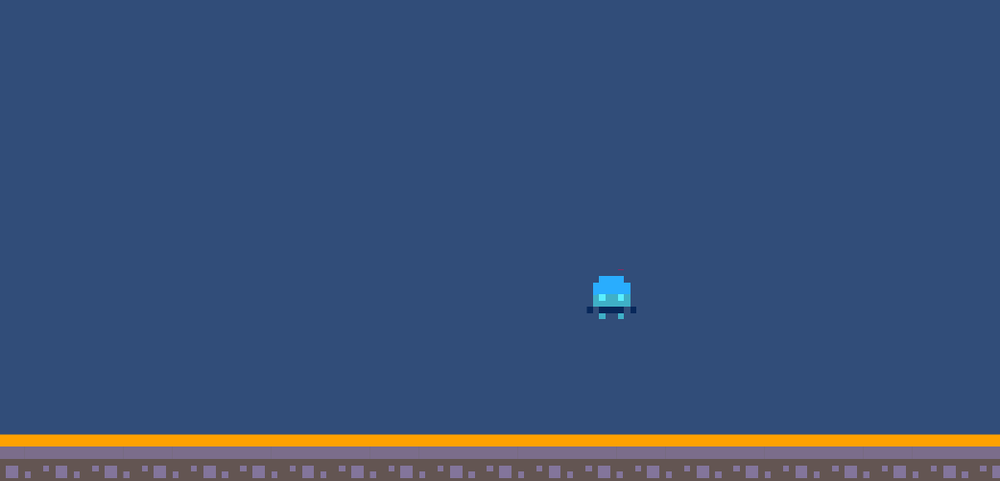  
いい感じにジャンプができました。でもスペースキーを連打すると空中でなんどもジャンプができてしまいます。これを修正する必要があります。  
つまりはPlayerが空中にいる(何にも触れていない)ときにスペースキーを押してもなにも起こらないように変更する必要があります。このようにある事象について1か0だったり、そうであるか、そうでないかのような処理を行うときはbool型の変数を使用します。
```
    Rigidbody2D rb;//Rigidbody2D型の変数
    bool is_field = false;
```
このようにコードを追加してください。このis_field変数がtrueのとき、地面にいる、falseのとき、空中にいるとして処理を作りましょう。そのためには地面に触れたときにtrueに変更し、離れたときにfalseに変更する必要があります。  
それでは地面に接するか離れたことをどのように判定すればいいでしょうか。ここでは当たり判定を用いて判定します。PlayerのBoxcollider2DとTilemapのTilemapCollider2Dが触れ合ったかどうかを判定すればいいわけです。
```
    private void OnCollisionEnter2D(Collision2D collision)
    {
        is_field = true;
    }

    private void OnCollisionExit2D(Collision2D collision)
    {
        is_field = false;
    }
```
このコードを追加してください。また新しい関数が出てきました。OnCollisionEnter2Dは自身(この場合Playerオブジェクト)が持っている当たり判定が他の当たり判定に触れたときに実行される関数です。ので、今回は他の当たり判定と触れる=地面に落ちるなのでそのタイミングでis_fieldをtrueに変更します。次にOnCollisionExit2Dですがこれは先ほどと逆で当たり判定同士が離れたときに実行される関数です。よってこれはジャンプしたときに呼び出されるのでis_fieldをtrueに変更します。  
これでis_fieldの変更の処理は終わりです。このis_fieldの値によってジャンプできるかどうかの処理を作ります。先ほどのジャンプの部分を次のように書き換えます。
```
        if (Input.GetKeyDown(KeyCode.Space) && is_field == true)
        {
            rb.AddForce(new Vector2(0, 7), ForceMode2D.Impulse);
        }  
```
この&&は"かつ"という意味です。つまり、ifの条件をスペースキーが押されいるかつ、is_fieldがtrueであるとき、というものに変更しました。これでプレビューを確認してみると空中でジャンプはできなくなっていると思います。これでプレイヤーの移動は完成です。