# ゲーム作り2
## 敵を作ろう
あなたが正義を説くのならそれは誰かの悪でもあるわけです。というわけで敵を作りましょう。  
今回は敵を作りにあたってprefabという機能を使います。敵は基本的に複数います。これらを1体1体作っていたら作業量が膨大になってしまいます。これを回避するためにそのオブジェクトの原型を作って、それらをコピーしてゲームシーン上に出す機能がprefabです。  
今までと同じようにヒエラルキーで右クリックから2D object > sprite > square　で名前をenemyとしましょう  
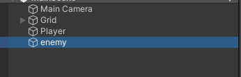  
これをprefabにします。やり方としてはヒエラルキー上のオブジェクトをプロジェクトウィンドウにドラッグアンドドロップするだけです。
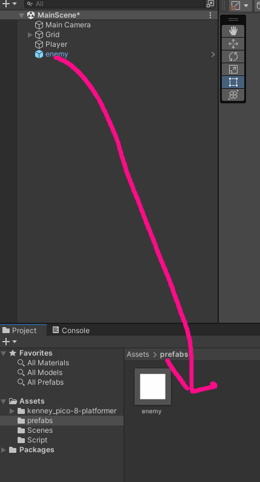  
画像のようにenemyが青っぽくなればできています。これから敵を編集するときはヒエラルキーにあるenemyではなくプロジェクトウィンドウの方のenemyを変更します。また、インスペクターウィンドウからSpriteをtilemap_packed_114として、BoxCollider2DとRigidbody2Dをつけましょう。  
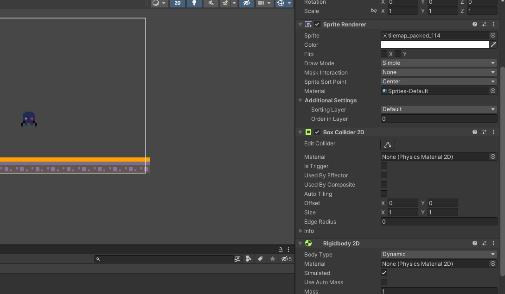  
### プレイヤーと敵の死亡判定
プレイヤーが敵に当たったら死ぬようにしましょう。当たり判定と接触したときにそれが地面なのか敵なのかを判定しなければなりません。今回は、tagという機能を使って判定します。まず、敵にtagをつけましょう。enemyを選択してインスペクターウィンドウから上部のtagを選んでAdd tagを選択して+からEnemyと入力してsaveを押してください。    
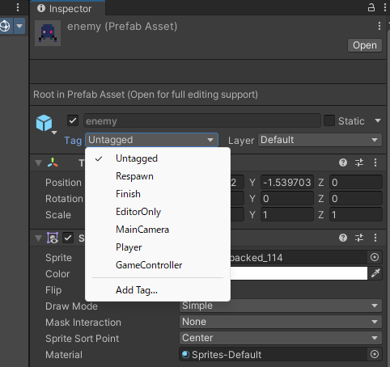  
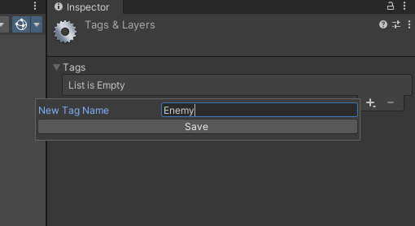  
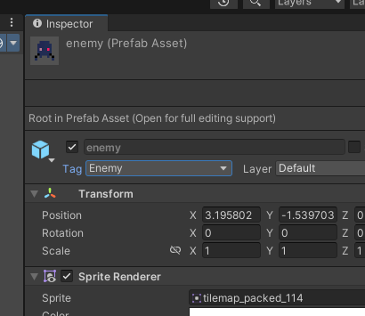  
次にPlayerControllerの編集をします。当たり判定をいじるのでこの部分を変更します。
```
    private void OnCollisionEnter2D(Collision2D collision)
    {
        is_field = true;
    }
```
ここでOnCollisionEnter2D(Collision2D collision)の部分に引っ付いているCollision2D collisionを活用します。これはこの関数が実行されるとき、引数として接触した当たり判定を取得できます。つまり、敵にぶつかったときは、このcollisionという変数を敵の当たり判定として使用できます。ので、このcollisionがつけられているオブジェクトのtagがEnemyの場合死亡するという処理を作ればいいわけです。
```
    private void OnCollisionEnter2D(Collision2D collision)
    {
        if(collision.gameObject.tag == "Enemy")
        {
            //死ぬ
        }
        is_field = true;
    }
```
このようにすればいいです。次は死んだときの処理を作りましょう。今回は簡単にプレイヤーを消すだけにしましょう。オブジェクトを破壊するときはDestroyという関数を使います。
```
    private void OnCollisionEnter2D(Collision2D collision)
    {
        if(collision.gameObject.tag == "Enemy")
        {
            Destroy(gameObject);
        }
        is_field = true;
    }
```
この状態で敵にプレイヤーがぶつかると消滅するはずです。では次にプレイヤーが敵を倒す処理を作りましょう。ゲームの敵というものはこぞって頭上からの攻撃に弱いものなので上から踏んだら倒せるようにしましょう。  
上から踏んだら倒せるということは、プレイヤーが敵と接触したときに上から踏んだなら敵を消し、それ以外ならプレイヤーを消せばいいわけです。つまり次のようになります。
```
    private void OnCollisionEnter2D(Collision2D collision)
    {
        if(collision.gameObject.tag == "Enemy")
        {
            if (/*上から踏んだかどうか*/)
            {
                Destroy(collision.gameObject);
            } else
            {
                Destroy(gameObject);
            }
        }
        is_field = true;
    }
```
上から踏んだかどうかの判定は法線での判定を使いましょう。法線というのは当たり判定の接触面からプレイヤーに線を引いたときにできる線のことで上向きであるほど1に近づき、下向きであるほど-1に近づきます。  
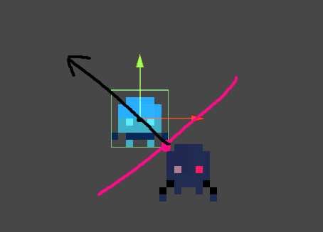  
この黒線が法線で、画像の場合だいたい0.5くらいです。今回はプレイヤーと敵の接触でできた法線が0.7以上なら敵を踏んで倒せたことにしましょう。　　
```
    private void OnCollisionEnter2D(Collision2D collision)
    {
        if(collision.gameObject.tag == "Enemy")
        {           
            ContactPoint2D contact_face = collision.contacts[0];
            Debug.Log(contact_face.normal.y);
            if (contact_face.normal.y >= 0.7f)
            {
                Destroy(collision.gameObject);
            } else
            {
                Destroy(gameObject);
            }
        }
        is_field = true;
    }
```
こう書き直してプレビューを確認しましょう。だいたい思った通りの挙動になったと思います。　　
### 敵の移動とバグ修正
次に敵が動くようにしましょう。今回はクリボーに習ってひたすら前に進むようにしましょう。これは簡単ですね。Update関数に前に進む機能を実装すればいいだけです。EnemyControllerを開いてください。　　
```
public class EnemyController : MonoBehaviour
{
    Rigidbody2D rb;
    void Start()
    {
        rb = GetComponent<Rigidbody2D>();
    }

    
    void FixedUpdate()
    {
        if(rb.velocity.x > -2)
        {
            rb.AddForce(new Vector2(-50, 0));
        }
    }
}
```
PlayerControllerの復習にもなると思います。始めにRigitbody2Dを取得して、Update関数で速度制限を設けながらAddforceで力を加えています。Enemy(Prefabの元の方)にEnemyControllerをつけて実行してみてください。  
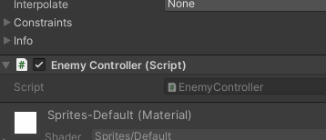  

そしてここで忘れていましたがたまに敵やプレイヤーが転んだり、プレイヤーと敵がぶつかったときに押されて移動するときがあると思います。これを修正しましょう。まず、転ぶのに関してはRigitbody2Dの設定で治せます。z軸での回転を無効化しましょう。　　
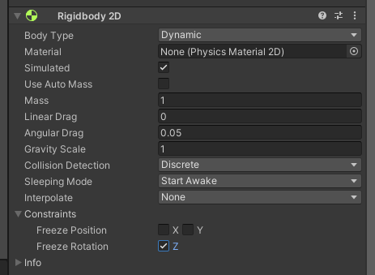  
画像のようにFreeze Rotation Z にチェックをいれてください。両方のオブジェクトで行ってください。次に押されるのを直しましょう。これは物理演算によって押されているので、重さを変更しましょう。EnemyのRigitbody2Dを見てください。  
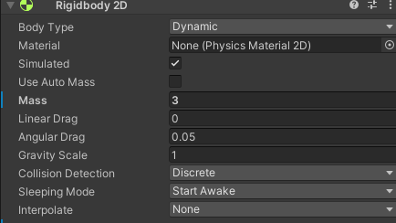  
また、敵が移動しているときに突然止まることがあるときはBoxCollider2DのEdgeRadiusを0.01くらいに設定してください。  
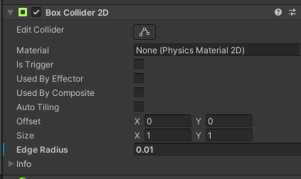  
また、最後に敵が壁にぶつかったら逆方向に折り返すようにしましょう。これは、移動ができなかった場合、反転するというやり方で実装します。  
```
    Vector3 last_pos;
    int vector_pm = -1;
    void FixedUpdate()
    {
        if (last_pos == transform.position)
        {
            this.transform.localScale = new Vector3(this.transform.localScale.x * -1, 1, 1);
            vector_pm *= -1;
        }
        else
        {
            last_pos = this.transform.position;
        }
        Debug.Log(vector_pm);
        if(Math.Abs(rb.velocity.x) < 2)
        {
            rb.AddForce(this.transform.right*-50*vector_pm);
        }
    }
```
ここは少しややこしいです。まず、前の状態からかなり変わっていると思いますが、1つ前の処理後の敵の位置をlast_posに保存し、それを次の処理で今の位置と比較することで、移動されたかどうかを判別しています。また、vector_pmは移動するときに係数としてaddforceの値にかけることで移動方向の逆転を実装しています。

これで最低限の敵は完成です。  
ここで、実はバグが残っています。ここで壁に向かってジャンプしてみるとおそらく何回でもジャンプできちゃうと思います。これはis_fieldが床壁関係なくリセットされているためです。床かどうかの判別をしなければなりません。今回は敵を踏んだ時と同じように踏んだ角度を見て床かどうか判断しましょう。次のように書き直してください。  
```
    private void OnCollisionEnter2D(Collision2D collision)
    {
        ContactPoint2D contact_face = collision.contacts[0];
        if (collision.gameObject.tag == "Enemy")
        {           
            Debug.Log(contact_face.normal.y);
            if (contact_face.normal.y >= 0.7f)
            {
                this.StepOnEnemy(collision);
            } else
            {
                this.Die();
            }
        } else if(collision.gameObject.tag == "Goal")
        {
            //ゴール検知
            SceneManager.LoadScene("ResultScene");
        }

        
    }

    private void OnCollisionStay2D(Collision2D collision)
    {
        ContactPoint2D contact_face = collision.contacts[0];
        Debug.Log(contact_face.normal.y);
        if (contact_face.normal.y >= 0.5f)
        {
            is_field = true;
        }
    }
```  

### ゴール作り
今回はゴールしたらそれを検知するまででいいです。今までと同じようにオブジェクト作成しましょう。  
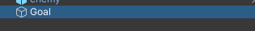  
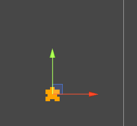  
また画像はtilemap_packed_146としましょう。今回、このオブジェクトに物理演算はさせないので、BoxCollider2Dのみつけましょう。  
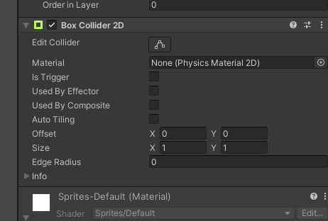  
またGoalタグを作成し、つけましょう。  
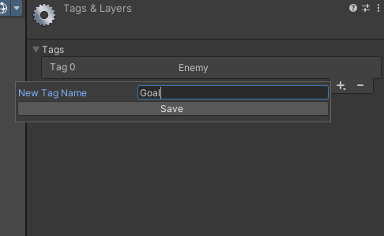  
PlayerControllerに戻り、当たり判定に変更を加えましょう。  
```
    private void OnCollisionEnter2D(Collision2D collision)
    {
        if(collision.gameObject.tag == "Enemy")
        {           
            ContactPoint2D contact_face = collision.contacts[0];
            Debug.Log(contact_face.normal.y);
            if (contact_face.normal.y >= 0.7f)
            {
                Destroy(collision.gameObject);
            } else
            {
                Destroy(gameObject);
            }
        } else if(collision.gameObject.tag == "Goal")
        {
            //ゴール検知
        }
        is_field = true;
    }
```
これで最低限です。次はクリア後の処理とタイトルからの移動、リスタートを作りましょう。
