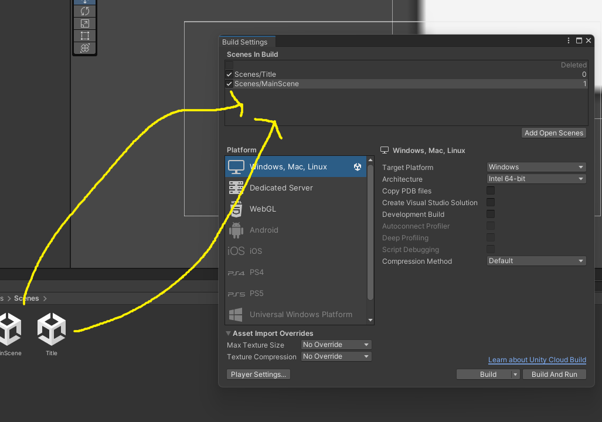
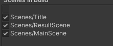

# 全体の調整
## タイトル画面
シーンを新しく作りましょう。プロジェクトウィンドウで右クリックからCreate > Sceneで作成しましょう。  
  
名前をTitleにしましょう。  
  
ダブルクリックしてシーンを開きましょう。今回はボタンを一つ配置して、それを押したらゲームをスタートできるようにしましょう。ボタンはunity上ではUIとして扱われます。ヒエラルキーで右クリックからUI > Buttonでボタンを作成してください。  
  
また、その後のポップアップは上を選択してください。読み込みが始まると思うので少し待ってください。  
  
  
  
画像のようにヒエラルキーからText(TMP)を開いて、インスペクターウィンドウからテキスト内容をStartに変更してください。次はこのボタンが押されたときの挙動を作りましょう。  
  
今までと同じようにStartButtonControllerを作りましょう。ここで新しくボタンが押されたときに実行される関数を作りましょう。ここでするべき処理は今まで作ってきたMainSceneにシーンを遷移させることです。シーン遷移を実行するためには一つ前準備が必要です。左上からFile > Build settingを選択して、Scenes in buildの部分に今まで作成しているシーンをすべてドラッグアンドドロップしてください。　　
　　
これでシーンを変えられます。StartButtonControllerを開いてください。そして新しく次の関数を書き込んでください。  
```
    public void OnPush()
    {
        SceneManager.LoadScene("MainScene");
    }
```
この関数をボタンに設定しましょう。まず、StartButtonControllerをButtonにつけましょう。  
  
その後、インスペクターウィンドウのButtonの下の方にある、On Click()という部分を探してください。ここの+ボタンを押します。そうしたらこんな風になると思います。  
  
そうしたらNone(Object)となっているところに、すぐ下にあるStartButtonControllerをドラッグアンドドロップして、No Functionとなっているところを画像のようにOnPush関数に変更してください。  
  
プレビューを確認して、ボタンを押してみるとMainSceneに遷移できたと思います。  
## リザルト画面 
次は同じ要領で、ゴール後の画面も作りましょう。また、同じように新しくシーンを作成して名前をResultSceneにしましょう。　　
　　
とりあえず画面にゲームクリアの文字とタイトルに戻るためのボタンを設置しましょう。UIのテキストを作成しましょう。また、追加でボタンも設置しましょう。  
  
  
画像のように設定しましょう。ではタイトルに戻るボタンを作りましょう。BackButtonControllerとしましょう。ここはさっきのスタートボタンとほぼ同じなのでそのまま貼ります。また、On Clickの部分も設定しておいてください。  
```
using System.Collections;
using System.Collections.Generic;
using UnityEngine;
using UnityEngine.SceneManagement;

public class BackButtonController : MonoBehaviour
{
    // Start is called before the first frame update
    void Start()
    {
        
    }

    // Update is called once per frame
    void Update()
    {
        
    }

    public void OnPush()
    {
        SceneManager.LoadScene("Title");
    }
}
```
　　
## クリア後とリスタート
クリアしたらリザルト画面に行くようにしましょう。これもさっきまでとほぼ同じです。PlayerControllerにクリア後にシーン遷移するようにしましょう。シーン遷移の為にBuildsettingsにresultSceneを追加しましょう。  
    
できたら次のように書き足してください。  
```
    private void OnCollisionEnter2D(Collision2D collision)
    {
        if(collision.gameObject.tag == "Enemy")
        {           
            ContactPoint2D contact_face = collision.contacts[0];
            Debug.Log(contact_face.normal.y);
            if (contact_face.normal.y >= 0.7f)
            {
                Destroy(collision.gameObject);
            } else
            {
                Destroy(gameObject);
            }
        } else if(collision.gameObject.tag == "Goal")
        {
            //ゴール検知
            SceneManager.LoadScene("ResultScene");
        }
        if(collision.gameObject.tag == "map")
        {
            is_field = true;
        }
    }
```
これで一旦プレビューを確認して、問題無ければ最後に敵に倒されたあと、リスタートできるようにしましょう。今回はRキーを押したらリスタートという形にしましょう。ここで、PlayerControllerにその処理を書き込みたくなる所ですが、敵に倒された後ということは、Playerはすでに破壊されているので、PlayerControllerは動作しません。ので、ここでは新しくオブジェクトとスクリプトを作りましょう。  
ヒエラルキーからCreateEmptyで名前をGameManagerにしましょう。  
　　  
また、ファイルも新しくつくって、名前をGameManagerにしましょう。歯車マークになったら成功です。  
   
そして、ファイルを開いて次のように書き足しましょう。  
```
    void Update()
    {
        if (Input.GetKeyDown(KeyCode.R))
        {
            SceneManager.LoadScene("MainScene");
        }
    }
```
最後にこのファイルをGameManagerにつけましょう。
これでRキーを押したらもう一度メインシーンが読み込まれて、ゲームが始めからリスタートできます。  
## カメラ移動
最後にカメラがプレイヤーを追従するようにしましょう。これは、カメラの位置をプレイヤーと同じになるようにしたらいいです。とりあえずスクリプトを作成し、名前をCameraControllerとしましょう。そして、PlayerのtagをPlayerに設定しましょう。  
  
次にCameraControllerを編集しましょう。内容を次のように書き換えてください。  
```
public class CameraController : MonoBehaviour
{
    GameObject player;
    void Start()
    {
        player = GameObject.FindWithTag("Player");
    }

    
    void Update()
    {
        this.transform.position = new Vector3( player.transform.position.x+3, player.transform.position.y,-10);
    }
}
```
これは、シーン内のPlayerタグを持つオブジェクトを変数playerに代入し、そのオブジェクトの位置をカメラの位置にするものです。これをMainCameraにつけることでカメラが追従します。+3の部分はカメラが見やすくなるための調整の値です。
## ステージ作成
これでゲーム自体は完成です。最後にステージを作りましょう。左上のWindowからTilePaletteを開いて地面を作り、敵を設置しましょう。敵はプロジェクトウィンドウからプレハブの元をシーンウィンドウにドラッグアンドドロップすることでコピーを設置できます。  
  
これで各々ステージを作成してください。ゴールはいい感じの所に場所を変えましょう。  
## ビルド
これで完成って言われたらなんか違いますよね。ので最後にこのゲームを実行ファイルに落とし込みましょう。  
ビルドする前に設定しましょう。先ほどと同じようにbuild settingを開いて、scenes in build内で、titleシーンが一番上に来るように順番を変えましょう。  
  
ビルドの設定はプラットフォーム以外変えなくてokです。windowsの人はwindowsをmacの人はmacを選択してBuildを選択してください。  
  
保存場所は各々で決めてください。ビルドは少し時間がかかるので待ちましょう。ビルドが終わったら実行してみましょう。.exeのファイルを実行してください。  
  
実行したらゲームが開始されます。これにて一応完成です。ですがこれは本当にギリギリゲームと呼べるレベルの物なので改造して自身の向上に利用していただけるとありがたいです。