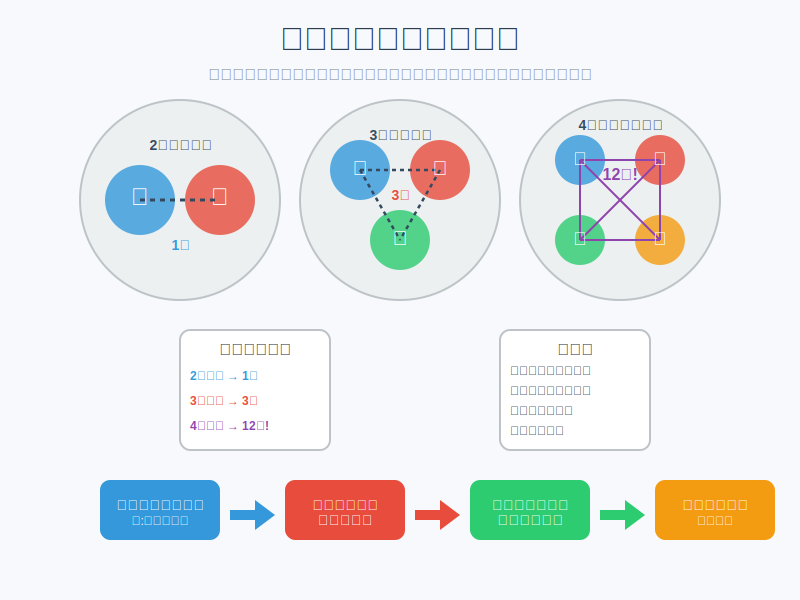

# 部会第１回

## 目次

1. 導入
1. 各班の活動紹介(10分)
1. レクリエーション、交流(30分)
1. 競プロ班オリエンテーション(60分)

## 導入

部長の加藤です！
（カトちゃんと呼んでください！）

部会の目的は、**交流**です！

１年生の方は、先輩方になんでも聞いてみてください。

## 各班の活動紹介

### 競プロ班

### DTM班

### WEB班

### ゲーム班

### AI班

### 部会

## レクリエーション、交流

### グループ分け

学年混合で各テーブルに、座るようにします

1. １年生の方々は、それぞれ好きなテーブルのところに座ってください。
1. ２年生以上も、１年生のがいるところに座ってください。
1. 座ったら、それぞれで自己紹介をしてください。

### ゲーム

#### イメージ

### 　補足

- ひとつの質問につき、５分内で、共通点を探し出し、紙に記入する

#### 点数の記述方法

紙を配布するので、各グループが以下のように記述する

|共通点|共通する人数|点数|
|---|---|---|
|明石市出身|3|3|
|プログラミングが好き|2|1|

質問

- 出身都道府県
- 訪れたことのある都道府県
- 好きなアーティストは(一人、２つまで)
- はまっている趣味は(一人、３つまで)
- 一番の得意科目は？
- 猫派？犬派？
- 最近見たアニメまたは映画は、３つまで。
