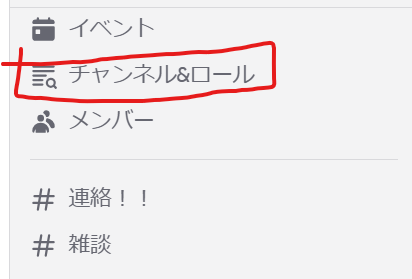
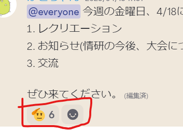
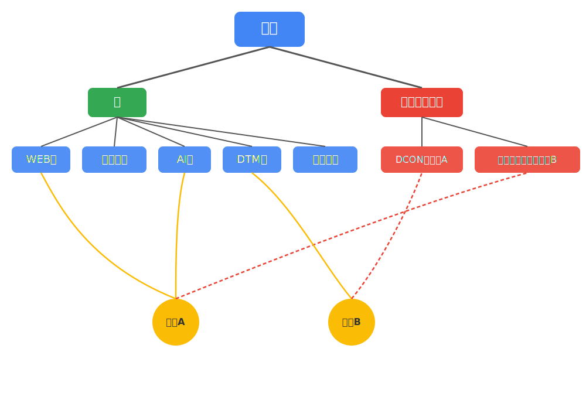

# 部会第２回

---

## 目次

1. グループ分け
1. レクリエーション
1. お知らせ
   1. 大会について
   1. 各班から
1. アイデア交流

---

## グループ分け

学年混合で各テーブルに、座るようにします

1. 全員、まず立って後ろに移動してください。
1. ３年生、２年生、１年生の順で席につきます。
1. 自己紹介
   - 名前
   - 学年
   - 好きな何か(もの・こと・ひと)

---

## レクリエーション

---

### 朝までそれ正解

参加者がある議題に対する「正解だと思う」回答を提示。全員が一番納得した回答を「それが正解」と決める

---

#### 流れ

1. １分間、一人で考える。
1. ２分間で、グループ内で順番に発表。グループ的「それ正解」を決定
1. グループ内で決まった「それ正解」を、全体に発表
1. 情研的「それ正解」を多数決で決定。

---

「せ」で始まる怖いものは？

---

「あ」で始まる身体によさそうなものは？

---

「す」で始まる今流行っているものは？

---

「あ」で始まるかわいいものは？

---

「は」で始まる腹立たしい行為は？

---

## お知らせ

#### Discord(非公式)への参加

Discordに参加してください。

---

#### Discordの注意点

まず、興味のある班**全て**を選択してください

---

#### 出席・欠席連絡

Discordの「欠席連絡」チャンネルにて、部会を欠席する場合には連絡をお願いします。

また、連絡に対して、適当な**リアクション**を押していただいた方は確実に出席とみなします。

---

#### Teams参加について

まだ、Teamsに参加していない方は、DiscordのDMでもなんでもいいので、部長のカトに連絡お願いいたします。

---

### 本題１：大会

---

#### 競技プログラミング大会

- 高専プロコン競技部門
  - ３人出場できます。競プロ班の中から精鋭が出てくださる予定？
- 情報オリンピック
  - 個人戦です。プログラミング力を試す最高の機会なので、全ての部員に参加を推奨
- パソコン甲子園プログラミング部門
  - 競プロ班の中から出てくださることを期待しています。

---

#### チーム開発大会

システムやアプリケーション、ソフトウェアなどをチームで開発する

- 高専プロコン課題部門・自由部門
  - １チーム５人。４チーム出場できます。
  - 課題部門は、「ICTを活用した環境問題の解決」を目的とした作品を開発する
    - 例
      - 公共設備(トイレ、ゴミ箱、喫煙所)の場所案内、清掃、寄付などを行えるアプリ
      - ブース上で、駒を使って、リアルなまちづくりを行うゲーム
  - 自由部門は、参加者の自由な発想で開発された独創的なコンピュータソフトウェア作品
    - 例
      - 中盤から始まる将棋ゲーム
      - 釣り人の状況確認+釣り人同士の交流プラットフォーム
- パソコン甲子園モバイル部門
  - テーマに沿ったアプリ・スマホで動くゲームなどを開発する
  - １チーム３人、応募数は無制限。ただし本選出場は２チームまで
  - 例
    - 呼吸トレーニングを行うアプリ
    - 市長として政治を行うゲーム
- DCON

ほかにも、アプリ甲子園、または未踏ジュニア等の応募もある

---

明石高専からの大会参加、勝利を一緒に目指しませんか？

---

部長かとはDCONに向けて、開発を続けています。

興味があったらまた聞いてほしいです！

---

### 本題２：プロジェクト始動

大会参加、勝利に向けて、「プロジェクト」という新たな仕組み

---

#### プロジェクトとは？

- チームで、一つの目標(作品の開発、大会への出場)に向けて取り組むチーム

---

---

- 大会に出場するために、まずプロジェクトを登録する。
- 部会やDiscord進捗報告などを行う予定

---

## おわりに

---

### 次回の部会について

これからは、ずっとここ(創造工房2FのBase2)でやる予定です。

---

### 各班から

- WEB班
  - この後、ここでえ！
  - グループで、ミッションを解いていく形式
- ゲーム班
  - 来週の月曜日は「長期留学(AFS・YFU)説明会」のため、休み。(ぜひこっちの説明会に参加してください😊)
  - 次回は、再来週(4/28(月))です。

---

- AI班
  - お休み中。前期の後半、もしくは後期から開始。
  - それまでは別の班で**基礎**をつけていただきたいです。
- DTM班
- 競プロ班
