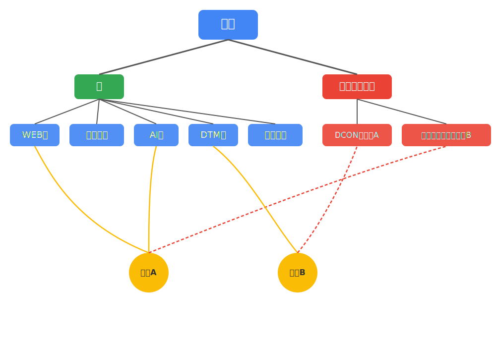

# 部会第２回

---

## アジェンダ

1. イントロダクション [5分]
1. やってみたいことのジャンルごとにグループ分け [5分]
1. レクリエーション [15分]
1. グループ内でアイデア出し [30分]
1. アイデア選択・発表準備 [10分]
1. アイデア発表（もし時間があれば）

---

## イントロダクション

### 交流会の狙い

- 大会・高専祭などを目指して、プロジェクトが少しでも立ち上がれば…
- 部員同士の仲を深める。

---

### 大会の説明(再掲)

---

#### 競技プログラミング大会

- **高専プロコン競技部門**
  - ３人出場できます。競プロ班の中から何人か出てくださる予定
- **情報オリンピック**
  - 個人戦です。プログラミング力を試す最高の機会なので、全ての部員に参加を推奨
- **パソコン甲子園プログラミング部門**
  - 競プロ班の中から出てくださるらしい？

---

#### チーム開発大会

システムやアプリケーション、ソフトウェアなどをチームで開発する

---

- **高専プロコン**
  - １チーム５人。４チーム出場できます。企業賞豪華
  - **課題部門**
    - 課題部門は、「ICTを活用した環境問題の解決」を目的とした作品を開発する
      - 公共設備(トイレ、ゴミ箱、喫煙所)の場所案内、清掃、寄付などを行えるアプリ
      - ブース上で、コマを使って、リアルなまちづくりを行うゲーム
  - **自由部門**
    - 参加者の自由な発想で開発された独創的なコンピュータソフトウェア作品
      - 中盤から始まる将棋ゲーム
      - 釣り人の状況確認+釣り人同士の交流プラットフォーム

---

- **パソコン甲子園モバイル部門**
  - テーマに沿ったアプリ・スマホで動くゲームなどを開発する
  - １チーム３人、応募数は無制限。ただし本選出場は２チームまで
  - 例
    - 呼吸トレーニングを行うアプリ
    - 市長として政治を行うゲーム
- **DCON**
  - AIを用いたシステムのプロトタイプを開発し、ビジネスプランを考える。
  - 優勝100万円
  - 難しい、得られるものは大きい

ほかにも、**アプリ甲子園**、または**未踏ジュニア**等の応募もある

---

| イベント名                 | 応募締切   | 準備期間/審査        | 本番/開催日        |
| :------------------------- | :--------- | :------------------- | :----------------- |
| 高専プロコン               | 5月中      | 10月まで             | 10月               |
| パソコン甲子園モバイル部門 | 7月まで    | 10月まで             | 11月               |
| DCON                     | 10月まで   | 翌年2月 (二次審査) | 翌年5月            |
| 高専祭                   | -          | -                    | 11月               |
| 明葉際                   | -          | -                    | 6月                |

---

> 部長はDCONに参加する予定
> 部長は、今年は、高専プロコンの課題部門 or 自由部門に参加したい。
> 大会参加は考えなくても、創りたいものがあれば、ひとまず高専祭に向けて作ってみるのもあり。

---

### プロジェクトについて(再掲)

大会参加、勝利に向けて、**「プロジェクト」** という新たな仕組み

---

#### プロジェクトとは？

- 協力して、一つの目標(作品の開発、大会への出場)に向けて取り組むチーム

---

---

#### 補足

- 大会に出場するために、まずプロジェクトを作成する。
- 部会やDiscordで進捗報告などを行う予定
- 班では**専門的技術の習得**、プロジェクトにて**技術の実践**を行う

---

#### 情研としてやること

アイデアの交流、プロジェクトの結成や、プロジェクト活動における支援を行います。

> 各班では、専門的な分野での技術習得を目指す。
> その技術がプロジェクトに活かされることを期待
---

#### プロジェクトの実例

- **マインドエモ**：DCONに向けて(部長かと、副部長江藤など)
- **高専プロコン競技部門**：(笠井・野田など)

---

好きな仲間とともに、やりたいアイデアが生まれたら、まずは部長にDMを連絡してください。

今後プロジェクトを管理する仕組みも創って、連絡いたします。

---

## ジャンルごとにグループ分け

ジャンル

- ゲーム
- AIを使ったシステム(DCONなど)
- 高専プロコンの課題部門・自由部門（WEBアプリ、システム、なんでも）
- 高専プロコンの競技部門

- その他（要望があれば）

---

## レクリエーション

---

### アイスブレイク

グループの中で、順番に以下の質問の回答を答えていってください。
（一つの質問を応えたら、次の人）

- 名前(もしあったら、望む呼び方)
- 趣味
- 一番遊んだゲーム
- 最近のマイブーム
- 情研でやりたいこと
- 明石高専の気に入らないところを**一つ**だけ

以上の内容が終わって時間が余っていたら、だれかの回答について、さらに質問をして深掘りしてください

---

### 朝までそれ正解

参加者がある議題に対する「正解だと思う」回答を提示。全員が一番納得した回答を「それが正解」と決める

---

#### 流れ

一つのお題について、

1. **３０秒間**、一人で考える。
1. **１分間**で、グループ内で順番に発表。グループ的「それ正解」を決定
1. グループ内で決まった「それ正解」を、全体に発表
1. 情研的「それ正解」を多数決で決定。

---

### コツ

- 一文で考える（例, ～で～すること）
- 形容詞を組み合わせて、言葉を創る。
- 複合語を考える（名詞と名詞をつなげる）
- 固有名詞
- カタカナ・外来語
- 厳密なことは考えない
- 楽しむ

---

「か」ではじまる強いものは？

---

「た」で始まる ちょっと懐かしいもの・ことは？

---

「い」で始まる ちょっとイラッとすることは？

---

## アイデア出し [30分]

---

### 流れ

1. 進行役を決める[2分]
1. 発散[10分]
1. 整理・選別・深掘り[8分]
1. アイデア選択・発表準備[10分]
1. アイデアの発表 [時間があれば]

---

### 1. 進行役を決める [2分]

進行役の役割：司会進行

---

### 2. 発散 [10分]

- ２人(or３人)のペアを組み、アイデアを出し合う。
- 随時、ペアの相手の意見をホワイトボードに書き出していく

> **アイデアの種：**
>
> - 具体的なアイデアでなくても、キーワードや、方向性、ジャンルなどなんでもでもOK
> - **他の人と被ってもOK、技術的可能性は考えない、小さな考えでオッケー、新たな意見を歓迎しよう**

---

#### アイデア出しのコツ

- **質より量を意識する:** まずはたくさん出すことが目標！どんな小さなこと、くだらないと思うことでもOK。
- **判断・批判は後回し:** 「できるかな？」「変じゃないかな？」という考えは一旦ストップ。すべてのアイデアを歓迎しよう。
- **人のアイデアに乗っかる:** 他の人の意見を聞いて「それなら、こうしたらもっと面白いかも？」と発展させてみよう。
- **自由な発想を大切に:** 常識にとらわれず、「こんなのあったら面白いな」という視点で考えてみよう。実現可能性は後で考えればOK。
- **「困った」「欲しい」から考える:** 普段感じている不便なことや、「こんな機能があったらいいな」という願望から発想してみよう。
- **視点を変えてみる:** もし自分がユーザーだったら？ もし予算が無限にあったら？ など、立場や条件を変えて考えてみる。
- **楽しむ！:** リラックスして、ゲーム感覚で楽しむことが一番大切！

---

#### ヒント (1/2)

- **ゲーム:**
  - 好きなゲームの「面白い要素」を組み合わせられないか？
  - 誰も見たことないような世界観やテーマは？
  - シンプルな操作で繰り返せる「コアな遊び」は何か？
  - 自分が本当に遊びたいゲームは？
- **AIを使ったシステム (DCONなど):**
  - 身の回りの「面倒な作業」を自動化できないか？ (画像認識、予測、分類など)
  - 学校や地域にあるデータを使って何か面白いことができないか？
  - AIで解決できそうな社会の課題は？ (DCONはビジネス視点も)

---

#### ヒント (2/2)

- **高専プロコン課題部門 (環境問題×ICT):**
  - 地域の環境問題 (ゴミ、エネルギー、自然) でICTが役立つ場面は？
  - 環境活動を「見える化」したり、参加しやすくしたりするには？
- **高専プロコン自由部門 (Webアプリ、システムなど):**
  - 学校生活の「不便」を解決するツールは？ (時間割、施設予約、情報共有など)
  - 自分の趣味や特技を活かせる、または支援するシステムは？
  - 「こんなWebサービス/アプリがあったら絶対使うのに」と思うものは？
- **組み合わせる:** ゲーム×AI、Webアプリ×センサーなど、ジャンルを融合してみるのも面白い！

---

### 3. 整理・選別・深掘り [7分]

進行役が司会をしながら、ホワイトボードに書かれたアイデアの種を整理していく。

- アイデアの種を、グループ分け
- さらに深掘りできそうなもの選択
- 深掘り（具体化）

---

### 4. アイデア選択・発表準備 [10分]

1. 一人一人が、発表したいアイデアに挙手をして、アイデアごとにチームを作る（or 一人でもOK）
1. 進行役は、ホワイトボードに名前を書く。

1. チーム内で、アイデアの発表準備を行う。

---

#### 発表の内容

- 提案するアイデアを簡単に説明
  - 「私たちは、～のアイデアを考えました。この{アプリ or ゲーム　or システム}では、」
- 可能であれば、さらなる追加の視点
  - 「**類似・競合との比較**」、「**技術**」、「**実装工程**」など

---

### 5. アイデアの発表 [時間が余れば]
